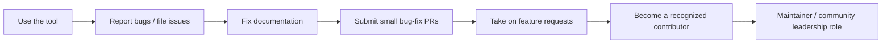

## Professional Networking and Development


### Purpose and Scope

Professional networking and continuing development function as the ongoing complement to portfolio, credentials, and formal education. In the geospatial field specifically, networking carries elevated importance because the domain is relatively small and cross-disciplinary compared to general software engineering — practitioners frequently discover roles, collaborators, and emerging tools through community channels (conferences, open-source projects, professional associations) before those opportunities reach general job boards. Continuing development ensures skills remain current in a field where sensor technology, cloud platforms, and open-source tooling evolve rapidly.

### Professional Associations and Organizations

| Organization | Focus | Typical Value |
| --- | --- | --- |
| URISA (Urban and Regional Information Systems Association) | GIS in public administration/planning | Local chapters, GIS-Pro conference, mentorship programs |
| ASPRS | Remote sensing, photogrammetry, surveying | Certification, technical journals, regional conferences |
| AAG (American Association of Geographers) | Academic geography, GIScience research | Annual meeting, academic networking |
| OSGeo (Open Source Geospatial Foundation) | Open-source geospatial software | Project communities (QGIS, PostGIS, GDAL), FOSS4G conference |
| National/regional GIS user groups | Local Esri user communities | Regional meetups, job boards, vendor updates |
| IEEE GRSS (Geoscience and Remote Sensing Society) | Technical remote sensing research | Conferences, technical publications |

[Inference] Membership value varies significantly by career stage and pathway — student and early-career practitioners often benefit most from local chapters and mentorship programs, while established professionals tend to derive more value from conference presentation opportunities and specialized technical committees, though this pattern is not uniformly documented and varies by individual circumstance.

### Conferences and Events

Conferences serve three overlapping functions: technical education (workshops, paper sessions), professional networking (informal conversations, recruiting), and visibility (presenting work, which strengthens both portfolio and reputation simultaneously).

**Major recurring events**:

- **Esri User Conference (Esri UC)** — largest vendor-specific event, strong for public-sector and Esri-ecosystem networking
- **FOSS4G (Free and Open Source Software for Geospatial)** — global and regional editions, strongest for open-source contributors and geospatial software engineers
- **AAG Annual Meeting** — academic/research-oriented
- **State/regional GIS conferences** (e.g., state URISA chapters) — lower-cost, strong for local job market connections
- **AGU Fall Meeting** — broader Earth and space science audience, relevant for environmental science and remote sensing researchers

**Example** approach to maximizing conference value on a limited budget:

1. Prioritize regional/state-level conferences early in career (lower cost, still strong local networking density)
2. Submit a lightning talk or poster based on a portfolio project — many conferences have lower barriers for poster submissions than full talks
3. Attend workshops in tools adjacent to but not identical to current expertise, to broaden rather than deepen existing skills
4. Follow up with new contacts within 48 hours via LinkedIn or email referencing the specific conversation topic

### Open-Source Contribution as a Networking and Development Vector

Contributing to open-source geospatial projects (QGIS, GDAL, PostGIS, GeoPandas, Rasterio, MapLibre) serves as both a technical development activity and a networking mechanism, since active contributors become visible within maintainer and user communities.

**Contribution pathway progression**:



Starting with documentation fixes or small, well-scoped bug reports is a common and low-friction entry point, since it requires less upfront codebase familiarity than feature development while still establishing a visible contribution history.

### Online Communities and Continuous Learning Channels

| Platform/Channel | Use Case |
| --- | --- |
| GIS Stack Exchange | Technical Q&A, reputation-building through quality answers |
| r/gis, r/remotesensing (Reddit) | Informal discussion, job postings, tool recommendations |
| Geospatial-focused Slack/Discord communities | Real-time discussion, often tied to specific tools (e.g., QGIS, MapLibre) |
| LinkedIn geospatial groups | Job postings, professional visibility, article sharing |
| GitHub (following projects/maintainers) | Tracking tool development, discovering emerging libraries |
| Newsletter aggregators (e.g., geospatial-focused newsletters) | Curated awareness of new tools, papers, and industry news |

**Key Points**

- Passive consumption (reading) builds awareness; active participation (answering questions, contributing code, writing summaries) builds visible reputation and networking value.
- Consistency matters more than intensity — a practitioner who answers questions or shares insights weekly over a year builds more community recognition than sporadic high-effort bursts.
- Community reputation on platforms like GIS Stack Exchange or GitHub can function as a de facto extension of a portfolio, since technical reviewers sometimes check contribution history during hiring evaluation.

### Mentorship

Mentorship operates bidirectionally across a career:

- **Seeking a mentor** (early-career): identify practitioners in the target pathway (see Career Pathways topic) via local chapter events, LinkedIn outreach referencing specific shared interests, or formal mentorship programs offered by organizations like URISA
- **Becoming a mentor** (mid-to-senior career): formalizes expertise, strengthens professional visibility, and is frequently viewed favorably in promotion or GISP-style contribution scoring (see Professional Certifications topic, where "contributions to the profession" explicitly includes mentorship and teaching)

[Inference] Effective mentorship relationships in this field often form more organically through sustained community participation (conference conversations, open-source collaboration, local chapter involvement) than through cold outreach alone, though cold outreach with a specific, well-scoped ask can still succeed when framed around a concrete shared interest rather than a general "will you mentor me" request.

### Informational Interviews

A structured, low-commitment networking mechanism particularly useful when exploring a transition between pathways (see Career Pathways in Geospatial and Environmental Science).

**Example** informational interview request structure:

```plaintext
Subject: Question about your transition into spatial data science

Hi [Name],

I came across your [talk/post/project] on [specific topic] and found your
background moving from GIS analysis into spatial data science really
relevant to a transition I'm considering.

Would you be open to a 15-minute call sometime in the next few weeks?
I'd love to hear how you approached building the statistical/ML skills
needed for the transition.

Thanks for considering — happy to work around your schedule.
```

Requests that reference specific, verifiable details about the recipient's work (rather than generic "I'd love to pick your brain") consistently receive higher response rates, since they demonstrate genuine research rather than mass outreach.

### Continuing Education Strategies

Continuing development should be structured rather than opportunistic, given the pace of change in cloud geospatial tooling, sensor technology, and ML methods applied to spatial data.

| Method | Best For |
| --- | --- |
| MOOC/structured courses (Coursera, edX, university extension) | Foundational gaps, credentialed continuing education units |
| Vendor training (Esri Academy, Google Earth Engine training) | Tool-specific proficiency tied to certification prep |
| Reading primary literature (journals: *IJGIS*, *Remote Sensing of Environment*, *Transactions in GIS*) | Staying current with research-driven methodology |
| Reproducing published methodologies as portfolio projects | Combines learning with tangible portfolio output |
| Following changelogs of core libraries (GDAL, GeoPandas, PostGIS) | Staying current with breaking changes and new capabilities in daily tooling |

### Building a Professional Online Presence

A coherent online presence functions as a passive networking channel, since it allows the professional community to discover a practitioner's work without active outreach.

**Recommended minimum presence**:

- **LinkedIn**: complete profile with specific technical skills listed (not just "GIS"), portfolio project links, and periodic posts about completed work or conference attendance
- **GitHub**: active contribution history, pinned repositories reflecting best portfolio work (see Portfolio Development topic)
- **Personal website or blog** (optional but valuable): technical write-ups that demonstrate reasoning, not just output — this format also feeds naturally into conference talk or poster submissions

**Next Steps**

- Identify one professional association aligned with the target career pathway and attend a local/regional event within the next quarter
- Select one open-source geospatial project already in regular personal use and submit a first small contribution (documentation fix or minor bug report)
- Draft and send two informational interview requests to practitioners in a target transition pathway
- Establish a recurring (e.g., monthly) cadence for reviewing changelogs or literature relevant to core tools in current use

**Related Topics**

- Writing and Submitting a Conference Talk or Poster Proposal
- Open-Source Contribution Workflows: Git, Pull Requests, and Code Review Etiquette
- Building a Technical Blog to Support a Geospatial Portfolio
- Mentorship Program Structures in GIS Professional Associations
- Staying Current with Geospatial Cloud Platform Changes (Earth Engine, STAC, Cloud-Native Formats)