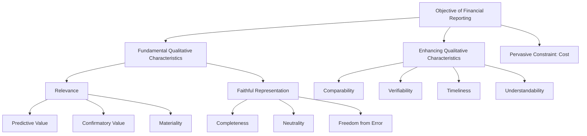

## Objectives of Financial Reporting and Qualitative Characteristics

### Overview

The Conceptual Framework for Financial Reporting establishes the theoretical foundation underlying accounting standards. Both the FASB's Conceptual Framework (Statements of Financial Accounting Concepts, primarily **CON 8**) and the IASB's *Conceptual Framework for Financial Reporting* (2018 revision) address two interlocking questions: (1) why does financial reporting exist, and (2) what makes reported information useful. This topic underpins standard-setting logic tested throughout advanced financial accounting and is foundational for forensic accountants evaluating whether reported information faithfully represents economic reality.

### Objective of General-Purpose Financial Reporting

**Core Objective**

The objective of general-purpose financial reporting (GPFR) is to provide financial information about the reporting entity that is useful to existing and potential investors, lenders, and other creditors in making decisions about providing resources to the entity.

**Key Points**

- Primary users: existing/potential investors, lenders, and other creditors — not management, regulators, or the general public directly
- Decisions covered: buying, selling, or holding equity/debt instruments; providing or settling loans/credit; voting or influencing management's actions
- Information provided is general-purpose — it cannot address every possible user's specific information needs
- Management is *not* a primary user because it can obtain internal information directly; GPFR is designed to address information asymmetry for external parties
- Financial reports are based substantially on estimates, judgments, and models rather than exact depictions [Inference: this framing reflects standard conceptual-framework language regarding measurement uncertainty]

**Economic Resources, Claims, and Changes**

GPFR is expected to provide information about:

1. The economic resources of the entity (assets) and claims against it (liabilities and equity)
2. Changes in those resources and claims arising from:
   - Financial performance (accrual-basis income and comprehensive income)
   - Financial performance reflected in past cash flows
   - Non-exchange transactions (e.g., issuing equity, distributions)

This information helps users assess the entity's prospects for future net cash inflows and evaluate management's stewardship of resources.

### Underlying Assumptions Supporting the Objective

- **Accrual basis of accounting**: Effects of transactions are recognized when they occur, not necessarily when cash is received or paid, because accrual-based information better reflects resources, claims, and changes than cash-flow information alone
- **Going concern**: Financial statements are ordinarily prepared assuming the entity will continue to operate for the foreseeable future, absent evidence to the contrary

### Qualitative Characteristics — Two-Tier Hierarchy

The Conceptual Framework organizes qualitative characteristics into **fundamental** and **enhancing** categories.

### Fundamental Qualitative Characteristics

Fundamental characteristics are those that make information decision-useful; information lacking them is not useful regardless of enhancement.

#### 1. Relevance

Information is relevant if it is capable of making a difference in the decisions made by users.

**Key Points**

- **Predictive value**: information can be used as an input to processes employed by users to predict future outcomes (does not require the information itself to be a prediction/forecast)
- **Confirmatory value**: information provides feedback about (confirms or changes) previous evaluations
- Predictive and confirmatory value are interrelated — information with predictive value often also has confirmatory value
- **Materiality** is an entity-specific aspect of relevance: information is material if omitting, misstating, or obscuring it could reasonably be expected to influence decisions that primary users make on the basis of the financial statements
- Materiality is *not* a uniform quantitative threshold set by the standard-setter; it depends on the nature and/or magnitude of the item in the context of the specific entity ([IAS 1](https://www.ifrs.org) / FASB CON 8 both treat materiality as entity-specific) [Unverified: precise numeric thresholds are not codified in the Framework itself, as materiality assessment is inherently judgmental]

**Example**

A change in a company's debt covenant ratio has predictive value (signals possible future covenant breach and refinancing risk) and confirmatory value (confirms whether prior liquidity concerns were justified).

#### 2. Faithful Representation

Information must faithfully represent the substance of the economic phenomena it purports to represent, not merely its legal form. A perfectly faithful representation has three characteristics:

- **Completeness**: includes all information necessary for a user to understand the phenomenon, including necessary descriptions and explanations
- **Neutrality**: free from bias in the selection or presentation of information; supported by the exercise of **prudence** (caution when making judgments under uncertainty, without allowing overstatement/understatement of assets, liabilities, income, or expenses)
- **Freedom from error**: no errors or omissions in the description, and the process used to produce the reported information has been selected and applied with no errors in the process — this does not mean perfectly accurate in all respects, since estimates by nature involve some uncertainty

**Key Points**

- Faithful representation ≠ accuracy; estimates (e.g., allowance for credit losses, fair value Level 3 inputs) can faithfully represent an estimate even though the true outcome is unknown
- Substance-over-form is embedded in faithful representation — this is a critical link to forensic accounting, where legal form is sometimes engineered to obscure economic substance (e.g., structured finance, off-balance-sheet arrangements, sham lease classifications)
- Neutrality does *not* mean "without purpose or influence on behavior" — it means without bias toward a predetermined outcome

**Forensic Accounting Relevance**

Faithful representation is the qualitative characteristic most directly implicated in financial statement fraud. Techniques such as channel stuffing (overstating revenue substance), off-balance-sheet special purpose entities (masking liabilities' economic substance), and cookie-jar reserves (violating neutrality) all represent deliberate breaches of faithful representation while sometimes technically complying with the letter of a rule.

### Enhancing Qualitative Characteristics

Enhancing characteristics improve the usefulness of information that is already relevant and faithfully represented; they cannot make irrelevant or unfaithfully represented information useful.

#### 1. Comparability

Enables users to identify and understand similarities and differences among items — both across entities (inter-entity) and across periods for the same entity (intra-entity/trend analysis). Consistency (use of the same methods for the same items period to period) is a means of achieving comparability, not identical to it.

#### 2. Verifiability

Different knowledgeable, independent observers could reach general consensus (though not necessarily complete agreement) that a depiction is a faithful representation. Can be:

- **Direct verification**: verifying an amount through direct observation (e.g., counting cash)
- **Indirect verification**: checking inputs to a model/formula and recalculating the output using the same methodology (e.g., verifying inventory value via FIFO recalculation)

#### 3. Timeliness

Information is available to decision-makers in time to influence their decisions; older information is generally less useful, though some information may retain usefulness long after period-end (e.g., trend data).

#### 4. Understandability

Classifying, characterizing, and presenting information clearly and concisely. The Framework assumes users have a reasonable knowledge of business and economic activities and review information with reasonable diligence — complexity should not be avoided merely because some users may find it difficult, if excluding it would make the information incomplete or misleading.

### The Pervasive Cost Constraint

**Key Points**

- Cost is a pervasive constraint on the information that can be provided by financial reporting, not a qualitative characteristic itself
- Standard-setters and preparers must weigh whether the benefits of reporting particular information justify the costs of providing and using it
- Costs include: costs of collecting/processing/verifying/disseminating information (preparers) and costs of analysis/interpretation (users), plus potential competitive disadvantage from disclosure
- This cost-benefit assessment is inherently judgmental and applied at the standard-setting level (not typically re-assessed by each preparer for each disclosure) [Inference: individual preparers do not perform a formal cost-benefit test for each required disclosure, since that judgment is embedded in the standard itself]

### FASB vs. IASB Framework Comparison

| Element | FASB (CON 8) | IASB (2018 Framework) |
| --- | --- | --- |
| Primary users | Existing/potential investors, lenders, other creditors | Same |
| Stewardship | Addressed under decision-usefulness | Explicitly named as part of the objective |
| Prudence | Not explicitly named as a separate concept historically | Explicitly reintroduced in 2018 revision, defined as "caution when exercising judgment under uncertainty" |
| Measurement uncertainty | Addressed within faithful representation | Explicit discussion of measurement uncertainty as a factor affecting relevance/faithful representation trade-off |
| Reporting entity concept | Addressed in Concepts Statements | Dedicated chapter defining reporting entity (including combined/consolidated entities) |

[Unverified: exact wording differences between the two frameworks should be checked against current FASB CON 8 and IASB Conceptual Framework text, since concept statements are periodically amended]

### Interaction and Trade-offs

**Key Points**

- Relevance and faithful representation sometimes conflict with timeliness: waiting for complete verified information can delay reporting, reducing relevance
- Comparability can conflict with adopting an improved accounting method (a new method may better represent economic substance but temporarily reduce period-to-period comparability)
- Professional judgment is required to balance these trade-offs; the Framework does not rank enhancing characteristics in strict priority order, though relevance and faithful representation are prioritized in application before enhancing characteristics are applied

### Diagram — Relevance vs. Faithful Representation Decision Filter (svg_diagram)

<svg xmlns="http://www.w3.org/2000/svg" viewBox="0 0 760 340">
<text x="380" y="28" text-anchor="middle" font-size="18" font-weight="bold" fill="#1a1a2e">Qualitative Characteristics Screening Process (svg_diagram)</text>
<rect x="30" y="60" width="200" height="60" rx="8" fill="#e8f0fe" stroke="#1a56db" stroke-width="1.5" />
<text x="130" y="85" text-anchor="middle" font-size="13" fill="#1a1a2e">Identify Economic</text>
<text x="130" y="102" text-anchor="middle" font-size="13" fill="#1a1a2e">Phenomenon</text>
<rect x="290" y="60" width="200" height="60" rx="8" fill="#fef3e2" stroke="#c2670c" stroke-width="1.5" />
<text x="390" y="85" text-anchor="middle" font-size="13" fill="#1a1a2e">Is it Relevant?</text>
<text x="390" y="102" text-anchor="middle" font-size="11" fill="#555">(predictive/confirmatory)</text>
<rect x="550" y="60" width="180" height="60" rx="8" fill="#fdeaea" stroke="#c81e1e" stroke-width="1.5" />
<text x="640" y="90" text-anchor="middle" font-size="13" fill="#1a1a2e">Exclude from Report</text>
<rect x="290" y="160" width="200" height="60" rx="8" fill="#fef3e2" stroke="#c2670c" stroke-width="1.5" />
<text x="390" y="185" text-anchor="middle" font-size="13" fill="#1a1a2e">Faithfully Represented?</text>
<text x="390" y="202" text-anchor="middle" font-size="11" fill="#555">(complete/neutral/error-free)</text>
<rect x="550" y="160" width="180" height="60" rx="8" fill="#fdeaea" stroke="#c81e1e" stroke-width="1.5" />
<text x="640" y="185" text-anchor="middle" font-size="13" fill="#1a1a2e">Exclude or</text>
<text x="640" y="202" text-anchor="middle" font-size="13" fill="#1a1a2e">Disclose Limitation</text>
<rect x="290" y="260" width="200" height="60" rx="8" fill="#e6f4ea" stroke="#1e8e3e" stroke-width="1.5" />
<text x="390" y="285" text-anchor="middle" font-size="13" fill="#1a1a2e">Apply Enhancing</text>
<text x="390" y="302" text-anchor="middle" font-size="13" fill="#1a1a2e">Characteristics &amp; Report</text>
<line x1="230" y1="90" x2="290" y2="90" stroke="#333" stroke-width="1.5" marker-end="url(#arrow)" />
<line x1="490" y1="90" x2="550" y2="90" stroke="#333" stroke-width="1.5" marker-end="url(#arrow)" />
<text x="510" y="82" font-size="11" fill="#c81e1e">No</text>
<line x1="390" y1="120" x2="390" y2="160" stroke="#333" stroke-width="1.5" marker-end="url(#arrow)" />
<text x="400" y="140" font-size="11" fill="#1e8e3e">Yes</text>
<line x1="490" y1="190" x2="550" y2="190" stroke="#333" stroke-width="1.5" marker-end="url(#arrow)" />
<text x="510" y="182" font-size="11" fill="#c81e1e">No</text>
<line x1="390" y1="220" x2="390" y2="260" stroke="#333" stroke-width="1.5" marker-end="url(#arrow)" />
<text x="400" y="240" font-size="11" fill="#1e8e3e">Yes</text>
</svg>

### Application to Forensic Accounting

**Key Points**

- Forensic engagements often begin by testing whether reported figures faithfully represent underlying transactions — analyzing substance-over-form indicators (e.g., round-trip transactions, related-party structuring)
- Materiality thresholds used in fraud investigation differ from audit materiality — forensic accountants often examine sub-materiality-threshold items because fraud is frequently structured in small increments to stay under detection thresholds
- Loss of neutrality (earnings management, income smoothing) is a central red flag pattern examined under faithful representation
- Understandability failures (deliberately obscure disclosure language, buried footnotes) are frequently examined in SEC enforcement actions and shareholder litigation as evidence of intent to mislead

### Common Exam/Test Pitfalls

- Confusing "reliability" (pre-2010 U.S. GAAP terminology) with "faithful representation" (current terminology under both frameworks post-convergence)
- Treating materiality as a fixed percentage rule rather than an entity-specific, decision-influence-based judgment
- Listing verifiability, comparability, timeliness, and understandability as equal in weight to relevance/faithful representation — enhancing characteristics are secondary and cannot rescue fundamentally deficient information
- Confusing "consistency" with "comparability" — consistency is one *means* of achieving comparability, not a synonym for it

**Related Topics**

- Elements of financial statements (assets, liabilities, equity, revenues, expenses, gains, losses)
- Recognition and measurement concepts (historical cost, fair value, current value bases)
- Materiality judgments in audit and forensic contexts
- Substance over form and its role in fraud detection
- FASB/IASB convergence history and remaining differences
- Prudence and neutrality in earnings management schemes
- Disclosure overload and understandability in SEC reporting
- Stewardship reporting and agency theory in financial reporting