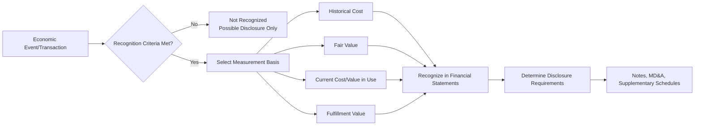

## Recognition, Measurement, and Disclosure Concepts

### Overview

Recognition, measurement, and disclosure form the three-stage process by which economic phenomena are captured and communicated in financial statements. Recognition determines *whether* an item enters the financial statements; measurement determines *what amount* is assigned to it; disclosure determines *what additional information* accompanies it. These concepts operationalize the qualitative characteristics (relevance, faithful representation) established in the Conceptual Framework.

### Recognition Concepts

**Definition**

Recognition is the process of capturing, for inclusion in the financial statements, an item that meets the definition of an element (asset, liability, equity, income, or expense).

**Recognition Criteria (IASB Conceptual Framework, 2018)**

An item is recognized only if recognizing it provides users with:

1. **Relevant information** about the element
2. **Faithful representation** of the element
3. Information whose benefits exceed the **cost** of providing it

**Key Points**

- The 2018 IASB Framework removed the older explicit "probable + reliably measurable" two-part test used in the 1989/2010 frameworks, replacing it with a cost-constrained relevance/faithful-representation test — recognition is now assessed holistically rather than via a fixed threshold [Unverified: exact wording nuances should be checked against the current IFRS Conceptual Framework text, as this represents a significant conceptual shift from pre-2018 guidance]
- U.S. GAAP (FASB CON 5, largely preserved in substance under CON 8) retains four traditional recognition criteria: **definitions**, **measurability**, **relevance**, and **reliability** (faithful representation)
- **Existence uncertainty** (is there an asset/liability at all?) is distinguished from **measurement uncertainty** (how much is it worth?) — high measurement uncertainty does not automatically preclude recognition, but it may reduce the relevance of the recognized amount and increase the need for disclosure
- Derecognition is the mirror concept: removing a previously recognized asset or liability from the statement of financial position when it no longer meets the definition of an element (e.g., a receivable is collected or written off; a liability is settled or extinguished)

**Example**

A contingent liability from pending litigation:

- If the outflow of resources is **probable** and the amount can be **reasonably estimated** → recognize a liability (ASC 450 threshold: "probable")
- If **reasonably possible** but not probable, or not reasonably estimable → disclose only in notes (do not recognize)
- If **remote** → generally no disclosure required

Under IFRS (IAS 37), a **provision** is recognized when there is a present obligation, an outflow is **probable** (>50%), and the amount can be estimated reliably — note the different probability threshold language ("probable" under both, but IAS 37 additionally uses "more likely than not" as its operational probable threshold, versus ASC 450's less precisely quantified "probable").

### Measurement Concepts

**Definition**

Measurement is the process of quantifying, in monetary terms, the elements recognized in the financial statements, using a selected measurement basis.

**Measurement Bases**

| Basis | Description | Common Application |
| --- | --- | --- |
| **Historical cost** | Amount paid/received (or fair value at acquisition) adjusted over time for depreciation, amortization, impairment | PP&E, most inventory, intangible assets |
| **Current cost** | Cost of an equivalent asset at the measurement date | Rarely used standalone; conceptual reference point |
| **Fair value** | Price that would be received to sell an asset or paid to transfer a liability in an orderly transaction between market participants at the measurement date (ASC 820 / IFRS 13) | Financial instruments, investment property, business combination assets/liabilities |
| **Value in use / Fulfillment value** | Present value of cash flows an entity expects to derive from an asset (value in use) or expects to incur in fulfilling a liability (fulfillment value) | Impairment testing, insurance contract liabilities |
| **Current cost (replacement cost)** | Amount currently required to replace the service capacity of an asset | Certain regulatory/rate-based industries |

**Key Points**

- No single measurement basis is used exclusively — U.S. GAAP and IFRS both employ a **mixed-attribute model**, selecting the basis that best satisfies relevance and faithful representation for each element type
- Fair value measurement follows a strict hierarchy under both ASC 820 and IFRS 13:
  - **Level 1**: quoted prices in active markets for identical assets/liabilities
  - **Level 2**: observable inputs other than quoted prices (comparable market data)
  - **Level 3**: unobservable inputs (entity's own assumptions, discounted cash flow models)
- The choice of measurement basis directly affects relevance (fair value often more relevant for financial instruments held for trading) versus faithful representation and verifiability trade-offs (historical cost is more verifiable but may be less relevant for long-held assets)
- Measurement uncertainty is highest at Level 3 fair value inputs, requiring extensive disclosure of valuation techniques and sensitivity to changes in unobservable inputs

**Example: Measurement Basis Selection**

$$\text{Fair Value} = PV\left(\sum_{t=1}^{n} \frac{CF_t}{(1+r)^t}\right)$$

For an available-for-sale debt security with no active market, Level 3 fair value is estimated by discounting expected contractual cash flows ($CF_t$) at a market-observed or synthesized discount rate ($r$), with disclosure of the valuation technique and key unobservable inputs (e.g., credit spread assumptions) required under ASC 820-10-50 / IFRS 13.93.

### Disclosure Concepts

**Definition**

Disclosure is the presentation of information — through notes, supplementary schedules, and other means — that is necessary for users to understand the amounts recognized (or not recognized) in the primary financial statements, but which is not itself presented as a recognized element on the face of the statements.

**Categories of Disclosure**

- **Notes to financial statements**: accounting policies, disaggregation of recognized amounts, contingencies, related-party transactions, subsequent events
- **Supplementary information**: required but outside the audited core statements in some jurisdictions (e.g., oil and gas reserve disclosures under ASC 932)
- **Management's Discussion and Analysis (MD&A)**: forward-looking and explanatory narrative, required by SEC Regulation S-K Item 303, not part of the audited financial statements themselves but subject to separate liability standards
- **Integrated/sustainability disclosures**: increasingly required or voluntary disclosures (e.g., climate-related financial disclosures) that extend beyond traditional recognized elements [Inference: regulatory scope in this area continues to evolve across jurisdictions and should be verified against current SEC/ISSB requirements at the time of use]

**Key Points**

- Disclosure does not substitute for recognition — an item that fails recognition criteria but is nonetheless relevant to users (e.g., a reasonably possible contingency) is disclosed rather than recognized; disclosure cannot "cure" an accounting policy that should result in recognition
- Materiality governs disclosure just as it governs recognition — immaterial items need not be separately disclosed even if technically required by a standard, and conversely material items require disclosure regardless of whether a specific line-item threshold is met
- **Accounting policy disclosure** (ASC 235 / IAS 1) is itself a required disclosure — describing which measurement basis and recognition policy was chosen when multiple alternatives are permitted (e.g., FIFO vs. weighted-average inventory costing)
- Disclosure overload has become a standard-setting concern — the FASB's **Disclosure Framework project** and IASB's **Disclosure Initiative** both aim to improve disclosure effectiveness by focusing on decision-usefulness rather than compliance checklists

### Forensic Accounting Relevance

**Key Points**

- Recognition manipulation is a primary fraud vector: premature revenue recognition (recognizing before performance obligations are satisfied under ASC 606/IFRS 15), improperly avoiding liability recognition (understating loss contingencies), and channel stuffing all violate recognition criteria while sometimes preserving surface-level GAAP compliance
- Measurement manipulation includes selective use of Level 3 fair value inputs to manufacture favorable valuations, improper impairment timing (delaying recognition of asset impairment to avoid earnings hits), and cherry-picking discount rate assumptions
- Disclosure deficiencies are frequently the focus of SEC enforcement actions under Section 13(a) of the Exchange Act — omitting related-party transactions, burying material contingencies in immaterial-seeming footnotes, or failing to disclose known trends in MD&A (Item 303 violations)
- Forensic accountants often reconstruct the recognition/measurement/disclosure chain to identify at which stage manipulation occurred — whether an item was improperly recognized, measured using unsupportable inputs, or recognized correctly but with misleading or omitted disclosure

### Recognition/Measurement/Disclosure Interaction Diagram (svg_diagram)

<svg xmlns="http://www.w3.org/2000/svg" viewBox="0 0 740 300">
<text x="370" y="26" text-anchor="middle" font-size="17" font-weight="bold" fill="#1a1a2e">Three-Stage Financial Reporting Process (svg_diagram)</text>
<rect x="20" y="70" width="200" height="90" rx="10" fill="#e8f0fe" stroke="#1a56db" stroke-width="1.5" />
<text x="120" y="100" text-anchor="middle" font-size="14" font-weight="bold" fill="#1a1a2e">Recognition</text>
<text x="120" y="122" text-anchor="middle" font-size="11" fill="#333">Relevance +</text>
<text x="120" y="138" text-anchor="middle" font-size="11" fill="#333">Faithful Representation</text>
<rect x="270" y="70" width="200" height="90" rx="10" fill="#fef3e2" stroke="#c2670c" stroke-width="1.5" />
<text x="370" y="100" text-anchor="middle" font-size="14" font-weight="bold" fill="#1a1a2e">Measurement</text>
<text x="370" y="122" text-anchor="middle" font-size="11" fill="#333">Historical Cost / Fair Value /</text>
<text x="370" y="138" text-anchor="middle" font-size="11" fill="#333">Value in Use / Fulfillment Value</text>
<rect x="520" y="70" width="200" height="90" rx="10" fill="#e6f4ea" stroke="#1e8e3e" stroke-width="1.5" />
<text x="620" y="100" text-anchor="middle" font-size="14" font-weight="bold" fill="#1a1a2e">Disclosure</text>
<text x="620" y="122" text-anchor="middle" font-size="11" fill="#333">Notes, MD&amp;A,</text>
<text x="620" y="138" text-anchor="middle" font-size="11" fill="#333">Supplementary Schedules</text>
<line x1="220" y1="115" x2="270" y2="115" stroke="#333" stroke-width="1.5" marker-end="url(#arrow2)" />
<line x1="470" y1="115" x2="520" y2="115" stroke="#333" stroke-width="1.5" marker-end="url(#arrow2)" />
<path d="M120,160 C120,220 620,220 620,160" fill="none" stroke="#888" stroke-width="1.2" stroke-dasharray="4,3" marker-end="url(#arrow2)" />
<text x="370" y="240" text-anchor="middle" font-size="11" fill="#666">Disclosure explains/supports recognized &amp; measured amounts</text>
<path d="M20,115 C-30,115 -30,190 60,200 L100,190" fill="none" stroke="#c81e1e" stroke-width="1.2" stroke-dasharray="4,3" />
<text x="20" y="260" text-anchor="start" font-size="10" fill="#c81e1e">Not recognized items may still</text>
<text x="20" y="274" text-anchor="start" font-size="10" fill="#c81e1e">require disclosure only</text>
</svg>

### FASB vs. IASB Comparison Summary

| Concept | U.S. GAAP | IFRS |
| --- | --- | --- |
| Recognition test | Definitions, measurability, relevance, reliability (CON 5/CON 8 substance) | Relevance + faithful representation, cost-constrained (2018 Framework) |
| Contingency recognition threshold | "Probable" (ASC 450) — generally interpreted as likely, no fixed % | "Probable" (IAS 37) — generally operationalized as >50% likelihood |
| Fair value hierarchy | ASC 820 (Levels 1–3) | IFRS 13 (Levels 1–3) — substantially converged |
| Disclosure framework | FASB Disclosure Framework project (materiality-focused) | IASB Disclosure Initiative (Principles of Disclosure) |
| Measurement basis philosophy | Mixed-attribute model, rules-oriented in application | Mixed-attribute model, more principles-based in application |

### Common Exam/Test Pitfalls

- Assuming recognition requires 100% certainty — recognition operates on relevance/reliability thresholds, not absolute certainty
- Confusing derecognition with impairment — impairment reduces a recognized carrying amount; derecognition removes the item entirely
- Treating disclosure as a lesser or optional substitute for recognition — the two serve distinct, non-substitutable purposes
- Assuming fair value is always "more accurate" than historical cost — fair value improves relevance but can reduce verifiability, particularly at Level 3
- Overlooking that MD&A disclosures, while not part of the audited financial statements, carry independent legal liability exposure (Item 303, Regulation S-K)

**Related Topics**

- Revenue recognition under ASC 606 / IFRS 15 (five-step model)
- Fair value measurement hierarchy and Level 3 valuation techniques
- Contingencies and provisions (ASC 450 vs. IAS 37)
- Impairment testing models (ASC 360, ASC 350, IAS 36)
- Materiality in disclosure decisions
- SEC Regulation S-K Item 303 and MD&A liability exposure
- Related-party transaction disclosure and forensic red flags
- Accounting policy choice and comparability implications