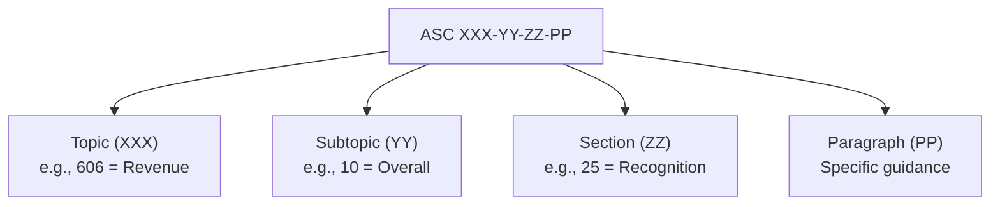

## GAAP Hierarchy and the FASB Accounting Standards Codification

### Overview

The GAAP hierarchy establishes the authoritative ranking of accounting guidance sources that preparers and auditors must follow when applying U.S. Generally Accepted Accounting Principles. The **FASB Accounting Standards Codification (ASC)**, effective for periods ending after September 15, 2009, reorganized decades of fragmented pronouncements into a single, topically structured authoritative source, fundamentally simplifying what had previously been a complex multi-tiered hierarchy.

### Pre-Codification GAAP Hierarchy (Historical Context)

Prior to 2009, U.S. GAAP hierarchy was governed by **SAS No. 69** (AICPA) and later **SFAS No. 162** (FASB), organizing authoritative literature into four descending categories (Category A being most authoritative):

| Category | Sources (pre-2009) |
| --- | --- |
| **A** | FASB Statements, Interpretations, Staff Positions; APB Opinions; AICPA Accounting Research Bulletins |
| **B** | FASB Technical Bulletins; AICPA Industry Audit and Accounting Guides; AICPA Statements of Position |
| **C** | Consensus positions of the FASB Emerging Issues Task Force (EITF); AICPA Practice Bulletins |
| **D** | AICPA Accounting Interpretations; FASB/AICPA Implementation Guides; widely recognized industry practice |

**Key Points**

- This pre-2009 structure required practitioners to search across dozens of separate pronouncement series to determine authoritative guidance on a single topic — a major driver of the Codification project
- SFAS No. 162 (2008) was the final pronouncement to formally restate this hierarchy immediately before the Codification superseded it

### The FASB Accounting Standards Codification (ASC)

**Purpose and Structure**

The Codification became, effective September 2009, the **single source of authoritative U.S. GAAP** for nongovernmental entities (governmental entities remain under GASB standards). It did not create new GAAP — it reorganized existing authoritative guidance into a consistent structure without changing substantive accounting requirements at the time of its issuance.

**Codification Numbering Structure**

**Key Points**

- Structure: **Topic → Subtopic → Section → Paragraph**, e.g., **ASC 606-10-25-1** refers to Topic 606 (Revenue from Contracts with Customers), Subtopic 10 (Overall), Section 25 (Recognition), Paragraph 1
- Sections follow a standardized numbering convention across all topics (not topic-specific), which materially improved navigability:
  - **05**: Overview and Background
  - **10**: Objectives
  - **15**: Scope and Scope Exceptions
  - **20**: Glossary
  - **25**: Recognition
  - **30**: Initial Measurement
  - **35**: Subsequent Measurement
  - **40**: Derecognition
  - **45**: Other Presentation Matters
  - **50**: Disclosure
  - **55**: Implementation Guidance and Illustrations
  - **60**: Relationships
  - **65**: Transition and Open Effective Date Information
  - **75**: XBRL Elements
- Topics are organized into nine Areas: General Principles (105–199), Presentation (205–299), Assets (300s), Liabilities (400s), Equity (500s), Revenue (600s), Expenses (700s), Broad Transactions (800s), Industry (900s)
- The Codification is maintained and published via the **FASB Codification Research System (CRS)**, accessible online; the "basic view" is free, with an enhanced professional view available by subscription

### Authoritative vs. Non-Authoritative Content Within the Codification

**Key Points**

- Everything within the Codification (Topics 105–999, excluding certain SEC-only content) is **authoritative** for nongovernmental entities
- **SEC content** included in the Codification (SEC Staff Accounting Bulletins, SEC Regulation S-X excerpts) is authoritative *only for SEC registrants* — it is included for convenience/reference but is not authoritative U.S. GAAP for non-public entities
- Content explicitly labeled as non-authoritative in the Codification includes: the FASB Concepts Statements (CON 1–8, providing conceptual framework guidance but not GAAP itself), and grandfathered guidance clearly marked as such
- If the guidance for a particular transaction or event is not specified within a source of authoritative GAAP for a nongovernmental entity, an entity should first consider accounting principles for similar transactions within a source of authoritative GAAP, and then consider nonauthoritative guidance from other sources (a residual hierarchy still exists for genuinely unaddressed topics)

**Post-Codification Residual Hierarchy for Unspecified Transactions**

When authoritative GAAP does not address a specific transaction, entities may consider (in descending order of persuasiveness, per ASC 105-10-05):

1. FASB Concepts Statements
2. Pronouncements of professional associations or regulatory agencies
3. AICPA Technical Practice Aids
4. Accounting textbooks, handbooks, and articles

### Codification Update Mechanism — Accounting Standards Updates (ASUs)

**Key Points**

- The FASB no longer issues standalone "Statements" (SFAS) or "Interpretations" (FIN) — since the Codification launch, new/amended guidance is issued as **Accounting Standards Updates (ASUs)**
- An ASU is *not* itself authoritative GAAP — it is a **transmittal document** that describes amendments to the Codification and provides background/basis for conclusions; the amended Codification text itself is what becomes authoritative once the ASU's effective date arrives
- ASUs are numbered sequentially by year and order of issuance (e.g., **ASU 2014-09**, *Revenue from Contracts with Customers*, later codified as ASC 606; **ASU 2016-02**, *Leases*, codified as ASC 842; **ASU 2016-13**, *Financial Instruments—Credit Losses*, codified as ASC 326)
- Each ASU specifies an effective date and transition method (full retrospective, modified retrospective, or prospective), which practitioners must track separately from the codified guidance itself

### The Emerging Issues Task Force (EITF)

**Key Points**

- The EITF assists the FASB by identifying, discussing, and attempting to reach consensus on emerging implementation issues before they become widespread divergent practices
- EITF consensuses, once ratified by the FASB, are incorporated into the Codification through the ASU process — the EITF does not issue independently authoritative guidance outside this pathway post-2009
- The EITF remains active as a mechanism for narrow-scope, timely guidance on implementation questions arising under existing standards

### IFRS Hierarchy Comparison (Contextual)

| Aspect | U.S. GAAP (Post-Codification) | IFRS |
| --- | --- | --- |
| Primary authoritative source | FASB ASC (single codified source) | IFRS Standards, IAS Standards, IFRIC/SIC Interpretations (not fully codified into one document, though the IFRS Foundation publishes a consolidated "Green Book"/"Red Book") |
| Update mechanism | ASUs amend the Codification | New/amended IFRS or IAS standards issued directly by the IASB |
| Residual guidance (topic not addressed) | FASB Concepts Statements → other authoritative analogues → nonauthoritative sources | IAS 8 hierarchy: management judgment referencing similar IFRS, then Conceptual Framework, then other standard-setters' pronouncements with similar frameworks |
| Conceptual framework status | Nonauthoritative (CON 1–8) | Nonauthoritative but explicitly referenced in IAS 8 as a required consideration in the absence of specific guidance |

### Practical Research Workflow Example

**Example**

A practitioner researching the accounting for a sale-leaseback transaction would:

1. Search the Codification topically — leases fall under **ASC 842** (post-ASU 2016-02 adoption)
2. Navigate to the relevant Subtopic — sale-leaseback guidance resides in **ASC 842-40**
3. Review Section 25 (Recognition) to determine whether the transaction qualifies as a sale under ASC 606 principles (a cross-reference requirement embedded in ASC 842-40-25)
4. Review Section 50 (Disclosure) for required qualitative and quantitative disclosures
5. Cross-check the ASU's effective date and transition guidance (Section 65) to confirm applicability to the entity's fiscal year

### Forensic Accounting Relevance

**Key Points**

- Forensic accountants must correctly identify the *applicable* authoritative Codification guidance and effective ASU version for the period under investigation — restatement disputes frequently hinge on whether the correct version of GAAP (pre- or post-amendment) was applied at the time of original reporting
- Litigation support engagements often require reconstructing what authoritative guidance was in effect at a specific historical reporting date, since ASU effective dates and early-adoption elections vary by entity
- Misapplication or selective citation of non-authoritative sources (e.g., citing outdated pre-Codification SFAS numbers, or misapplying SEC-only guidance to a private company) is a common technical deficiency identified in expert witness rebuttal reports
- The transition disclosures required under ASC 250 (Accounting Changes and Error Corrections) become directly relevant when forensic analysis identifies that an entity applied superseded guidance

### Common Exam/Test Pitfalls

- Referring to "FAS 157" or other pre-Codification numbers as current authoritative citations — post-2009, correct citation form is the ASC reference (e.g., ASC 820, not FAS 157)
- Treating an ASU itself as authoritative GAAP — the ASU is the amending/transmittal document; the *codified* result is what is authoritative
- Assuming SEC guidance embedded in the Codification applies to all entities — it is authoritative only for SEC registrants
- Confusing the EITF's current role (issue identification feeding into the ASU process) with its pre-2009 role (issuing directly authoritative Category C guidance)
- Forgetting that FASB Concepts Statements, despite being embedded in Codification-adjacent literature, remain nonauthoritative

**Related Topics**

- Accounting Standards Updates (ASU) transition methods and effective date tracking
- IFRS vs. U.S. GAAP convergence history (Norwalk Agreement, joint projects)
- SEC Regulation S-X and Regulation S-K interaction with the Codification
- Accounting changes and error corrections (ASC 250) and restatement mechanics
- Private Company Council (PCC) and private company GAAP alternatives
- GASB standards and the governmental accounting hierarchy (contrast with FASB)
- Codification research methodology and professional literature search techniques