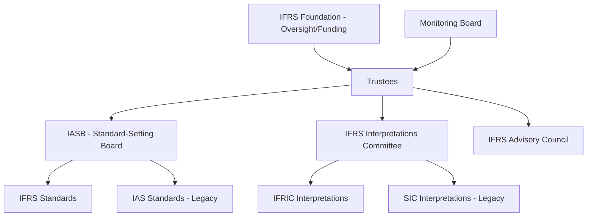

## IASB Conceptual Framework and IFRS Structure

### Overview

The International Accounting Standards Board (IASB), operating under the oversight of the **IFRS Foundation**, issues International Financial Reporting Standards (IFRS) as the basis for financial reporting in over 140 jurisdictions worldwide. Unlike the FASB's fully codified single-source model, IFRS retains a layered structure of standards, interpretations, and a nonauthoritative conceptual framework that together govern application.

### Institutional Structure

**Key Points**

- The **IFRS Foundation** is the oversight body; its **Trustees** appoint IASB members and oversee governance, funding, and due process, but do not set technical accounting requirements themselves
- The **IASB** is the independent standard-setting board that issues IFRS Standards
- The **IFRS Interpretations Committee** (formerly IFRIC) issues authoritative interpretations of existing standards to address emerging application questions and reduce diversity in practice
- The **Monitoring Board** provides a formal link between the IFRS Foundation and public capital market authorities (e.g., IOSCO, national securities regulators)
- Legacy nomenclature persists: standards issued before the IASB's 2001 restructuring (from its predecessor, the International Accounting Standards Committee, IASC) are still called **IAS** (e.g., IAS 1, IAS 16, IAS 37); standards issued by the IASB itself are called **IFRS** (e.g., IFRS 9, IFRS 15, IFRS 16). Both carry equal authority — the naming difference is historical, not hierarchical

### The IASB Conceptual Framework (2018 Revision)

**Purpose**

The Conceptual Framework for Financial Reporting assists the IASB in developing IFRS Standards, assists preparers in developing consistent accounting policies when no standard specifically applies, and assists all parties in understanding and interpreting IFRS.

**Structure of the Framework (Chapters)**

| Chapter | Content |
| --- | --- |
| 1 | The objective of general purpose financial reporting |
| 2 | Qualitative characteristics of useful financial information |
| 3 | Financial statements and the reporting entity |
| 4 | The elements of financial statements (assets, liabilities, equity, income, expenses) |
| 5 | Recognition and derecognition |
| 6 | Measurement |
| 7 | Presentation and disclosure |
| 8 | Concepts of capital and capital maintenance |

**Key Points**

- The 2018 revision introduced **Chapter 3 (Reporting Entity)** as new content not present in the 1989/2010 versions, formally defining what constitutes a reporting entity (including cases where an entity is not a legal entity, and combined/consolidated financial statements)
- **Prudence** was explicitly reintroduced in 2018 as "the exercise of caution when making judgments under conditions of uncertainty," clarified as *asymmetric neutrality is not required* — prudence does not justify deliberate overstatement of liabilities/understatement of assets or vice versa
- The 2018 Framework replaced the old "probable + reliable measurement" recognition test with a relevance/faithful-representation/cost-constrained test (see Recognition, Measurement, and Disclosure Concepts topic)
- **Measurement uncertainty** received expanded discussion — high measurement uncertainty can reduce (but does not automatically preclude) the relevance of recognizing an item
- The Framework is explicitly **not an IFRS Standard** — in case of conflict between the Framework and a specific IFRS/IAS Standard, the Standard prevails (Framework, paragraph SP1.2)

### IFRS Standard-Setting Due Process

**Key Points**

- Due process requires public consultation at multiple stages, typically including a **Discussion Paper** (early-stage, broader alternatives explored) and an **Exposure Draft** (near-final proposed standard, formal comment period, usually 120 days minimum)
- A **Post-Implementation Review (PIR)** is conducted a few years after a major standard's effective date to assess whether it is achieving its intended objectives (e.g., PIR of IFRS 15 and IFRS 9 have both been conducted)
- The IASB maintains a public **work plan** tracking active projects, research projects, and maintenance/narrow-scope amendments

### Structure of an Individual IFRS Standard

**Key Points**

- Standards typically follow a consistent internal structure: Objective, Scope, Definitions, Recognition, Measurement, Presentation, Disclosure, Effective Date and Transition, and Appendices (including application guidance and, in some cases, illustrative examples)
- **Basis for Conclusions** documents accompany major standards, explaining the IASB's reasoning — these are issued as a *separate, nonauthoritative* document, not part of the standard itself, though frequently used to interpret intent in ambiguous situations
- Illustrative Examples and application guidance, when included as an integral appendix (explicitly stated to be part of the standard), *are* authoritative; freestanding "educational material" issued by IASB staff generally is not

### Hierarchy for Matters Not Specifically Addressed (IAS 8)

When no IFRS Standard specifically applies to a transaction, **IAS 8** *Accounting Policies, Changes in Accounting Estimates and Errors* requires management to use judgment in developing a policy that results in relevant and reliable information, referencing (in descending order):

1. Requirements in IFRS Standards dealing with similar and related issues
2. The definitions, recognition criteria, and measurement concepts in the **Conceptual Framework**
3. Most recent pronouncements of other standard-setting bodies that use a similar conceptual framework (e.g., U.S. GAAP), other accounting literature, and accepted industry practices — but only to the extent these do not conflict with IFRS or the Framework

**Key Points**

- This hierarchy formally elevates the Conceptual Framework to a mandatory reference point (step 2) when standards are silent — a materially different role than the FASB Concepts Statements play under U.S. GAAP, where the Framework sits deeper in the residual hierarchy
- Step 3 explicitly permits (with constraints) reference to other GAAP frameworks like U.S. GAAP, making cross-framework research occasionally relevant even for IFRS preparers on unaddressed issues

### IFRS for SMEs

**Key Points**

- The **IFRS for SMEs Standard** is a simplified, self-contained standard for entities without public accountability, based on full IFRS principles but with reduced disclosure requirements and simplified recognition/measurement options (e.g., no available-for-sale classification complexity, simplified goodwill treatment)
- It is a separate standard from full IFRS, not merely a subset — adoption is jurisdiction-dependent and it is periodically updated on its own review cycle, most recently substantially revised effective 2027 [Unverified: exact current effective date and scope of the most recent IFRS for SMEs revision should be confirmed against the IFRS Foundation's current publications, as SME standard revision cycles are less frequent and less publicized than full IFRS updates]

### IFRS vs. U.S. GAAP Structural Comparison

| Aspect | IFRS | U.S. GAAP |
| --- | --- | --- |
| Codification | Not fully codified into one authoritative document (standards + interpretations + Framework, published together in the "Red Book"/annual bound volume for reference, but not a unified numbering codification) | Fully codified (FASB ASC) |
| Conceptual Framework authority | Nonauthoritative, but mandatory reference under IAS 8 hierarchy step 2 | Nonauthoritative, appears later in residual hierarchy (ASC 105-10-05) |
| Standard naming | Mixed: IAS (pre-2001) and IFRS (post-2001), equal authority | Uniform Topic numbering post-2009; historical FAS/FIN/EITF numbers retired from active citation |
| Approach | Generally described as more principles-based | Generally described as more rules-based, though both frameworks contain detailed application guidance in practice [Inference: the principles-based/rules-based distinction is a widely used pedagogical generalization rather than a precise technical dividing line, since both bodies of literature include both principle statements and detailed implementation guidance] |
| SME-specific standard | IFRS for SMEs (standalone standard) | No separate FASB codification path; Private Company Council (PCC) issues targeted alternatives within the ASC |

### Jurisdictional Adoption Considerations

**Key Points**

- IFRS as issued by the IASB is adopted, endorsed with modification, or used as a reference point differently across jurisdictions — the **EU** uses an endorsement mechanism (EU-adopted IFRS may lag or diverge slightly from IASB-issued IFRS on specific standards), while many other jurisdictions adopt IFRS as issued without modification
- The **U.S.** does not require domestic issuers to use IFRS; foreign private issuers filing with the SEC may use IFRS as issued by the IASB without reconciliation to U.S. GAAP (a position formalized by the SEC in 2007)
- This jurisdictional variation means "IFRS" as applied in practice is not always perfectly uniform, and forensic/comparative analysis must identify which jurisdictional version of IFRS (IASB-issued vs. EU-endorsed vs. other local variant) governs a given entity's financial statements [Unverified: current EU endorsement status for any specific individual standard should be checked at the time of analysis, since endorsement delays and carve-outs (e.g., historical partial carve-out from IAS 39 hedge accounting) have occurred and can change]

### Forensic Accounting Relevance

**Key Points**

- Cross-border fraud and financial statement investigations frequently require the practitioner to determine which conceptual framework and standard set (IFRS as issued vs. a jurisdictional variant vs. U.S. GAAP) governed the entity's reporting at the relevant time
- The Conceptual Framework's emphasis on substance over form (embedded in faithful representation, Chapter 2) is a frequently cited analytical anchor in IFRS-based forensic engagements evaluating structured transactions
- Understanding the IAS 8 hierarchy is essential when an investigation reveals an entity applied an accounting policy for a transaction type not explicitly addressed by a specific standard — determining whether the policy selection process itself followed required due process (referencing similar standards, then the Framework) is part of assessing good-faith versus deliberate misapplication

### Common Exam/Test Pitfalls

- Assuming IAS and IFRS designate different authority levels — they carry equal authority; the distinction is purely chronological/institutional (IASC-era vs. IASB-era)
- Treating the Conceptual Framework as directly enforceable IFRS — it is explicitly nonauthoritative and yields to specific standards in conflict
- Confusing the IFRS Interpretations Committee's authoritative interpretations (IFRIC/SIC) with nonauthoritative educational materials or staff papers
- Assuming IFRS is applied identically worldwide — endorsement mechanisms (notably in the EU) can create jurisdiction-specific variants
- Overlooking that Basis for Conclusions documents, despite their interpretive usefulness, are not authoritative parts of the standard itself

**Related Topics**

- IAS 8 accounting policy selection, changes in estimates, and error correction
- IFRS 15 / ASC 606 revenue recognition convergence and remaining differences
- IFRS Foundation governance and the Monitoring Board
- EU IFRS endorsement mechanism and historical carve-outs
- IFRS for SMEs recognition and measurement simplifications
- Post-implementation review process and standard-setting due process
- Convergence history between IASB and FASB (Norwalk Agreement, Memorandum of Understanding)
- SEC treatment of foreign private issuers reporting under IFRS