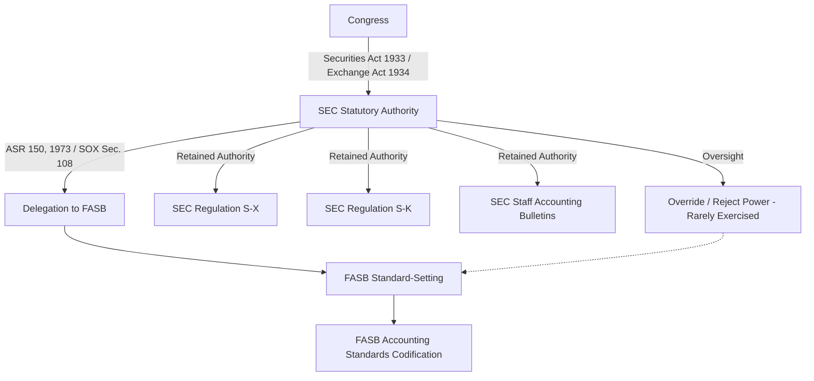

## Standard-Setting Process and SEC Rulemaking Authority

### Overview

U.S. financial reporting authority rests on a layered legal and institutional structure: the **Securities and Exchange Commission (SEC)** holds statutory rulemaking authority over public company accounting under federal securities law, but has historically delegated primary standard-setting responsibility to private-sector bodies — first the Committee on Accounting Procedure (CAP), then the Accounting Principles Board (APB), and since 1973 the **Financial Accounting Standards Board (FASB)**. Understanding this delegation relationship, its legal basis, and its practical limits is essential to interpreting the authority and enforceability of U.S. GAAP.

### Legal Basis of SEC Authority

**Key Points**

- The SEC derives its authority to prescribe accounting principles and reporting requirements for public companies from the **Securities Act of 1933** and the **Securities Exchange Act of 1934**, particularly Section 13(a) and Section 19(a) of the Exchange Act
- Congress granted the SEC this authority directly, but the SEC has chosen, as a matter of policy, to rely on the private sector (FASB) for setting accounting standards, while retaining oversight and override authority
- This delegation was formalized in **Accounting Series Release (ASR) No. 150** (1973), in which the SEC stated that FASB pronouncements would be considered to have substantial authoritative support, and later reaffirmed through **Financial Reporting Release (FRR) No. 1** and subsequent policy statements
- The SEC's recognition of the FASB (and, by extension, the Codification) as the designated private-sector standard-setter for public companies was further reaffirmed under the **Sarbanes-Oxley Act of 2002**, Section 108, which directed the SEC to conduct a study on adopting a principles-based accounting system and reaffirmed FASB's role, conditioned on FASB meeting certain funding-independence and governance criteria

### FASB Governance and Independence

**Key Points**

- The FASB operates under the oversight of the **Financial Accounting Foundation (FAF)**, which appoints FASB members, oversees funding, and safeguards the Board's independence from constituent pressure
- FASB funding is derived primarily from accounting support fees assessed on public companies (mandated under Sarbanes-Oxley Section 109), rather than from voluntary contributions — a structural change intended to reduce the risk of donor influence over standard-setting outcomes
- The **Financial Accounting Standards Advisory Council (FASAC)** advises the FASB on agenda priorities, project timing, and other matters, without setting standards itself
- FASB due process for a new standard typically follows: agenda decision → research → **Discussion Paper** (optional, for major projects) → **Exposure Draft** → public comment period → redeliberation → final **Accounting Standards Update (ASU)**

### SEC's Retained and Independently Exercised Authority

Despite delegating standard-setting to FASB, the SEC retains and actively exercises independent rulemaking authority in several domains:

| SEC Authority | Scope |
| --- | --- |
| **Regulation S-X** | Governs the form and content of financial statements filed with the SEC (which statements are required, general disclosure requirements, article-specific rules for industries like banks, insurance, oil & gas) |
| **Regulation S-K** | Governs non-financial-statement disclosure requirements in SEC filings, including **Item 303 (MD&A)**, executive compensation, and risk factor disclosures |
| **Staff Accounting Bulletins (SABs)** | Interpretive guidance reflecting SEC staff views on the application of GAAP in specific contexts (e.g., SAB 101/104 historically addressed revenue recognition views prior to ASC 606) |
| **Financial Reporting Releases (FRRs)** | Formal Commission-level (not just staff-level) pronouncements on accounting and auditing matters |
| **Comment letters and enforcement** | The SEC's Division of Corporation Finance reviews filings and issues comment letters; the Division of Enforcement pursues actions for material misstatements or disclosure violations |

**Key Points**

- SAB guidance is included within the FASB Codification for reference but is authoritative *only for SEC registrants*, not for private companies — a critical distinction tested in GAAP hierarchy contexts
- The SEC has, on occasion, used its authority to reject or delay a FASB position it found unacceptable — historically most notably regarding stock option expensing in the early 1990s, when the SEC's public support for expensing (alongside congressional pressure) contributed to FASB's own multi-year deliberation before eventual issuance of SFAS 123R (now within ASC 718)
- The theoretical power to override FASB and issue its own GAAP has rarely been formally exercised, but its existence shapes FASB's practical incentives to maintain SEC confidence in its due process and outcomes [Inference: the SEC's restraint in formally overriding FASB reflects a longstanding policy preference for private-sector standard-setting rather than an absence of legal authority to do so]

### Other Bodies in the Standard-Setting Ecosystem

**Key Points**

- **Public Company Accounting Oversight Board (PCAOB)**: created by Sarbanes-Oxley (2002) to oversee the audits of public companies; sets **auditing standards** (not accounting/GAAP standards) and inspects registered public accounting firms — a frequently confused distinction, since PCAOB governs *how* audits are performed, not what accounting principles are applied
- **AICPA**: historically a standard-setter (CAP, APB eras) and still relevant for standards applicable to **private company audits not registered with the PCAOB** (AICPA Auditing Standards Board, ASB, issues Statements on Auditing Standards, SAS, for non-issuer audits) and for professional ethics (AICPA Code of Professional Conduct)
- **Private Company Council (PCC)**: works with the FASB to identify and propose alternative recognition, measurement, and disclosure guidance within U.S. GAAP for private companies, addressing cost-benefit concerns specific to non-public entities (e.g., simplified goodwill amortization alternatives)
- **Governmental Accounting Standards Board (GASB)**: sets GAAP for U.S. state and local governments — operates under the same Financial Accounting Foundation structure as FASB but produces entirely separate authoritative literature (not part of the FASB Codification)
- **International Organization of Securities Commissions (IOSCO)**: coordinates securities regulators globally and has historically influenced the SEC's stance toward IFRS acceptance for foreign private issuers

### SEC Rulemaking Process (Administrative Law Context)

**Key Points**

- SEC rules (as distinct from FASB standards) are subject to the **Administrative Procedure Act (APA)** notice-and-comment rulemaking process: proposed rule release → public comment period → adopting release (final rule) → publication in the Federal Register
- This is a materially different due process pathway than FASB's standard-setting, which is not a government rulemaking process and is not subject to the APA — a distinction relevant when analyzing the legal weight and challengeability of SEC rules versus FASB standards
- SEC rules can be challenged in federal court under the APA's arbitrary-and-capricious standard; FASB standards, as private-sector pronouncements, are not directly subject to this type of judicial review, though their *application* can be scrutinized in litigation over financial statement accuracy

### Illustrative Interaction Example

**Example**

When the FASB issued **ASU 2014-09** (Revenue from Contracts with Customers, codified as ASC 606), the SEC did not independently issue competing revenue recognition rules — it deferred to the FASB's converged (with IASB) standard, while separately retaining its own disclosure requirements under Regulation S-K for revenue-related MD&A discussion (Item 303) and issuing SEC staff observations/interpretive guidance regarding transition disclosures for registrants. This illustrates the typical division: FASB sets the recognition/measurement/disclosure *accounting* requirements; the SEC layers on additional *disclosure and transition compliance* requirements specific to its registrant population.

### Forensic Accounting Relevance

**Key Points**

- SEC enforcement actions (Accounting and Auditing Enforcement Releases, AAERs) are a primary evidentiary source for forensic accountants studying real-world financial statement fraud patterns, since they document the SEC's own investigative findings and legal theories
- Understanding the SEC's independent authority over Regulation S-K (particularly Item 303 MD&A) is critical in securities litigation, since MD&A misstatements can trigger liability distinct from, and in addition to, GAAP-based financial statement misstatement claims
- Distinguishing PCAOB auditing standard violations (audit failures — how the audit was performed) from FASB/GAAP violations (accounting failures — what was reported) is a foundational analytical step in professional liability and audit malpractice engagements
- The accounting support fee funding structure (Sarbanes-Oxley Section 109) is sometimes referenced in expert testimony regarding FASB's institutional independence when addressing allegations of standard-setting influenced by preparer interests

### Common Exam/Test Pitfalls

- Confusing PCAOB (auditing standards, public company audits) with FASB (accounting standards/GAAP) — a frequently tested distinction
- Assuming the SEC has never exercised independent authority over accounting matters because it "delegates" standard-setting — the SEC retains and actively uses authority over Regulation S-X, S-K, and SABs
- Treating SAB guidance as authoritative for all entities — it is authoritative only for SEC registrants
- Assuming FASB standard-setting is a government rulemaking process subject to the APA — it is a private-sector process, distinct from SEC rulemaking
- Overlooking that GASB, despite sharing the FAF governance umbrella with FASB, produces entirely separate authoritative literature outside the FASB Codification

**Related Topics**

- Accounting and Auditing Enforcement Releases (AAERs) as forensic research sources
- PCAOB auditing standards and inspection process
- SEC Regulation S-K Item 303 (MD&A) disclosure requirements and liability exposure
- Sarbanes-Oxley Act structural reforms (Sections 108, 109, 404)
- FASB Accounting Standards Codification and update mechanism (ASUs)
- Private Company Council alternatives within U.S. GAAP
- Historical stock option expensing controversy (SFAS 123R / ASC 718) as a case study in SEC-FASB dynamics
- GASB governmental accounting standards and public sector reporting