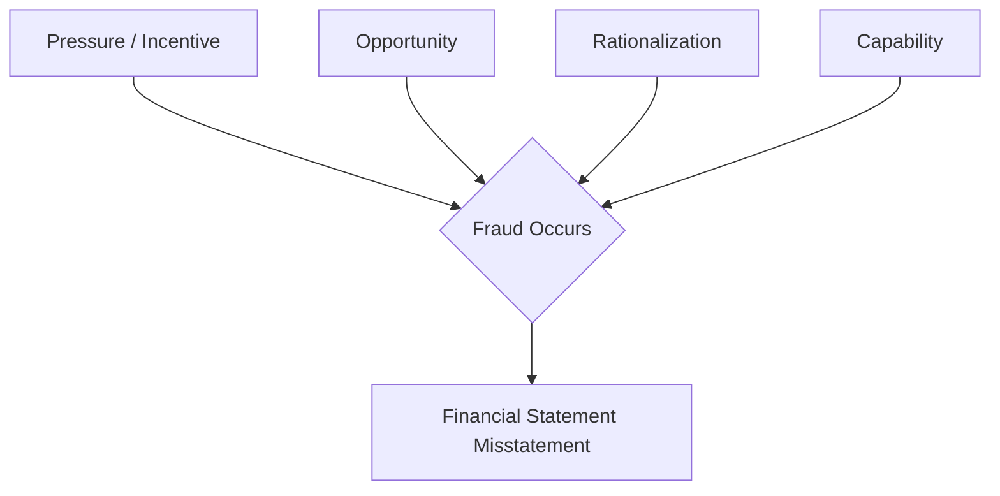
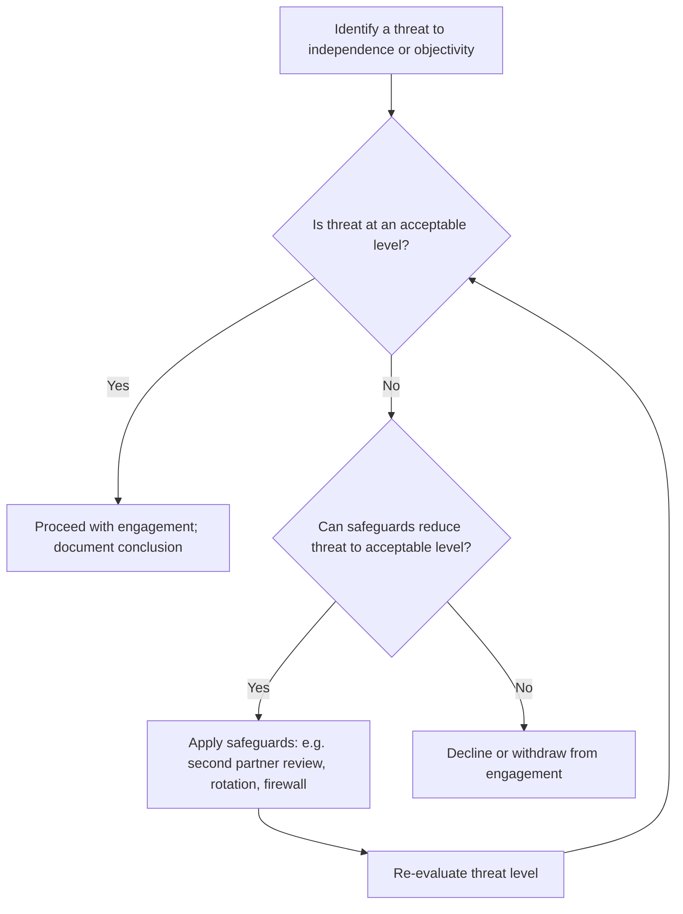

## Ethics and Professional Responsibility in Financial Reporting

### Overview

Ethics and professional responsibility in financial reporting concerns the normative and regulatory framework governing the conduct of accountants, auditors, and corporate officers in the preparation, review, and certification of financial statements. It sits at the intersection of professional codes of conduct, legal liability regimes, corporate governance structures, and the public-interest obligations that accounting as a profession is expected to uphold. The subject matter spans individual moral reasoning, firm-level quality controls, and systemic regulatory enforcement.

### The Public Interest Foundation

**Key Points**

- Accounting is licensed as a profession partly because society grants accountants a monopoly on attestation services (audits) in exchange for a duty to serve the public interest, not merely the paying client.
- The "public interest" includes investors, creditors, employees, regulators, and the capital markets broadly, not only the entity that engages and pays the accountant.
- This creates a structural tension: the auditor is paid by the client (management/those charged with governance) but owes a primary duty of care to third-party users of the financial statements.

This tension — commonly termed the **agency problem in auditing** — underlies most of the ethical failures studied in forensic and financial accounting: management has incentive to bias reporting; auditors have commercial incentive to retain the client relationship; and the party bearing the cost of misstatement (investors) is not the party controlling the engagement.

### Governing Codes of Professional Conduct

#### AICPA Code of Professional Conduct

The AICPA Code is organized around a **Conceptual Framework approach** layered on top of enumerated rules. It applies to members in three practice contexts: members in public practice, members in business, and other members.

**Fundamental Principles**

- Responsibilities
- The Public Interest
- Integrity
- Objectivity and Independence
- Due Care
- Scope and Nature of Services

**Key Rules (Public Practice)**

- Independence (Rule 101 / ET 1.200)
- Integrity and Objectivity (ET 1.100)
- General Standards and Compliance with Standards (ET 1.300)
- Confidential Client Information (ET 1.700)
- Contingent Fees (ET 1.510)
- Commissions and Referral Fees (ET 1.520)
- Acts Discreditable (ET 1.400)

#### The Conceptual Framework for Independence

Because rules cannot anticipate every fact pattern, the AICPA (and analogously the IESBA Code and SEC/PCAOB independence rules) requires members to apply a **threats-and-safeguards analysis** when no specific rule addresses a situation.

**Threat Categories**

1. **Self-interest threat** — financial or other interest will inappropriately influence judgment (e.g., auditor holds stock in client).
2. **Self-review threat** — evaluating one's own prior work or work product of the firm (e.g., auditor's firm prepared the financial statements it now audits).
3. **Advocacy threat** — promoting a client's position to the point objectivity is compromised (e.g., acting as an advocate in litigation).
4. **Familiarity threat** — long or close relationship leads to being too sympathetic to client interests (e.g., long audit partner tenure on one engagement).
5. **Undue influence / management participation threat** — client pressure or intimidation compromises objectivity (e.g., threat to replace the firm if an unfavorable opinion is issued).
6. **Adverse interest threat** — interests of the CPA and client become opposed, e.g., litigation between the two.

If threats are not at an acceptable level, the member must identify and apply **safeguards** (e.g., second-partner review, rotation, elimination of the prohibited service) or decline/withdraw from the engagement.

#### IESBA International Code of Ethics for Professional Accountants

The International Ethics Standards Board for Accountants (IESBA) Code, adopted (with local amendments) by IFAC member bodies globally, uses the same five fundamental principles as the AICPA (Integrity, Objectivity, Professional Competence and Due Care, Confidentiality, Professional Behavior) and the same threats-and-safeguards conceptual framework, making the two codes substantially convergent though not identical in specific prohibitions.

### Independence Rules in Depth

**Key Points**

- Independence has two dimensions: **independence in fact** (actual state of mind — objectivity and integrity) and **independence in appearance** (whether a reasonable, informed third party would conclude independence is impaired).
- SEC and PCAOB rules apply to audits of public companies (issuers) and are generally more restrictive than AICPA rules for private-company/non-issuer engagements.

**Prohibited Non-Audit Services for SEC Issuer Audit Clients (SOX §201 / SEC Rule 2-01)**

- Bookkeeping or other services related to accounting records/financial statements
- Financial information systems design and implementation
- Appraisal or valuation services, fairness opinions
- Actuarial services
- Internal audit outsourcing services
- Management functions or human resources
- Broker-dealer, investment adviser, or investment banking services
- Legal services and expert services unrelated to the audit
- Tax services to certain persons in a financial reporting oversight role

**Partner Rotation Requirements (SOX §203)**

- Lead (engagement) audit partner and concurring review partner must rotate off after **5 consecutive years**, with a **5-year "time-out" period** before returning.
- Other audit partners providing significant engagement services face a 7-year rotation / 2-year time-out under related rules.

**Audit Committee Pre-Approval (SOX §202)**

All audit and permitted non-audit services must be pre-approved by the issuer's audit committee, which must be composed entirely of independent directors under SOX §301.

### Sarbanes-Oxley Act of 2002 — Ethics and Accountability Provisions

**Key Points**

The Sarbanes-Oxley Act (SOX) was enacted in direct response to the Enron and WorldCom scandals and fundamentally reshaped the ethical and legal accountability structure of U.S. financial reporting.

| Section | Provision |
| --- | --- |
| §302 | CEO/CFO must personally certify accuracy of quarterly/annual reports and effectiveness of disclosure controls |
| §404 | Management must assess and report on internal control over financial reporting (ICFR); auditor must attest (for accelerated filers) |
| §406 | Public companies must disclose whether they have adopted a code of ethics for senior financial officers, and if not, why |
| §802 | Criminalizes destruction, alteration, or falsification of records to impede a federal investigation (up to 20 years imprisonment) |
| §906 | Criminal certification — knowing false certification of financial reports carries fines up to $5 million and up to 20 years imprisonment |
| §301 | Requires audit committees to establish procedures for handling complaints regarding accounting, internal controls, or auditing matters (whistleblower channel) |
| §806 | Whistleblower protection — prohibits retaliation against employees who report suspected fraud to regulators, Congress, or supervisors |
| §201 | Restricts auditor-provided non-audit services (see above) |
| §203 | Audit partner rotation (see above) |
| §108 | Established the Public Company Accounting Oversight Board (PCAOB) as the standard-setter and inspector of registered public accounting firms |

**§404 Internal Controls — Mechanics**

Under §404(a), management must issue a report stating its responsibility for ICFR and its assessment of effectiveness as of the fiscal year-end, typically using a recognized framework such as **COSO's Internal Control–Integrated Framework** (the five components: Control Environment, Risk Assessment, Control Activities, Information and Communication, Monitoring Activities). Under §404(b), the external auditor of an accelerated or large accelerated filer must independently attest to and report on the effectiveness of ICFR under PCAOB Auditing Standard **AS 2201**.

### The Fraud Triangle and Ethical Failure

**Key Points**

Donald Cressey's **Fraud Triangle**, foundational to forensic accounting, explains the conditions under which otherwise ethical professionals commit financial statement fraud.

1. **Pressure/Incentive** — financial need, analyst earnings expectations, debt covenant compliance, management bonus targets tied to reported earnings.
2. **Opportunity** — weak internal controls, override authority, collusion, inadequate audit oversight.
3. **Rationalization** — "I'll pay it back," "everyone does it," "the company owes me," "it's only temporary."

The **Fraud Diamond** (Wolfe & Hermanson, 2004) adds a fourth element, **Capability** — the individual's personal traits, position, and skill set needed to actually perpetrate and conceal the fraud, arguing that pressure, opportunity, and rationalization alone are insufficient without the capability to execute.

**Example**

A CFO facing pressure to meet Wall Street earnings estimates (Pressure), operating in an environment with weak audit committee oversight and significant management override of controls (Opportunity), convinces herself that "we'll make up the shortfall next quarter so it's just timing" (Rationalization), and — as CFO — possesses the authority and accounting knowledge to book fictitious revenue through improperly structured bill-and-hold arrangements (Capability).

### Types of Financial Statement Fraud (ACFE Classification)

1. **Revenue recognition fraud** — premature recognition, channel stuffing, fictitious sales, round-tripping.
2. **Overstatement of assets** — inventory overstatement, capitalizing expenses that should be expensed (e.g., WorldCom's capitalization of line costs), inflated receivables.
3. **Understatement of liabilities/expenses** — off-balance-sheet financing, unrecorded liabilities, understated allowances/reserves.
4. **Improper disclosures** — omission of related-party transactions, contingent liabilities, or subsequent events.
5. **Improper asset valuation** — manipulation of fair value estimates, goodwill impairment timing.

### Landmark Case Studies

**Enron Corporation (2001)**

Enron used **special purpose entities (SPEs)** — notably the LJM partnerships — to keep debt off its balance sheet while overstating earnings, in what [Inference] is generally regarded as a scheme facilitated by the "3% equity" off-balance-sheet accounting rule then in effect, which was subsequently tightened by FASB's consolidation guidance (now largely embedded in ASC 810, Variable Interest Entities). Arthur Andersen, Enron's auditor, was convicted (later overturned on appeal on technical grounds, but the firm had already collapsed) of obstruction of justice for shredding audit documents, effectively ending the firm and reducing the "Big 5" to the "Big 4."

**WorldCom (2002)**

WorldCom improperly capitalized approximately $3.8 billion of ordinary operating expenses (line costs) as capital expenditures, understating expenses and overstating both net income and assets, in what remains one of the largest accounting frauds in U.S. history by dollar magnitude.

**Others commonly studied**

- **Adelphia Communications** — related-party looting, off-balance-sheet family debt.
- **Tyco International** — executive self-dealing and unauthorized bonuses.
- **HealthSouth** — fictitious income entries to meet earnings targets.
- **Satyam Computer Services (India, 2009)** — fabricated cash balances and revenue, sometimes termed "India's Enron."
- **Wirecard (Germany, 2020)** — fabrication of approximately €1.9 billion in non-existent cash held in trust accounts, [Inference] widely cited as a major failure of both internal audit function and external auditor professional skepticism regarding third-party confirmations.

### Auditor Legal Liability Framework

**Key Points**

Forensic and financial accounting study requires distinguishing the liability standards accountants face, since ethical breach and legal liability, while related, are not identical.

| Liability Basis | Standard | Who Can Sue |
| --- | --- | --- |
| Common law — breach of contract | Ordinary negligence | Client (privity) |
| Common law — negligence (tort) | Ordinary negligence | Client; foreseen/known third parties (jurisdiction-dependent: *Ultramares* privity rule vs. *Restatement* foreseen-user rule vs. reasonably foreseeable-user rule) |
| Common law — fraud | Scienter (intent or reckless disregard) | Any party who relied |
| Securities Act of 1933, §11 | Negligence (defendant bears burden to prove due diligence) | Purchasers of registered securities |
| Securities Exchange Act of 1934, §10(b)/Rule 10b-5 | Scienter | Purchasers or sellers of securities |
| SOX §906 / criminal fraud statutes | Knowing and willful | Government (criminal prosecution) |

**Privity Doctrine Evolution**

- *Ultramares Corp. v. Touche* (N.Y. 1931) — established the strict privity rule limiting ordinary-negligence liability to parties in direct contractual privity or "near privity."
- *Credit Alliance Corp. v. Arthur Andersen* — refined near-privity into a three-part test (auditor's awareness of a known use, a known party/class, and some conduct linking the auditor to that party).
- *Restatement (Second) of Torts §552* — extended negligence liability to a limited, identifiable class of foreseen third-party users the accountant knew would rely on the work, adopted by a majority [Inference] of U.S. jurisdictions.
- A minority of jurisdictions apply a broader **reasonable foreseeability** standard.

### Professional Skepticism and Due Care

**Key Points**

- **Professional skepticism**, per AU-C 200 / PCAOB AS 1015, requires an attitude that includes a questioning mind, alertness to conditions indicating possible misstatement, and critical assessment of audit evidence.
- **Due professional care** (AICPA General Standards) requires observance of the fields of practice's technical and ethical standards, exercising professional judgment, and maintaining objectivity — but does not imply infallibility or guarantee of fraud detection.
- Auditors are responsible under AU-C 240 / PCAOB AS 2401 for obtaining **reasonable assurance** that financial statements are free of material misstatement, whether caused by error or fraud — not absolute assurance, given inherent limitations (collusion, forgery, management override).

**[Inference]** A recurring finding in post-scandal regulatory reviews (e.g., PCAOB inspection reports) is that audit failures often trace to insufficient professional skepticism rather than to absence of applicable technical audit standards — i.e., the standards existed but were not rigorously applied. This is a pattern observation, not a universal claim about any specific engagement.

### Corporate Governance and the Audit Committee

**Key Points**

- SOX §301 requires audit committees of listed issuers to be composed entirely of independent directors, with at least one designated as a "financial expert" (Item 407 of Regulation S-K defines the qualifying attributes).
- The audit committee, not management, has direct responsibility for the appointment, compensation, and oversight of the external auditor.
- Effective audit committees serve as a key mitigant to the management-override risk identified in the fraud triangle's "opportunity" leg.

### Whistleblower Protections and Incentives

**Key Points**

- **SOX §806** protects employees of public companies from retaliation for reporting suspected securities fraud to a federal regulatory or law enforcement agency, a member of Congress, or an internal supervisor with investigative authority.
- **Dodd-Frank Act §922 (Securities Whistleblower Incentive Program)** established SEC bounty awards of **10–30%** of monetary sanctions exceeding $1 million collected as a result of original information voluntarily provided, and added a private right of action for retaliation with a longer statute of limitations than SOX §806.
- **False Claims Act qui tam provisions** apply where fraud involves government contracts or programs, allowing private relators to sue on the government's behalf and share in recoveries.

### Forensic Accounting Ethical Considerations

**Key Points**

Forensic accountants, distinct from external auditors, are frequently engaged specifically to investigate suspected fraud, often in litigation support or expert witness capacity, which raises distinct ethical issues:

- **Independence from the retaining party's litigation interest** — while retained by one side, the forensic accountant's analytical work and expert testimony must remain objective and evidence-based, consistent with *Daubert*/*Frye* admissibility standards for expert testimony.
- **Chain of custody** for digital and documentary evidence must be rigorously maintained to preserve evidentiary integrity.
- **Confidentiality vs. disclosure obligations** — forensic accountants may encounter a duty to report ongoing or imminent fraud (e.g., under AU-C 240 auditor communication requirements, or attorney-client privilege constraints when engaged through counsel).
- Membership bodies such as the **ACFE (Association of Certified Fraud Examiners)** impose their own Code of Professional Ethics for Certified Fraud Examiners (CFEs), emphasizing integrity, objectivity, and confidentiality parallel to but distinct from the AICPA Code.

### Ethical Decision-Making Frameworks

**Key Points**

Professional ethics education commonly applies normative ethical theory to accounting dilemmas:

1. **Utilitarianism (consequentialist)** — evaluates the ethicality of an action by its aggregate outcomes/welfare effects (e.g., does non-disclosure of a contingent liability produce net social harm to investors?).
2. **Deontology (Kantian, rule-based)** — evaluates actions against a duty or rule irrespective of outcome (e.g., independence rules are followed because they are the rule, not merely because violation is likely to be caught).
3. **Virtue ethics** — focuses on the character and integrity of the professional rather than isolated acts or rules; asks "what would a person of practical wisdom (phronesis) do."
4. **Justice/fairness approach** — asks whether the distribution of burdens and benefits (e.g., who bears the loss from a misstatement) is equitable.

**AICPA "steps" heuristic for resolving an ethical conflict** (illustrative structured approach commonly taught, not itself an authoritative numbered AICPA rule):

- Identify the facts and the ethical issue
- Identify affected parties and their interests
- Identify applicable rules, laws, and the Conceptual Framework
- Identify alternative courses of action
- Evaluate each alternative against the fundamental principles
- Determine the appropriate course of action and document rationale

### Illustrative Threats-and-Safeguards Application

### Regulatory and Enforcement Bodies

| Body | Role |
| --- | --- |
| SEC (Securities and Exchange Commission) | Federal regulator; enforces securities laws, can bring civil actions, impose officer/director bars |
| PCAOB (Public Company Accounting Oversight Board) | Sets auditing standards for public company audits; inspects registered firms; disciplinary authority created by SOX §101 |
| AICPA Professional Ethics Division | Investigates and disciplines AICPA members for Code violations; can result in expulsion |
| State Boards of Accountancy | License CPAs; can suspend or revoke licenses independent of AICPA membership status |
| DOJ (Department of Justice) | Criminal prosecution under SOX §802/§906 and general fraud statutes |
| IESBA | Sets the International Code of Ethics adopted by IFAC member bodies worldwide |

### Common Exam/Analytical Application Patterns

**Key Points**

- Distinguishing **independence in fact vs. appearance** in scenario questions (e.g., an auditor who owns no stock but whose spouse is the client's controller has an appearance-of-impairment issue even absent actual bias).
- Applying the **threats-and-safeguards conceptual framework** to novel fact patterns not covered by a specific rule.
- Mapping a fact pattern to the correct **fraud triangle leg** to identify the primary control weakness to remediate.
- Distinguishing **auditor responsibility for fraud detection** (reasonable assurance) from **management's responsibility for fraud prevention** (primary responsibility for internal controls and the reliability of financial statements rests with management, not the auditor).
- Identifying which **SOX section** governs a described violation (certification failure → §302/§906; document destruction → §802; ICFR reporting → §404; non-audit service prohibition → §201).

### Related Topics

- Corporate governance structures and board independence requirements
- COSO Internal Control–Integrated Framework (2013) in depth
- PCAOB Auditing Standards (AS 1000 series) and inspection process
- Fraud triangle, fraud diamond, and forensic red-flag indicators
- Revenue recognition fraud schemes under ASC 606
- Off-balance-sheet financing and variable interest entities (ASC 810)
- Whistleblower statutes: SOX §806, Dodd-Frank §922, False Claims Act qui tam
- Auditor legal liability: *Ultramares*, *Credit Alliance*, Restatement §552 comparative analysis
- Digital forensic evidence collection and chain-of-custody procedures
- Earnings management vs. fraudulent financial reporting: the materiality and intent distinction
- International comparative ethics: IESBA Code vs. AICPA Code convergence points