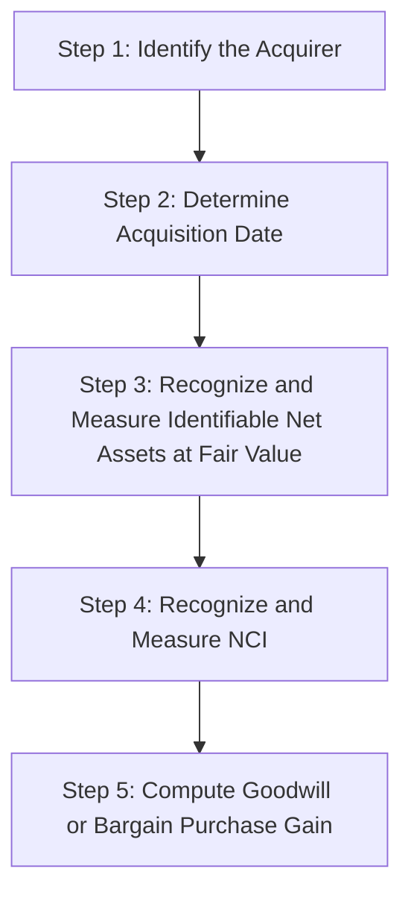
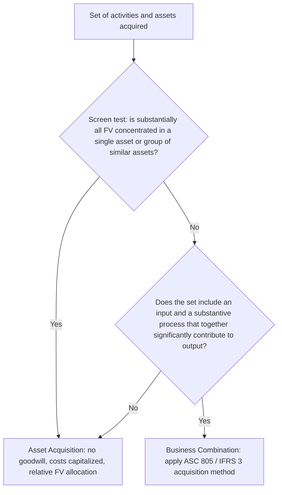

## Acquisition Method under ASC 805 and IFRS 3

### Overview

The acquisition method is the sole permitted accounting model for business combinations under both U.S. GAAP (ASC 805, *Business Combinations*) and IFRS (IFRS 3, *Business Combinations*). It replaced the pooling-of-interests method and the earlier purchase method, requiring the acquirer to recognize identifiable assets acquired, liabilities assumed, and any noncontrolling interest at fair value as of the acquisition date, with any residual recognized as goodwill (or a bargain purchase gain).

### Core Steps of the Acquisition Method

1. Identify the acquirer
2. Determine the acquisition date
3. Recognize and measure identifiable assets acquired and liabilities assumed
4. Recognize and measure any noncontrolling interest (NCI)
5. Recognize and measure goodwill or a gain from a bargain purchase

### Step 1 — Identifying the Acquirer

**Key Points**

- The acquirer is the entity that obtains **control** over the acquiree; control is assessed under ASC 810 (VIE and voting interest models) for U.S. GAAP and IFRS 10 for IFRS.
- In most combinations, the acquirer is the entity transferring cash/assets or issuing equity, but in a **reverse acquisition**, the legal acquirer (issuer of shares) may be the accounting acquiree if the former owners of the legal acquiree obtain a controlling financial interest in the combined entity.

**Indicators used to identify the accounting acquirer when not obvious (e.g., combinations effected through an exchange of equity interests):**

- Relative voting rights in the combined entity after the combination
- Existence of a large minority voting interest if no other owner/group has a significant voting interest
- Composition of the governing body (board) of the combined entity
- Composition of senior management of the combined entity
- Terms of the exchange of equity interests, including any premium paid
- Relative size (assets, revenues, earnings) of the combining entities

**Reverse Acquisitions**

A reverse acquisition occurs when the legal acquirer is identified as the accounting acquiree. Common in reverse mergers into shell companies to achieve a public listing. Consolidated financial statements are issued under the legal acquirer's name but represent a continuation of the accounting acquirer's financial statements, with retrospective adjustment of the legal acquirer's equity structure.

### Step 2 — Determining the Acquisition Date

**Key Points**

- The acquisition date is generally the **closing date** — the date the acquirer legally transfers consideration, acquires the assets, and assumes the liabilities of the acquiree, i.e., the date it obtains control.
- The acquisition date can differ from the closing date if control is obtained earlier or later than closing by written agreement (e.g., a management/voting agreement granting control prior to legal close).
- The acquisition date fixes the measurement date for essentially all recognition and measurement under the standard, including fair value of consideration transferred and identifiable net assets.

### Step 3 — Recognition and Measurement of Identifiable Assets and Liabilities

#### Recognition Principle

**Key Points**

As of the acquisition date, the acquirer recognizes, separately from goodwill, the identifiable assets acquired and liabilities assumed, provided they meet the definitions of assets and liabilities in the applicable conceptual framework (FASB Concepts Statements / IASB Conceptual Framework) at the acquisition date, and are part of the business combination exchange (not a separate transaction — see "Separate Transactions" below).

#### Measurement Principle

**Key Points**

- Identifiable assets acquired and liabilities assumed are measured at **acquisition-date fair value**, determined under ASC 820 (*Fair Value Measurement*) / IFRS 13.
- This is a departure from historical cost for the acquiree's pre-combination carrying amounts — a "fresh start" for the net assets acquired, sometimes called **push-down accounting** conceptually (though push-down accounting itself is a distinct, separately elected concept under ASC 805-50 for the acquiree's own separate financial statements).

#### Exceptions to Recognition and/or Measurement Principles

Both ASC 805 and IFRS 3 carve out specific exceptions where fair value is not used or recognition criteria differ:

| Item | Treatment |
| --- | --- |
| Contingent liabilities (IFRS) / Contingencies (ASC 805) | ASC 805: recognized at fair value if arising from a contract; recognized if fair value can be reasonably estimated even without a contract, otherwise per ASC 450 guidance is applied subsequently. IFRS 3: a present obligation from a past event recognized if fair value can be measured reliably, even if not probable. |
| Income taxes | Deferred tax assets/liabilities recognized and measured per ASC 740 / IAS 12, **not** at fair value. |
| Employee benefits | Recognized and measured per ASC 715/712 or IAS 19, not fair value. |
| Indemnification assets | Recognized on the same basis and measurement as the indemnified item (i.e., mirror-image treatment), not independently at fair value. |
| Reacquired rights | Measured based on the remaining contractual term, not current market fair value. |
| Share-based payment awards | Measured per ASC 718 / IFRS 2 (market-based measure), not the general FV principle. |
| Assets held for sale | Measured at fair value less costs to sell per ASC 360-10 / IFRS 5, not fair value alone. |
| Leases (post ASC 842 / IFRS 16) | Acquirer generally recognizes ROU assets/lease liabilities based on remaining lease terms, with specific off-market adjustment guidance. |

#### Intangible Assets — Recognition Criterion

**Key Points**

An intangible asset acquired in a business combination is recognized separately from goodwill if it meets either:

1. The **separability criterion** — capable of being separated/divided from the entity and sold, transferred, licensed, rented, or exchanged, individually or with a related contract/asset; or
2. The **contractual-legal criterion** — arises from contractual or other legal rights, regardless of whether those rights are separable/transferable.

**Common recognized intangibles**: customer relationships, trade names/trademarks, technology (patents, developed software), non-compete agreements, order/production backlogs, favorable leases, in-process research and development (IPR&D) — the latter recognized as an indefinite-lived intangible asset under U.S. GAAP until the project is completed or abandoned (ASC 805-20-25).

**[Inference]** A frequent application challenge in forensic and technical accounting practice is distinguishing acquired customer-relationship intangibles from goodwill, since both relate to future economic benefit from the customer base — the separability/contractual-legal test is the operative distinguishing criterion, but valuation judgment (e.g., attrition rate assumptions in a multi-period excess earnings model) materially affects the resulting split.

### Step 4 — Noncontrolling Interest (NCI)

**Key Points**

- **U.S. GAAP (ASC 805):** NCI is measured at **acquisition-date fair value** — the "full goodwill method." This means goodwill is grossed up to reflect 100% of the acquiree's implied fair value, not just the acquirer's purchased percentage.
- **IFRS (IFRS 3):** Provides a **choice, election made on an acquisition-by-acquisition basis**:
  - **Full goodwill method** — NCI measured at fair value (same as U.S. GAAP), or
  - **Partial goodwill method** — NCI measured at its proportionate share of the acquiree's identifiable net assets (no goodwill attributed to NCI).

$$\text{Goodwill (Full Method)} = \text{FV of Consideration Transferred} + \text{FV of NCI} - \text{FV of Identifiable Net Assets Acquired}$$

$$\text{Goodwill (Partial Method, IFRS option)} = \text{FV of Consideration Transferred} - (\text{Acquirer's \% of FV of Identifiable Net Assets})$$

### Step 5 — Goodwill and Bargain Purchase

#### Goodwill Calculation

$$\text{Goodwill} = \text{Consideration Transferred} + \text{FV of NCI} + \text{FV of Previously Held Equity Interest} - \text{FV of Identifiable Net Assets Acquired}$$

**Consideration Transferred** is measured at acquisition-date fair value and typically includes:

- Cash
- Fair value of equity instruments issued
- Fair value of assets transferred by the acquirer
- Liabilities incurred to former owners of the acquiree
- Fair value of contingent consideration (earnout arrangements)
- **Excludes** acquisition-related costs (expensed as incurred under both standards, per ASC 805-10-25-23 and IFRS 3.53) and costs to issue debt or equity securities (accounted for under other applicable GAAP/IFRS, e.g., debt issuance costs or equity issuance costs).

#### Contingent Consideration

**Key Points**

- Measured at acquisition-date fair value and included in consideration transferred.
- Classified as a **liability** or **equity** based on the substance of the arrangement (ASC 480/815 principles for liability-vs-equity classification; IAS 32 under IFRS).
- Liability-classified contingent consideration is remeasured at fair value each reporting period through earnings until settled; equity-classified contingent consideration is **not** remeasured.

#### Bargain Purchase

**Key Points**

- Occurs when the fair value of identifiable net assets acquired exceeds the sum of consideration transferred, NCI, and any previously held equity interest.
- Before recognizing a bargain purchase gain, the acquirer must **reassess** whether it has correctly identified all assets acquired/liabilities assumed and whether all measurements are appropriate — a bargain purchase is treated as an unusual/exceptional outcome.
- After reassessment, any remaining excess is recognized as a **gain in earnings (P&L) on the acquisition date**, attributed to the acquirer (not NCI).

### Step Acquisitions (Business Combinations Achieved in Stages)

**Key Points**

When an acquirer held a noncontrolling equity interest in the acquiree immediately before obtaining control:

- The **previously held equity interest is remeasured to acquisition-date fair value**, with any resulting gain or loss recognized in earnings (this is a key difference from equity-method step-up mechanics under ASC 323, since here the entire investment is remeasured, not just incremental layers).
- The remeasured fair value of the previously held interest is included as a component of "consideration transferred" in the goodwill formula above.

### Measurement Period

**Key Points**

- The **measurement period** is the period after the acquisition date, not to exceed **one year**, during which the acquirer may retrospectively adjust provisional amounts recognized for identifiable assets/liabilities/NCI/consideration as new information is obtained about facts and circumstances that existed as of the acquisition date.
- Adjustments during the measurement period are recognized as if the accounting had been completed at the acquisition date (retrospective, with corresponding adjustment to goodwill); comparative prior-period information is revised.
- Changes due to events occurring **after** the acquisition date (not existing as of that date) are **not** measurement-period adjustments — they are recognized in the current period per otherwise-applicable GAAP/IFRS (e.g., subsequent changes in contingent consideration fair value).

### Separate Transactions vs. Part of the Business Combination

**Key Points**

A critical judgment area: the acquirer must identify amounts that are **not** part of the exchange for the acquiree but are instead separate transactions to be accounted for under other applicable standards. Examples:

- Transactions that effectively settle pre-existing relationships between the acquirer and acquiree (e.g., a pre-existing lawsuit or contract settled as part of the deal — the settlement gain/loss is separated from goodwill computation).
- Arrangements to compensate employees or former owners for **future services** (e.g., an earnout contingent on the selling shareholder's continued employment is generally treated as **compensation expense**, not contingent consideration, under both ASC 805-10-55 and IFRS 3.B55).
- Reimbursement of the acquiree's acquisition-related costs by the acquirer.

**[Inference]** The distinction between contingent consideration (part of the business combination) and post-combination compensation expense (a separate transaction) is a frequently litigated/restated area, as it directly affects whether an amount runs through goodwill (balance sheet) versus through earnings as compensation expense over the future service period — with material EPS and covenant implications.

### Goodwill — Subsequent Accounting

**Key Points**

- Goodwill is **not amortized** under either ASC 350 or IAS 36; it is tested for **impairment** at least annually (and upon triggering events).
- **U.S. GAAP** (ASC 350, as amended by ASU 2017-04): a one-step quantitative test comparing the fair value of the reporting unit to its carrying amount; impairment loss = excess of carrying amount over fair value, limited to the goodwill balance. A qualitative assessment ("Step 0") may first be performed to determine whether the quantitative test is necessary. Private companies may elect the **accounting alternative (ASU 2014-02/ASU 2021-03)** to amortize goodwill over 10 years (or less if justified) and test only upon triggering events.
- **IFRS** (IAS 36): goodwill is tested at the level of a **cash-generating unit (CGU)** or group of CGUs; impairment is measured by comparing the CGU's carrying amount to its **recoverable amount** (higher of fair value less costs of disposal and value in use). IFRS does **not** permit reversal of goodwill impairment losses in subsequent periods.

### Key ASC 805 vs. IFRS 3 Differences

| Area | ASC 805 (U.S. GAAP) | IFRS 3 |
| --- | --- | --- |
| NCI measurement | Fair value only (full goodwill) | Choice: fair value (full) or proportionate share of net assets (partial), election per transaction |
| Contingent liabilities | Recognized if arising from a contract, or if fair value reasonably estimable | Recognized if a present obligation and fair value can be measured reliably |
| Bargain purchase gain | Recognized in earnings after reassessment | Recognized in earnings after reassessment (substantially converged) |
| Private company goodwill | Accounting alternative allows 10-year straight-line amortization (ASU 2014-02) | No amortization alternative under full IFRS; **IFRS for SMEs** has separate simplified rules |
| Measurement period | Not to exceed one year from acquisition date | Not to exceed one year from acquisition date (converged) |
| Acquisition-related costs | Expensed as incurred | Expensed as incurred (converged) |
| Definition of a "business" | ASU 2017-01 narrowed the definition via a "screen test" (substantially all FV concentrated in a single asset/group → asset acquisition, not a business) | 2018 amendments to IFRS 3 introduced a similar optional concentration test, broadly converged post-amendment |

### Business Combination vs. Asset Acquisition

**Key Points**

- If the acquired set of activities/assets does not meet the definition of a **business**, the transaction is accounted for as an **asset acquisition**, not under ASC 805/IFRS 3.
- Under the ASU 2017-01 "screen," if substantially all the fair value of the gross assets acquired is concentrated in a single identifiable asset (or group of similar assets), the set is **not** a business — this is a practical expedient that avoids the more subjective three-element test (inputs, processes, outputs).
- Distinction matters significantly: in an **asset acquisition**, consideration is allocated to identifiable assets/liabilities based on **relative fair value** (no goodwill is generally recognized; any excess of consideration over net assets is generally allocated pro rata, and transaction costs are **capitalized**, not expensed) — a materially different outcome from the acquisition method.

### Illustrative Example — Goodwill Computation

**Example**

Acquirer Co. purchases 80% of Target Co. for $4,000,000 cash. The remaining 20% NCI has an acquisition-date fair value of $950,000. The fair value of Target's identifiable net assets (assets minus liabilities, all remeasured to fair value) is $4,200,000.

$$\text{Goodwill} = \$4{,}000{,}000 + \$950{,}000 - \$4{,}200{,}000 = \$750{,}000$$

Under U.S. GAAP, this $750,000 goodwill is recognized in full (full goodwill method — NCI's implied share of goodwill is $150,000, i.e., $950,000 − 20% × $4,200,000 = $110,000... [Inference — illustrative only] the precise NCI-attributable goodwill split depends on whether NCI fair value was determined using a proportionate market approach or an independent valuation, and can therefore imply a control premium borne entirely by the acquirer's 80% interest).

Under IFRS, if Acquirer instead elected the **partial goodwill method**:

$$\text{Goodwill} = \$4{,}000{,}000 - (80\% \times \$4{,}200{,}000) = \$4{,}000{,}000 - \$3{,}360{,}000 = \$640{,}000$$

Note the partial-goodwill result ($640,000) excludes any goodwill attributable to the 20% NCI, producing a lower reported goodwill balance than the full-goodwill method ($750,000) for the same transaction.

### Disclosure Requirements

**Key Points**

Both standards require extensive acquisition-date and subsequent-period disclosures, including:

- Name and description of the acquiree; acquisition date; percentage of voting interests acquired
- Primary reasons for the combination and how control was obtained
- Qualitative description of factors comprising recognized goodwill (e.g., synergies, assembled workforce not separately recognized)
- Fair value of consideration transferred, by major class (cash, equity, contingent consideration)
- Amounts recognized for each major class of assets acquired and liabilities assumed
- Amount of goodwill expected to be deductible for tax purposes
- Amount of NCI recognized and the valuation technique/inputs used to measure it
- For a bargain purchase, the amount of the gain and the line item in which it is recognized, plus the reasons the transaction resulted in a gain
- Revenue and earnings of the combined entity as though the acquisition date had been the beginning of the annual reporting period (pro forma disclosure)

### Related Topics

- Consolidation procedures and elimination entries post-acquisition (ASC 810 / IFRS 10)
- Goodwill impairment testing mechanics — reporting units and CGUs
- Purchase price allocation (PPA) valuation techniques: income, market, and cost approaches
- Multi-period excess earnings method (MPEEM) for customer relationship intangibles
- Push-down accounting under ASC 805-50
- Asset acquisitions vs. business combinations — the ASU 2017-01 screen test in depth
- Noncontrolling interest presentation and subsequent equity transactions (ASC 810-10-45)
- Contingent consideration: liability vs. equity classification and subsequent remeasurement
- Step acquisitions and deconsolidation accounting
- IFRS for SMEs goodwill and intangible asset simplifications
- Forensic red flags in purchase accounting: goodwill "plugging" and valuation manipulation risk