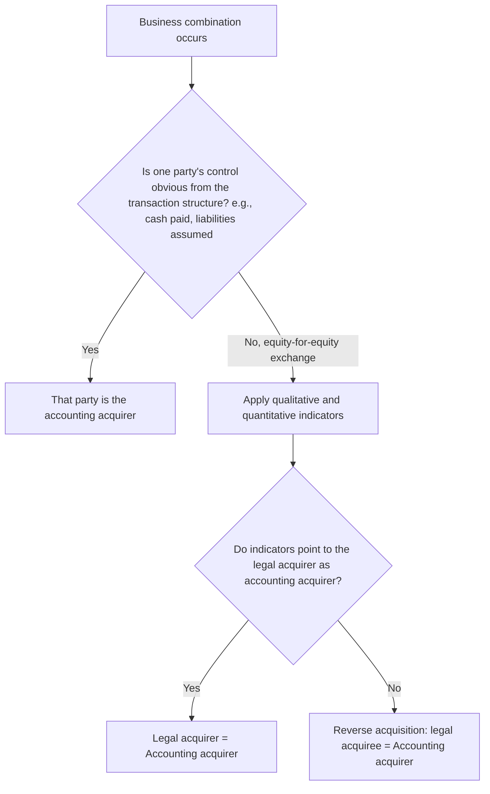

## Identifying the Acquirer and the Acquisition Date

### Overview

The first two steps of the acquisition method under ASC 805 and IFRS 3 require determining **which** combining entity is the accounting acquirer and **when** control passed. Both determinations are foundational: they fix whose historical financial statements continue post-combination, whose assets/liabilities are remeasured to fair value, and the measurement date for consideration transferred, identifiable net assets, and noncontrolling interest.

### Identifying the Acquirer — General Principle

**Key Points**

- The acquirer is the combining entity that obtains **control** of the acquiree.
- Control is assessed using the definitions in ASC 810 (voting interest model and variable interest entity model) under U.S. GAAP, and IFRS 10 under IFRS — both business combination standards defer to the respective consolidation standard's control definition rather than defining control independently.
- In the majority of combinations, identification is straightforward: the entity that transfers cash or other assets, incurs liabilities, or issues equity interests is self-evidently the acquirer.
- Difficulty arises primarily in combinations effected **through an exchange of equity interests alone**, where it is not obvious from the legal structure which party is obtaining control in substance.

### Indicators for Identifying the Acquirer in Equity-Based Combinations

When control is not obvious from the form of the transaction, ASC 805-10-55 and IFRS 3.B14–B18 direct consideration of the following indicators, none individually determinative:

**1. Relative Voting Rights**

The combining entity whose owners, as a group, retain or receive the **largest portion of voting rights** in the combined entity is generally the acquirer.

**2. Large Minority Voting Interest**

If no other owner or organized group of owners has a significant voting interest, the existence of a large minority voting interest held by one combining entity's owners points to that entity being the acquirer.

**3. Composition of the Governing Body**

The combining entity whose owners have the ability to elect, appoint, or remove a **majority of the governing body** (board of directors) of the combined entity is generally the acquirer.

**4. Composition of Senior Management**

The combining entity whose (former) management **dominates the management** of the combined entity is generally the acquirer.

**5. Terms of the Exchange of Equity Interests**

The combining entity that pays a **premium over the pre-combination fair value** of the other combining entity's equity interests is generally the acquirer (the entity paying the premium is presumptively obtaining control).

**6. Relative Size**

The combining entity whose **relative size** (measured in assets, revenues, or earnings) is significantly greater than the other combining entity(ies) is generally the acquirer, since it is unusual for a significantly larger entity to be acquired by a significantly smaller one.

**7. Multi-Entity Combinations (More Than Two Entities)**

When more than two entities are combined, considerations include which entity initiated the combination, and the relative size of the combining entities.

**8. New Entity Formed to Effect the Combination**

If a new entity is formed to issue equity interests to effect a combination, one of the **pre-existing combining entities** must be identified as the accounting acquirer using the indicators above — the newly formed entity itself is not automatically the acquirer merely because it is the new legal parent.

### Reverse Acquisitions

**Key Points**

- A **reverse acquisition** occurs when the entity that issues securities (the **legal acquirer**) is identified, based on application of the indicators above, as the **accounting acquiree**, while the entity whose owners receive the securities (the **legal acquiree**) is identified as the **accounting acquirer**.
- Common commercial context: a private operating company merges into a smaller public shell company to achieve a public listing without a traditional IPO. The public shell is the legal acquirer (issuer of shares) but the private company's former shareholders obtain a controlling voting interest in the combined entity, making the private company the accounting acquirer.

**Accounting Consequences of a Reverse Acquisition**

- Consolidated financial statements are issued under the **legal parent's name and legal capital structure**, but the financial statements themselves are a **continuation of the accounting acquirer's (legal subsidiary's) financial statements**.
- The accounting acquirer's assets and liabilities are carried forward at **pre-combination carrying amounts** (not remeasured to fair value, since it is treated as continuing, not acquired).
- The accounting acquiree's (legal parent's) assets and liabilities **are** remeasured to fair value per the acquisition method, since it is the entity accounting-acquired.
- **Equity structure** is restated: the number of equity shares outstanding is that of the legal acquirer/parent, but comparative equity balances and per-share amounts (e.g., EPS) are recast using the accounting acquirer's historical share-exchange-adjusted equity structure.
- Goodwill or a bargain purchase gain is computed based on the fair value of the consideration effectively transferred by the accounting acquirer (measured, in the absence of a directly determinable fair value of consideration, by reference to the fair value of the legal acquirer's equity interests the accounting acquirer's owners would have had to issue to give the legal acquirer's owners the equivalent ownership percentage).

**Example**

Private Operating Co. arranges a reverse merger into Public Shell Corp. Public Shell issues new shares to Private Operating Co.'s shareholders such that, post-merger, Private Operating Co.'s former shareholders hold 92% of the combined entity's outstanding voting shares, and Private Operating Co.'s management and board dominate the combined entity's governance. Despite Public Shell being the surviving legal entity and technical share issuer, Private Operating Co. is identified as the accounting acquirer under the voting-rights and governance-composition indicators. The consolidated financial statements are issued under "Public Shell Corp." as the legal name, but the financial history, retained earnings, and comparative periods presented are those of Private Operating Co.

### Determining the Acquisition Date

**Key Points**

- The acquisition date is the date on which the acquirer obtains **control** of the acquiree.
- This is generally, but not necessarily, the **closing date** — the date on which the acquirer legally transfers the consideration, acquires the assets, and assumes the liabilities of the acquiree per the terms of the definitive agreement.
- The acquirer should consider **all pertinent facts and circumstances** in determining the acquisition date, since it can precede or follow the closing date.

**Circumstances in Which the Acquisition Date Differs from the Closing Date**

1. **Control obtained before closing** — a written agreement may provide that the acquirer obtains control of the acquiree before the legal closing date (e.g., through a voting or management agreement granting operational and financial control in advance of the formal transfer of consideration).
2. **Control obtained after closing** — in some regulatory-approval-dependent transactions, or where a government or other third party imposes conditions delaying the transfer of control, the effective date control passes could theoretically follow legal close, though this is a less common fact pattern than #1.

**[Inference]** In practice, the overwhelming majority of business combinations use the closing date as the acquisition date because the definitive agreement and the transfer of control are contractually and operationally synchronized; deviations are typically driven by specific regulatory, governmental, or contractual mechanics unique to the transaction (e.g., certain cross-border deals subject to staged regulatory clearance) rather than routine practice.

### Why the Acquisition Date Matters

**Key Points**

The acquisition date is the pivotal measurement date for nearly every element of the acquisition method:

| Element | Why Acquisition Date Governs |
| --- | --- |
| Fair value of consideration transferred | Measured as of acquisition date |
| Fair value of identifiable assets/liabilities | Measured as of acquisition date |
| Fair value of NCI | Measured as of acquisition date |
| Remeasurement of previously held equity interest (step acquisition) | Remeasured to fair value as of acquisition date, with gain/loss to earnings |
| Measurement period | Runs for up to one year **from** the acquisition date |
| Consolidation of acquiree's post-combination results | Acquiree's results included in consolidated financial statements only **from** the acquisition date forward |
| Goodwill impairment testing baseline | Initial goodwill balance established as of acquisition date |

### Determining Control — Interaction with ASC 810 / IFRS 10

**Key Points**

- **Voting interest model (ASC 810):** Control generally presumed with ownership of a majority (>50%) of voting equity interests, absent substantive participating or protective rights held by others that would overcome the presumption.
- **Variable interest entity (VIE) model (ASC 810):** For entities meeting VIE criteria, control is based on which party is the **primary beneficiary** — having both (a) the power to direct the activities that most significantly impact the VIE's economic performance, and (b) the obligation to absorb losses or right to receive benefits that could be significant to the VIE.
- **IFRS 10:** A single control model applies to all investees — an investor controls an investee when it has power over the investee, exposure or rights to variable returns, and the ability to use its power to affect the amount of those returns. There is no separate VIE-equivalent bifurcated model as under legacy U.S. GAAP, though the underlying analytical factors substantially overlap.
- Determining the acquirer and determining control for consolidation purposes are **the same underlying analysis** — if an entity is identified as having obtained control per ASC 810/IFRS 10, it is, by definition, the acquirer for ASC 805/IFRS 3 purposes as well (subject to the reverse-acquisition indicator analysis for legal-form complications).

### Application Example — Standard (Non-Reverse) Acquisition

**Example**

Acquirer Inc. and Target Inc. sign a definitive merger agreement on March 1. The agreement is subject to shareholder and regulatory approval. All approvals are obtained, and the merger legally closes on June 30, with Acquirer Inc. transferring cash consideration and Target Inc.'s shareholders relinquishing their shares on that date. No side agreement grants Acquirer Inc. operational or financial control before June 30. The **acquisition date is June 30** — the closing date — since that is when control transferred, consistent with the general presumption. Target Inc.'s assets and liabilities are remeasured to fair value as of June 30, and Target Inc.'s post-June-30 results of operations are included in Acquirer Inc.'s consolidated financial statements from that date forward.

### Application Example — Control Obtained Before Closing

**Example**

Acquirer Inc. and Target Inc. sign a definitive agreement on March 1, which includes an ancillary **management and voting rights agreement** effective immediately, granting Acquirer Inc. the contractual right to direct Target Inc.'s key operating and financing decisions and to appoint a majority of Target Inc.'s board, pending only ministerial regulatory filings before the legal share transfer formally closes on June 30. [Inference] If the March 1 agreement, in substance, transfers the power to direct the activities that most significantly affect Target Inc.'s economic performance along with exposure to variable returns, the acquisition date could be identified as March 1 — the date control was obtained in substance — notwithstanding that legal closing did not occur until June 30. Such fact patterns require careful analysis of the specific contractual terms and are inherently judgment-dependent, since substance-over-form assessment of "control obtained" ahead of legal closing is not a bright-line test under either standard.

### Common Analytical Pitfalls

**Key Points**

- Assuming the entity that is legally designated as "Parent" or "Acquirer" in the merger agreement is automatically the accounting acquirer — this is not the case where the indicators point the other way (reverse acquisition risk).
- Treating the signing date of the definitive agreement as the acquisition date — the acquisition date is when **control transfers**, not when the parties become contractually committed to the transaction (signing typically precedes acquisition date, particularly where regulatory approvals are pending).
- Failing to reassess the acquirer determination when a transaction is structured as a merger of near-equals (e.g., a "merger of equals" all-stock transaction) — these transactions most frequently require the full indicator analysis since no party's control is self-evident from the consideration structure alone.
- Overlooking that VIE consolidation conclusions under ASC 810 can produce an "acquirer" that differs from whichever party is the majority equity holder, where power and economics are contractually separated from voting equity.

### Related Topics

- Acquisition method overview: recognition and measurement of identifiable net assets (ASC 805 / IFRS 3)
- Control assessment: voting interest model vs. VIE primary beneficiary model (ASC 810)
- IFRS 10 control model: power, variable returns, and the link between the two
- Step acquisitions and remeasurement of previously held equity interests
- Measurement period adjustments and their one-year limit from acquisition date
- Reverse acquisition accounting mechanics: recast equity structure and comparative EPS
- Business combinations achieved without the transfer of consideration (e.g., by contract alone, or through lapse of minority veto rights)
- Distinguishing a business combination from an asset acquisition (ASU 2017-01 screen test)