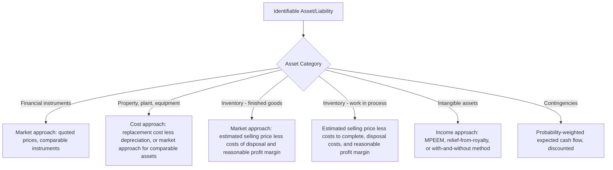

## Recognizing and Measuring Identifiable Assets and Liabilities Assumed

### Overview

Step 3 of the acquisition method under ASC 805 and IFRS 3 requires the acquirer to recognize, separately from goodwill, the identifiable assets acquired and liabilities assumed as of the acquisition date, and to measure them at acquisition-date fair value. This step is the most operationally intensive part of purchase accounting, involving recognition criteria distinct from ordinary financial reporting, a general fair value measurement principle, and a substantial list of specific exceptions.

### The Recognition Principle

**Key Points**

- As of the acquisition date, the acquirer recognizes identifiable assets acquired and liabilities assumed **separately from goodwill**.
- To qualify for recognition, an item must meet the definition of an **asset** or **liability** in the applicable conceptual framework (FASB Concepts Statement / IASB Conceptual Framework) **at the acquisition date**.
- The item must also be part of what the acquirer and acquiree exchanged in the business combination, rather than the result of a **separate transaction** (see Separate Transactions below).
- Recognition under the acquisition method can differ significantly from the acquiree's own pre-combination recognition — items the acquiree never recognized (e.g., internally developed customer relationships, unrecorded intangibles, or certain contingencies) may be recognized for the first time by the acquirer, and items the acquiree recognized (e.g., its own previously recorded goodwill, or certain restructuring/deferred financing cost balances) are typically **not** carried forward.

**Items the Acquiree Carried but the Acquirer Does Not Recognize**

- The acquiree's own previously recognized **goodwill** is eliminated (not carried forward as an asset).
- Direct costs of the acquiree's own past business combinations, deferred financing costs, and similar items with no future economic benefit to the combined entity as of the new acquisition date are generally not recognized.

### The Classification and Designation Principle

**Key Points**

At the acquisition date, the acquirer classifies or designates identifiable assets acquired and liabilities assumed on the basis of the **contractual terms, economic conditions, operating or accounting policies, and other pertinent conditions existing at the acquisition date** — not based on how the acquiree had classified or designated them.

**Illustrative reclassification requirement**: an acquiree may have classified a financial asset as held-to-maturity; the acquirer reassesses classification (e.g., under ASC 320/326 or IFRS 9) based on its own intent and ability as of the acquisition date, which may result in a different classification (e.g., available-for-sale or trading) — this is a **fresh assessment**, not a carryover.

**Two specific exceptions to this reassessment principle:**

1. **Lease classification** (operating vs. finance/sales-type) is retained based on the contractual terms and other factors at **lease inception**, unless the lease has been modified in a way that would require reassessment under ASC 842/IFRS 16 independent of the business combination.
2. **Insurance/reinsurance contract classification** is likewise generally retained based on contract terms at inception.

### The General Measurement Principle

**Key Points**

Identifiable assets acquired and liabilities assumed are measured at **acquisition-date fair value**, determined in accordance with ASC 820 / IFRS 13 — the exit-price notion (the price that would be received to sell an asset or paid to transfer a liability in an orderly transaction between market participants at the measurement date).

$$FV = \text{Exit Price in an Orderly Transaction Between Market Participants at the Measurement Date}$$

This is applied item by item across the identifiable net asset base — there is no blanket "step-up" percentage; each asset and liability class requires its own valuation approach (income, market, or cost approach, as appropriate to the asset).

### Recognition and Measurement Exceptions — Comprehensive Listing

Both ASC 805 and IFRS 3 provide specific, enumerated exceptions to the general recognition and/or measurement principles. These exceptions exist because applying fair value or the general recognition criteria to certain items would be inconsistent with other authoritative guidance those items are otherwise subject to.

#### 1. Income Taxes

**Key Points**

- Deferred tax assets and liabilities arising from assets acquired and liabilities assumed are recognized and measured in accordance with **ASC 740** (U.S. GAAP) or **IAS 12** (IFRS) — **not** at fair value.
- Recognized based on the tax bases of the acquired assets/liabilities and the differences between those tax bases and their acquisition-date fair values (i.e., the fair-value step-up itself typically creates a new temporary difference generating deferred tax).
- Valuation allowances against acquired deferred tax assets are assessed based on the combined entity's ability to realize them.

#### 2. Employee Benefits

**Key Points**

- Assets and liabilities (or, if applicable, an asset/liability related to employee benefit arrangements) are recognized and measured in accordance with **ASC 710/712/715** or **IAS 19**, not at fair value.

#### 3. Indemnification Assets

**Key Points**

- Where the seller contractually indemnifies the acquirer for the outcome of a contingency or uncertainty related to a specific asset or liability (e.g., an environmental liability or litigation exposure), the acquirer recognizes an **indemnification asset at the same time**, and measured on the **same basis**, as the indemnified item.
- If the indemnified item is measured at fair value, the indemnification asset is measured at fair value (net of collectability considerations). If the indemnified liability is a contingency measured under a non-fair-value basis (e.g., ASC 450), the offsetting indemnification asset is measured on that same consistent basis, subject to management's assessment of collectability.

#### 4. Reacquired Rights

**Key Points**

- A reacquired right (e.g., a franchise or license right previously granted by the acquirer to the acquiree, now reacquired in the combination) is recognized as an **intangible asset** measured on the basis of the **remaining contractual term** of the related contract, without regard to whether market participants would consider potential contract renewals in determining fair value.
- Any settlement gain or loss on effective settlement of a pre-existing relationship through the reacquisition is measured separately (see Separate Transactions below).

#### 5. Share-Based Payment Awards

**Key Points**

- Replacement awards issued by the acquirer for acquiree share-based payment awards are measured in accordance with **ASC 718** / **IFRS 2**, using a market-based measure (grant-date fair-value-equivalent methodology), not the general acquisition-method fair value principle.
- The portion of the replacement award's value attributable to **pre-combination service** is included in consideration transferred; the portion attributable to **post-combination service** is recognized as compensation expense over the remaining post-combination service period.

$$\text{Consideration (pre-combination portion)} = \text{Total FV of Replacement Award} \times \frac{\text{Pre-combination service period}}{\text{Total service period (greater of original or new requisite period)}}$$

#### 6. Assets Held for Sale

**Key Points**

- Acquired long-lived assets (or disposal groups) classified as held for sale at the acquisition date are measured at **fair value less costs to sell**, in accordance with **ASC 360-10** / **IFRS 5**, not fair value alone.

#### 7. Contingencies (ASC 805-Specific)

**Key Points**

- **Contractual contingencies** (contingent assets and liabilities arising from contractual rights or obligations) are recognized at acquisition-date **fair value**.
- **Non-contractual contingencies** are recognized at fair value only if it is **more likely than not** that they meet the definition of an asset or liability at the acquisition date (a lower threshold than the "probable" threshold under ASC 450 that would otherwise apply outside a business combination).
- If, at the acquisition date, a contingency's fair value cannot be determined, it is **not initially recognized**; it is subsequently evaluated and recognized when it becomes probable and estimable, using ASC 450 rather than fair value.
- This creates a distinctly **lower recognition threshold at the acquisition date** than the ordinary-course ASC 450 "probable and reasonably estimable" test, reflecting the FASB's acknowledgment that acquisition-date fair value estimation embeds a probability-weighted view inherently.

#### 8. Contingent Liabilities (IFRS 3-Specific — Differs from ASC 805)

**Key Points**

- IFRS 3 does not have a distinct contractual/non-contractual bifurcation like ASC 805. Instead, IFRS 3 requires recognition of a contingent liability assumed in a business combination if it is a **present obligation arising from past events** and its **fair value can be measured reliably** — recognized even if **not probable** that an outflow of resources will be required (a departure from the general IAS 37 recognition threshold, which requires "probable" for provisions outside a business combination).

#### 9. Leases (Post-ASC 842 / IFRS 16)

**Key Points**

- For leases in which the acquiree is the **lessee**, the acquirer generally recognizes a right-of-use asset and lease liability based on the **remaining lease terms** as of the acquisition date, per acquisition-specific guidance layered on top of ASC 842/IFRS 16.
- An adjustment is made for any **off-market terms** (favorable or unfavorable relative to current market terms) — recognized as an adjustment to the right-of-use asset rather than as a separate intangible/liability, per amendments clarifying ASC 805's interaction with ASC 842.
- For leases in which the acquiree is the **lessor**, classification (operating vs. sales-type/finance) is retained based on inception-date terms (see Classification Principle above), and the underlying leased asset is measured considering the terms of the in-place lease.

### Intangible Assets — Recognition Criteria (Detailed)

**Key Points**

An identifiable intangible asset must meet **one** of two criteria to be recognized separately from goodwill:

1. **Separability criterion** — capable of being separated or divided from the acquired entity and sold, transferred, licensed, rented, or exchanged, either individually or together with a related contract, identifiable asset, or liability, regardless of whether the acquirer intends to do so.
2. **Contractual-legal criterion** — arises from contractual or other legal rights, regardless of whether those rights are transferable or separable from the entity or from other rights and obligations.

**Common Categories with Illustrative Valuation Approach**

| Intangible Category | Typical Valuation Method |
| --- | --- |
| Trade names / trademarks | Relief-from-royalty method |
| Customer relationships / customer lists | Multi-period excess earnings method (MPEEM) |
| Developed technology / patents | MPEEM or relief-from-royalty |
| In-process R&D (IPR&D) | MPEEM, cost approach, or option-based models |
| Non-compete agreements | With-and-without method (comparing enterprise value with vs. without the agreement) |
| Favorable/unfavorable contracts (e.g., leases, supply agreements) | Discounted cash flow of off-market terms |
| Order or production backlog | Discounted cash flow of expected margin on backlog orders |

**In-Process Research and Development (IPR&D)**

**Key Points**

- Acquired IPR&D is recognized as an **indefinite-lived intangible asset** as of the acquisition date under U.S. GAAP (ASC 805-20-25), even though it does not yet generate cash flows and may never reach commercial viability.
- It is **not amortized** while indefinite-lived, but tested for impairment (ASC 350) until the associated project is completed (at which point it becomes a finite-lived, amortizable asset) or abandoned (at which point it is written off).
- Under IFRS, acquired IPR&D is recognized as an intangible asset if it meets the separability or contractual-legal criterion (essentially always met in a business combination context per IFRS 3.IE); subsequent measurement follows IAS 38, and useful life (finite vs. indefinite) is assessed based on the specific facts.

### Fair Value Measurement Approaches by Asset Class

### Separate Transactions — Distinguishing from the Business Combination Exchange

**Key Points**

The acquirer must identify any amounts that are **not** part of the exchange for the acquiree and instead represent separate transactions, accounted for under otherwise-applicable GAAP/IFRS rather than as part of the acquisition-method allocation.

**Common Separate Transaction Fact Patterns**

1. **Effective settlement of a pre-existing relationship** between the acquirer and acquiree (e.g., a supply contract, license, or lawsuit) — the settlement gain or loss is measured as the lesser of (a) the amount by which the contract is favorable/unfavorable from the perspective of the party not at a disadvantage, relative to market terms, and (b) any stated settlement provisions in the contract available to the party at a disadvantage; recognized separately from goodwill.
2. **Arrangements for future employee or former-owner services** — e.g., an earnout contingent on the selling shareholder's continued employment is generally accounted for as **post-combination compensation expense**, not contingent consideration, because it compensates for future services rather than being part of the price paid for the acquiree.
3. **Reimbursement by the acquirer of the acquiree's acquisition-related costs** — accounted for as a separate transaction (generally an expense to the acquirer), not as consideration transferred.
4. **Transactions that effectively pay off pre-existing acquirer liabilities** to the acquiree or its owners.

**Indicators used to distinguish a contingent consideration arrangement from a separate compensation arrangement** (per ASC 805-10-55-25 / IFRS 3.B55): continuing employment requirement linked to payment, duration of the continuing employment period, level of compensation relative to other employees, incremental payments to employees who do not sell their shares/continue employment, number of shares owned by the selling shareholder-employee, linkage of the payment to the valuation of the acquiree versus a formula tied to a performance metric, and the formula used to determine contingent payments relative to earnings-based valuation approaches used to value the acquiree overall.

### Example — Applying the Exceptions in Combination

**Example**

Acquirer Co. acquires Target Co. As of the acquisition date:

- Target has an unrecorded **customer relationship intangible**, valued via MPEEM at $8,000,000 — recognized separately from goodwill under the general fair value principle (contractual-legal criterion, since customer contracts exist).
- Target has a **pending lawsuit** with an uncertain outcome; legal counsel assesses the loss as more likely than not to result in an outflow, and a reliable fair value estimate of $1,200,000 is determinable — recognized as a liability under the ASC 805 contingency exception (more-likely-than-not threshold, not the ordinary ASC 450 "probable" threshold).
- Target's **defined benefit pension plan** funded status is remeasured under ASC 715 (not fair value) — recognized at the ASC 715-prescribed net funded status amount.
- Target's acquired **deferred tax liability**, reflecting the difference between the stepped-up fair values of acquired assets and their carryover tax bases, is recognized under ASC 740, generating an additional component of the purchase price allocation that indirectly increases residual goodwill (since a larger DTL reduces identifiable net assets, all else equal).
- A **$500,000 earnout** payable to the selling shareholder is contingent on her remaining employed by the combined entity for two years post-closing — assessed against the indicators above and concluded to be a **separate post-combination compensation arrangement**, recognized as compensation expense over the two-year service period rather than as contingent consideration included in goodwill.

### Common Analytical Pitfalls

**Key Points**

- Applying fair value measurement to income taxes, employee benefits, or share-based payment awards instead of their designated non-fair-value guidance (ASC 740/715/718 or IAS 12/19, IFRS 2).
- Failing to apply the **lower ("more likely than not")** recognition threshold for non-contractual contingencies under ASC 805, and instead defaulting to the ordinary ASC 450 "probable" threshold.
- Misclassifying an employee-retention-contingent earnout as contingent consideration (affecting goodwill) rather than post-combination compensation expense (affecting post-combination earnings) — a frequent source of restatements and SEC comment letters.
- Carrying forward the acquiree's own previously recognized goodwill or its lease classification without independent reassessment (except for the specific lease-classification and insurance-contract exceptions, which **are** retained from inception).
- Overlooking that reacquired rights are measured based on remaining contractual term only, ignoring renewal assumptions a market participant might otherwise consider.

### Related Topics

- Acquisition method overview and the five-step framework
- Business combination consideration transferred and contingent consideration classification
- Goodwill computation, noncontrolling interest measurement, and bargain purchase gains
- Purchase price allocation valuation techniques: MPEEM, relief-from-royalty, with-and-without method
- Deferred tax accounting for business combinations (ASC 740 / IAS 12 intersection with ASC 805/IFRS 3)
- IPR&D subsequent accounting: indefinite-lived intangible impairment testing
- Measurement period adjustments and their interaction with provisional fair values
- Lease accounting for acquired lessee and lessor positions in business combinations