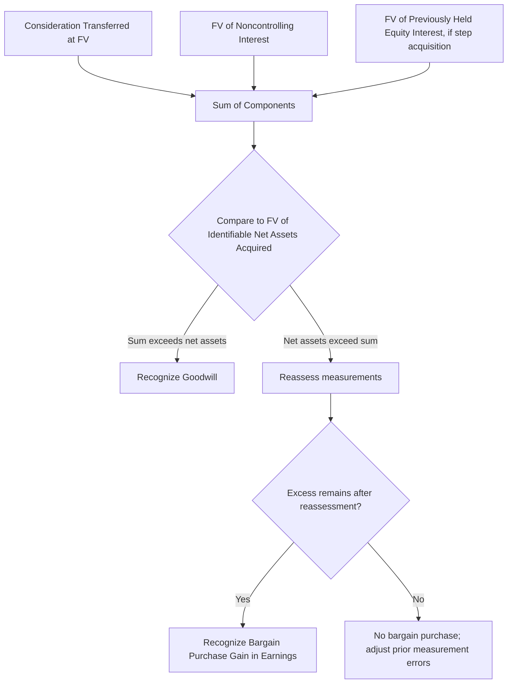
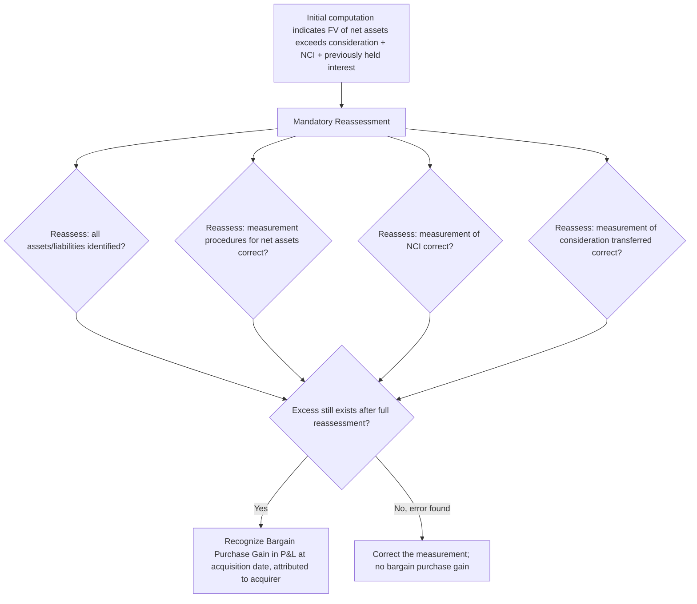

## Goodwill Recognition and Bargain Purchase Gains

### Overview

Step 5 of the acquisition method under ASC 805 and IFRS 3 requires the acquirer to compute the residual difference between what was effectively given up (and any noncontrolling interest and previously held equity interest) and the fair value of the identifiable net assets acquired. A positive residual is recognized as **goodwill**; a negative residual, after mandatory reassessment, is recognized as a **bargain purchase gain** in earnings.

### The Goodwill Formula

$$\text{Goodwill} = \text{Consideration Transferred} + \text{FV of NCI} + \text{FV of Previously Held Equity Interest} - \text{FV of Identifiable Net Assets Acquired}$$

Each component is measured at **acquisition-date fair value**. The formula reflects that goodwill represents future economic benefits arising from assets that are not individually identified and separately recognized — commonly described as paying for synergies, assembled workforce, and expected future growth not attributable to any specific recognized asset.

### Consideration Transferred

**Key Points**

Measured at acquisition-date fair value; the sum of the fair values of:

- Assets transferred by the acquirer
- Liabilities incurred by the acquirer to former owners of the acquiree
- Equity interests issued by the acquirer

**Specific Components and Their Treatment**

| Component | Treatment |
| --- | --- |
| Cash | Face amount (or present value if deferred) |
| Equity securities issued | Fair value at acquisition date (market price if quoted, otherwise valuation) |
| Contingent consideration | Fair value at acquisition date; included in consideration even though payment is uncertain |
| Acquisition-related transaction costs (legal, advisory, due diligence) | **Excluded** from consideration transferred; expensed as incurred (ASC 805-10-25-23 / IFRS 3.53) |
| Debt or equity issuance costs to fund the acquisition | **Excluded**; accounted for under other applicable guidance (e.g., debt issuance costs netted against the debt, equity issuance costs against additional paid-in capital) |
| Replacement share-based payment awards | Portion attributable to pre-combination service included in consideration; post-combination portion is compensation expense |

### Contingent Consideration in the Goodwill Computation

**Key Points**

- Included in consideration transferred at **acquisition-date fair value**, notwithstanding the inherent uncertainty of the ultimate payment.
- **Classification** as a liability or equity instrument follows the general liability/equity distinction framework (ASC 480/815-40 principles under U.S. GAAP; IAS 32 under IFRS).
- **Liability-classified** contingent consideration is remeasured to fair value at each subsequent reporting date until settled, with changes recognized in **earnings** (not as a goodwill adjustment, once the measurement period has closed).
- **Equity-classified** contingent consideration is **not remeasured**; subsequent settlement is recognized within equity.
- During the **measurement period**, changes in the fair value of contingent consideration resulting from additional information about facts and circumstances that existed **as of the acquisition date** are measurement-period adjustments to goodwill; changes resulting from events **after** the acquisition date (e.g., actual performance results driving an earnout calculation) are **not** measurement-period adjustments and are recognized in earnings (for liability-classified awards) in the period they occur.

### Noncontrolling Interest — Full vs. Partial Goodwill

**Key Points**

- **U.S. GAAP:** NCI is always measured at **acquisition-date fair value**, producing the **full goodwill method** — goodwill reflects 100% of the acquiree's implied enterprise-level goodwill, not just the acquirer's proportionate purchased share.
- **IFRS:** An acquisition-by-acquisition **election** is permitted between:
  - **Full goodwill method** (NCI at fair value) — converged with U.S. GAAP, or
  - **Partial goodwill method** (NCI at its proportionate share of the acquiree's identifiable net assets, with no goodwill attributed to NCI).

$$\text{Goodwill}_{\text{Full}} = \text{Consideration} + FV_{NCI} - FV_{\text{Net Assets}}$$

$$\text{Goodwill}_{\text{Partial (IFRS option)}} = \text{Consideration} - \left(\%\text{Acquired} \times FV_{\text{Net Assets}}\right)$$

The partial goodwill method under IFRS always produces goodwill **less than or equal to** the full goodwill method for the same transaction, since it excludes any goodwill notionally attributable to the noncontrolling shareholders.

### Step Acquisitions and Remeasurement of Previously Held Interests

**Key Points**

- Where the acquirer held a noncontrolling equity interest in the acquiree **immediately before** obtaining control (a **business combination achieved in stages**), that previously held interest is **remeasured to acquisition-date fair value**.
- The resulting **gain or loss** (fair value less previous carrying amount, which may have been at cost, equity-method carrying value, or fair value depending on the prior classification) is recognized in **earnings** at the acquisition date.
- The **remeasured fair value** (not the prior carrying amount) of the previously held interest becomes a component of the goodwill formula.

**Example**

Acquirer Co. held a 25% equity-method investment in Target Co., carried at $3,000,000. Acquirer Co. subsequently purchases an additional 55% for $8,800,000 cash, obtaining control (80% total). The 25% previously held interest has an acquisition-date fair value of $3,600,000. Target's identifiable net assets have an acquisition-date fair value of $13,000,000, and NCI (20%) is measured at fair value of $2,700,000.

$$\text{Remeasurement gain} = \$3{,}600{,}000 - \$3{,}000{,}000 = \$600{,}000 \text{ (recognized in earnings)}$$

$$\text{Goodwill} = \$8{,}800{,}000 + \$2{,}700{,}000 + \$3{,}600{,}000 - \$13{,}000{,}000 = \$2{,}100{,}000$$

### Qualitative Nature of Recognized Goodwill

**Key Points**

Disclosure requirements under both standards require a qualitative description of the factors that make up recognized goodwill, commonly including:

- Expected synergies from combining operations (cost synergies, revenue synergies)
- Assembled workforce (specifically **not** separately recognizable as an intangible asset under either ASC 805 or IFRS 3, and therefore subsumed within goodwill)
- Intangible assets that do not qualify for separate recognition (failing both the separability and contractual-legal criteria)
- Expected future economic benefits from unidentified or unrecognized net assets

### Goodwill Attributable to Noncontrolling Interest

**Key Points**

Under the full goodwill method (mandatory under U.S. GAAP; elective under IFRS), goodwill is conceptually **allocated between the controlling and noncontrolling interests**, though it is not typically presented on the face of the balance sheet in split form — it is disclosed and relevant for subsequent goodwill impairment testing at the reporting unit level, where impairment losses can affect the controlling and noncontrolling interest shares differently depending on how the reporting unit's goodwill was attributed at formation.

$$\text{NCI-Attributable Goodwill (implied)} = FV_{NCI} - \left(\%\text{NCI} \times FV_{\text{Net Assets}}\right)$$

### Bargain Purchase — Definition and Mandatory Reassessment

**Key Points**

- A **bargain purchase** occurs when the fair value of identifiable net assets acquired **exceeds** the sum of consideration transferred, the fair value of NCI, and the fair value of any previously held equity interest.
- Before recognizing any resulting gain, the acquirer is **required to reassess** whether it has correctly identified **all** of the assets acquired and **all** of the liabilities assumed, and to review the procedures used to measure the following as of the acquisition date:
  - Identifiable assets acquired and liabilities assumed
  - The noncontrolling interest, if any
  - Consideration transferred (and, for step acquisitions, the previously held equity interest and any interest the acquirer held in the acquiree immediately before the acquisition date)
- The reassessment requirement exists because bargain purchases are inherently **unusual** — sellers generally do not sell businesses below fair value voluntarily absent a distress sale, forced sale (e.g., regulatory-mandated divestiture), or private-transaction/related-party dynamics — so a computed bargain purchase more often signals a measurement error (e.g., an unrecognized liability, an overstated asset fair value, or an understated consideration/NCI fair value) than a genuine economic bargain.

### Recognizing the Bargain Purchase Gain

**Key Points**

- If, after reassessment, an excess remains, the acquirer recognizes the resulting gain in **earnings (profit or loss)** as of the acquisition date.
- The gain is attributed **entirely to the acquirer** (the controlling interest), not allocated to NCI, since it arises from the terms of the exchange the acquirer specifically negotiated.
- Both ASC 805 and IFRS 3 require disclosure of: the amount of the recognized gain, the income statement line item in which it is recognized, and a description of the reasons the transaction resulted in a bargain purchase.

**Example**

Acquirer Co. purchases 100% of Target Co. in a court-supervised distressed sale (motivated seller under financial duress) for $5,000,000 cash. Fair value of Target's identifiable net assets, after thorough remeasurement, is $6,300,000. Upon initial computation:

$$\text{Preliminary result} = \$5{,}000{,}000 - \$6{,}300{,}000 = -\$1{,}300{,}000 \text{ (indicates a bargain purchase)}$$

Acquirer Co. reassesses: it confirms all identifiable assets and liabilities (including a previously overlooked $400,000 asset retirement obligation now properly recognized, which reduces net assets to $5,900,000) and confirms consideration and valuation procedures were correctly applied.

$$\text{Revised excess} = \$5{,}000{,}000 - \$5{,}900{,}000 = -\$900{,}000$$

Because the seller was under demonstrable financial distress (a plausible, documented economic reason for a genuine bargain) and the reassessment did not eliminate the excess, Acquirer Co. recognizes a **$900,000 bargain purchase gain in earnings** at the acquisition date, with disclosure explaining the distressed-sale circumstances.

### Common Causes of an Apparent (Often Erroneous) Bargain Purchase

**Key Points**

- Understated fair value of consideration transferred (e.g., misvaluing non-cash consideration such as contingent consideration or issued equity)
- Omission of assumed liabilities, particularly **off-balance-sheet or contingent liabilities** not fully identified in diligence
- Overstated fair values assigned to acquired assets (optimistic valuation assumptions in intangible asset models)
- Failure to properly value **NCI** at fair value (understating NCI fair value inflates the apparent bargain)
- **[Inference]** In forensic and audit-quality review contexts, a computed bargain purchase gain is frequently treated as a heightened-risk indicator warranting specific audit attention (e.g., under PCAOB inspection focus areas), given the base-rate rarity of genuine bargain purchases relative to measurement-error-driven ones; this reflects general professional practice observation rather than a specific quantifiable probability.

### Subsequent Accounting for Goodwill

**Key Points**

- Goodwill is **not amortized**; it is tested for **impairment** at least annually and upon triggering events, under **ASC 350** (reporting-unit level) or **IAS 36** (cash-generating-unit level).
- **U.S. GAAP (ASU 2017-04):** single-step quantitative test — impairment loss equals the excess of the reporting unit's carrying amount over its fair value, capped at the goodwill balance; an optional qualitative "Step 0" screen may bypass the quantitative test if it is not more likely than not that fair value is below carrying amount.
- **Private company alternative (ASU 2014-02 / ASU 2021-03):** permits straight-line amortization of goodwill over 10 years (or a shorter period if justified) with impairment testing only upon a triggering event, at the entity level or reporting-unit level per accounting policy election.
- **IFRS (IAS 36):** goodwill allocated to cash-generating units (CGUs) or groups of CGUs; impairment measured by comparing carrying amount to **recoverable amount** (higher of fair value less costs of disposal and value in use); **reversal of a goodwill impairment loss is prohibited** under IFRS, whereas U.S. GAAP also does not permit reversal of a recognized goodwill impairment loss.

### Goodwill vs. Bargain Purchase — Comparative Summary

| Aspect | Goodwill | Bargain Purchase Gain |
| --- | --- | --- |
| Trigger | Consideration + NCI + prior interest > FV net assets | FV net assets > Consideration + NCI + prior interest, after reassessment |
| Financial statement effect | Asset recognized on balance sheet | Gain recognized in earnings at acquisition date |
| Subsequent accounting | Impairment-only model (or amortized under private company alternative) | No subsequent accounting — one-time acquisition-date gain |
| Attribution | Allocated conceptually between controlling and NCI interests (full goodwill method) | Attributed entirely to the acquirer/controlling interest |
| Frequency in practice | Common — the typical outcome of most business combinations | Uncommon — requires mandatory reassessment before recognition |
| Disclosure focus | Qualitative factors comprising goodwill (synergies, workforce) | Reasons the transaction resulted in a gain |

### Common Analytical Pitfalls

**Key Points**

- Including acquisition-related transaction costs (legal, advisory fees) within consideration transferred, thereby overstating goodwill — these must be expensed as incurred.
- Failing to remeasure a previously held equity interest to fair value in a step acquisition, or incorrectly including its prior carrying amount instead of its acquisition-date fair value in the goodwill formula.
- Recognizing a bargain purchase gain without performing (or adequately documenting) the mandatory reassessment procedures.
- Confusing the IFRS partial goodwill election with a requirement — it is an **acquisition-by-acquisition choice**, not a default, and once elected for a given acquisition, cannot be selectively changed to full goodwill for the same transaction after the fact absent a measurement-period adjustment.
- Attributing a bargain purchase gain proportionally to NCI rather than recognizing it entirely within the controlling interest's earnings.

### Related Topics

- Consideration transferred: measurement and classification of contingent consideration
- Noncontrolling interest: full goodwill vs. partial goodwill methods under IFRS
- Step acquisitions and remeasurement of previously held equity interests
- Goodwill impairment testing: reporting unit / CGU identification and quantitative test mechanics
- Recognizing and measuring identifiable assets acquired and liabilities assumed (Step 3)
- Measurement period adjustments and their one-year limitation
- Push-down accounting and its interaction with acquisition-date goodwill
- Forensic red flags: goodwill impairment timing manipulation and purchase price allocation bias