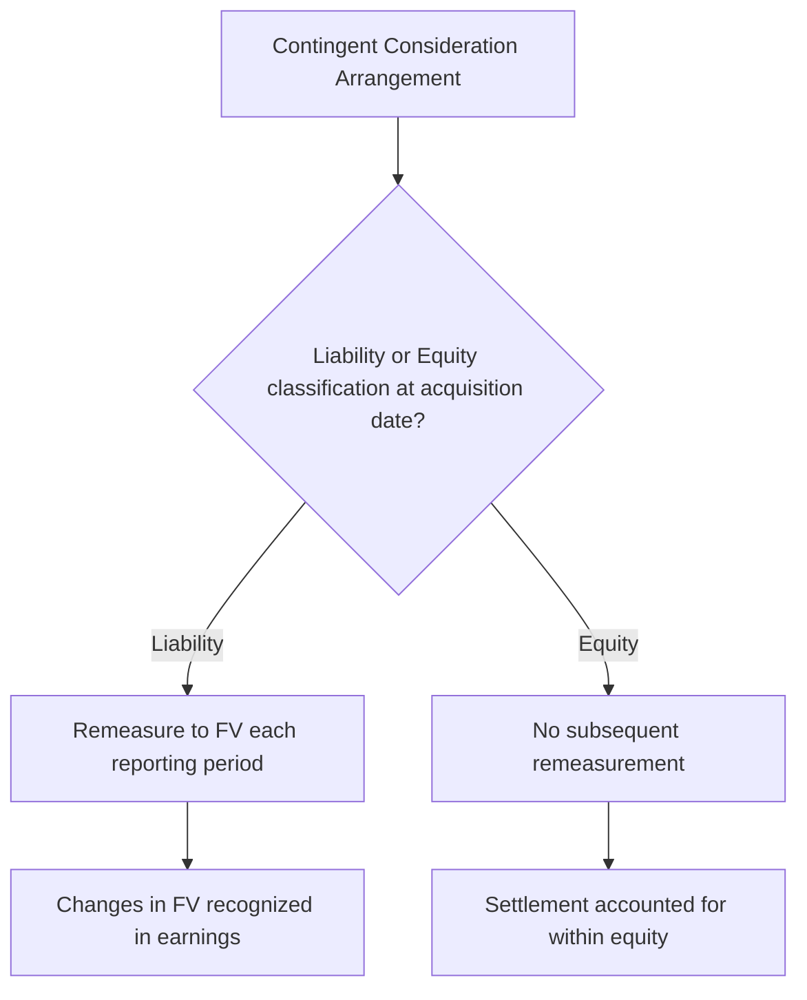
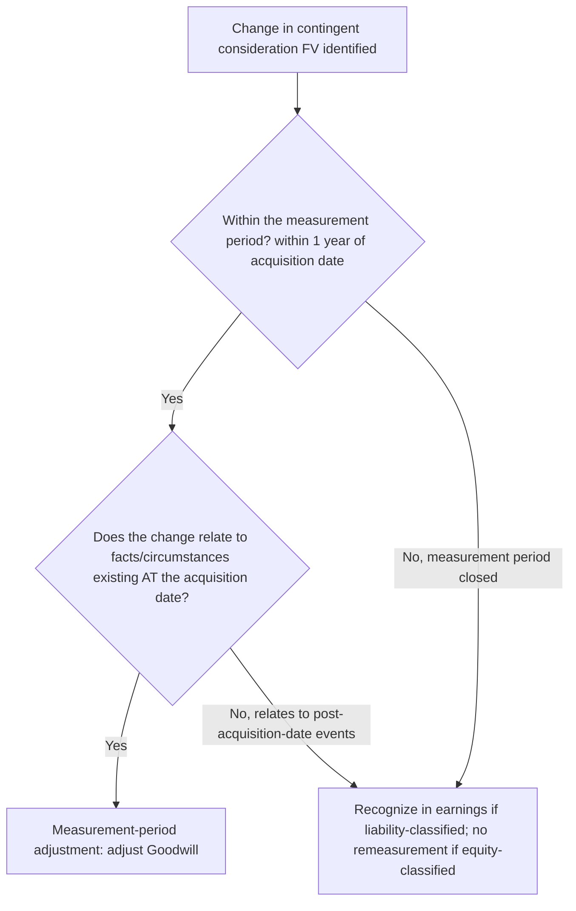

## Contingent Consideration and Acquisition-Related Costs

### Overview

Contingent consideration (commonly structured as an "earnout") and acquisition-related transaction costs are two distinct elements of the acquisition method under ASC 805 and IFRS 3 that are frequently conflated in practice but receive fundamentally different accounting treatment. Contingent consideration is included as a component of the consideration transferred and thus factors into the goodwill computation; acquisition-related costs are excluded from consideration and expensed as incurred.

### Contingent Consideration — Definition

**Key Points**

- Contingent consideration is an obligation of the acquirer to transfer additional assets or equity interests to the former owners of the acquiree **if specified future events occur or conditions are met**, or, less commonly, a right of the acquirer to the return of previously transferred consideration if specified conditions are met.
- Common contingent consideration triggers: achievement of revenue targets, EBITDA/earnings milestones, regulatory approval of a pipeline product, successful integration milestones, or the acquiree's stock price reaching a specified threshold (where consideration includes acquirer equity).
- Economically, contingent consideration bridges valuation gaps between buyer and seller expectations, allowing the purchase price to adjust based on the acquiree's actual post-closing performance.

### Recognition and Initial Measurement

**Key Points**

- Contingent consideration is recognized as part of **consideration transferred**, measured at its **acquisition-date fair value**, regardless of the low probability that may be assigned to any individual payment scenario.
- Fair value is typically estimated using a **probability-weighted expected cash flow approach** (e.g., a Monte Carlo simulation or scenario-based discounted cash flow), discounted to present value using a rate that reflects the risk associated with the obligation (often incorporating a credit-risk-adjusted discount rate for liability-classified awards).

$$FV_{\text{Contingent Consideration}} = \sum_{i=1}^{n} P_i \times CF_i \times \frac{1}{(1+r)^t}$$

where $P_i$ is the probability of scenario $i$, $CF_i$ is the payment under that scenario, $r$ is the discount rate reflecting the risk of the obligation, and $t$ is the expected timing of settlement.

### Classification — Liability vs. Equity

**Key Points**

The classification of contingent consideration as a liability or as equity is determined at the acquisition date using the general liability/equity distinction frameworks:

| Framework | Basis |
| --- | --- |
| U.S. GAAP | ASC 480 (Distinguishing Liabilities from Equity) and ASC 815-40 (Derivatives — Contracts in an Entity's Own Equity) principles |
| IFRS | IAS 32 (Financial Instruments: Presentation) |

**General indicators:**

- An obligation to pay a **fixed amount of cash** or other assets regardless of changes in the acquirer's share price → **liability**.
- An obligation to deliver a **variable number of the acquirer's own shares** with a fixed monetary value → generally **liability**.
- An obligation to deliver a **fixed number of the acquirer's own shares** → generally **equity**, provided other equity-classification conditions in ASC 815-40/IAS 32 are met (e.g., no cash-settlement alternative at the holder's option, indexed solely to the acquirer's own stock).

### Subsequent Measurement — The Critical Distinction

**Key Points**

This is the most consequential accounting distinction for contingent consideration:

| Classification | Subsequent Measurement |
| --- | --- |
| **Liability-classified** | Remeasured to fair value at **each subsequent reporting date** until settled; changes in fair value recognized in **earnings** (not other comprehensive income, and not as a goodwill adjustment once the measurement period has closed) |
| **Equity-classified** | **Not remeasured**. Subsequent settlement is accounted for **within equity** (e.g., recorded as an equity transaction upon issuance of the contingently issuable shares) |

**[Inference]** Because liability-classified contingent consideration flows through earnings each period until settlement, it introduces ongoing earnings volatility unrelated to the combined entity's core operating performance — a frequently cited reason acquirers structure earnouts, where feasible, using fixed-share equity settlement to avoid this remeasurement volatility, though the appropriate classification is ultimately governed by the specific contractual terms rather than accounting-outcome preference.

### Measurement Period vs. Post-Measurement-Period Changes

**Key Points**

A key distinction governs **where** subsequent changes in contingent consideration fair value are recognized:

- **During the measurement period** (up to one year from the acquisition date): changes resulting from **additional information about facts and circumstances that existed as of the acquisition date** are recognized as **measurement-period adjustments**, with a corresponding adjustment to **goodwill**.
- **At any time** (including within the measurement period): changes resulting from **events occurring after the acquisition date** (e.g., actual achievement of a revenue milestone, changes in the acquirer's own stock price for equity-indexed liability awards) are **not** measurement-period adjustments. For liability-classified consideration, these are recognized in **earnings** in the period the change occurs; equity-classified consideration is not remeasured regardless of timing.

### Example — Liability-Classified Earnout

**Example**

Acquirer Co. acquires Target Co. for $10,000,000 cash plus a contingent earnout of up to $3,000,000 if Target achieves $20,000,000 in revenue during the 12 months following closing. At the acquisition date, the probability-weighted fair value of the earnout is estimated at $1,800,000, classified as a liability (fixed-dollar payout regardless of Acquirer Co.'s share price).

$$\text{Consideration Transferred} = \$10{,}000{,}000 + \$1{,}800{,}000 = \$11{,}800{,}000$$

Six months later (within the measurement period), the acquirer obtains updated information indicating that a major customer contract in place **as of the acquisition date** was more favorable than initially understood, increasing the probability-weighted fair value estimate to $2,100,000 based on facts existing at acquisition. This $300,000 increase is a **measurement-period adjustment**, increasing both the contingent consideration liability and **goodwill** by $300,000.

At year-end (18 months post-acquisition, measurement period closed), Target's actual revenue performance updates the fair value estimate to $2,700,000, driven by stronger-than-expected sales growth **after** the acquisition date. This $600,000 increase is recognized as an **expense in earnings**, not a goodwill adjustment, since the measurement period has closed and the change relates to post-acquisition-date events.

### Acquisition-Related Costs — Definition and Scope

**Key Points**

Acquisition-related costs are costs the acquirer incurs to effect a business combination. Both ASC 805 and IFRS 3 require these costs to be **excluded from consideration transferred** and **expensed as incurred** in the periods in which the costs are incurred and the services are received, with one specific exception for certain financing-related costs.

**Categories of Acquisition-Related Costs**

| Cost Type | Treatment |
| --- | --- |
| Finder's/advisory fees (investment banking) | Expensed as incurred |
| Legal, accounting, valuation, and other professional/consulting fees | Expensed as incurred |
| General administrative costs, including costs of maintaining an internal acquisitions department | Expensed as incurred |
| Costs of registering and issuing debt or equity securities | **Excluded** from the expense-as-incurred rule; accounted for under other applicable GAAP/IFRS (e.g., debt issuance costs presented as a direct deduction from the related debt liability under ASC 835-30; equity issuance costs recorded as a reduction of additional paid-in capital) |

**Rationale**: The FASB and IASB concluded that acquisition-related costs are **not part of the fair value exchange** for the acquiree — they are costs of a separate service (advisory, legal, valuation services) the acquirer purchases to help execute the transaction, not part of what was given to the acquiree's former owners in exchange for control.

### Interaction Between Contingent Consideration and Acquisition Costs — Common Confusion Points

**Key Points**

- **Due diligence costs incurred to evaluate the fairness of a proposed earnout** are still ordinary acquisition-related costs — expensed as incurred, not capitalized into the contingent consideration liability's initial measurement.
- **Costs to subsequently monitor or verify earnout achievement** (e.g., post-closing audit rights to verify revenue milestone attainment) are generally treated as ordinary operating/administrative expenses of the combined entity in the periods incurred, not as adjustments to the contingent consideration liability itself.
- **Success fees paid to advisors contingent on deal closing** remain acquisition-related costs (expensed as incurred) — they are a cost of the acquirer's own advisory arrangement, wholly distinct from contingent consideration payable to the acquiree's former owners.

### Contingent Consideration vs. Post-Combination Compensation — The Separate Transactions Boundary

**Key Points**

Not every earnout is contingent consideration. Where an earnout payment is contingent on the **selling shareholder's continued employment**, it may instead represent **post-combination compensation expense**, a separate transaction outside the business combination exchange (see the "Separate Transactions" principle under ASC 805-10-55-25 / IFRS 3.B55).

**Indicators Distinguishing Contingent Consideration from Compensation for Future Services**

1. Linkage to continuing employment — if the arrangement automatically forfeits upon termination of employment, that is a strong indicator of compensation.
2. Duration of the required continuing employment period relative to the earnout period.
3. Level of compensation relative to that of other, similarly situated employees of the combined entity.
4. Incremental payments to employee-shareholders who continue employment, compared to non-employee-shareholders who received no such incremental amounts for the same relinquished equity.
5. Number of shares owned by the selling shareholder-employee relative to their compensation level.
6. Linkage of the contingent payment formula to a **valuation** of the acquiree (indicative of consideration for the business) versus linkage to an **earnings/performance formula** consistent with a bonus arrangement (indicative of compensation).
7. Formula for determining contingent payments — consistency with earnings-based approaches used elsewhere to value the acquiree as a whole.

**Example**

Acquirer Co. structures an earnout of $2,000,000, payable in two years, to the founder-CEO of the acquired company, **contingent on her remaining employed** through the payment date and forfeitable in full upon voluntary resignation. Her post-acquisition base salary and role are otherwise consistent with market compensation for the position, but the earnout represents a substantial multiple of typical incentive compensation for her level. Applying the indicators above — automatic forfeiture upon termination, and magnitude disproportionate to ordinary incentive pay for the role — the arrangement is concluded to be **post-combination compensation expense**, recognized over the two-year service period as she renders service, **not** included in consideration transferred or the goodwill computation.

### Comparative Summary — Contingent Consideration vs. Acquisition Costs

| Aspect | Contingent Consideration | Acquisition-Related Costs |
| --- | --- | --- |
| Part of consideration transferred? | Yes, at acquisition-date fair value | No — explicitly excluded |
| Effect on goodwill | Included in goodwill computation | No effect (expensed, not capitalized) |
| Subsequent accounting | Remeasured through earnings (if liability) or not remeasured (if equity) | N/A — expensed immediately |
| Payee | Former owners of the acquiree | Third-party advisors/service providers to the acquirer |
| Financial statement line item | Consideration transferred; subsequent FV changes in earnings (liability-classified) | Operating expense (e.g., "acquisition-related costs" or "transaction costs") in the period incurred |

### Disclosure Requirements

**Key Points**

Both standards require disclosure of:

- The amount of acquisition-related costs recognized as expense, and the line item(s) in the income statement in which those costs are recognized.
- For contingent consideration: a description of the arrangement and the basis for determining the amount of payment; an estimate of the range of undiscounted outcomes (or a statement that a range cannot be estimated, with an explanation); and, for fair value measurements of contingent consideration classified as Level 3 within the fair value hierarchy, the valuation techniques and key assumptions used, and a reconciliation of the beginning and ending balances (ASC 820/IFRS 13 Level 3 rollforward disclosures apply).

### Common Analytical Pitfalls

**Key Points**

- Including acquisition-related transaction costs (banker fees, legal fees, due diligence costs) within consideration transferred, overstating goodwill — a recurring restatement issue for first-time or infrequent acquirers.
- Failing to distinguish measurement-period adjustments (goodwill impact) from post-acquisition-date fair value changes (earnings impact) for contingent consideration, particularly around the one-year measurement period boundary.
- Misclassifying an employment-contingent earnout as contingent consideration rather than applying the indicators to assess whether it is, in substance, post-combination compensation expense.
- Treating equity-classified contingent consideration as subject to remeasurement — it is not; only liability-classified contingent consideration is remeasured through earnings.
- Netting debt or equity issuance costs against consideration transferred instead of applying the specific guidance that routes them to the related financing instrument (debt discount or reduction of additional paid-in capital).

### Related Topics

- Goodwill recognition and the overall consideration-transferred formula
- Liability vs. equity classification of financial instruments (ASC 480, ASC 815-40, IAS 32)
- Fair value hierarchy and Level 3 measurement disclosures (ASC 820 / IFRS 13)
- Separate transactions: settlements of pre-existing relationships and post-combination compensation
- Measurement period adjustments and their one-year limitation
- Replacement share-based payment awards: pre-combination vs. post-combination service allocation
- Step acquisitions and remeasurement of previously held equity interests