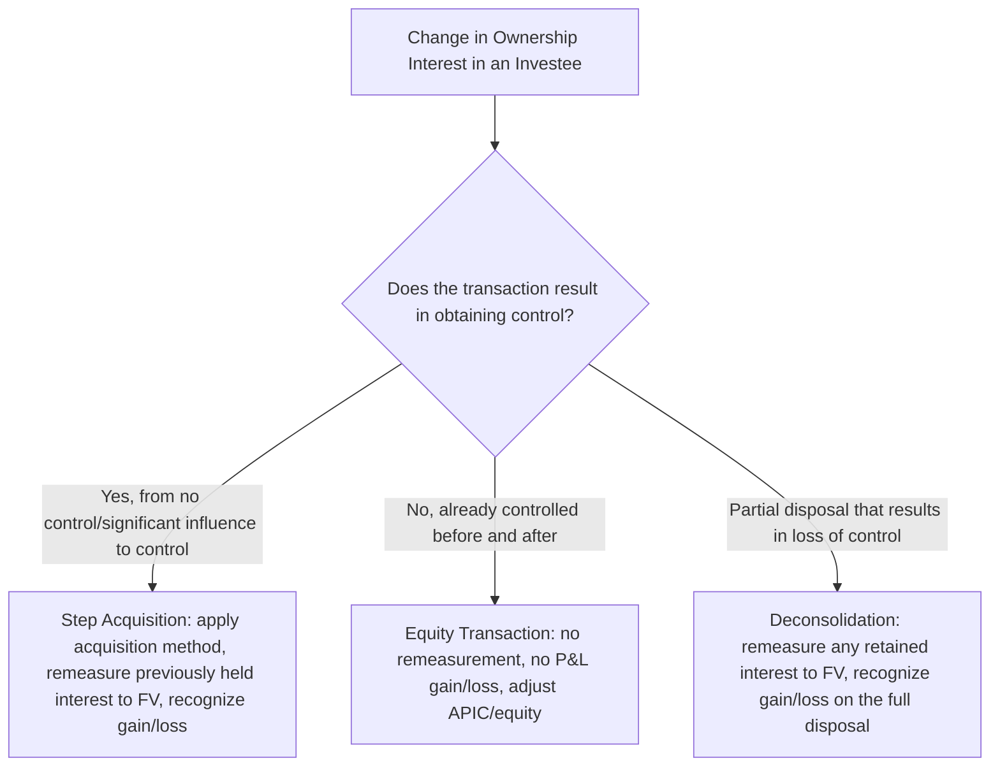
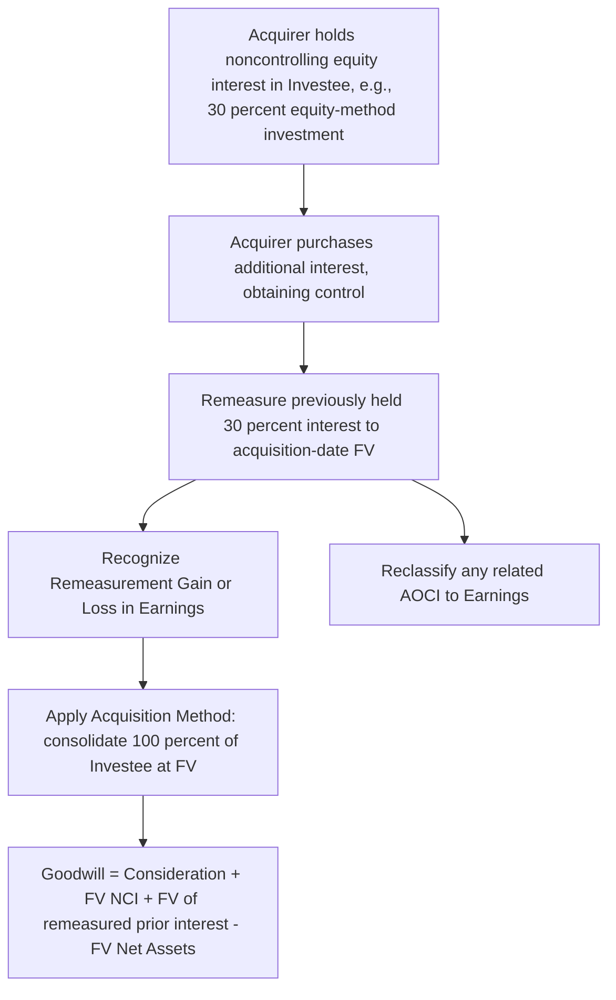
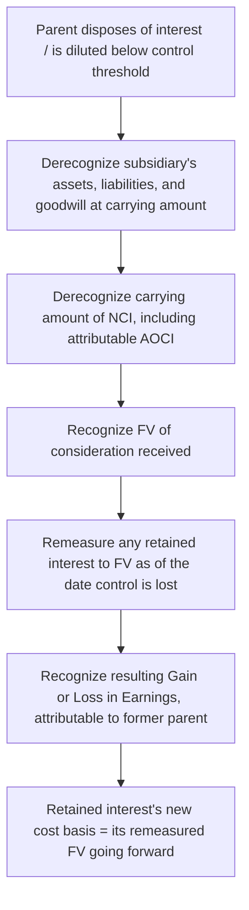

## Step Acquisitions and Changes in Ownership Interest

### Overview

Step acquisitions (business combinations achieved in stages) and subsequent changes in a parent's ownership interest in an already-controlled subsidiary are governed by distinct accounting models under ASC 805/810 and IFRS 3/10. The critical dividing line is whether the transaction results in a **change of control**: obtaining control triggers full acquisition-method remeasurement, while ownership changes that do **not** affect control are treated as **equity transactions** among owners, with no remeasurement to fair value and no gain or loss recognition.

### The Central Distinction

### Step Acquisitions — Definition

**Key Points**

- A **step acquisition** (business combination achieved in stages) occurs when an acquirer obtains control of an acquiree in which it held a **noncontrolling equity interest immediately before the acquisition date**.
- The prior interest could have been accounted for as: an equity-method investment (ASC 323 / IAS 28), a cost-method or fair-value-through-OCI/net-income investment (ASC 321/IFRS 9), or an investment in an unconsolidated VIE.
- The combination is accounted for using the acquisition method as of the date control is obtained — the same five-step framework applied to any other business combination — with one specific additional mechanic: **remeasurement of the previously held interest**.

### Remeasurement of the Previously Held Equity Interest

**Key Points**

- At the acquisition date, the acquirer **remeasures its previously held equity interest in the acquiree to acquisition-date fair value**.
- The difference between this fair value and the interest's **previous carrying amount** is recognized as a **gain or loss in earnings** at the acquisition date.
- If the previously held interest was accounted for under the **equity method**, any amounts previously recognized in **other comprehensive income** related to that investment (e.g., the investor's share of the investee's OCI) are **reclassified to earnings on the same basis as would be required if the investee had directly disposed of the related assets or liabilities** — i.e., a recycling of accumulated OCI into the remeasurement gain/loss.
- The **remeasured fair value** (not the prior carrying amount) becomes a component of the goodwill computation.

$$\text{Remeasurement Gain/Loss} = FV_{\text{previously held interest, acquisition date}} - \text{Carrying Amount immediately before acquisition date}$$

$$\text{Goodwill} = \text{Consideration Transferred} + FV_{NCI} + FV_{\text{Previously Held Interest}} - FV_{\text{Identifiable Net Assets}}$$

### Example — Step Acquisition from Equity Method to Control

**Example**

Acquirer Co. has held a 30% equity-method investment in Investee Co. for several years, with a current carrying amount of $4,500,000 (including $200,000 of cumulative unrealized gains on the investee's available-for-sale securities previously recognized in Acquirer Co.'s AOCI through equity-method OCI pickup). Acquirer Co. purchases an additional 55% interest for $11,000,000 cash, obtaining control (85% total). At the acquisition date, the 30% previously held interest has a fair value of $5,200,000. NCI (15%) is measured at fair value of $2,600,000. Fair value of Investee Co.'s identifiable net assets is $16,500,000.

**Step 1 — Remeasurement gain:**

$$\$5{,}200{,}000 - \$4{,}500{,}000 = \$700{,}000 \text{ gain recognized in earnings}$$

**Step 2 — AOCI reclassification:**

The $200,000 previously recognized in AOCI is reclassified into earnings as part of (or alongside) the remeasurement, consistent with the basis on which the investee would have recognized the amount had it disposed of the underlying securities directly.

**Step 3 — Goodwill:**

$$\text{Goodwill} = \$11{,}000{,}000 + \$2{,}600{,}000 + \$5{,}200{,}000 - \$16{,}500{,}000 = \$2{,}300{,}000$$

Investee Co.'s full identifiable net assets are consolidated at fair value from the acquisition date forward; Acquirer Co.'s consolidated financial statements include 100% of Investee Co.'s assets, liabilities, and post-acquisition results, with a 15% NCI presented in equity.

### Changes in Ownership Interest That Do Not Affect Control (Equity Transactions)

**Key Points**

- Once a parent **already controls** a subsidiary, subsequent **increases** in ownership interest (purchasing additional shares from NCI) or **decreases** in ownership interest (selling a partial interest to NCI or a third party) that **do not result in a loss of control** are accounted for as **equity transactions** — transactions between the parent and the NCI holders in their capacity as owners.
- **No remeasurement** of the subsidiary's assets and liabilities to fair value occurs.
- **No gain or loss is recognized in earnings** on the difference between the consideration paid/received and the carrying amount of the interest acquired/disposed of.
- The difference between the consideration paid (or received) and the amount by which NCI is adjusted is recognized **directly in equity attributable to the parent** (typically within additional paid-in capital), not in profit or loss.

$$\text{Adjustment to Parent's Equity (e.g., APIC)} = \text{Consideration Paid} - \Delta(\text{Carrying Amount of NCI})$$

**Example**

Parent Co. owns 80% of Subsidiary Co. (already consolidated). Parent Co. purchases an additional 10% from NCI holders for $1,500,000 cash, increasing its interest to 90%. Subsidiary Co.'s identifiable net assets have a **carrying amount** (not fair value — no remeasurement occurs) of $12,000,000.

$$\text{Carrying amount of 10 percent NCI interest acquired} = 10\% \times \$12{,}000{,}000 = \$1{,}200{,}000$$

$$\text{Excess of consideration paid over NCI carrying amount} = \$1{,}500{,}000 - \$1{,}200{,}000 = \$300{,}000$$

This $300,000 excess is charged **directly to Parent Co.'s additional paid-in capital** (a reduction of parent equity) — it is **not** goodwill, and it is **not** a loss in earnings, since the transaction is between owners of an already-controlled entity and control status is unchanged.

### Partial Disposals That Do Not Result in Loss of Control

**Key Points**

- If Parent Co. instead **sells** a portion of its interest in an already-controlled subsidiary, while **retaining control**, the transaction is likewise an equity transaction.
- The difference between the sale proceeds and the corresponding decrease in the carrying amount of the parent's interest (with a corresponding increase to NCI) is recognized **directly in equity**, not as a gain or loss in the income statement.

### Loss of Control — Deconsolidation

**Key Points**

When a parent **loses control** of a subsidiary (whether through a full sale, partial sale reducing ownership below the control threshold, dilution from the subsidiary issuing new shares to third parties, expiration of a control agreement, or other means), a fundamentally different accounting model applies — this is **not** treated as a mere equity transaction:

1. The parent **derecognizes** the subsidiary's assets and liabilities (including any goodwill) at their carrying amounts as of the date control is lost.
2. The parent derecognizes the carrying amount of any NCI in the former subsidiary (including any components of accumulated OCI attributable to NCI).
3. Any consideration received is recognized at fair value.
4. Any **retained noncontrolling investment** in the former subsidiary is remeasured to its **acquisition-date-equivalent fair value** as of the date control is lost — establishing a new cost basis for subsequent accounting (e.g., as an equity-method investment or a fair-value financial asset going forward).
5. The resulting difference is recognized as a **gain or loss in earnings**, attributable to the former parent.

$$\text{Gain/Loss on Deconsolidation} = \left(\text{FV of Consideration Received} + FV_{\text{Retained Interest}}\right) - \left(\text{Carrying Amount of Former Subsidiary's Net Assets} + \text{Carrying Amount of NCI Derecognized}\right)$$

### Example — Loss of Control with a Retained Interest

**Example**

Parent Co. owns 70% of Subsidiary Co. (consolidated). Parent Co. sells a 50-percentage-point interest to a third party for $9,000,000 cash, reducing its ownership to 20% and **losing control** (assume no other basis for control, such as contractual arrangements, is retained). At the date control is lost, Subsidiary Co.'s net assets have a carrying amount of $10,000,000, and the carrying amount of the 30% pre-existing NCI is $3,000,000. The retained 20% interest has a fair value of $2,800,000 at the date control is lost.

$$\text{Gain/Loss} = (\$9{,}000{,}000 + \$2{,}800{,}000) - (\$10{,}000{,}000 + \$3{,}000{,}000) = \$11{,}800{,}000 - \$13{,}000{,}000 = -\$1{,}200{,}000$$

Parent Co. recognizes a **$1,200,000 loss** in earnings at the date control is lost. The retained 20% interest is subsequently carried at its remeasured fair value of $2,800,000 as its new cost basis (e.g., as an equity-method investment if significant influence is retained, or otherwise per ASC 321/IFRS 9).

### Comparative Summary — Three Scenarios

| Scenario | Remeasurement to FV? | Gain/Loss in Earnings? | Where Recognized |
| --- | --- | --- | --- |
| **Obtaining control** (step acquisition) | Yes — previously held interest remeasured to FV | Yes | Earnings, at acquisition date |
| **Ownership change, control retained throughout** (buying/selling NCI shares) | No — no remeasurement of subsidiary net assets | No | Directly in parent's equity (e.g., APIC) |
| **Losing control** (full or partial disposal, or dilution) | Yes — any retained interest remeasured to FV | Yes | Earnings, at date control is lost |

### ASC 810 vs. IFRS 10 — Convergence and Nuances

**Key Points**

- The overall framework — step acquisitions trigger remeasurement and gain/loss recognition; ownership changes with control retained are equity transactions; loss of control triggers deconsolidation with remeasurement of retained interests — is **substantially converged** between ASC 810 (as it interacts with ASC 805) and IFRS 10 (as it interacts with IFRS 3).
- **[Inference]** Practical differences that can arise relate more to the underlying **control assessment mechanics** (ASC 810's distinct VIE model vs. IFRS 10's single unified control model) than to the ownership-change accounting itself, since a fact pattern that is a VIE under U.S. GAAP but assessed purely under a voting/power-and-returns lens under IFRS could, in edge cases, reach different conclusions about **when** control is obtained, lost, or retained — which in turn determines which of the three scenarios above applies.

### Dilution Gains and Losses (Subsidiary Issues New Shares)

**Key Points**

- If a controlled subsidiary issues new shares to third parties (not to the parent), reducing the parent's percentage ownership without a direct sale by the parent, this is analyzed under the same control framework:
  - If the parent **retains control** after the share issuance, the transaction is treated as an **equity transaction** (analogous to a partial disposal with control retained) — no gain or loss in earnings, with the dilution effect adjusted through equity.
  - If the share issuance causes the parent to **lose control**, the deconsolidation model applies in full, including remeasurement of any retained interest and recognition of a gain or loss in earnings.

### Common Analytical Pitfalls

**Key Points**

- Applying acquisition-method remeasurement (fair value step-up of net assets) to a purchase of additional NCI shares in an **already-controlled** subsidiary — this is incorrect; no remeasurement occurs for equity transactions among owners with control unchanged.
- Recognizing a gain or loss in earnings on the purchase or sale of NCI shares when control is retained throughout — the correct treatment routes the difference through equity (e.g., APIC), not the income statement.
- Failing to remeasure a **retained** noncontrolling interest to fair value upon loss of control, and instead simply continuing to carry it at its pre-disposal proportionate carrying amount.
- Omitting the required reclassification (recycling) of AOCI amounts associated with a previously held equity-method interest when a step acquisition occurs.
- Misidentifying whether a transaction results in a loss of control versus a mere dilution with control retained — the control assessment (not simply the ownership percentage) governs which of the two fundamentally different accounting models applies.

### Related Topics

- Goodwill recognition and the role of the previously held interest in the goodwill formula
- Control assessment under ASC 810 (voting interest and VIE models) and IFRS 10
- Equity method of accounting for investments (ASC 323 / IAS 28) and OCI recycling mechanics
- Noncontrolling interest presentation and subsequent equity transactions (ASC 810-10-45)
- Deconsolidation accounting and retained-interest remeasurement
- Business combination acquisition method overview and the five-step framework
- Identifying the acquirer and the acquisition date