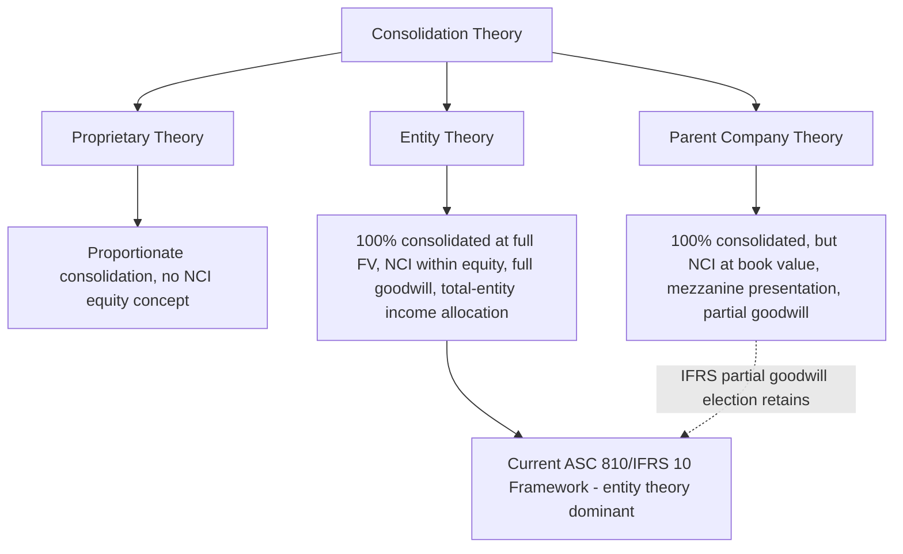

## Consolidation Theories and the Entity Concept

### Overview

Consolidation theory addresses a conceptual question underlying all consolidated financial reporting: when a parent controls a less-than-100%-owned subsidiary, whose perspective should the consolidated financial statements represent, and how should the noncontrolling interest be portrayed? Three historically distinct theories — the **proprietary theory**, the **parent company theory**, and the **entity theory** — offer different answers, and understanding them explains the specific mechanics (NCI measurement, elimination entries, and income attribution) mandated by current U.S. GAAP (ASC 810) and IFRS (IFRS 10/IFRS 3).

### Why Consolidation Theory Matters

**Key Points**

- Current standards (ASC 810, as converged through the FASB's 2007 amendments, and IFRS 10/IFRS 3) are built substantially on the **entity theory**, representing a deliberate shift away from the parent company theory that dominated pre-2009 U.S. GAAP practice.
- Understanding the three theories explains **why** NCI is presented as a component of consolidated equity (not as a liability or mezzanine item), why NCI's share of subsidiary income is measured at 100% of the subsidiary's fair-valued net assets and earnings (not just the parent's economic interest), and why intercompany profit elimination is performed in full rather than only to the extent of the parent's ownership percentage.

### Proprietary Theory

**Key Points**

- Views the consolidated entity from the perspective of the **parent company's shareholders alone** — the subsidiary is viewed merely as a bundle of assets and liabilities proportionately owned by the parent.
- Under strict application, only the parent's **proportionate share** of the subsidiary's assets, liabilities, revenues, and expenses would be consolidated (a "proportionate consolidation" approach).
- **NCI is not separately recognized** as a distinct equity component under this theory — since the theory does not conceptually acknowledge outside owners as part of the reporting entity's equity.
- **[Inference]** Proportionate consolidation under proprietary theory is analytically similar to the treatment historically applied to unincorporated joint ventures in some jurisdictions (e.g., historical IFRS treatment of jointly controlled entities under the since-superseded IAS 31 proportionate consolidation option), though modern joint venture accounting (IFRS 11) has since moved toward equity-method treatment for joint ventures specifically, distinct from the consolidation-theory discussion for controlled subsidiaries.
- This theory is **not** the basis for current U.S. GAAP or IFRS full consolidation requirements for controlled subsidiaries, but remains a useful conceptual anchor for contrast.

### Parent Company Theory

**Key Points**

- Views the consolidated financial statements primarily from the perspective of the **parent company's shareholders**, while still consolidating **100%** of the subsidiary's assets and liabilities (unlike proprietary theory's proportionate approach).
- **Assets and liabilities of the subsidiary** are consolidated at their full amounts, but historically, under parent company theory as applied in pre-2009 U.S. GAAP, only the **parent's share** of the fair-value step-up (the excess of fair value over the subsidiary's book value at acquisition) was reflected — the NCI's share of subsidiary net assets was carried at the subsidiary's **pre-acquisition book value**, not remeasured to fair value.
- **NCI was presented outside of permanent equity** — historically in a "mezzanine" or intermediate section between liabilities and stockholders' equity, reflecting the view that NCI was not truly part of the parent shareholders' equity but also not a liability in the traditional sense.
- **Consolidated net income** was computed as income attributable to the parent only; **NCI's share of subsidiary income was treated as a deduction** (an expense-like reduction) in arriving at consolidated net income, rather than as an allocation of total consolidated income between two equity classes.
- **Goodwill** was recognized only for the **parent's purchased share** — i.e., the "partial goodwill" outcome, since goodwill by definition only arises from what the parent paid for its interest, with no goodwill attributed to NCI.

### Entity Theory

**Key Points**

- Views the consolidated group as a **single economic entity** in which **both the parent's shareholders and the noncontrolling shareholders are owners of the consolidated entity** — the reporting entity is the combined economic unit, not merely an extension of the parent's own shareholders.
- **100%** of the subsidiary's assets and liabilities are consolidated at their full **fair values** as of the acquisition date, including the portion attributable to NCI (the "full goodwill" / full fair-value approach).
- **NCI is presented as a distinct component within total equity** (permanent equity), not as a liability or mezzanine item — reflecting that NCI holders are owners of the consolidated entity, just not owners of the parent specifically.
- **Consolidated net income** is computed as the **total income of the consolidated entity**, which is then **allocated** between the controlling interest and the noncontrolling interest — both portions are presented as components of "net income," not as an expense deduction for the NCI share.
- **Goodwill** may be recognized in full ("full goodwill method"), covering both the parent's and NCI's implied share of the acquiree's total goodwill (mandatory under U.S. GAAP; elective under IFRS alongside the partial goodwill option).

### Comparative Summary of the Three Theories

| Feature | Proprietary Theory | Parent Company Theory | Entity Theory |
| --- | --- | --- | --- |
| Consolidated assets/liabilities | Parent's proportionate share only | 100% consolidated | 100% consolidated, at full fair value |
| NCI recognition | Not separately recognized | Recognized, but outside permanent equity (mezzanine) | Recognized as a distinct component of total equity |
| NCI measurement basis | N/A | Subsidiary's pre-acquisition book value (no step-up for NCI) | Acquisition-date fair value (full step-up) |
| Goodwill | Not applicable in the same sense | Parent's share only ("partial goodwill") | Full goodwill (parent + NCI implied share), U.S. GAAP mandatory |
| Consolidated net income presentation | N/A | Parent's income only; NCI share treated as a deduction | Total entity income, allocated between controlling and noncontrolling interests |
| Perspective represented | Parent shareholders' proportionate economic interest | Parent shareholders, viewing subsidiary as controlled but distinct | Combined economic entity, encompassing all owners |

### The Shift to Entity Theory — U.S. GAAP History

**Key Points**

- Pre-2009 U.S. GAAP (under ARB 51 as originally issued and amended, prior to FASB Statement No. 160) predominantly applied a **parent company theory** approach: NCI (then commonly termed "minority interest") was presented in the mezzanine section, goodwill was recognized only for the parent's purchased interest, and NCI's share of income was presented as a deduction in arriving at consolidated net income.
- **FASB Statement No. 160** (now codified in ASC 810), effective for fiscal years beginning on or after December 15, 2008, moved U.S. GAAP substantially toward the **entity theory**, requiring:
  - NCI to be presented as a **separate component of equity** in the consolidated balance sheet, clearly labeled and distinguished from the parent's equity.
  - Consolidated net income to be reported at the **total entity level**, with separate disclosure of amounts attributable to the parent and to NCI.
  - NCI to be measured, in the context of a business combination under the then-newly-revised ASC 805 (FASB Statement No. 141(R)), at **acquisition-date fair value**, producing the full goodwill outcome.
  - Increases/decreases in a parent's ownership interest that **do not result in a change of control** to be accounted for as **equity transactions**, consistent with the view that transactions between the parent and NCI holders (both owners of the single economic entity) do not generate gains or losses in earnings.

### The Shift to Entity Theory — IFRS

**Key Points**

- IFRS 3 (as revised in 2008, effective for business combinations occurring in annual periods beginning on or after July 1, 2009) and the consolidation guidance now in **IFRS 10** (superseding IAS 27's consolidation provisions) reflect a substantially similar shift toward entity-theory concepts, achieved through the IASB-FASB convergence project of that era.
- IFRS **preserves an element of parent company theory optionality** that U.S. GAAP does not: the **acquisition-by-acquisition choice** between the full goodwill method (entity theory — NCI at fair value) and the partial goodwill method (more consistent with parent company theory — NCI at its proportionate share of identifiable net assets, no goodwill attributed to NCI).
- This means IFRS occupies a **hybrid position**: the presentation of NCI within equity and the total-entity income allocation approach are entity-theory features **applied unconditionally**, while the goodwill measurement choice retains an explicit parent-company-theory-consistent option.

### How the Entity Concept Manifests in Current Consolidation Mechanics

**Key Points**

The entity theory's influence can be traced directly into specific technical requirements studied elsewhere in consolidation accounting:

1. **Full fair value consolidation** — subsidiary assets and liabilities consolidated at 100% fair value at acquisition, not just the parent's purchased percentage (reflects viewing the subsidiary as fully absorbed into a single reporting entity).
2. **NCI within permanent equity** — reflects NCI holders as legitimate owners of the single combined entity, not outside claimants.
3. **Full intercompany elimination** — intercompany profits/losses on transactions between the parent and a less-than-wholly-owned subsidiary are eliminated in **full** (100%), not merely to the extent of the parent's ownership percentage, because from the single-entity perspective, an intercompany sale generates no true "outside" profit at all until sold to a party external to the consolidated entity, regardless of which specific consolidated entity (parent or partially owned subsidiary) recorded the sale.
4. **Total consolidated net income allocation** — net income of the consolidated entity is computed first at the total-entity level and then allocated between controlling and noncontrolling interests, rather than computing "parent income" and treating NCI's share as a cost.
5. **Equity-transaction treatment for ownership changes with control retained** — since NCI and the parent are both simply owners of the single entity, a transfer of ownership interest between them (with control unaffected) is analogous to a treasury stock or capital transaction among shareholders of a single corporation, not a transaction generating a gain/loss with an outside party.
6. **Deconsolidation gain/loss recognition and remeasurement of retained interests** — consistent with treating loss of control as the point at which the subsidiary genuinely exits the single reporting entity, triggering full remeasurement, as opposed to a continuous partial-interest adjustment.

### Intercompany Profit Elimination Under Entity Theory — Illustrative Contrast

**Example**

Parent Co. owns 75% of Subsidiary Co. Subsidiary Co. sells inventory to Parent Co. at a $100,000 markup over cost, all of which remains unsold in Parent Co.'s ending inventory at year-end.

- **Under a proprietary-theory-consistent (proportionate) approach**, only the parent's 75% share of the unrealized profit ($75,000) would arguably be eliminated, since only 75% of the transaction is viewed as "internal" to the parent's proportionate interest.
- **Under the entity theory (current ASC 810/IFRS 10 requirement)**, the **full $100,000** unrealized intercompany profit is eliminated, regardless of the parent's 75% ownership percentage, because the transaction occurred entirely **within** the single consolidated reporting entity — the fact that 25% of Subsidiary Co.'s equity is held by outside NCI holders does not make 25% of the transaction "external" from the perspective of the consolidated group as a whole.

This full-elimination mechanic is one of the clearest practical fingerprints of entity theory in applied consolidation technique, and a common point of confusion for those reasoning by analogy from the parent's ownership percentage.

### Consolidated Net Income Allocation — Illustrative Example

**Example**

Consolidated entity reports total consolidated net income (after all eliminations) of $5,000,000 for the year. Subsidiary Co. (85%-owned, non-wholly-owned) reported standalone net income of $1,200,000 for the year, with no basis-difference amortization adjustments applicable in the current period.

$$\text{NCI's share of income} = 15\% \times \$1{,}200{,}000 = \$180{,}000$$

$$\text{Income attributable to Parent Co. shareholders} = \$5{,}000{,}000 - \$180{,}000 = \$4{,}820{,}000$$

Under entity theory presentation, the consolidated income statement displays **total consolidated net income of $5,000,000**, followed by a required disaggregation: "Net income attributable to noncontrolling interest: $180,000" and "Net income attributable to Parent Co.: $4,820,000" — both portions are components of the single reported net income figure, not a computation that nets out NCI as an expense before arriving at a "parent-only" net income total (the parent-company-theory presentation this superseded).

### Common Analytical Pitfalls

**Key Points**

- Assuming intercompany profit elimination should be limited to the parent's ownership percentage — under current entity-theory-based standards, full (100%) elimination is required regardless of the noncontrolling percentage.
- Presenting NCI outside of equity (in a mezzanine or liability section) — this was appropriate under legacy parent company theory but is **not** consistent with current ASC 810/IFRS 10 requirements, which mandate presentation within total equity, separately from the parent's equity.
- Treating NCI's share of income as a deduction/expense in arriving at "consolidated net income," rather than presenting total entity income with a required allocation disclosure between controlling and noncontrolling interests.
- Assuming IFRS's partial goodwill election means IFRS as a whole retains parent company theory — in fact, only the goodwill measurement choice retains a parent-company-theory-consistent option; NCI equity presentation and total-entity income allocation are entity-theory features applied under IFRS regardless of the goodwill method elected.
- Confusing proprietary theory's proportionate consolidation with the equity method — while both limit recognition to a proportionate share in some sense, proportionate consolidation (proprietary theory) would still gross up the investor's balance sheet with its share of the investee's individual assets and liabilities, whereas the equity method reports a single net investment line, a conceptually distinct presentation.

### Related Topics

- Noncontrolling interest measurement: full vs. partial goodwill methods (IFRS election)
- Goodwill recognition and the consideration-transferred formula
- Intercompany transaction elimination procedures (upstream vs. downstream transactions)
- Consolidated net income allocation and basis-difference amortization affecting NCI's share
- Step acquisitions, changes in ownership interest, and deconsolidation accounting
- Historical development: ARB 51, FASB Statement No. 160, and IFRS 3/IFRS 10 convergence
- Variable interest entity (VIE) consolidation model vs. IFRS 10's unified control model