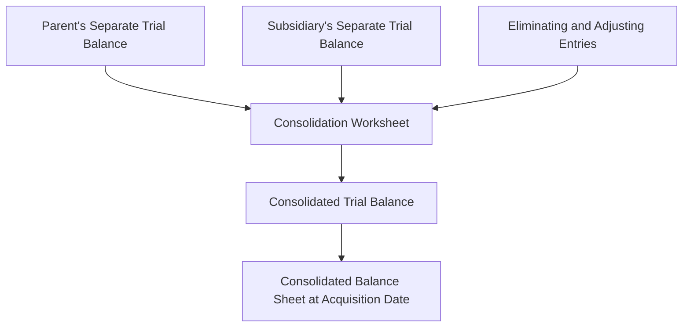
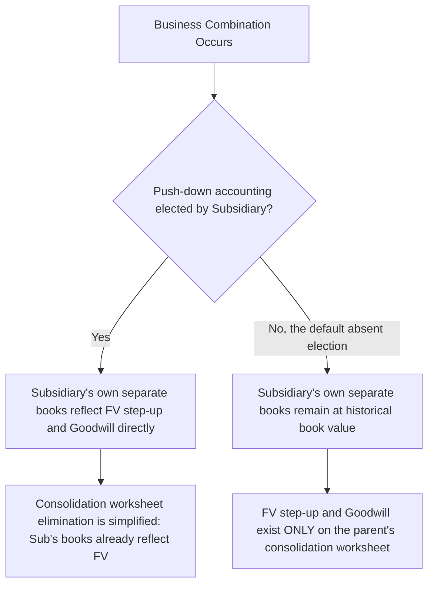

## Consolidation Worksheet Mechanics at Acquisition

### Overview

The consolidation worksheet is the technical instrument used to combine the separately maintained legal-entity books of a parent and its subsidiary into a single set of consolidated financial statements as of the acquisition date. Because the parent and subsidiary continue to maintain separate general ledgers post-acquisition, consolidation is performed **outside** the books, through worksheet eliminating entries — these entries never post to either entity's actual accounting records.

### Purpose and Structure of the Consolidation Worksheet

**Key Points**

- The worksheet begins with the **parent's separate-entity trial balance** and the **subsidiary's separate-entity trial balance**, placed in adjacent columns.
- **Eliminating entries** (also called consolidating entries or worksheet entries) are entered in a middle set of debit/credit columns to adjust the simple mechanical sum of the two trial balances to the correct consolidated presentation.
- The final columns produce the **consolidated trial balance**, from which the consolidated balance sheet (and, in subsequent periods, the consolidated income statement and other statements) is prepared.
- At the **acquisition date itself** (before any post-acquisition activity), only a **consolidated balance sheet** is typically prepared, since no consolidated income statement activity has yet occurred for the combined entity.

### The Fundamental Elimination — Investment Account Against Subsidiary Equity

**Key Points**

The core acquisition-date worksheet entry eliminates two items that would otherwise cause **double-counting** in the consolidated statements:

1. The parent's **"Investment in Subsidiary"** account (recorded on the parent's own books at the cost/fair value of consideration transferred) — this represents the parent's claim on the subsidiary's net assets, which must be eliminated because those same net assets are about to be consolidated in full, line by line.
2. The subsidiary's **pre-acquisition stockholders' equity accounts** (common stock, additional paid-in capital, retained earnings as of the acquisition date) — these represent the subsidiary's own equity claims, which are replaced in the consolidated statements by the acquisition-date fair value allocation and any NCI.

**Entry S (Eliminate Subsidiary's Equity)** — a common worksheet-entry labeling convention (though letter labels vary by textbook/firm methodology):

| Debit | Credit |
| --- | --- |
| Subsidiary Common Stock |  |
| Subsidiary Additional Paid-in Capital |  |
| Subsidiary Retained Earnings (acquisition date balance) |  |
|  | Investment in Subsidiary (parent's %) |
|  | Noncontrolling Interest (NCI %, at book value component) |

**Entry A (Allocate Excess of Fair Value over Book Value / Fair Value Adjustments)**

| Debit | Credit |
| --- | --- |
| Identifiable assets — fair value step-up (e.g., PP&E, intangibles) |  |
| Goodwill |  |
|  | Liabilities — fair value step-up (if applicable) |
|  | Investment in Subsidiary (remaining excess allocated to parent's %) |
|  | Noncontrolling Interest (remaining excess allocated to NCI's %) |

### Worksheet Mechanics — Step-by-Step at Acquisition Date

**Key Points**

**Step 1 — Determine total consideration and goodwill/bargain purchase** (performed off-worksheet, as a supporting schedule, using the formula from the acquisition method: Consideration + FV of NCI + FV of previously held interest − FV of identifiable net assets = Goodwill or bargain purchase).

**Step 2 — Eliminate the parent's Investment account against the subsidiary's pre-acquisition equity** (Entry S), removing the subsidiary's book-value equity and the corresponding portion of the parent's investment account, with any excess flowing to Entry A.

**Step 3 — Allocate the excess of fair value over book value to specific identifiable assets/liabilities and to goodwill** (Entry A), based on the acquisition-date purchase price allocation (PPA) study, remeasuring the subsidiary's assets and liabilities from **book value to fair value** on the worksheet — this fair value step-up is **never recorded on the subsidiary's own separate books** (absent a push-down accounting election); it exists only in the consolidation worksheet.

**Step 4 — Establish the Noncontrolling Interest balance** in consolidated equity, comprising NCI's proportionate share of the subsidiary's book value (from Entry S) plus NCI's share of the fair value step-up and goodwill (from Entry A), consistent with the full fair value/full goodwill method mandated under U.S. GAAP (or the elected method under IFRS).

**Step 5 — Sum all columns** (parent trial balance + subsidiary trial balance +/− eliminating entries) to produce the consolidated trial balance, then present as the consolidated balance sheet.

### Illustrative Worksheet — Full Numerical Example

**Example**

Parent Co. acquires 80% of Subsidiary Co. for $9,600,000 cash on the acquisition date. NCI fair value is independently determined at $2,300,000. Subsidiary Co.'s separate-entity balance sheet at acquisition (book values) and fair values are as follows:

| Item | Subsidiary Book Value | Subsidiary Fair Value | Fair Value Adjustment |
| --- | --- | --- | --- |
| Current assets | $1,500,000 | $1,500,000 | — |
| PP&E, net | $4,000,000 | $5,200,000 | +$1,200,000 |
| Identifiable intangibles (not on Sub's books) | $0 | $1,800,000 | +$1,800,000 |
| Liabilities | ($2,500,000) | ($2,500,000) | — |
| **Net identifiable assets** | **$3,000,000** | **$6,000,000** | **+$3,000,000** |

Subsidiary's pre-acquisition equity (book value): Common Stock $1,000,000 + APIC $500,000 + Retained Earnings $1,500,000 = $3,000,000 (consistent with net assets at book value, as expected).

**Goodwill computation (supporting schedule, off-worksheet):**

$$\text{Goodwill} = \$9{,}600{,}000 + \$2{,}300{,}000 - \$6{,}000{,}000 = \$5{,}900{,}000$$

**Worksheet Entry S — Eliminate Subsidiary's book-value equity:**

| Account | Debit | Credit |
| --- | --- | --- |
| Common Stock (Subsidiary) | $1,000,000 |  |
| APIC (Subsidiary) | $500,000 |  |
| Retained Earnings (Subsidiary) | $1,500,000 |  |
| Investment in Subsidiary |  | $2,400,000 (80% × $3,000,000) |
| Noncontrolling Interest |  | $600,000 (20% × $3,000,000) |

**Worksheet Entry A — Allocate fair value step-up and goodwill:**

| Account | Debit | Credit |
| --- | --- | --- |
| PP&E (step-up) | $1,200,000 |  |
| Identifiable Intangibles | $1,800,000 |  |
| Goodwill | $5,900,000 |  |
| Investment in Subsidiary |  | $7,200,000 ($9,600,000 − $2,400,000 from Entry S) |
| Noncontrolling Interest |  | $1,700,000 ($2,300,000 − $600,000 from Entry S) |

**Verification:** Total debits in Entry A ($1,200,000 + $1,800,000 + $5,900,000 = $8,900,000) equal total credits ($7,200,000 + $1,700,000 = $8,900,000). ✓

**Combined effect:** After both entries, the "Investment in Subsidiary" account (originally $9,600,000 on Parent Co.'s separate books) is fully eliminated ($2,400,000 + $7,200,000 = $9,600,000), and total NCI on the consolidated balance sheet equals $600,000 + $1,700,000 = **$2,300,000**, matching the independently determined acquisition-date fair value of NCI — confirming internal consistency of the worksheet mechanics.

### Worksheet Format — Columnar Layout

**Key Points**

A standard consolidation worksheet at acquisition date is typically organized as:

| Line Item | Parent Co. | Subsidiary Co. | Eliminations Dr | Eliminations Cr | Consolidated |
| --- | --- | --- | --- | --- | --- |
| Current assets | [Parent balance] | [Sub balance] |  |  | Sum |
| PP&E, net | [Parent balance] | [Sub balance] | Entry A step-up |  | Sum + step-up |
| Identifiable intangibles | — | — | Entry A |  | Recognized amount |
| Goodwill | — | — | Entry A |  | Recognized amount |
| Investment in Subsidiary | [Parent's cost] | — |  | Entry S + Entry A | $0 (fully eliminated) |
| Liabilities | [Parent balance] | [Sub balance] |  |  | Sum |
| Common Stock — Subsidiary | — | [Sub balance] | Entry S |  | $0 (eliminated) |
| APIC — Subsidiary | — | [Sub balance] | Entry S |  | $0 (eliminated) |
| Retained Earnings — Subsidiary | — | [Sub balance] | Entry S |  | $0 (eliminated) |
| Common Stock — Parent | [Parent balance] | — |  |  | [Parent balance] (survives, represents consolidated entity) |
| Retained Earnings — Parent | [Parent balance] | — |  |  | [Parent balance] (survives) |
| Noncontrolling Interest | — | — |  | Entry S + Entry A | Sum (new consolidated equity line) |

The key visual/structural takeaway: **all of the subsidiary's pre-acquisition equity accounts net to zero** in the consolidated column (fully eliminated), while the **parent's own equity accounts flow through unchanged** — a direct mechanical expression of the principle that consolidated equity, apart from NCI, represents only the parent's shareholders' equity.

### Push-Down Accounting — An Alternative to Worksheet-Only Elimination

**Key Points**

- **Push-down accounting** (ASC 805-50) is an **optional election** available to the acquired subsidiary itself (not the parent), allowing the subsidiary to record the acquisition-date fair value adjustments and resulting goodwill **directly on its own separate books**, rather than leaving them purely as worksheet eliminating entries maintained only at the consolidated level.
- If push-down accounting is elected, the subsidiary's **own separate-entity financial statements** (relevant, for example, if the subsidiary has its own public debt requiring separate SEC reporting, or otherwise issues standalone financial statements) reflect the stepped-up fair values and goodwill directly.
- If push-down accounting is **not** elected (the more common default in the absence of a specific standalone-reporting driver), the subsidiary continues to report its own separate financial statements at **historical (pre-acquisition) book value**, and the fair value step-up/goodwill exists **only** in the parent's consolidation worksheet — never appearing on the subsidiary's own books.
- **IFRS does not have an equivalent explicit push-down accounting standard**; subsidiary-level financial statements under IFRS generally continue to reflect the subsidiary's own historical cost basis, with fair value adjustments confined to the consolidated financial statements.

### Deferred Taxes on the Acquisition-Date Worksheet

**Key Points**

- Where a fair value step-up creates a new temporary difference between the stepped-up book value (for consolidated reporting purposes) and the unchanged tax basis of the acquired asset, a **deferred tax liability** (or asset, for a step-down) is recognized as part of Entry A, per ASC 740/IAS 12.
- This deferred tax effect **reduces the net identifiable assets figure** used in the goodwill computation, since the deferred tax liability is itself an identifiable liability assumed, measured under ASC 740/IAS 12 rather than fair value — increasing residual goodwill relative to a scenario ignoring the tax effect.

$$\text{Deferred Tax Liability on Step-Up} = \left(\text{FV of Asset} - \text{Tax Basis of Asset}\right) \times \text{Applicable Tax Rate}$$

### Noncontrolling Interest Line — Balance Sheet Presentation

**Key Points**

- The NCI balance established through Entries S and A above is presented within the consolidated balance sheet's **equity section**, as a distinct line item — e.g., "Noncontrolling interest in consolidated subsidiary" — clearly separated from, but included within, total consolidated stockholders' equity (consistent with entity theory presentation).
- This is a mechanical, worksheet-level confirmation of the entity-theory principle: NCI is not netted against assets, not shown as a liability, and not omitted from the balance sheet.

### Common Analytical Pitfalls

**Key Points**

- Forgetting that eliminating entries are **worksheet-only** — they are never posted to either the parent's or subsidiary's actual general ledger, and must therefore be **re-entered on the worksheet in every subsequent consolidation period** (with adjustments for post-acquisition activity in later periods, such as amortization of the fair value step-up and subsequent goodwill impairment).
- Eliminating the subsidiary's equity at **fair value** in Entry S instead of **book value** — Entry S removes book-value equity; the fair value step-up is a **separate** entry (Entry A), not combined into a single fair-value elimination, which is important for clearly tracing NCI's book-value share versus its step-up/goodwill share.
- Omitting the deferred tax liability associated with the fair value step-up, understating recognized liabilities and correspondingly understating goodwill.
- Confusing push-down accounting (an election affecting the **subsidiary's own separate books**) with the ordinary consolidation worksheet process (which occurs regardless of any push-down election, at the **parent's consolidated level**) — these operate independently; push-down accounting, if elected, simplifies but does not eliminate the need for the parent to still prepare consolidated financial statements.
- Failing to verify that the sum of NCI recognized in Entry S (book-value share) and Entry A (step-up/goodwill share) reconciles to the independently determined acquisition-date fair value of NCI used in the goodwill computation — a useful internal control/check on worksheet accuracy.

### Related Topics

- Goodwill recognition and the consideration-transferred formula
- Noncontrolling interest measurement: full vs. partial goodwill methods
- Push-down accounting under ASC 805-50: election criteria and subsequent reporting implications
- Deferred tax accounting for business combination fair value adjustments (ASC 740 / IAS 12)
- Consolidation worksheet mechanics in subsequent periods: amortization of fair value adjustments and intercompany eliminations
- Consolidation theories and the entity concept: how the entity theory manifests in the equity presentation of NCI
- Identifying the acquirer and the acquisition date