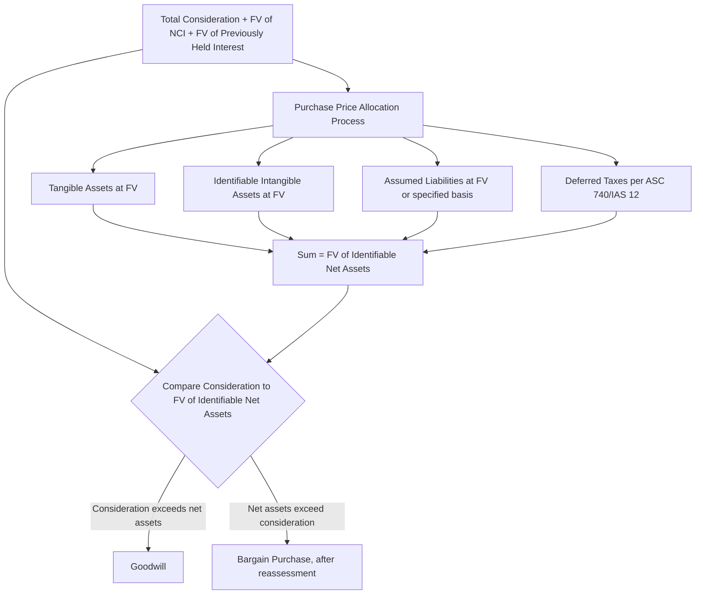

## Fair Value Allocation of Identifiable Net Assets

### Overview

Fair value allocation of identifiable net assets — commonly termed **purchase price allocation (PPA)** in practice — is the process of assigning acquisition-date fair values to each of the acquiree's individually identifiable assets and liabilities as required by ASC 805 and IFRS 3. This process directly determines both the amounts recognized on the consolidated balance sheet at acquisition and the residual amount recognized as goodwill, making it one of the most valuation-intensive and judgment-dependent aspects of business combination accounting.

### The Allocation Framework

**Key Points**

- Every identifiable asset acquired and liability assumed that meets the recognition criteria (see identifiable asset/liability recognition principles under ASC 805/IFRS 3) is measured at **acquisition-date fair value**, determined under **ASC 820** (U.S. GAAP) or **IFRS 13** (IFRS) — both of which define fair value using an **exit price** notion from the perspective of market participants.
- The **residual** after allocating fair value to all identifiable assets and liabilities is **goodwill** (or, in the reverse case, a bargain purchase gain).
- Allocation requires a systematic valuation exercise across multiple asset classes, each typically requiring a different valuation approach and often a different valuation specialist discipline (real estate/machinery appraisers for tangible assets; intangible asset valuation specialists for customer relationships, technology, and trade names; actuaries for pension obligations).

### The Fair Value Measurement Hierarchy (ASC 820 / IFRS 13)

**Key Points**

Fair value measurements used in PPA are categorized within the three-level hierarchy based on the observability of the inputs used:

| Level | Description | Typical PPA Application |
| --- | --- | --- |
| Level 1 | Quoted prices in active markets for identical assets/liabilities | Marketable securities held by the acquiree |
| Level 2 | Observable inputs other than quoted prices (e.g., quoted prices for similar assets, market-corroborated inputs) | Certain real estate, some debt instruments assumed |
| Level 3 | Unobservable inputs, requiring the reporting entity's own assumptions | Most identifiable intangible assets (customer relationships, technology, trade names), IPR&D, contingent consideration |

**[Inference]** Because the majority of intangible assets recognized in a typical business combination lack active markets, PPA valuations for intangibles are predominantly **Level 3** measurements, which correspondingly carry the most extensive disclosure requirements (valuation techniques, significant unobservable inputs, and sensitivity considerations) and receive the greatest scrutiny in audit and regulatory review.

### Valuation Approaches by Asset Category

#### Tangible Assets

**Key Points**

| Asset | Typical Approach |
| --- | --- |
| Cash and cash equivalents | Face value (generally approximates fair value) |
| Accounts receivable | Contractual amounts, adjusted for estimated uncollectible amounts and, where material, a discount for the time value of money if collection is not near-term |
| Inventory — finished goods | **Market approach**: estimated selling price less costs of disposal and a reasonable profit allowance for the selling effort |
| Inventory — work in process | Estimated selling price less costs to complete, costs of disposal, and a reasonable profit allowance for completing and selling effort |
| Inventory — raw materials | Often approximated by **current replacement cost** |
| Property, plant, and equipment | **Cost approach** (depreciated replacement cost) or **market approach** (comparable sales), depending on asset type and available market data |
| Land | **Market approach** — comparable sales |

#### Intangible Assets — Income Approach Methods

**Key Points**

**Multi-Period Excess Earnings Method (MPEEM)** — most commonly used for the **primary** or most significant intangible asset (frequently customer relationships or core technology), calculating the present value of cash flows attributable to that specific asset after deducting **contributory asset charges** (a fair return on all other assets — working capital, fixed assets, other intangibles, and assembled workforce — that contribute to generating those cash flows).

$$FV_{\text{Intangible (MPEEM)}} = \sum_{t=1}^{n} \frac{\left(CF_t - \text{Contributory Asset Charges}_t\right)}{(1+r)^t}$$

**Relief-from-Royalty Method** — commonly used for trade names, trademarks, and technology; estimates fair value as the present value of royalty payments the owner is relieved from paying by owning rather than licensing the asset, based on a market-derived royalty rate applied to projected revenue.

$$FV_{\text{Intangible (Relief-from-Royalty)}} = \sum_{t=1}^{n} \frac{\text{Revenue}_t \times \text{Royalty Rate} \times (1 - \text{Tax Rate})}{(1+r)^t}$$

**With-and-Without Method** — commonly used for non-compete agreements; compares the present value of cash flows/enterprise value **with** the agreement in place versus **without** it, with the difference representing the asset's fair value.

**Cost Approach** — used for certain assets where replacement cost is more relevant than income generation, such as assembled workforce (for internal valuation-support purposes, even though assembled workforce itself is **not separately recognized** as an intangible asset under ASC 805/IFRS 3 and is instead subsumed into goodwill) or certain software.

#### Financial Liabilities and Contingencies

**Key Points**

- **Debt assumed** is measured at acquisition-date fair value, which may differ materially from its face amount if the acquiree's stated interest rate differs from current market rates for similar credit risk and terms — this creates a **premium or discount** amortized over the debt's remaining term post-acquisition.
- **Contingent liabilities** are measured per the exception guidance discussed under recognition and measurement exceptions (ASC 805's contractual/more-likely-than-not framework, or IFRS 3's present-obligation/reliably-measurable framework) rather than a simple fair value default.

### The Contributory Asset Charge Concept (MPEEM Detail)

**Key Points**

- A **contributory asset charge (CAC)** represents a fair economic return on (and, where relevant, of) each supporting asset that contributes to generating the cash flows attributable to the subject intangible being valued under MPEEM, preventing double-counting of value across multiple intangible assets when more than one intangible is valued using an income approach.
- Typical contributory assets requiring a charge: working capital, fixed assets (PP&E), assembled workforce, and any other separately identified intangible assets (e.g., if customer relationships are the primary asset being valued via MPEEM, a charge is applied for the contribution of acquired technology, trade name, and workforce).
- The **rate of return** applied to each contributory asset typically corresponds to that asset class's own risk profile — lower for low-risk contributory assets like working capital and fixed assets, and a rate closer to the overall weighted average cost of capital (WACC) for higher-risk assets.

### Weighted Average Return Analysis (WARA) — Cross-Check

**Key Points**

- A **Weighted Average Return Analysis (WARA)** is commonly performed as a reasonableness cross-check across the entire PPA, comparing the weighted average of the individual discount/return rates applied to each recognized asset (tangible and intangible) and to goodwill, against the **overall weighted average cost of capital (WACC)** used to value the acquired business as a whole (or the internal rate of return implied by the transaction price).
- A significant unexplained variance between the WARA-derived rate and the overall WACC/IRR is generally treated as a signal warranting reconsideration of individual asset discount rate assumptions, useful lives, or cash flow projections within the PPA — [Inference] this is a widely used valuation-profession quality control technique rather than an explicit line-item requirement of ASC 805/IFRS 3 itself.

### Deferred Taxes in the Allocation

**Key Points**

- Fair value step-ups (the excess of an asset's fair value over its unchanged **tax basis**) create new **taxable temporary differences**, requiring recognition of a **deferred tax liability** under ASC 740/IAS 12 as part of the identifiable liabilities assumed.
- Conversely, a fair value **step-down** (e.g., an assumed liability's fair value differing unfavorably from its tax basis) or the recognition of certain acquired tax attributes (net operating loss carryforwards, tax credit carryforwards) can give rise to a **deferred tax asset**, subject to a valuation allowance assessment based on the combined entity's expected ability to realize the benefit.
- Because deferred taxes are recognized under ASC 740/IAS 12 rather than fair value, they are one of the **specific exceptions** to the general fair value measurement principle, and their inclusion **directly affects** the residual goodwill computed.

$$\text{Net Identifiable Assets (final, for goodwill purposes)} = \sum(\text{FV of identifiable assets}) - \sum(\text{FV/ASC 740-based value of identifiable liabilities, including DTL})$$

### Illustrative Comprehensive Allocation Example

**Example**

Acquirer Co. acquires 100% of Target Co. for $40,000,000 cash. A PPA study, incorporating input from tangible asset appraisers, an intangible asset valuation specialist, and a tax specialist, produces the following:

| Item | Target's Book Value | Acquisition-Date Fair Value | Method |
| --- | --- | --- | --- |
| Cash and receivables | $3,000,000 | $3,000,000 | Face value / net realizable value |
| Inventory | $2,500,000 | $3,100,000 | Market approach (finished goods selling price less disposal costs and profit allowance) |
| PP&E | $8,000,000 | $11,500,000 | Cost approach (depreciated replacement cost) |
| Customer relationships | $0 (unrecorded) | $9,200,000 | MPEEM, net of contributory asset charges |
| Trade name | $0 (unrecorded) | $2,400,000 | Relief-from-royalty |
| Developed technology | $0 (unrecorded) | $4,100,000 | MPEEM |
| Non-compete agreement (founder) | $0 (unrecorded) | $600,000 | With-and-without method |
| Total liabilities assumed | ($6,000,000) | ($6,000,000) | Face/contractual (no material fair value adjustment) |
| Deferred tax liability (on step-up, at 25% rate) | $0 | ($5,225,000) | ASC 740: 25% × ($3,100,000 − $2,500,000 + $11,500,000 − $8,000,000 + $9,200,000 + $2,400,000 + $4,100,000 + $600,000) = 25% × $20,900,000 |

$$\text{FV of Identifiable Net Assets} = \$3{,}000{,}000 + \$3{,}100{,}000 + \$11{,}500{,}000 + \$9{,}200{,}000 + \$2{,}400{,}000 + \$4{,}100{,}000 + \$600{,}000 - \$6{,}000{,}000 - \$5{,}225{,}000 = \$22{,}675{,}000$$

$$\text{Goodwill} = \$40{,}000{,}000 - \$22{,}675{,}000 = \$17{,}325{,}000$$

The resulting $17,325,000 goodwill represents value attributable to expected synergies, assembled workforce, and other factors not meeting the separate intangible asset recognition criteria.

### Subsequent Amortization and Depreciation of Allocated Fair Values

**Key Points**

- The fair-value-adjusted carrying amounts established through PPA become the **new depreciable/amortizable basis** for the combined entity going forward, over each asset's remaining useful life as assessed at the acquisition date.
- Finite-lived intangible assets (customer relationships, developed technology, non-compete agreements, unfavorable/favorable contract adjustments) are amortized, typically on a **straight-line basis** unless a pattern of economic benefit consumption can be reliably demonstrated to support an accelerated method.
- **Indefinite-lived intangibles** (certain trade names, IPR&D) are not amortized but are tested for impairment at least annually.
- **Goodwill** is never amortized under the impairment-only model (subject to the private-company amortization alternative under ASC 350).

### Measurement Period Adjustments to the Allocation

**Key Points**

- Provisional amounts recognized in the initial PPA may be adjusted within the **measurement period** (up to one year from the acquisition date) as new information about facts and circumstances existing **as of the acquisition date** becomes available (e.g., a finalized independent appraisal received after the acquisition date that refines a provisional estimate made at closing).
- Such adjustments are made **retrospectively**, as if the accounting had been completed at the acquisition date, with a corresponding offsetting adjustment to **goodwill** — and, if the adjustment affects a depreciable/amortizable asset, retrospective revision of any depreciation/amortization already recorded in the interim.
- Adjustments driven by events occurring **after** the acquisition date (not existing as of that date) are **not** measurement-period adjustments, and are instead recognized prospectively in current-period earnings under otherwise-applicable GAAP/IFRS.

### Common Analytical Pitfalls

**Key Points**

- Applying fair value to items governed by specific measurement exceptions (income taxes, employee benefits, share-based payments, assets held for sale) instead of their designated non-fair-value bases.
- Omitting the deferred tax liability associated with fair value step-ups, which both understates recognized liabilities and correspondingly understates residual goodwill.
- Double-counting value across intangible assets by failing to apply appropriate contributory asset charges when using MPEEM for a primary asset while other intangibles are separately recognized.
- Using the acquirer's overall WACC as the discount rate for every individual asset class without WARA-style reasonableness testing, potentially producing internally inconsistent risk-adjusted valuations across the allocation.
- Recognizing assembled workforce as a separate intangible asset — it is explicitly excluded from separate recognition under both ASC 805 and IFRS 3 and is subsumed within goodwill, though it remains a relevant **contributory asset** for CAC purposes within an MPEEM analysis of other intangibles.
- Treating a provisional PPA estimate updated after the measurement period closes as a measurement-period adjustment (goodwill impact) rather than correctly recognizing the change in current-period earnings.

### Related Topics

- Goodwill recognition and bargain purchase gain computation
- Recognition and measurement exceptions: income taxes, employee benefits, contingencies, leases
- Deferred tax accounting for business combination fair value adjustments (ASC 740 / IAS 12)
- Consolidation worksheet mechanics: recording the fair value step-up and goodwill at acquisition
- Goodwill and intangible asset impairment testing subsequent to acquisition
- Measurement period adjustments and their one-year limitation
- Intangible asset useful life determination and amortization method selection