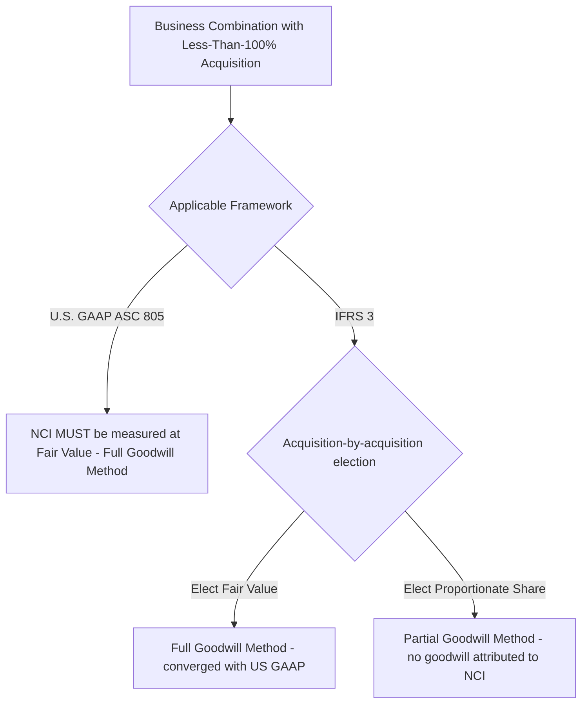

## Noncontrolling Interest Measurement at Acquisition

### Overview

Noncontrolling interest (NCI) measurement at the acquisition date is Step 4 of the acquisition method under ASC 805 and IFRS 3, establishing the initial carrying amount of the equity interest held by owners other than the parent in a less-than-wholly-owned consolidated subsidiary. This measurement directly determines both the initial NCI balance presented in consolidated equity and, through the goodwill formula, the amount of goodwill (or bargain purchase) recognized.

### Definition of Noncontrolling Interest

**Key Points**

- NCI is defined as the **equity in a subsidiary not attributable, directly or indirectly, to the parent** — i.e., the portion of the subsidiary owned by parties other than the parent.
- NCI arises whenever the acquirer obtains **control** (typically, but not always, through majority ownership) without acquiring **100%** of the acquiree's equity interests.
- Consistent with **entity theory** (the conceptual foundation of current ASC 810/IFRS 10), NCI holders are viewed as **owners of the single consolidated reporting entity**, distinct from the parent's shareholders but still owners of the combined economic unit — this is why NCI is measured, presented, and allocated income in the specific manner described below, rather than treated as an outside liability claim.

### The Two Measurement Approaches

**Key Points**

| Approach | U.S. GAAP (ASC 805) | IFRS (IFRS 3) |
| --- | --- | --- |
| **Fair value method** ("full goodwill method") | **Mandatory** for all business combinations | **Elective**, on an acquisition-by-acquisition basis |
| **Proportionate share of identifiable net assets method** ("partial goodwill method") | **Not permitted** | **Elective**, on an acquisition-by-acquisition basis |

Under U.S. GAAP, there is no choice: NCI is **always** measured at acquisition-date fair value. Under IFRS, the acquirer makes an explicit **election, separately for each business combination**, between the two methods — this is one of the few remaining substantive measurement differences between the two frameworks in the business combinations area.

### Fair Value Method (Full Goodwill Method)

**Key Points**

- NCI is measured at its **acquisition-date fair value** — an independent valuation of what the noncontrolling equity interest would be worth to a market participant, **not** simply a mechanical pro-rata calculation based on the price paid by the acquirer for its controlling interest.
- Because a controlling interest often commands a **control premium** relative to a noncontrolling interest, and because NCI shares may lack the same marketability as the acquirer's purchased block, the **per-share (or per-unit) fair value of NCI can differ from the per-share price implied by the consideration the acquirer paid** for its controlling stake.
- Common valuation approaches for NCI fair value:
  - **Market approach** — quoted market price of the acquiree's shares (if publicly traded) held by parties other than the acquirer, adjusted as necessary.
  - **Income approach** — discounted cash flow analysis of the overall enterprise, with NCI's proportionate share derived and then adjusted for the absence of a control premium and/or a lack-of-marketability discount, as appropriate to the specific facts.
  - Acquirer's own **overall consideration paid**, grossed up and used as a starting reference point for the total entity value, adjusted for control premium considerations, when no more direct evidence of NCI's fair value exists.

$$\text{Goodwill}_{\text{Full}} = \text{Consideration Transferred} + FV_{NCI} - FV_{\text{Identifiable Net Assets}}$$

**Resulting Effect**: Under the full goodwill method, goodwill reflects **100% of the acquiree's total implied goodwill** — both the portion attributable to the parent's purchased interest and the portion attributable to NCI — consistent with the entity-theory view that the consolidated entity's assets (including goodwill) belong to the combined ownership group as a whole, not merely to the controlling shareholders.

### Partial Goodwill Method (IFRS Election Only)

**Key Points**

- NCI is measured at its **proportionate share of the acquiree's identifiable net assets** (the fair-valued net assets recognized in the PPA), **without** any goodwill attributed to NCI.

$$FV_{NCI, \text{Partial Method}} = \%\text{NCI} \times FV_{\text{Identifiable Net Assets}}$$

$$\text{Goodwill}_{\text{Partial}} = \text{Consideration Transferred} - \left(\%\text{Acquired} \times FV_{\text{Identifiable Net Assets}}\right)$$

- Under this method, goodwill reflects **only the parent's purchased share** of the acquiree's implied goodwill — the historically "parent company theory"-consistent outcome that IFRS has retained as an explicit option.
- The partial goodwill method will always produce a **lower or equal** goodwill figure (and a correspondingly lower NCI balance) compared to the full goodwill method for the same underlying transaction, since it excludes any goodwill notionally attributable to noncontrolling shareholders.

### Side-by-Side Numerical Comparison

**Example**

Acquirer Co. purchases 75% of Target Co. for $15,000,000 cash. The fair value of Target Co.'s identifiable net assets (post-PPA) is $16,800,000. An independent valuation determines the fair value of the 25% NCI interest to be $4,600,000 (reflecting a lack of control discount relative to a simple pro-rata calculation).

**Full Goodwill Method (mandatory under U.S. GAAP; elective under IFRS):**

$$\text{Goodwill} = \$15{,}000{,}000 + \$4{,}600{,}000 - \$16{,}800{,}000 = \$2{,}800{,}000$$

$$\text{NCI recognized} = \$4{,}600{,}000$$

**Partial Goodwill Method (IFRS election only):**

$$FV_{NCI} = 25\% \times \$16{,}800{,}000 = \$4{,}200{,}000$$

$$\text{Goodwill} = \$15{,}000{,}000 - (75\% \times \$16{,}800{,}000) = \$15{,}000{,}000 - \$12{,}600{,}000 = \$2{,}400{,}000$$

$$\text{NCI recognized} = \$4{,}200{,}000$$

**Comparison:**

|  | Full Goodwill Method | Partial Goodwill Method |
| --- | --- | --- |
| Goodwill | $2,800,000 | $2,400,000 |
| NCI | $4,600,000 | $4,200,000 |
| Total consolidated assets (goodwill + NCI combined effect) | Higher | Lower |

Note that the $400,000 difference between the two methods ($2,800,000 − $2,400,000 for goodwill, and correspondingly $4,600,000 − $4,200,000 for NCI) represents the **goodwill implicitly attributable to the 25% NCI interest** under the fair value approach — the amount by which NCI's independently assessed fair value ($4,600,000) exceeds its simple proportionate share of identifiable net assets ($4,200,000).

### Why NCI Fair Value May Diverge from a Simple Pro-Rata Calculation

**Key Points**

The fair value of NCI is **not mechanically derivable** from the price the acquirer paid for its controlling stake, for several reasons:

1. **Control premium** — the acquirer typically pays a premium to obtain the benefits of control (the ability to direct the acquiree's strategy, operations, financing, and asset deployment), which a noncontrolling shareholder does not receive; therefore, grossing up the acquirer's per-share price to 100% and allocating pro rata to NCI would generally **overstate** NCI's fair value if that per-share price embeds a control premium.
2. **Lack of marketability** — noncontrolling shares in a private or thinly-traded acquiree may be subject to a marketability discount not applicable to a negotiated controlling block sale.
3. **Different classes of equity** — if NCI holders hold a different class of shares (e.g., with different voting rights, dividend preferences, or liquidation preferences) than the shares acquired by the parent, their fair value per unit can differ substantially from the parent's purchased shares' implied per-unit value.

**[Inference]** In practice, valuation specialists frequently apply a **discount for lack of control (DLOC)** to the pro-rata enterprise value when estimating NCI fair value in private-company acquisitions, reflecting the absence of a market-observable NCI share price; this is a standard valuation technique in the field rather than an explicit numerical prescription within ASC 805 or IFRS 3 itself, which require only that fair value be determined using ASC 820/IFRS 13 principles.

### NCI in the Step Acquisition Context

**Key Points**

- When a business combination is achieved in stages (see step acquisitions), NCI at the new acquisition date is measured on the **same basis** (fair value, mandatory under U.S. GAAP; elective under IFRS) as in a single-step acquisition — the existence of a previously held interest by the **acquirer** does not change how the **remaining** NCI (held by parties other than the acquirer) is measured.
- The acquirer's own previously held interest is separately remeasured to fair value and included as a distinct component of the goodwill formula, distinct from the NCI component (see step acquisitions for full treatment).

### Presentation of NCI in Consolidated Equity

**Key Points**

- Regardless of which measurement method is used (full or partial goodwill), NCI is presented as a **distinct component of total consolidated equity**, separately from the parent's equity, consistent with entity theory (see consolidation theories and the entity concept).
- NCI is **not** presented as a liability, and **not** presented in a mezzanine section between liabilities and equity (this was the legacy parent company theory treatment, superseded under current U.S. GAAP by FASB Statement No. 160 and under IFRS by the 2008 revision of IFRS 3/introduction of IFRS 10 concepts).

### Subsequent Measurement — NCI Is Not Remeasured to Fair Value Each Period

**Key Points**

- The **initial** acquisition-date fair value (or proportionate-share) measurement establishes NCI's starting carrying amount; NCI is **not subsequently remeasured to fair value** in later reporting periods.
- NCI's carrying amount subsequently changes through: its allocated share of the subsidiary's post-acquisition net income or loss, its allocated share of other comprehensive income, dividends/distributions paid to NCI holders, and any equity transactions (e.g., the parent purchasing additional shares from NCI, or selling shares to NCI, with control retained — see step acquisitions and changes in ownership interest).
- This "roll-forward" carrying value approach is consistent with ordinary equity accounting rather than a fair-value-through-OCI or fair-value-through-earnings model.

$$\text{NCI Ending Balance} = \text{NCI Acquisition-Date FV (or Proportionate Share)} + \text{NCI's Share of Subsequent Net Income} - \text{NCI's Share of Dividends} \pm \text{Equity Transaction Adjustments} \pm \text{NCI's Share of OCI}$$

### Disclosure Requirements

**Key Points**

Both standards require disclosure of:

- The amount of NCI recognized at the acquisition date, and the **valuation technique(s) and significant inputs** used to measure that fair value (if the fair value method is used).
- If the acquirer (under IFRS) or a private company (in some jurisdictions' local equivalents) uses the partial goodwill method, disclosure that NCI was measured at its proportionate share of identifiable net assets rather than fair value, given the resulting difference in reported goodwill.

### Common Analytical Pitfalls

**Key Points**

- Calculating NCI's fair value as a simple mechanical pro-rata extrapolation of the price paid by the acquirer for its controlling interest, without considering that a **control premium** embedded in the acquirer's price may cause this to overstate NCI's actual fair value.
- Applying the **partial goodwill method under U.S. GAAP** — this is not a permitted option under ASC 805; U.S. GAAP requires the fair value method without exception.
- Failing to apply the IFRS election **consistently within a single acquisition** — the choice between full and partial goodwill is made once per acquisition (not, for example, applied differently to different classes of NCI within the same transaction).
- Remeasuring NCI to fair value in **subsequent** reporting periods — NCI's carrying amount rolls forward through allocated income/OCI/dividends/equity transactions; it is not subject to ongoing fair value remeasurement after the acquisition date.
- Confusing the **NCI fair value** used in the acquisition-date goodwill computation with the subsequent **carrying amount** of NCI presented in later consolidated balance sheets — only the former is a fair value measurement; the latter is a rolled-forward book value.

### Related Topics

- Goodwill recognition and bargain purchase gain computation
- Consolidation theories and the entity concept: NCI's equity presentation rationale
- Fair value allocation of identifiable net assets (the PPA underlying the goodwill formula)
- Step acquisitions and remeasurement of previously held equity interests
- Changes in ownership interest with control retained: equity transaction accounting for NCI
- Consolidation worksheet mechanics: recording NCI in Entries S and A
- Fair value measurement principles under ASC 820 / IFRS 13, including control premium and marketability discount considerations