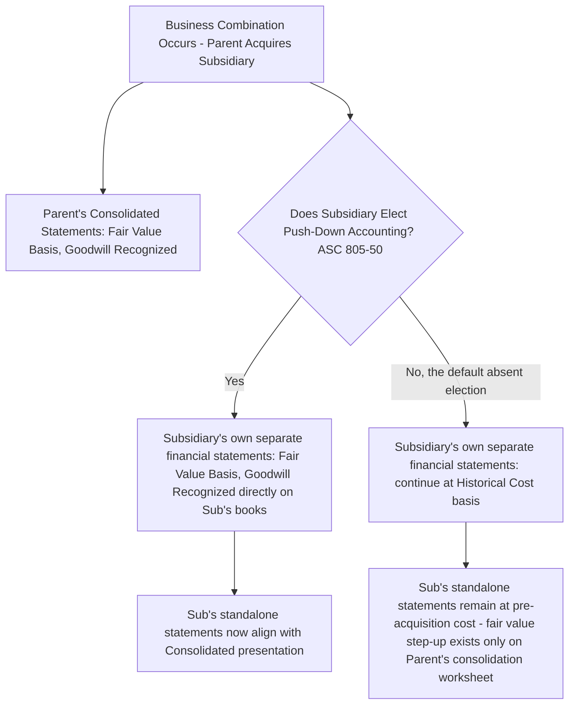

## Push-Down Accounting

### Overview

Push-down accounting refers to the practice of recording the acquisition-date fair value adjustments and resulting goodwill directly on the **acquired subsidiary's own separate-entity financial statements**, rather than confining those adjustments to the parent's consolidation worksheet. Under U.S. GAAP, this is addressed explicitly in **ASC 805-50**, and is available as an **election** made by the acquired entity itself. IFRS has no equivalent specific standard.

### The Underlying Question Push-Down Accounting Addresses

**Key Points**

- Without push-down accounting, an acquired subsidiary's **own separate-entity financial statements** (which it may still need to issue — for example, because it has publicly held debt requiring standalone SEC reporting, or for regulatory, tax, lender covenant, or joint-venture-partner reporting purposes) continue to reflect its **pre-acquisition historical cost basis**, even though the **consolidated** financial statements of its new parent reflect the acquisition-date fair value step-up and goodwill.
- This creates two different bases of accounting for the same underlying entity simultaneously: **historical cost** at the standalone subsidiary level and **fair value (as of acquisition)** at the consolidated parent level.
- Push-down accounting allows (but does not require) the subsidiary to align its own standalone books with the fair-value-based consolidated presentation, by "pushing down" the parent's acquisition accounting onto the subsidiary's separate ledger.

### U.S. GAAP Framework — ASC 805-50

**Key Points**

- ASC 805-50 (as amended by **ASU 2014-17**, *Business Combinations (Topic 805): Pushdown Accounting*) provides that an acquired entity (or its subsidiaries, or an acquired **business** — the guidance is not limited to entities with SEC-registered debt) **may elect** to apply pushdown accounting in its separate financial statements **each time** a change-in-control event occurs.
- Prior to ASU 2014-17 (issued in 2014), push-down accounting was governed primarily by **SEC staff guidance** (historically SAB Topic 5.J), which effectively **mandated** push-down accounting for SEC registrants in certain circumstances involving substantially wholly owned subsidiaries — ASU 2014-17 **codified push-down accounting as an explicit GAAP election available to all entities** (public and private), removing the SEC-mandate framework and making it a genuine choice rather than a required outcome for registrants meeting specific ownership thresholds.
- The election is made **on an acquisition-by-acquisition basis** and is **irrevocable** once made for that specific change-in-control event.
- If not elected at the time of the triggering change-in-control event, the entity retains the ability to elect pushdown accounting in a **subsequent** reporting period, applied as of that change-in-control date (a "later election" option), though this is treated as a change with specific transition mechanics rather than routine practice.

### What Constitutes a "Change-in-Control Event" Triggering Eligibility

**Key Points**

- Push-down accounting eligibility is triggered when an acquirer obtains **control** of the acquired entity, as assessed under the same control principles applied in identifying the acquirer for consolidation purposes (ASC 810).
- **Business combinations** falling under the general scope of ASC 805 are the typical trigger, but the concept of a qualifying change-in-control event under ASC 805-50 can, in principle, extend to certain other control-obtaining transactions the entity determines meet the "change in control" threshold contemplated by the guidance.

### Mechanics of Applying Push-Down Accounting

**Key Points**

When push-down accounting is elected, the acquired entity's separate financial statements are adjusted to reflect:

1. **Recognition of identifiable assets and liabilities at their acquisition-date fair values**, using the same recognition and measurement principles (including all the specific exceptions — income taxes, employee benefits, contingencies, leases, etc.) applied at the consolidated level under ASC 805.
2. **Recognition of goodwill** (or a bargain purchase gain, if applicable) directly on the subsidiary's own separate balance sheet, computed on the same basis as at the consolidated level.
3. **A "new basis" of accounting** going forward — the subsidiary's pre-acquisition retained earnings and other historical equity accounts are effectively **reset**, since the entity is now reporting on a fresh fair-value cost basis as of the push-down date; a new capital account (frequently labeled something akin to "cumulative effect of pushdown accounting" or a restated additional paid-in capital) may be established to reflect the parent's basis in the entity.
4. Financial statements issued for periods **before** the push-down date are **not restated**; push-down accounting is applied prospectively from the change-in-control date, similar in spirit to the acquisition method's own prospective (not retrospective) application at the consolidated level.

### Illustrative Example — Applying Push-Down Accounting

**Example**

Parent Co. acquires 100% of Subsidiary Co. for $30,000,000. At acquisition, a PPA determines Subsidiary Co.'s identifiable net assets at fair value to be $22,000,000 (versus a pre-acquisition book value of $14,000,000), and resulting goodwill of $8,000,000.

**Without push-down accounting elected:**

- Subsidiary Co.'s own separate financial statements continue to reflect its $14,000,000 pre-acquisition net asset book value; no goodwill appears on Subsidiary Co.'s standalone balance sheet.
- The $8,000,000 fair value step-up and $8,000,000 goodwill exist **only** within Parent Co.'s consolidation worksheet eliminating entries.

**With push-down accounting elected:**

- Subsidiary Co.'s own separate balance sheet is adjusted to reflect the **$22,000,000 fair value** of its identifiable net assets and recognizes **$8,000,000 of goodwill** directly.
- Subsidiary Co.'s pre-acquisition retained earnings (accumulated prior to the acquisition date) are eliminated/reset as part of adopting the new basis, since those historical earnings related to the pre-acquisition ownership and cost basis.
- Subsidiary Co.'s subsequent standalone financial statements — for example, those it must file with the SEC in connection with its own outstanding public debt — now present depreciation, amortization, and goodwill impairment testing on the **same fair-value-based amounts** used at the consolidated Parent Co. level, eliminating the need for separate reconciling schedules between the two sets of statements.

### Effect on the Consolidation Worksheet

**Key Points**

- When push-down accounting **is** elected, the consolidation worksheet process at the parent level is **simplified** at the mechanical level: because the subsidiary's own books already reflect fair value and goodwill, the parent's Investment account, upon elimination, offsets more directly against the subsidiary's already-fair-valued equity — the separate "Entry A" fair-value step-up allocation (as would otherwise be needed on the worksheet) is substantially reduced or eliminated, since the step-up is already recorded in the subsidiary's own trial balance being consolidated.
- When push-down accounting **is not** elected, the full worksheet mechanics described under consolidation worksheet mechanics at acquisition (Entry S to eliminate book-value equity, and Entry A to allocate the fair value step-up and goodwill) remain necessary in **every** consolidation period, since the subsidiary's separate books never reflect the fair value basis.

### Advantages and Considerations of Electing Push-Down Accounting

**Key Points**

**Potential advantages:**

- Aligns the subsidiary's standalone financial statements with the parent's consolidated presentation, which can simplify financial statement preparation, particularly where the subsidiary itself must issue standalone statements (e.g., due to outstanding public debt, regulatory requirements for regulated subsidiaries such as insurance or banking entities, or joint venture partner reporting requirements).
- Provides more decision-useful information to users of the subsidiary's own standalone statements (e.g., subsidiary-level public bondholders) by reflecting the economics of the actual acquisition transaction rather than stale historical cost.

**Potential considerations:**

- **[Inference]** Resetting the subsidiary's pre-acquisition retained earnings can affect the subsidiary's own standalone financial ratios, debt covenant calculations (if covenants reference retained earnings or net asset thresholds), and dividend-paying capacity under state corporate law in some jurisdictions where dividends are legally limited by reference to retained earnings or surplus — these are practical consequences frequently evaluated before electing pushdown accounting, though the specific effect is fact-and-jurisdiction-dependent rather than a uniform outcome of the standard itself.
- Since the election is **irrevocable** for that specific change-in-control event, the decision requires careful upfront consideration rather than being treated as a routine or easily reversible bookkeeping choice.

### IFRS — Absence of an Equivalent Standard

**Key Points**

- IFRS does **not** contain an explicit standard analogous to ASC 805-50 governing push-down accounting.
- Under IFRS, a subsidiary's own separate financial statements (prepared, for example, under **IAS 27**, *Separate Financial Statements*) generally continue to be based on the subsidiary's own historical cost, with **fair value adjustments confined to the consolidated financial statements** prepared by the parent under IFRS 10/IFRS 3.
- **[Inference]** In practice, this means that a comparable "fresh start" presentation at the subsidiary's own standalone level is generally not achieved under full IFRS in the same explicit, standard-sanctioned manner as the U.S. GAAP push-down election, though jurisdiction-specific local GAAP variations (distinct from full IFRS as issued by the IASB) may address similar situations differently; this is a general practice observation rather than an exhaustive survey of every jurisdiction's local accounting framework.

### Push-Down Accounting vs. Ordinary Consolidation — Comparative Summary

| Aspect | Without Push-Down Accounting | With Push-Down Accounting Elected |
| --- | --- | --- |
| Subsidiary's own separate financial statements | Historical cost basis (pre-acquisition) | Fair value basis (post-acquisition), including goodwill |
| Location of fair value step-up / goodwill | Exists only on parent's consolidation worksheet | Recorded directly on subsidiary's own books |
| Consolidation worksheet complexity | Full Entry S / Entry A mechanics required every period | Simplified — subsidiary's trial balance already reflects fair value |
| Subsidiary's pre-acquisition retained earnings | Continue unchanged on subsidiary's own books | Reset/eliminated as part of adopting new basis |
| Availability | N/A (default state) | U.S. GAAP only (ASC 805-50); elective, acquisition-by-acquisition, irrevocable |
| IFRS equivalent | Standard IFRS 10/IFRS 3 consolidated-only treatment | No direct IFRS equivalent standard |

### Common Analytical Pitfalls

**Key Points**

- Assuming push-down accounting is **mandatory** for SEC registrants — since ASU 2014-17, it is an **election**, not a requirement, even for entities that would have been subject to the pre-2014 SEC staff mandate under legacy SAB Topic 5.J guidance.
- Confusing push-down accounting (affecting the **subsidiary's own separate books**) with the ordinary consolidation worksheet process (which the **parent** performs regardless of any push-down election) — the two are related but operate at different reporting levels, and push-down accounting does not eliminate the parent's obligation to prepare consolidated financial statements.
- Treating the election as **retroactively reversible** — once elected for a specific change-in-control event, the election is irrevocable for that event.
- Assuming an IFRS-reporting subsidiary can achieve the same standalone fair-value "reset" as under U.S. GAAP push-down accounting absent specific local GAAP provisions — full IFRS as issued by the IASB does not contain an equivalent standard.
- Overlooking the potential legal and covenant implications of resetting a subsidiary's retained earnings when evaluating whether to elect push-down accounting, particularly for regulated or debt-covenant-constrained subsidiaries.

### Related Topics

- Consolidation worksheet mechanics at acquisition: Entry S and Entry A eliminations
- Fair value allocation of identifiable net assets (the PPA underlying any push-down entries)
- Goodwill recognition and bargain purchase gain computation
- Separate financial statements under IAS 27 and their relationship to consolidated IFRS statements
- SEC standalone reporting requirements for subsidiaries with public debt
- Consolidation theories and the entity concept