## Equity Method Accounting for the Parent's Investment

### Overview

The equity method (ASC 323, *Investments — Equity Method and Joint Ventures*, and IAS 28, *Investments in Associates and Joint Ventures*) is the basis of accounting a parent uses on its **own separate books** to account for its investment in a controlled subsidiary between the acquisition date and consolidation — and, more broadly, the method used for investments in associates and joint ventures where the investor has **significant influence** but not control. In an academic consolidation context, understanding equity-method mechanics on the parent's separate books is essential because the parent's Retained Earnings and Investment in Subsidiary accounts, if the parent applies the equity method internally, will already equal the consolidated totals — a powerful internal-consistency check.

### Scope — When the Equity Method Applies

**Key Points**

- **Significant influence** (the general threshold for equity method applicability outside a parent-subsidiary control relationship) is presumed when an investor holds **20% to 50%** of an investee's voting stock, though this is a rebuttable presumption, not a bright-line rule — influence can exist below 20% (e.g., through board representation, participation in policy-making, material intercompany transactions, or technological dependency) or be absent above 20% (e.g., if the investee is in bankruptcy reorganization or the investor's rights are otherwise restricted).
- In the **consolidation context specifically**, a parent that **controls** a subsidiary (typically >50% ownership, or control via other means such as VIE primary beneficiary status) may still apply the equity method on its own **separate, unconsolidated** financial statements to account for its investment — this is common in practice for internal recordkeeping purposes, even though the subsidiary is fully consolidated (not equity-accounted) in the parent's **consolidated** financial statements.
- Under **IFRS**, IAS 27 permits a parent to use the equity method to account for investments in subsidiaries in its **separate financial statements** as an accounting policy choice (alongside cost or fair value through IFRS 9), whereas U.S. GAAP parent-only (unconsolidated) financial statements are not a standard external reporting requirement in the same manner, making the equity-method-on-the-parent's-own-books discussion primarily an internal/academic consolidation mechanics tool in a U.S. GAAP context rather than a routine external reporting choice.

### The Core Equity Method Mechanics

**Key Points**

- The investment is initially recorded at **cost** (acquisition-date fair value of consideration transferred, for a controlling acquisition).
- The carrying amount of the investment is subsequently adjusted (**"one-line consolidation"**) to reflect the investor's **share of the investee's post-acquisition net income or loss**, increasing or decreasing the investment account, with a corresponding **credit or debit to equity in earnings of investee** on the investor's income statement.
- **Dividends received** from the investee **reduce** the investment account (treated as a **return of investment**, not as dividend income) — a key distinction from the cost method.
- The investor's share of the investee's **other comprehensive income** items similarly adjusts the investment account, with an offsetting entry to the investor's own OCI.

$$\text{Investment Balance}_{\text{End}} = \text{Investment Balance}_{\text{Begin}} + \left(\%\text{Ownership} \times \text{Investee Net Income}\right) - \left(\%\text{Ownership} \times \text{Dividends Declared by Investee}\right) \pm \text{Basis Difference Amortization} \pm \text{Other Adjustments}$$

```mermaid
flowchart TD
    A[Initial Investment recorded at Cost / Acquisition-Date FV] --> B[Investment Balance]
    B --> C[+ Investor's Share of Investee Net Income]
    B --> D[- Investor's Share of Dividends Declared by Investee]
    B --> E[- Amortization of Basis Differences, e.g., excess FV of depreciable assets]
    B --> F[+/- Investor's Share of Investee OCI]
    C --> G[Updated Investment Balance]
    D --> G
    E --> G
    F --> G
```

### Basis Differences and Their Amortization

**Key Points**

- When the cost of the investment **exceeds** the investor's proportionate share of the investee's identifiable net assets at book value, this excess (the **basis difference**) must be **analyzed and allocated** to specific identifiable assets and liabilities (based on the investor's proportionate share of their fair values in excess of book value) and to **equity-method goodwill** (the residual), conceptually parallel to a business combination's PPA, though performed only for the investor's proportionate ownership interest rather than 100% of the investee.
- The portion of the basis difference allocated to **depreciable/amortizable assets** (e.g., PP&E, identifiable intangibles with finite lives) is **amortized** by the investor over the assets' remaining useful lives, **reducing** "equity in earnings of investee" each period (a debit to equity in earnings / credit to the investment account) — this amortization is **not** recorded on the investee's own separate books; it exists only within the investor's application of the equity method.
- The portion allocated to **equity-method goodwill** is **not amortized**, consistent with the goodwill impairment-only model, but equity-method investments as a whole (rather than the implicit goodwill component in isolation) are tested for **other-than-temporary impairment** under ASC 323 / impairment indicators under IAS 28, rather than a discrete goodwill-only impairment test.

$$\text{Basis Difference} = \text{Cost of Investment} - \left(\%\text{Ownership} \times \text{Investee's Book Value of Net Assets}\right)$$

$$\text{Basis Difference} = \left(\%\text{Ownership} \times \text{Excess FV over BV of Identifiable Net Assets}\right) + \text{Equity-Method Goodwill (residual)}$$

### Elimination of Intercompany (Unrealized) Profits Under the Equity Method

**Key Points**

- Consistent with the entity-theory-based full elimination principle applied in consolidation (see consolidation theories and the entity concept), the investor's share of **unrealized intercompany profit** on transactions between the investor and investee is eliminated from equity in earnings, though under the equity method this elimination is generally limited to the **investor's proportionate ownership percentage** of the unrealized profit (a key distinction from full consolidation's 100% elimination), since the equity method is a one-line "share of net assets" presentation rather than a line-by-line combination of the investee's own financial statements.
- **Downstream sales** (investor sells to investee) — unrealized profit elimination is limited to the investor's ownership percentage, since only that portion represents profit that has not truly left the investor's economic sphere; the remaining percentage (representing the "outside" interest's share) is not eliminated under the equity method's proportionate approach.
- **Upstream sales** (investee sells to investor) — similarly, the investor's share of the investee's unrealized profit is eliminated from equity in earnings.

**[Inference]** This proportionate elimination approach for equity-method investees stands in explicit contrast to the **full (100%) elimination** required for consolidated subsidiaries under entity theory — a frequently tested distinction, since the underlying economic transaction type (an intercompany sale with unrealized profit) is treated differently purely based on whether the investee is consolidated (full elimination) or equity-accounted (proportionate elimination only).

### Recognizing Losses — The Zero-Floor Limitation

**Key Points**

- If the investor's share of investee losses **reduces the investment account to zero**, the investor generally **discontinues** applying the equity method and does not recognize further losses, **unless** the investor has guaranteed obligations of the investee, is otherwise committed to provide further financial support, or has made additional advances/loans to the investee that would themselves need to absorb further losses (in substance functioning as additional investment).
- If the investee **subsequently reports net income** after a period of suspended loss recognition, the investor resumes applying the equity method only after its share of that subsequent income **equals** the share of losses not recognized during the suspension period.

### Example — Full Equity Method Application with Basis Difference

**Example**

Investor Co. acquires 30% of Investee Co. for $6,000,000 on January 1. At that date, Investee Co.'s identifiable net assets have a book value of $15,000,000 and a fair value of $16,500,000, with the $1,500,000 excess entirely attributable to equipment with a remaining 10-year useful life. Investee Co. reports net income of $1,800,000 and declares dividends of $600,000 during the year.

**Basis difference:**

$$\text{Basis Difference} = \$6{,}000{,}000 - (30\% \times \$15{,}000{,}000) = \$6{,}000{,}000 - \$4{,}500{,}000 = \$1{,}500{,}000$$

**Allocation of basis difference:**

$$\text{Allocated to equipment} = 30\% \times \$1{,}500{,}000 = \$450{,}000$$

$$\text{Equity-method goodwill (residual)} = \$1{,}500{,}000 - \$450{,}000 = \$1{,}050{,}000$$

**Annual amortization of the equipment basis difference:**

$$\$450{,}000 \div 10 \text{ years} = \$45{,}000 \text{ per year}$$

**Equity method journal activity for the year:**

| Transaction | Investment Account Effect |
| --- | --- |
| Share of net income: 30% × $1,800,000 | +$540,000 |
| Amortization of basis difference (equipment) | −$45,000 |
| Dividends received: 30% × $600,000 | −$180,000 |
| **Net change in Investment for the year** | **+$315,000** |

$$\text{Investment Balance, End of Year} = \$6{,}000{,}000 + \$540{,}000 - \$45{,}000 - \$180{,}000 = \$6{,}315{,}000$$

**Equity in earnings recognized on Investor Co.'s income statement:**

$$\$540{,}000 - \$45{,}000 = \$495{,}000$$

### Equity Method vs. Full Consolidation — Comparative Summary

| Aspect | Equity Method (Investor's Separate Books) | Full Consolidation |
| --- | --- | --- |
| Presentation | Single-line "Investment in Investee" asset; single-line "Equity in earnings" on income statement | Line-by-line combination of all assets, liabilities, revenues, expenses |
| Applicability | Significant influence (typically 20–50%) or a parent's internal separate-book policy choice for a controlled subsidiary | Control (typically >50%, or other bases of control such as VIE primary beneficiary status) |
| Intercompany profit elimination | Proportionate to ownership percentage | Full (100%), regardless of ownership percentage |
| Basis difference amortization | Recorded only on investor's books, reducing equity in earnings | Recorded via consolidation worksheet fair value step-up and subsequent depreciation/amortization at the full (100%) amount |
| NCI | Not applicable (equity method does not consolidate the investee's other owners) | Explicitly recognized as a distinct equity component |
| Dividends received | Reduce the investment account (return of investment) | Eliminated entirely in consolidation (intercompany dividend elimination) |

### Why the Parent's Equity-Method Investment Balance Should Equal Consolidated Net Assets

**Key Points**

- A useful internal-consistency principle: if a parent applies the **equity method correctly** on its own separate books to account for a wholly or partially owned subsidiary, the parent's **"Investment in Subsidiary"** account balance, together with its own separately reported net assets, should equal what the **consolidated balance sheet** would show for total parent-attributable net assets (i.e., total consolidated assets and liabilities, less NCI).
- Similarly, the parent's own **net income** (inclusive of "equity in earnings of subsidiary") should equal **consolidated net income attributable to the parent**.
- **[Inference]** This equivalence is frequently used as a pedagogical and practical **check figure** when preparing consolidation worksheets — if the parent's separately maintained equity-method-basis retained earnings does not reconcile to consolidated retained earnings attributable to the parent, it signals either an equity-method application error on the parent's books or a consolidation worksheet error, making this a standard audit/preparation cross-check technique rather than a distinct recognition or measurement requirement of the standards themselves.

### Interaction with Step Acquisitions

**Key Points**

- Where an investor's equity-method investment (reflecting significant influence but not control) is followed by the acquisition of additional shares that result in obtaining **control**, the investor's **previously held equity-method investment** is **remeasured to acquisition-date fair value**, with the resulting gain or loss recognized in earnings — this is the step acquisition mechanic discussed separately (see step acquisitions and changes in ownership interest), and is **not** simply a continuation of ordinary equity-method roll-forward accounting once control is obtained.
- Any amounts previously recognized in **accumulated OCI** related to the equity-method investment (e.g., the investor's pickup of the investee's own OCI items) are **reclassified into earnings** as part of this remeasurement, on the same basis as if the investee had directly disposed of the underlying items generating that OCI.

### Common Analytical Pitfalls

**Key Points**

- Recording dividends received from an equity-method investee as **dividend income** rather than correctly treating them as a **reduction of the investment account** (a return of investment) — this is one of the most frequently tested distinctions between the equity method and the cost/fair-value method.
- Failing to identify and amortize a **basis difference** when the cost of the investment exceeds the proportionate share of the investee's book value, instead recording 100% of the investor's share of investee net income without adjustment.
- Applying **100% elimination** of intercompany profit on equity-method investee transactions instead of the correct **proportionate (ownership percentage)** elimination — this is the reverse of the common consolidation-level error of using proportionate elimination when full elimination is required.
- Continuing to recognize the investor's full share of investee losses **below zero** investment carrying amount, without considering the zero-floor limitation and the specific exceptions (guarantees, additional funding commitments, or advances functioning as additional investment) that would permit continued loss recognition.
- Confusing the parent's **internal, separate-books equity-method accounting** for a controlled subsidiary (an internal bookkeeping and cross-check mechanism) with the subsidiary's treatment in the **externally reported consolidated financial statements**, where full consolidation — not the equity method — is required once control exists.

### Related Topics

- Consolidation worksheet mechanics at acquisition and in subsequent periods
- Step acquisitions and remeasurement of previously held equity interests
- Consolidation theories and the entity concept: full vs. proportionate intercompany elimination
- Fair value allocation of identifiable net assets and basis difference allocation parallels
- Other-than-temporary impairment assessment for equity-method investments
- Intercompany transaction elimination: upstream vs. downstream sales
- Noncontrolling interest measurement at acquisition