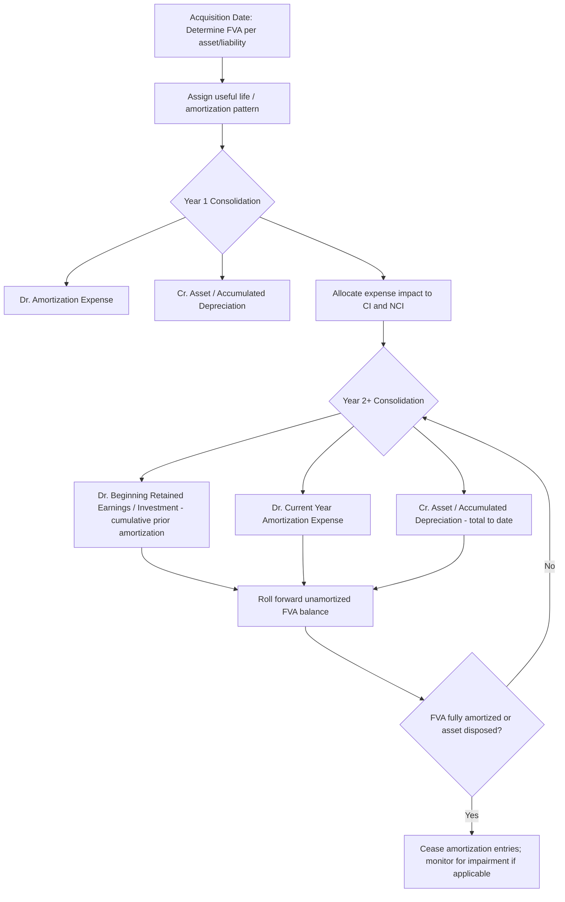

## Amortization of Acquisition-Date Fair Value Adjustments

### Conceptual Foundation

**Key Points**

- Under the acquisition method (IFRS 3 / ASC 805), the subsidiary's identifiable assets and liabilities are remeasured to fair value at the acquisition date, creating a difference between fair value and the subsidiary's pre-existing book value — the **fair value adjustment (FVA)**, sometimes called the **fair value increment/decrement** or **acquisition differential**.
- This differential is not recognized on the subsidiary's own books (its separate financial statements are unaffected). It exists only in the consolidation worksheet and must be tracked separately, period after period, for as long as the asset or liability remains on the consolidated books.
- Consolidation is not a one-time event. Each period after acquisition, the consolidated financial statements must reflect the **subsequent amortization, depreciation, or impairment** of these fair value adjustments, because the consolidated entity is deemed to have "acquired" the assets at fair value, not at the subsidiary's historical cost.
- Failure to amortize the FVA causes consolidated net income and asset carrying values to be systematically misstated relative to what a single combined economic entity's financial statements should show.

### Where Fair Value Adjustments Arise

**Key Points**

- Fair value adjustments typically arise on:
  - Inventory (FIFO/weighted-average step-up, usually flows through in the first period as goods are sold)
  - Property, plant & equipment (depreciable step-up/step-down)
  - Identifiable intangible assets not previously recognized by the subsidiary (customer relationships, technology, trade names, order backlog, non-compete agreements)
  - Long-term debt (fair value vs. book/face value, amortized via effective interest)
  - Goodwill (the residual — not amortized, but tested annually for impairment)
- Each identifiable adjustment has its own useful life, amortization pattern, and residual value assumptions, distinct from goodwill.

### The Basic Amortization Mechanics

At acquisition:

$$\text{FVA} = \text{Fair Value of Identifiable Net Asset} - \text{Book Value of Identifiable Net Asset}$$

Each period thereafter, the consolidation worksheet must record an amortization entry that:

1. Reduces the carrying amount of the FVA (a contra effect against the asset/liability)
2. Reduces (or increases, for decrements or below-market debt) consolidated net income
3. Is allocated between controlling and non-controlling interests (NCI) if the subsidiary is not wholly owned

**Standard elimination/adjustment entry (worksheet only, not in either entity's books):**

```plaintext
Dr. Amortization Expense (P&L)              XXX
    Cr. Accumulated Depreciation / Asset     XXX
        (or Cr. Intangible Asset directly)
```

For an FVA decrement (fair value below book value), the entry reverses — amortization *increases* consolidated income relative to the subsidiary's standalone figures.

### Example: Depreciable PP&E Step-Up

**Example**

Parent acquires 80% of Subsidiary on January 1, 20X1. At acquisition, Subsidiary's equipment has a book value of $400,000 and a fair value of $500,000, with a remaining useful life of 10 years, straight-line, no residual value.

- FVA on equipment = $500,000 − $400,000 = $100,000
- Annual amortization = $100,000 ÷ 10 years = $10,000 per year

Consolidation worksheet entry each year (20X1–20X10):

```plaintext
Dr. Depreciation Expense          10,000
    Cr. Equipment (net) / Accumulated Depreciation   10,000
```

**Effect:** Consolidated depreciation expense is $10,000 higher than the sum of Parent's and Subsidiary's separately reported depreciation, and the equipment's consolidated carrying amount is $10,000 lower each year than the unadjusted book values combined — until the FVA is fully amortized after 10 years.

### Example: Identifiable Intangible Asset (Customer Relationships)

**Example**

At acquisition, Subsidiary has unrecognized customer relationships valued at $2,000,000 with a useful life of 8 years, amortized straight-line (or, more precisely under IFRS 3/ASC 805, using a pattern reflecting the expected consumption of economic benefits — often an accelerated pattern tied to customer attrition curves).

Annual straight-line amortization:

$$\frac{\$2{,}000{,}000}{8} = \$250{,}000 \text{ per year}$$

Worksheet entry:

```plaintext
Dr. Amortization Expense – Customer Relationships    250,000
    Cr. Customer Relationship Intangible Asset       250,000
```

[Inference] In practice, many acquirers use an accelerated (e.g., declining-balance or attrition-based) pattern for customer relationship intangibles rather than straight-line, since customer attrition is typically front-loaded; the pattern chosen must reflect the expected consumption of economic benefits per IFRS 3/IAS 38 and ASC 805/350, and this determination is judgment-dependent and subject to auditor and valuation-specialist scrutiny.

### Example: Inventory Step-Up

Inventory FVAs are unique because they typically reverse within the first operating cycle (often the first 3–12 months) as the acquired inventory is sold to third parties, rather than being amortized over a multi-year life.

**Example**

Acquired inventory book value $300,000; fair value $350,000 (step-up of $50,000). If 60% of that inventory is sold in 20X1:

```plaintext
Dr. Cost of Goods Sold          30,000
    Cr. Inventory                30,000
```

($50,000 × 60% = $30,000 recognized as incremental COGS in the period of sale). The remaining $20,000 step-up stays on the consolidated balance sheet in inventory until sold.

### Example: Fair Value Adjustment on Long-Term Debt Assumed

If Subsidiary has outstanding bonds with a book (face) value of $1,000,000 but a fair value of $950,000 at acquisition (due to a below-market coupon relative to acquisition-date market rates), the $50,000 discount is amortized to interest expense over the remaining life of the debt using the **effective interest method**, increasing consolidated interest expense relative to Subsidiary's separately reported interest expense (since the bonds are recognized at fair value, i.e., a discount, on the consolidated books).

### Allocation Between Controlling and Non-Controlling Interests

**Key Points**

- When the subsidiary is partially owned, FVA amortization affects the NCI's share of consolidated net income, not just the controlling interest's share.
- FVAs are recognized in full (100%) under the acquisition method's full-goodwill approach (IFRS 3; ASC 805), regardless of the percentage acquired — this is because IFRS 3 and ASC 805 require **100% fair value remeasurement** of identifiable net assets even when less than 100% is acquired (with goodwill/gain on bargain purchase measured either as full-goodwill or partial-goodwill depending on the NCI measurement election under IFRS; ASC 805 requires full-goodwill only).
- Therefore, 100% of the annual FVA amortization reduces consolidated net income, and this reduction is allocated between the parent and NCI based on their respective ownership percentages.

**Example (continuing the equipment example, 80% ownership):**

|  | Amount |
| --- | --- |
| Annual FVA amortization (equipment) | $10,000 |
| Allocated to Controlling Interest (80%) | $8,000 |
| Allocated to NCI (20%) | $2,000 |

This allocation flows into the "Net Income Attributable to NCI" and "Net Income Attributable to Parent" lines on the consolidated income statement.

### Deferred Tax Considerations

**Key Points**

- Fair value adjustments typically create **temporary differences** for tax purposes, because most tax jurisdictions do not step up the tax basis of assets to fair value in a stock acquisition (asset acquisitions and certain elections, e.g., a Section 338(h)(10) election in the U.S., are exceptions).
- This means the FVA amortization has book-tax basis differences requiring **deferred tax liability (DTL)** recognition at acquisition (for FVA increments) or deferred tax asset (DTA) for decrements, per IAS 12 / ASC 740.
- As the FVA amortizes, the related deferred tax liability also reverses (is amortized) proportionally, reducing consolidated income tax expense relative to what would otherwise be reported.

**Example**

FVA on equipment = $100,000; applicable tax rate = 25%.

- Deferred tax liability at acquisition = $100,000 × 25% = $25,000
- As $10,000 of FVA amortizes annually, $2,500 of the DTL reverses annually:

```plaintext
Dr. Deferred Tax Liability       2,500
    Cr. Income Tax Expense       2,500
```

[Unverified] Specific jurisdictional tax treatment (e.g., whether a stock acquisition triggers any tax basis step-up) depends on local tax law and the structure of the transaction; the treatment above assumes the common case of no tax basis step-up in a stock acquisition.

### Impact on Consolidated Financial Statements Over Time

**Key Points**

- **Income Statement:** Each period, consolidated expenses (depreciation, amortization, COGS, interest) differ from the simple sum of Parent's and Subsidiary's separate expenses by the amount of FVA amortization (net of related deferred tax effects).
- **Balance Sheet:** The carrying amount of the adjusted asset/liability on the consolidated balance sheet equals Subsidiary's book value **plus** the unamortized portion of the FVA (for increments), declining each period until fully amortized or until the asset is disposed of/impaired.
- **Retained Earnings / Equity:** Cumulative FVA amortization since acquisition reduces consolidated retained earnings relative to the sum of Parent's and Subsidiary's separately reported retained earnings — this is a key reconciling item in preparing consolidation worksheets in subsequent years.
- **Equity Method Cross-Check:** If Parent accounts for its investment using the equity method on its separate books, the equity method income already reflects the Parent's share of FVA amortization (this is often called "amortization of excess" in equity method literature) — so under the equity method, Parent's Investment in Subsidiary account and Equity in Earnings of Subsidiary already net out this effect, and consolidation entries must eliminate the investment/equity-income accounts consistently with the worksheet FVA amortization to avoid double-counting.

### Consolidation Worksheet Mechanics Across Multiple Years

**Key Points**

- In **Year 1**, the FVA amortization entry is straightforward, dr. expense / cr. asset.
- In **Year 2 and beyond**, because the amortization from Year 1 already flowed through Retained Earnings (closing entries), the worksheet must include a **catch-up adjustment** to beginning Retained Earnings (or, under the equity method, to the Investment account) for the cumulative prior-year amortization, in addition to the current-year amortization entry. This is often structured as:

```plaintext
Dr. Retained Earnings – Beginning (or Investment in Sub)   [cumulative prior-year amortization]
Dr. Amortization Expense (P&L) – current year              [current-year amount]
    Cr. Asset / Accumulated Depreciation                    [total FVA remaining reduction]
```

- This ensures the consolidated balance sheet reflects the correct **cumulative** unamortized FVA balance at each reporting date, and the income statement reflects only the current period's amortization.

### Illustrative Diagram: FVA Amortization Flow Through Consolidation (svg_diagram)

<svg xmlns="http://www.w3.org/2000/svg" viewBox="0 0 900 480">
<text x="450" y="30" font-size="18" font-weight="bold" text-anchor="middle" fill="#1a1a1a">FVA Amortization Flow Through Consolidation (svg_diagram)</text>
<rect x="40" y="70" width="220" height="90" rx="8" fill="#e8f0fe" stroke="#4285f4" stroke-width="1.5" />
<text x="150" y="100" font-size="13" font-weight="bold" text-anchor="middle">Acquisition Date</text>
<text x="150" y="120" font-size="12" text-anchor="middle">Fair Value − Book Value</text>
<text x="150" y="138" font-size="12" text-anchor="middle">= FVA Recognized</text>
<rect x="340" y="70" width="220" height="90" rx="8" fill="#fef7e0" stroke="#f9ab00" stroke-width="1.5" />
<text x="450" y="100" font-size="13" font-weight="bold" text-anchor="middle">Each Subsequent Period</text>
<text x="450" y="120" font-size="12" text-anchor="middle">Amortize/Depreciate FVA</text>
<text x="450" y="138" font-size="12" text-anchor="middle">over remaining useful life</text>
<rect x="640" y="70" width="220" height="90" rx="8" fill="#e6f4ea" stroke="#34a853" stroke-width="1.5" />
<text x="750" y="100" font-size="13" font-weight="bold" text-anchor="middle">Consolidated F/S Impact</text>
<text x="750" y="120" font-size="12" text-anchor="middle">↑ Expense / ↓ Asset</text>
<text x="750" y="138" font-size="12" text-anchor="middle">↓ Net Income</text>
<line x1="260" y1="115" x2="335" y2="115" stroke="#5f6368" stroke-width="2" marker-end="url(#arrow)" />
<line x1="560" y1="115" x2="635" y2="115" stroke="#5f6368" stroke-width="2" marker-end="url(#arrow)" />
<rect x="40" y="210" width="820" height="110" rx="8" fill="#fce8e6" stroke="#ea4335" stroke-width="1.5" />
<text x="450" y="235" font-size="13" font-weight="bold" text-anchor="middle">Allocation of Amortization Impact</text>
<text x="450" y="258" font-size="12" text-anchor="middle">100% of FVA amortization reduces consolidated pre-allocation net income</text>
<line x1="300" y1="270" x2="300" y2="295" stroke="#5f6368" stroke-width="1.5" marker-end="url(#arrow)" />
<line x1="600" y1="270" x2="600" y2="295" stroke="#5f6368" stroke-width="1.5" marker-end="url(#arrow)" />
<text x="300" y="310" font-size="12" text-anchor="middle" font-weight="bold">→ Controlling Interest %</text>
<text x="600" y="310" font-size="12" text-anchor="middle" font-weight="bold">→ NCI %</text>
<rect x="40" y="350" width="820" height="100" rx="8" fill="#f3e8fd" stroke="#a142f4" stroke-width="1.5" />
<text x="450" y="375" font-size="13" font-weight="bold" text-anchor="middle">Deferred Tax Overlay</text>
<text x="450" y="398" font-size="12" text-anchor="middle">FVA increment → DTL recognized at acquisition; reverses proportionally as FVA amortizes</text>
<text x="450" y="418" font-size="12" text-anchor="middle">FVA decrement → DTA recognized at acquisition; reverses proportionally as FVA amortizes</text>
</svg>

### Illustrative Diagram: Multi-Year Worksheet Adjustment Logic



### Special Cases and Complications

**Key Points**

- **Non-depreciable assets (land):** FVA on land is not amortized; it remains on the consolidated books until the land is sold or impaired, at which point the FVA affects the gain/loss on disposal.
- **Goodwill:** Never amortized under current IFRS/US GAAP (post-2001/2004 transition); tested at least annually for impairment (or upon triggering events). [Note: Private companies electing the U.S. GAAP Private Company Council (PCC) alternative under ASU 2014-02 may amortize goodwill over 10 years or less — this is an accounting policy election available only to qualifying private entities, not public business entities.]
- **Impairment interaction:** If the FVA-adjusted asset becomes impaired, impairment testing is performed on the *consolidated* carrying amount (book value plus unamortized FVA), not the subsidiary's separate-book carrying amount.
- **Disposal of the underlying asset:** If the asset with an unamortized FVA is sold before full amortization, the remaining unamortized FVA balance is included in calculating the consolidated gain or loss on disposal (since the consolidated carrying amount differs from the subsidiary's separate-book carrying amount).
- **Step acquisitions:** In a business combination achieved in stages, only the FVA arising at the date control is obtained is subject to this amortization framework; previously held equity-method interests are remeasured to fair value at the date control is achieved, with any resulting gain/loss recognized in profit or loss.
- **Forensic accounting relevance:** Manipulation of useful-life assumptions, front-loading intangible amortization to inflate later-period income, or misclassifying FVAs as goodwill (to avoid amortization) are recurring red flags in forensic reviews of M&A-heavy consolidated entities. Auditors and forensic examiners scrutinize the purchase price allocation (PPA) report for aggressive valuation assumptions that shift value into non-amortizable goodwill.

### Consolidated Worksheet Summary Table Approach

| FVA Item | Initial Amount | Life/Pattern | Annual Amortization | Deferred Tax Effect | NCI Allocation Required? |
| --- | --- | --- | --- | --- | --- |
| Inventory step-up | $50,000 | Until sold (≈1 period) | Full amount at sale | Yes (temporary) | Yes, if NCI exists |
| Equipment step-up | $100,000 | 10 yrs, straight-line | $10,000 | Yes | Yes |
| Customer relationships | $2,000,000 | 8 yrs, attrition pattern | Varies (front-loaded) | Yes | Yes |
| Land | $75,000 | Not amortized | $0 (until disposal) | Yes (on disposal) | Yes, on disposal |
| Debt fair value discount | $50,000 | Remaining bond life, effective interest | Increasing pattern | Yes | Yes |
| Goodwill | Residual | Indefinite (impairment only) | $0 | Generally no DTL (permanent difference in most jurisdictions) | Depends on full vs. partial goodwill method |

### Conclusion

**Conclusion**

Amortization of acquisition-date fair value adjustments is the mechanism by which consolidated financial statements maintain internal consistency with the acquisition method's core premise: identifiable assets and liabilities are recognized at fair value as of the acquisition date, and that fair value basis — not the subsidiary's historical cost — governs subsequent expense recognition in consolidation. This requires per-asset tracking of unamortized FVA balances, period-by-period worksheet adjustments (including cumulative catch-up entries for prior years), deferred tax recognition and reversal, and allocation of the income statement impact between controlling and non-controlling interests. Because these adjustments never appear on the subsidiary's own books, they exist purely as a consolidation-level construct that must be independently maintained, audited, and reconciled for the life of each acquired asset or liability.

**Related Topics**

- Purchase price allocation (PPA) and valuation methodologies for identifiable intangibles
- Goodwill impairment testing (IAS 36 / ASC 350)
- Equity method "amortization of excess" and its reconciliation to consolidation worksheets
- Deferred tax accounting for business combinations (IAS 12 / ASC 740)
- Non-controlling interest measurement: full-goodwill vs. partial-goodwill methods
- Step acquisitions and loss of control/remeasurement accounting
- Bargain purchase gains and their consolidated income statement treatment
- Intercompany elimination entries subsequent to acquisition
- Push-down accounting considerations
- Forensic red flags in purchase price allocations and post-acquisition earnings management