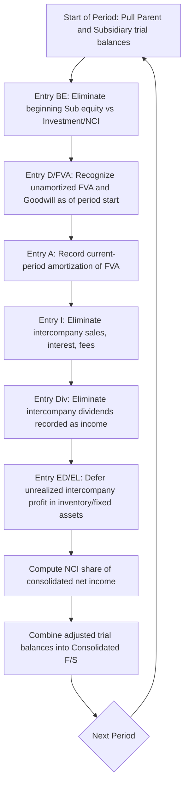

## Consolidation Worksheet Procedures in Subsequent Periods


### Conceptual Foundation

**Key Points**

- The consolidation worksheet is not part of either the parent's or subsidiary's general ledger; it is a **memorandum device** used each reporting period to combine the two entities' separately maintained books into a single set of consolidated financial statements.
- In the **first period** after acquisition, worksheet entries are relatively simple: eliminate the investment against subsidiary equity, recognize fair value adjustments (FVAs) and goodwill, and eliminate intercompany transactions.
- In **subsequent periods** (Year 2 onward), the worksheet must additionally account for the fact that each prior period's elimination and adjustment entries were **not permanently recorded** in either entity's books — they must be reconstructed and updated every period, with adjustments made for the cumulative effects that have already flowed through retained earnings (or the Investment account, if the equity method is used) since acquisition.
- This "starting over each period" characteristic is the central complexity of subsequent-period consolidation and is often called the need for **basic elimination entries (BE)** and **amortization/adjustment entries (AJE)** to be re-derived, layered with a **cumulative catch-up component**.

### Two Parent-Side Accounting Methods and Their Effect on the Worksheet

**Key Points**

- The mechanics of the subsequent-period worksheet differ depending on how the Parent accounts for its investment in the Subsidiary on its own separate books:
  1. **Cost method** — Parent records dividend income when received; Investment account remains at original cost (rare in practice under current US GAAP for consolidation purposes, but still tested in some curricula).
  2. **Equity method** — Parent recognizes its share of Subsidiary's net income (adjusted for FVA amortization and intercompany profit elimination) as "Equity in Earnings of Subsidiary," and the Investment account is adjusted each period to reflect Parent's share of Subsidiary's equity changes.
  3. **Partial equity method** — Parent recognizes its share of Subsidiary's *reported* net income only, without adjusting for FVA amortization or intercompany eliminations (a simplified/hybrid approach sometimes used pedagogically).
- Regardless of method, the **consolidated financial statements must be identical** — the worksheet entries simply differ in how much correction is needed, because the parent's pre-consolidation books already contain more or less of the "right" answer depending on the method used.

### The Standard Worksheet Entries in Subsequent Periods

**Key Points**

Most textbooks structure the subsequent-period worksheet using a sequence of standard entries, commonly labeled:

| Entry | Common Label | Purpose |
| --- | --- | --- |
| Entry BE | Basic Elimination Entry | Eliminates the Investment account and Subsidiary's beginning equity balances (Common Stock, APIC, Beginning Retained Earnings) |
| Entry D (or FVA) | Fair Value/Differential Allocation | Recognizes the unamortized FVA balances and goodwill as of the beginning of the current period |
| Entry A (or AJE) | Amortization Entry | Records current-period amortization/depreciation of FVAs |
| Entry I | Intercompany Income Elimination | Eliminates intercompany sales, profits in ending inventory, intercompany interest, management fees, etc. |
| Entry D (Dividends) | Dividend Elimination | Eliminates intercompany dividends recorded as income by Parent (if applicable) |
| Entry ED / EL | Excess Depreciation/Deferral of Intercompany Profit | Defers unrealized intercompany profit in ending inventory/fixed assets |

[Inference] Exact entry labels (BE, D, A, I, etc.) vary by textbook and instructor convention — some texts use "Entry S" for stockholders' equity elimination and "Entry A" for the full FVA/goodwill recognition combined with amortization — but the underlying substance (eliminate investment vs. equity; recognize/amortize FVA; eliminate intercompany items) is consistent across all standard treatments of IFRS 3/ASC 805 consolidation.

### Entry BE — Basic Elimination Entry (Beginning-of-Period Balances)

**Example**

Parent owns 80% of Subsidiary. At the beginning of Year 3, Subsidiary's equity consists of: Common Stock $200,000; APIC $50,000; Retained Earnings $300,000 (beginning of Year 3 balance).

```plaintext
Dr. Common Stock — Subsidiary            200,000
Dr. APIC — Subsidiary                     50,000
Dr. Retained Earnings — Subsidiary (beg.) 300,000
    Cr. Investment in Subsidiary                    440,000  [80% × 550,000]
    Cr. NCI (beginning balance)                      110,000  [20% × 550,000]
```

This entry eliminates the subsidiary's beginning-of-period stockholders' equity against the Investment account (Parent's share) and establishes the NCI's beginning equity claim. It is re-derived fresh every period using that period's beginning equity balances — it is never "carried forward" as a permanent ledger entry.

### Entry D/FVA — Recognizing Unamortized Differential and Goodwill

**Example**

At acquisition, total FVA on equipment was $100,000 (10-year life) and goodwill was $150,000. By the beginning of Year 3 (i.e., after 2 full years of amortization at $10,000/year), unamortized FVA = $100,000 − $20,000 = $80,000.

```plaintext
Dr. Equipment (FVA, unamortized as of beginning of Year 3)   80,000
Dr. Goodwill                                                 150,000
    Cr. Investment in Subsidiary                                         X
    Cr. NCI                                                              Y
```

The split between Investment and NCI depends on whether the FVA/goodwill was allocated 100% (full fair value method) — the Investment and NCI credits here represent the "excess" of fair value over book value at acquisition, apportioned by ownership percentage, adjusted for cumulative amortization to date.

### Entry A — Current-Period Amortization

**Example**

Continuing the illustration, Year 3 current-period amortization of the equipment FVA:

```plaintext
Dr. Depreciation Expense              10,000
    Cr. Equipment (net)                        10,000
```

This is the *current-year-only* amortization; the prior two years' cumulative amortization ($20,000) is already reflected in the reduced "unamortized FVA" figure used in Entry D above — this avoids double-counting.

### Entry I — Intercompany Transaction Elimination

**Example**

Subsidiary sold inventory to Parent during the year at a markup; $40,000 of that inventory remains unsold in Parent's ending inventory, with a 25% gross margin embedded.

Unrealized profit = $40,000 × 25% = $10,000

```plaintext
Dr. Cost of Goods Sold (or Sales)          [intercompany sales amount]
    Cr. Cost of Goods Sold                             [intercompany sales amount]
    (eliminates intercompany sales/COGS matching)

Dr. Cost of Goods Sold                     10,000
    Cr. Inventory (ending)                          10,000
    (defers unrealized profit until inventory is sold to outside party)
```

If the intercompany sale was a **downstream sale** (Parent to Subsidiary), 100% of the unrealized profit elimination is absorbed by the Parent's retained earnings/investment; if **upstream** (Subsidiary to Parent), the elimination affects the NCI's share proportionally as well as the Parent's.

### Cumulative Catch-Up Logic — Why It's Needed Every Period

**Key Points**

- Because none of the BE/D/A/I entries are permanently recorded in either company's ledgers, **each new period's worksheet must reconstruct the cumulative effect from acquisition date through the beginning of the current period**, then layer on the current period's activity.
- This is why Entry D always uses the **unamortized balance as of the beginning of the current period** (not the original acquisition-date amount), and why Entry BE always uses **beginning-of-period equity balances** — retained earnings at the start of the year already reflects all prior years' subsidiary income, dividends, and (if equity method) prior FVA amortization catch-ups recorded by Parent.
- Under the **full equity method**, Parent's own books already reflect cumulative FVA amortization and intercompany eliminations through the Investment account and Retained Earnings — so Entry BE and Entry D, when properly derived, will **fully eliminate the Investment account to zero** (assuming no other basis differences), and the worksheet entries essentially "unwind" what Parent already recorded.
- Under the **cost method** or **partial equity method**, Parent's separate books do *not* reflect this cumulative effect, so the worksheet must independently reconstruct and inject the full multi-year cumulative adjustment — this typically means Entry D and Entry A carry a **larger, catch-up-inclusive adjustment to beginning Retained Earnings** to bring the consolidated figures to the correct cumulative position.

### Illustrative Diagram: Sequence of Worksheet Entries Each Period



### Worksheet Layout — Column Structure

**Key Points**

A typical consolidation worksheet is organized in columns:

| Account | Parent | Subsidiary | Debit Adjustments | Credit Adjustments | Consolidated |
| --- | --- | --- | --- | --- | --- |
| Sales Revenue | XXX | XXX | (Entry I) |  | XXX |
| COGS | XXX | XXX | (Entry I, ED) |  | XXX |
| Depreciation Expense | XXX | XXX | (Entry A) |  | XXX |
| Equity in Earnings of Sub | XXX | — | (Entry BE reversal) |  | 0 |
| Investment in Subsidiary | XXX | — |  | (Entry BE, D) | 0 |
| Common Stock — Sub | — | XXX | (Entry BE) |  | 0 |
| Retained Earnings — Sub (beg.) | — | XXX | (Entry BE) |  | 0 |
| Goodwill | — | — | (Entry D) |  | XXX |
| NCI | — | — |  | (Entry BE, D, share of NI) | XXX |

The worksheet nets each row across the adjustment columns; only the "Consolidated" column figures are used to prepare the actual consolidated financial statements.

### Elimination of Equity in Earnings of Subsidiary (Equity Method Parents)

**Example**

Under the full equity method, Parent recorded during Year 3:

```plaintext
Dr. Investment in Subsidiary        X
    Cr. Equity in Earnings of Subsidiary   X
```

This must be reversed on the worksheet, since "Equity in Earnings of Subsidiary" is not a consolidated income statement line item — it is replaced by consolidating Subsidiary's actual revenues and expenses line-by-line:

```plaintext
Dr. Equity in Earnings of Subsidiary       X
    Cr. Investment in Subsidiary                    X
```

This reversal is typically embedded within Entry BE or presented as a separate "Entry ES" depending on textbook convention.

### Non-Controlling Interest Roll-Forward Each Period

**Key Points**

- NCI on the consolidated balance sheet is not static — it must be rolled forward each period:

$$\text{NCI}_{\text{ending}} = \text{NCI}_{\text{beginning}} + \text{NCI share of consolidated net income} - \text{NCI share of dividends declared by Subsidiary}$$

- "NCI share of consolidated net income" is based on Subsidiary's **reported net income, adjusted for FVA amortization and any upstream intercompany profit elimination attributable to Subsidiary** — not simply Subsidiary's unadjusted net income.
- This roll-forward must be performed and disclosed every period; errors here are a common source of consolidated balance sheet imbalances in practice problems and real audits alike.

### Illustrative Diagram: NCI Roll-Forward and Income Allocation (svg_diagram)

<svg xmlns="http://www.w3.org/2000/svg" viewBox="0 0 880 380">
<text x="440" y="30" font-size="18" font-weight="bold" text-anchor="middle" fill="#1a1a1a">NCI Roll-Forward and Income Allocation (svg_diagram)</text>
<rect x="40" y="70" width="240" height="80" rx="8" fill="#e8f0fe" stroke="#4285f4" stroke-width="1.5" />
<text x="160" y="100" font-size="13" font-weight="bold" text-anchor="middle">Subsidiary Reported NI</text>
<text x="160" y="120" font-size="12" text-anchor="middle">(from Sub's own books)</text>
<rect x="330" y="70" width="240" height="80" rx="8" fill="#fef7e0" stroke="#f9ab00" stroke-width="1.5" />
<text x="450" y="100" font-size="13" font-weight="bold" text-anchor="middle">Adjust for FVA Amort.</text>
<text x="450" y="120" font-size="12" text-anchor="middle">and Intercompany Elims</text>
<rect x="620" y="70" width="220" height="80" rx="8" fill="#e6f4ea" stroke="#34a853" stroke-width="1.5" />
<text x="730" y="100" font-size="13" font-weight="bold" text-anchor="middle">Adjusted Consolidated NI</text>
<text x="730" y="120" font-size="12" text-anchor="middle">from Subsidiary</text>
<line x1="280" y1="110" x2="325" y2="110" stroke="#5f6368" stroke-width="2" marker-end="url(#arrow2)" />
<line x1="570" y1="110" x2="615" y2="110" stroke="#5f6368" stroke-width="2" marker-end="url(#arrow2)" />
<line x1="730" y1="150" x2="730" y2="185" stroke="#5f6368" stroke-width="2" marker-end="url(#arrow2)" />
<text x="730" y="205" font-size="12" text-anchor="middle" font-weight="bold">× NCI %</text>
<rect x="620" y="220" width="220" height="60" rx="8" fill="#fce8e6" stroke="#ea4335" stroke-width="1.5" />
<text x="730" y="245" font-size="13" font-weight="bold" text-anchor="middle">NCI Share of NI</text>
<text x="730" y="263" font-size="12" text-anchor="middle">(current period)</text>
<rect x="40" y="310" width="800" height="60" rx="8" fill="#f3e8fd" stroke="#a142f4" stroke-width="1.5" />
<text x="440" y="335" font-size="13" font-weight="bold" text-anchor="middle">NCI Ending Balance = NCI Beginning + NCI Share of NI − NCI Share of Dividends</text>
<text x="440" y="355" font-size="11" text-anchor="middle">Rolled forward and re-derived every consolidation period</text>
</svg>

### Dividends Elimination

**Example**

Subsidiary declares and pays $50,000 in dividends during the year; Parent (80% owner) recorded $40,000 as dividend income (cost method) or as a reduction of the Investment account (equity method).

Cost method worksheet entry:

```plaintext
Dr. Dividend Income                40,000
    Cr. Dividends Declared — Subsidiary       40,000
```

The remaining 20% ($10,000) reduces the NCI balance directly, since dividends paid to NCI shareholders are external cash distributions from the consolidated entity's perspective, reducing NCI equity.

### Common Errors and Review Points in Subsequent-Period Worksheets

**Key Points**

- Using the **acquisition-date** FVA/goodwill amount in Entry D instead of the **unamortized balance as of the beginning of the current period** — this double-counts prior years' amortization.
- Forgetting to reverse "Equity in Earnings of Subsidiary" when Parent uses the full equity method, resulting in double-counting of Subsidiary's income in consolidated net income.
- Failing to update the **beginning Retained Earnings elimination** for cumulative NCI and FVA effects when Parent uses the cost or partial equity method, causing the balance sheet to be out of balance in Year 2 and beyond.
- Applying intercompany profit elimination percentages incorrectly for upstream vs. downstream transactions — downstream unrealized profit elimination affects only Parent's/controlling retained earnings, while upstream elimination is shared proportionally with NCI.
- Omitting the current-period **NCI share of net income** as a separate line on the consolidated income statement (required presentation under ASC 810 / IFRS 10 — consolidated net income must be split between "attributable to Parent" and "attributable to NCI").

### Conclusion

**Conclusion**

Consolidation worksheet procedures in subsequent periods extend the acquisition-date logic of the acquisition method into every future reporting period, because none of the elimination, fair value recognition, or intercompany adjustment entries are permanently booked by either the parent or the subsidiary. Each period requires reconstructing the cumulative effect of prior periods' equity elimination (Entry BE), unamortized fair value adjustments and goodwill (Entry D), current-period amortization (Entry A), and intercompany eliminations (Entry I and related entries), with the precise mechanics depending on whether the parent applies the cost, equity, or partial equity method on its separate books. The non-controlling interest must be rolled forward each period, and consolidated net income must be properly split between controlling and non-controlling interests. Mastery of this topic requires fluency in tracing how prior-period effects embed themselves in beginning retained earnings and the Investment account, and in recognizing that the consolidated financial statements — unlike the worksheet itself — are the only output that persists and is reported externally.

**Related Topics**

- Equity method mechanics and "amortization of excess" reconciliation
- Intercompany inventory, fixed asset, and bond transaction eliminations
- Non-controlling interest measurement and presentation (ASC 810 / IFRS 10)
- Push-down accounting vs. traditional consolidation worksheet approach
- Consolidated statement of cash flows preparation from worksheet outputs
- Step acquisitions and changes in ownership percentage subsequent to control
- Deconsolidation and loss of control accounting
- Variable interest entities (VIEs) and consolidation under ASC 810
- Foreign currency translation adjustments in multinational consolidation worksheets
- Forensic red flags in recurring consolidation adjustments and NCI misstatement