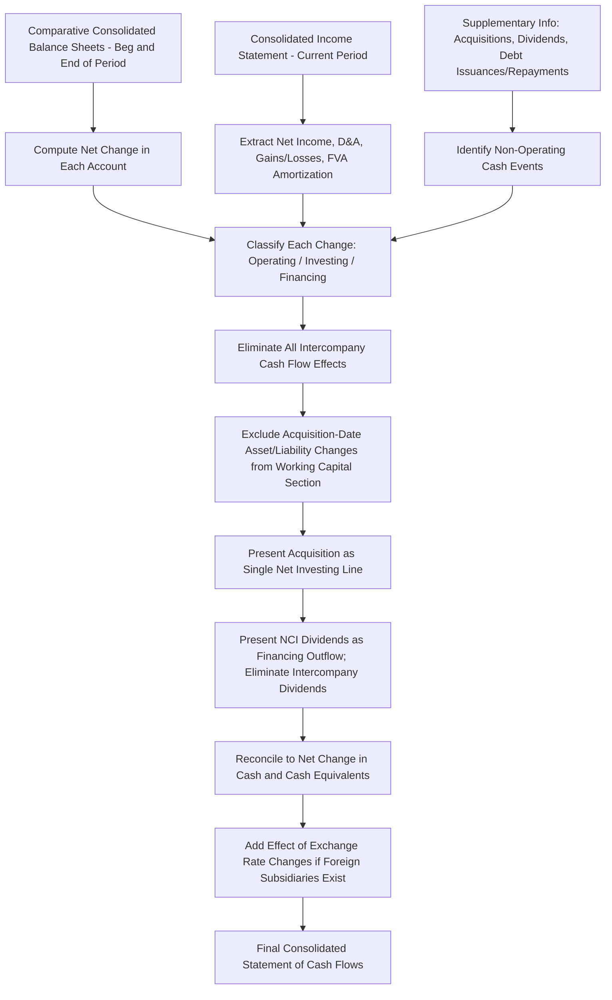

## Consolidated Statement of Cash Flows


### Conceptual Foundation

**Key Points**

- The consolidated statement of cash flows (CSCF) reports the cash inflows and outflows of the **economic entity as a whole** (parent plus all consolidated subsidiaries), not the cash flows of the parent alone or the subsidiary alone.
- Unlike the consolidated income statement and balance sheet, the CSCF is generally **not prepared directly from a consolidation worksheet of trial balances**. Instead, it is most commonly derived indirectly from the **consolidated balance sheet (comparative), consolidated income statement, and supplementary information about specific transactions** (acquisitions, dividends, intercompany financing) during the period.
- All intercompany cash flows — intercompany loans, intercompany interest and dividend payments, intercompany sales settled in cash — must be **fully eliminated** in the consolidated statement, because they represent cash movement within the single reporting entity, not cash flows with parties outside the consolidated group.
- The statement is organized into three sections under both IFRS (IAS 7) and US GAAP (ASC 230): **Operating, Investing, and Financing activities**, with an ending reconciliation to the change in cash and cash equivalents.

### Two Preparation Methods: Direct vs. Indirect

**Key Points**

- **Indirect method** (overwhelmingly the most common in practice): begins with **consolidated net income** (including NCI's share) and adjusts for non-cash items, changes in working capital, and reclassifies investing/financing items embedded in net income.
- **Direct method**: presents major classes of gross cash receipts and cash payments (cash collected from customers, cash paid to suppliers, etc.) for operating activities; permitted under both IFRS and US GAAP but rarely used because it requires a reconciliation to the indirect method figures to be disclosed anyway (under US GAAP) and is more costly to prepare.
- [Unverified] Preference for the indirect method is a market practice observation rather than a strict rule under either framework — both IAS 7 and ASC 230 permit either method, but the indirect method dominates because it can be derived largely from existing balance sheet and income statement data without separately tracking gross cash receipts/payments by category.

### Why the CSCF Cannot Simply Aggregate Parent and Subsidiary Cash Flow Statements

**Key Points**

- If Parent and Subsidiary each independently prepared a cash flow statement, simply adding the two together would **misstate** the consolidated result because:
  1. Intercompany cash flows (loans, interest, dividends, intercompany sales proceeds) would appear as real inflows/outflows to each entity separately, but they **net to zero** for the consolidated entity and must be eliminated.
  2. NCI's share of Subsidiary's net income requires adjustment because consolidated net income (the typical starting point under the indirect method) includes **100% of Subsidiary's income**, not just Parent's share.
  3. Dividends paid by Subsidiary to NCI shareholders are a **financing outflow** of the consolidated entity (cash truly leaving the group to outside parties), whereas dividends paid by Subsidiary to Parent are intercompany and must be eliminated entirely.
  4. Fair value adjustment (FVA) amortization and goodwill impairment — consolidation-only, worksheet-level entries with no cash effect — must be added back in the operating section as non-cash items, just like depreciation and amortization on Parent's or Subsidiary's own books.

### Structure of the Consolidated Statement of Cash Flows (Indirect Method)

**Key Points**

**Operating Activities**

```plaintext
Consolidated Net Income (including NCI's share)              XXX
Add: Depreciation and Amortization (incl. FVA amortization)  XXX
Add: Goodwill Impairment Loss                                 XXX
Add/Less: (Gain)/Loss on Sale of Assets                       XXX
Add/Less: Equity in Earnings of Equity-Method Investees, net of dividends received  XXX
Changes in Operating Working Capital (excluding intercompany balances):
  (Increase)/Decrease in Accounts Receivable (external only)  XXX
  (Increase)/Decrease in Inventory (external only)             XXX
  Increase/(Decrease) in Accounts Payable (external only)      XXX
= Net Cash Provided by Operating Activities                   XXX
```

**Investing Activities**

```plaintext
Purchase of Property, Plant & Equipment (Parent + Sub, external only)   (XXX)
Proceeds from Sale of PP&E                                               XXX
Cash Paid for Acquisition of Subsidiary, net of cash acquired            (XXX)
Purchase of Investments (external only)                                  (XXX)
= Net Cash Used in Investing Activities                                  (XXX)
```

**Financing Activities**

```plaintext
Proceeds from Issuance of Long-Term Debt (external only)                 XXX
Repayment of Long-Term Debt (external only)                              (XXX)
Dividends Paid to Parent's Shareholders                                  (XXX)
Dividends Paid to Non-Controlling Interest Shareholders                  (XXX)
Proceeds from/(Payments for) Changes in Ownership Interest Not Resulting in Loss of Control  XXX
= Net Cash Used in/Provided by Financing Activities                      (XXX)
```

```plaintext
Net Increase/(Decrease) in Cash and Cash Equivalents                     XXX
Cash and Cash Equivalents, Beginning of Period                           XXX
Cash and Cash Equivalents, End of Period                                 XXX
```

### Key Elimination Items Unique to Consolidated Cash Flow Statements

**Key Points**

- **Intercompany dividends:** Dividends from Subsidiary to Parent are eliminated entirely (100%) — they are internal cash movements. Only dividends paid by Subsidiary to **outside NCI shareholders** appear as a financing outflow on the CSCF.
- **Intercompany loans and interest:** Cash advanced by Parent to Subsidiary (or vice versa) as an intercompany loan, and any interest paid/received on it, are eliminated in full — no net cash flow effect for the consolidated entity, even though each entity separately recorded a real cash movement.
- **Intercompany sales of goods/services:** Cash collected from and paid to affiliates for intercompany inventory or asset transfers is eliminated; only cash flows with parties **external** to the consolidated group are reported.
- **Acquisition of a subsidiary during the period:** Reported as a single investing activity line — "cash paid for acquisition, net of cash acquired" — rather than by grossing up each individual asset and liability acquired. The subsidiary's cash balance at acquisition is **netted against** the purchase price paid, since the acquired cash effectively "arrives with" the acquisition.

### Example: Acquisition During the Period — Net Cash Paid

**Example**

Parent acquires 100% of Subsidiary for $800,000 cash. At acquisition, Subsidiary had $50,000 of cash and cash equivalents on hand.

$$\text{Cash Paid for Acquisition, Net of Cash Acquired} = \$800{,}000 - \$50{,}000 = \$750{,}000$$

This $750,000 net figure is the amount reported in the investing activities section — not the gross $800,000 purchase price — because the $50,000 of cash acquired is now part of the consolidated entity's own cash balance and did not "leave" the consolidated group.

Additionally, in a worksheet approach to preparing the statement, all *other* assets acquired (PP&E, inventory, receivables, goodwill) and liabilities assumed are **excluded from the individual working capital change calculations** in the operating section for that year, since their initial recognition arose from the acquisition (an investing activity), not from ongoing operations.

### Example: NCI Dividends as a Financing Outflow

**Example**

Subsidiary (80%-owned) declares and pays total dividends of $100,000 during the year.

- Dividends to Parent (80% × $100,000 = $80,000): **eliminated entirely** — internal cash movement, no effect on consolidated CSCF.
- Dividends to NCI (20% × $100,000 = $20,000): appears as:

```plaintext
Financing Activities:
Dividends Paid to Non-Controlling Interest         (20,000)
```

This is the only portion of Subsidiary's dividend that represents a real cash outflow to parties outside the consolidated group.

### Example: Reconciling Consolidated Net Income to Cash Flow — Adding Back FVA Amortization and NCI

**Example**

Consolidated net income for the year = $500,000 (this already includes 100% of Subsidiary's adjusted net income, split between Parent and NCI attribution on the income statement, but the *total* of $500,000 is the starting point for the indirect-method cash flow reconciliation).

```plaintext
Operating Activities:
Consolidated Net Income                              500,000
Add: Depreciation Expense (Parent + Sub)              120,000
Add: Amortization of FVA (equipment, intangibles)      35,000
Add: Goodwill Impairment Loss                          10,000
Less: Gain on Sale of Equipment                        (8,000)
...
```

Note that consolidated net income already includes NCI's allocated share; no separate "add back for NCI" line is needed at the top because the starting point is **total** consolidated net income (attributable to both controlling and non-controlling interests combined), which matches the total net cash generated by consolidated operations.

### Working Capital Changes — Excluding Intercompany Balances

**Key Points**

- When computing changes in accounts receivable, accounts payable, and inventory for the operating activities section, any **intercompany receivable/payable balances** (e.g., Parent's receivable from Subsidiary for an intercompany loan or unsettled intercompany sale) must be **excluded**, since these balances are eliminated on the consolidated balance sheet and have no external cash flow effect.
- Practically, this means the preparer should use the **already-eliminated (consolidated) balance sheet figures** for receivables, payables, and inventory when computing period-over-period changes — not the sum of Parent's and Subsidiary's separate, pre-elimination balances.

### Foreign Subsidiaries — Currency Translation Effects

**Key Points**

- For consolidated groups with foreign subsidiaries whose functional currency differs from the parent's presentation currency, the CSCF must reflect cash flows **translated at appropriate exchange rates** (typically the exchange rate in effect at the time of each cash flow, or a weighted-average rate as a practical expedient), consistent with IAS 21 / ASC 830.
- The effect of exchange rate changes on cash and cash equivalents held in foreign currency is presented as a **separate reconciling line**, not commingled within operating, investing, or financing activities:

```plaintext
Effect of Exchange Rate Changes on Cash and Cash Equivalents        XXX
```

- [Unverified] The precise mechanics of translating cash flow statement line items (average rate vs. spot rate for specific transactions) can vary based on company policy and the nature of the transaction; both IAS 21 and ASC 830 allow the use of a weighted-average rate as a practical approximation, provided it does not produce materially different results from using actual transaction-date rates.

### Illustrative Diagram: Building the Consolidated CSCF from Consolidated F/S Data



### Illustrative Diagram: Elimination Logic for Intercompany Cash Items (svg_diagram)

<svg xmlns="http://www.w3.org/2000/svg" viewBox="0 0 900 420">
<text x="450" y="30" font-size="18" font-weight="bold" text-anchor="middle" fill="#1a1a1a">Intercompany Cash Flow Elimination Logic (svg_diagram)</text>
<rect x="40" y="70" width="250" height="70" rx="8" fill="#e8f0fe" stroke="#4285f4" stroke-width="1.5" />
<text x="165" y="100" font-size="13" font-weight="bold" text-anchor="middle">Parent Pays Cash</text>
<text x="165" y="120" font-size="12" text-anchor="middle">to Subsidiary (loan/purchase)</text>
<rect x="610" y="70" width="250" height="70" rx="8" fill="#e8f0fe" stroke="#4285f4" stroke-width="1.5" />
<text x="735" y="100" font-size="13" font-weight="bold" text-anchor="middle">Subsidiary Receives Cash</text>
<text x="735" y="120" font-size="12" text-anchor="middle">from Parent</text>
<line x1="290" y1="105" x2="605" y2="105" stroke="#5f6368" stroke-width="2" marker-end="url(#arrow3)" stroke-dasharray="6,4" />
<text x="450" y="95" font-size="12" text-anchor="middle" fill="#5f6368">Internal transfer only</text>
<rect x="250" y="180" width="400" height="80" rx="8" fill="#fce8e6" stroke="#ea4335" stroke-width="1.5" />
<text x="450" y="210" font-size="13" font-weight="bold" text-anchor="middle">Consolidated Entity View</text>
<text x="450" y="230" font-size="12" text-anchor="middle">Cash moved between two "pockets"</text>
<text x="450" y="248" font-size="12" text-anchor="middle">of the SAME economic entity → Net Effect = $0</text>
<rect x="80" y="300" width="330" height="90" rx="8" fill="#e6f4ea" stroke="#34a853" stroke-width="1.5" />
<text x="245" y="325" font-size="13" font-weight="bold" text-anchor="middle">External Cash Flows</text>
<text x="245" y="345" font-size="12" text-anchor="middle">Customer receipts, supplier</text>
<text x="245" y="362" font-size="12" text-anchor="middle">payments, NCI dividends</text>
<text x="245" y="379" font-size="12" text-anchor="middle" font-weight="bold">→ REPORTED on CSCF</text>
<rect x="480" y="300" width="330" height="90" rx="8" fill="#fef7e0" stroke="#f9ab00" stroke-width="1.5" />
<text x="645" y="325" font-size="13" font-weight="bold" text-anchor="middle">Intercompany Cash Flows</text>
<text x="645" y="345" font-size="12" text-anchor="middle">Loans, interest, dividends,</text>
<text x="645" y="362" font-size="12" text-anchor="middle">sales proceeds between affiliates</text>
<text x="645" y="379" font-size="12" text-anchor="middle" font-weight="bold">→ ELIMINATED, not reported</text>
</svg>

### Non-Cash Investing and Financing Disclosures

**Key Points**

- Significant non-cash transactions related to the consolidated group — such as issuing stock to effect an acquisition, converting debt to equity, or acquiring an asset via a capital/finance lease — must be disclosed separately (typically in a supplementary schedule or footnote), since they do not appear within the body of the CSCF itself but materially affect the consolidated entity's investing/financing position.
- **Example:** If Parent acquires Subsidiary for $500,000 paid entirely in Parent's common stock (no cash consideration), **none of the acquisition appears in the investing activities section** of the CSCF — it is disclosed as a non-cash investing and financing activity, since no cash changed hands.

### Common Errors and Review Points

**Key Points**

- Failing to eliminate intercompany dividends, loans, or interest, causing the consolidated statement to overstate both operating/financing inflows and outflows by amounts that should net to zero.
- Reporting the **gross** acquisition price in investing activities without netting the cash acquired, overstating the true net cash outflow from the acquisition.
- Treating 100% of Subsidiary's dividends as a financing outflow rather than isolating only the portion paid to NCI.
- Including acquisition-date opening balances of receivables, payables, and inventory (acquired via the business combination) in the ordinary working-capital-change calculations, which distorts operating cash flow for the period of acquisition — these should be excluded from operating activities and instead reflected within the single net "cash paid for acquisition" investing line.
- Omitting the "effect of exchange rate changes on cash" reconciling line for groups with foreign subsidiaries, causing the statement to fail to reconcile to the actual change in the cash balance.
- Forgetting that consolidated net income (the typical starting point) already includes 100% of Subsidiary's net income (both controlling and NCI portions) — no additional adjustment for "NCI's share" is needed at the top of the reconciliation, unlike on the income statement where the split is explicitly presented.

### Conclusion

**Conclusion**

The consolidated statement of cash flows presents the cash inflows and outflows of the parent and all consolidated subsidiaries as a single economic entity, requiring the complete elimination of all intercompany cash movements — loans, interest, dividends, and intercompany sales settlements — so that only cash flows with parties external to the group are reported. Because the statement is derived primarily from comparative consolidated balance sheets, the consolidated income statement, and supplementary transaction data (rather than directly from a period-by-period consolidation worksheet), preparers must carefully isolate the cash effects of acquisitions (reported net of cash acquired, as a single investing line), correctly classify NCI dividends as an external financing outflow while eliminating intercompany dividends entirely, and exclude acquisition-date balance sheet changes from ordinary working capital reconciliations. For groups with foreign operations, a separate reconciling line captures the effect of exchange rate changes on cash balances. Mastery of this topic requires understanding that the CSCF, unlike the balance sheet and income statement, is built from a fundamentally different data assembly process — one centered on tracing real cash movement rather than eliminating equity and income accounts on a worksheet.

**Related Topics**

- Indirect vs. direct method mechanics and required reconciliation disclosures
- Acquisition accounting: "cash paid, net of cash acquired" computation in complex, multi-tranche deals
- Foreign currency translation (IAS 21 / ASC 830) and its interaction with the cash flow statement
- Equity method investees and their treatment in the operating activities section
- Non-cash investing and financing activity disclosures
- Segment-level cash flow reporting for multi-subsidiary conglomerates
- Cash flow statement analysis for forensic detection of earnings quality issues (e.g., operating cash flow vs. net income divergence)
- Statement of cash flows for VIEs and special purpose entities
- Discontinued operations presentation within the consolidated cash flow statement
- Free cash flow computation and its use in financial statement analysis of consolidated groups