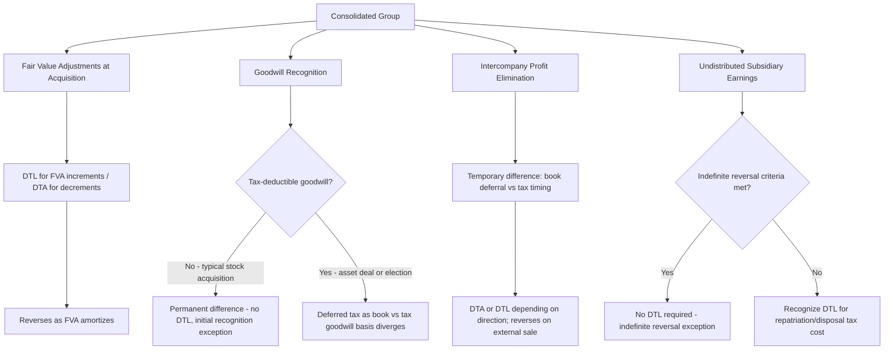

## Consolidated Income Tax Provision Considerations


### Conceptual Foundation

**Key Points**

- The consolidated income tax provision must reflect the income tax consequences of the **consolidated financial reporting group**, which frequently differs from the group's **tax filing structure** — consolidated financial statement entities and consolidated (or combined) tax return entities are not necessarily the same population.
- Two distinct concepts must not be conflated: (1) **financial statement consolidation** under IFRS 10/ASC 810 (based on control), and (2) **tax consolidation/combination** under domestic tax law (based on ownership thresholds, elections, and jurisdiction-specific rules, e.g., 80% common ownership for a US federal consolidated return under IRC §1504).
- A subsidiary can be consolidated for financial reporting purposes while filing a **separate tax return** (if it does not meet the tax-law consolidation threshold, operates in a different jurisdiction, or the group has not elected consolidated tax filing), requiring separate current and deferred tax computations for that entity that are then aggregated (not literally consolidated) into the group's tax provision.
- Consolidation-specific book-tax differences arise primarily from: (a) fair value adjustments (FVAs) recognized only for financial reporting, not tax, (b) elimination of intercompany profits, (c) goodwill (permanent difference in most jurisdictions), and (d) undistributed earnings of foreign subsidiaries (outside basis differences).

### Separate Return vs. Consolidated/Combined Return Filing

**Key Points**

- **Separate return method:** Each legal entity computes and files its own tax return; consolidated financial reporting still requires the group's tax provision to be built by aggregating each entity's current and deferred tax expense/benefit, then adjusting for any consolidation-only book-tax differences (primarily intercompany profit elimination).
- **Consolidated/combined tax return:** Certain jurisdictions (e.g., US federal consolidated returns, UK group relief, France's régime de groupe) permit or require eligible affiliated entities to file a single tax return, which can allow losses of one group member to offset income of another (subject to jurisdiction-specific limitations) — this changes the *effective tax rate* and *utilization of tax attributes* compared to separate filing, but does not eliminate the need to track each entity's deferred tax positions distinctly for financial reporting purposes (since NCI allocation and subsidiary-level disclosures often still require entity-level detail).
- [Unverified] The specific ownership percentage and eligibility rules for consolidated/combined tax filing vary significantly by jurisdiction and are subject to legislative change; the 80% common ownership threshold cited for US federal consolidated returns under IRC §1504 is a specific US rule and should not be assumed to apply elsewhere.

### Book-Tax Basis Differences from Fair Value Adjustments

**Key Points**

- In a typical **stock acquisition** (as opposed to an asset acquisition or a transaction with a tax election to treat it as an asset purchase, e.g., a US IRC §338(h)(10) election), the **tax basis** of the acquired subsidiary's assets and liabilities generally **carries over unchanged** at their pre-acquisition tax basis, even though the **financial reporting basis** is stepped up (or down) to fair value under the acquisition method.
- This creates a **temporary difference** at the acquisition date between the financial reporting carrying amount (fair value) and the tax basis (historical/carryover basis) for each asset and liability with an FVA, requiring recognition of a **deferred tax liability (DTL)** for FVA increments or a **deferred tax asset (DTA)** for FVA decrements, per IAS 12 (Income Taxes) and ASC 740 (Income Taxes).
- As each FVA is subsequently amortized/depreciated for financial reporting purposes (with no corresponding tax deduction, since the tax basis did not step up), the temporary difference **reverses proportionally**, and the associated deferred tax balance is reduced.

### Example: Deferred Tax on Equipment Fair Value Step-Up

**Example**

At acquisition, equipment FVA = $100,000 (10-year life, straight-line); applicable statutory tax rate = 25%.

Acquisition-date entry (part of the business combination accounting, recognized as part of purchase price allocation):

```plaintext
Dr. Equipment (fair value step-up)          100,000
    Cr. Deferred Tax Liability                        25,000
    Cr. Goodwill (or adjust consideration/NCI)        75,000
```

Each subsequent year, as $10,000 of the FVA amortizes ($10,000 × 25% = $2,500 of associated DTL reversal):

```plaintext
Dr. Deferred Tax Liability            2,500
    Cr. Income Tax Expense                      2,500
```

This entry reduces consolidated income tax expense each year, partially offsetting the pre-tax income statement impact of the $10,000 annual depreciation add-on from the FVA.

### Goodwill and Deferred Taxes — A Special Case

**Key Points**

- Goodwill arising in a **stock acquisition with no tax basis step-up** is typically **not tax-deductible** and is treated as a **permanent difference** — no deferred tax is recognized on the initial recognition of goodwill under both IAS 12 (specific "initial recognition exception" for goodwill) and ASC 740 (goodwill from a nontaxable transaction is generally not tax-deductible and does not generate a deferred tax asset/liability at initial recognition).
- However, if the transaction is structured such that goodwill **is** tax-deductible (e.g., certain asset acquisitions or a §338(h)(10) election in the US, which treats a stock purchase as an asset purchase for tax purposes), then tax-deductible goodwill **does** generate deferred tax consequences as it is amortized for tax purposes but not for book purposes (since book goodwill is not amortized under current IFRS/US GAAP), creating an unusual pattern where the *tax* basis of goodwill declines while the *book* basis does not, requiring ongoing deferred tax accounting.
- [Inference] The interaction between non-amortized book goodwill and tax-amortizable goodwill (in jurisdictions/structures where the latter applies) creates a recurring source of deferred tax complexity that often requires specialist tax input; the "initial recognition exception" under IAS 12 for goodwill specifically prevents grossing up goodwill for the DTL that would otherwise be required, which is a narrow, goodwill-specific exception rather than a general principle applicable to other assets.

### Intercompany Profit Elimination and Its Tax Effect

**Key Points**

- When intercompany profit in ending inventory (or a fixed asset) is eliminated on the consolidation worksheet for financial reporting purposes, the **selling entity's separate tax return** still reflects the full gain/profit as taxable income in the period of the intercompany sale (assuming the entities file separate returns, or the intercompany transaction is not eliminated for tax purposes even under a consolidated return in some jurisdictions, depending on specific intercompany transaction deferral rules).
- This creates a **temporary difference**: for book purposes, the profit is deferred until the inventory/asset is sold to an outside party; for tax purposes (in a separate-return jurisdiction), the tax was already paid on the full intercompany gain when it was recognized on the selling entity's separate return.
- This requires recognition of a **deferred tax asset** for the excess of tax paid over book profit recognized, which reverses when the intercompany profit is subsequently recognized in consolidated income (as the inventory/asset is sold externally).
- [Unverified] Many consolidated tax return regimes (including the US federal consolidated return regulations) have specific **intercompany transaction deferral rules** that defer the tax gain on intercompany transactions until the asset leaves the consolidated tax group — where such rules apply, the book-tax temporary difference described above may not arise, or may arise differently; the treatment depends heavily on whether the entities are eligible for and have elected consolidated tax filing, and the specific intercompany transaction regulations of the relevant jurisdiction.

### Example: DTA on Intercompany Inventory Profit (Separate Return Assumption)

**Example**

Subsidiary sells inventory to Parent at a $40,000 intercompany profit; Parent has not resold this inventory by year-end. Subsidiary files a separate tax return and paid tax on the full $40,000 gain (tax rate 25%).

- Book: $40,000 profit eliminated (deferred) in consolidation
- Tax: $40,000 gain already taxed on Subsidiary's separate return; tax paid = $10,000

```plaintext
Dr. Deferred Tax Asset                10,000
    Cr. Income Tax Expense                     10,000
```

This DTA reverses in the future period when Parent resells the inventory externally and the $40,000 profit is finally recognized in consolidated income.

### Undistributed Earnings of Subsidiaries — Outside Basis Differences

**Key Points**

- The **"outside basis difference"** is the difference between the carrying amount of the Investment in Subsidiary account (on the parent-only or pre-consolidation books) or, in consolidation, the difference between the subsidiary's consolidated net assets and their tax basis to the parent — most commonly arising from **undistributed (unremitted) earnings** of the subsidiary that have not yet been paid out as dividends.
- Under both IAS 12 and ASC 740, a deferred tax liability is generally required for the additional tax that would be triggered upon distribution or sale of the subsidiary (e.g., withholding tax on dividend repatriation, or capital gains tax on eventual sale) — **unless** an exception applies.
- **Key exception (both frameworks, with jurisdiction-specific mechanics):** No DTL is required for undistributed earnings of a subsidiary if the parent is able to control the timing of reversal (i.e., control whether/when dividends are distributed) **and** it is probable that the temporary difference will not reverse in the foreseeable future (commonly referred to as the **"indefinite reversal" exception** or, under US GAAP, the **"APB 23 exception"** for foreign subsidiaries specifically).
- [Unverified] The APB 23 indefinite reversal exception under US GAAP historically applied primarily to foreign subsidiaries and joint ventures; significant US tax law changes (e.g., the 2017 Tax Cuts and Jobs Act's shift toward a more territorial system with GILTI and other international provisions) have materially affected the practical application and relevance of this exception, and companies should evaluate current tax law and specific FASB/IASB guidance in effect at the reporting date rather than relying on pre-2017 assumptions.

### Illustrative Diagram: Sources of Consolidation-Specific Book-Tax Differences



### Illustrative Diagram: Consolidated Tax Provision Build-Up (svg_diagram)

<svg xmlns="http://www.w3.org/2000/svg" viewBox="0 0 900 460">
<text x="450" y="30" font-size="18" font-weight="bold" text-anchor="middle" fill="#1a1a1a">Consolidated Tax Provision Build-Up (svg_diagram)</text>
<rect x="40" y="65" width="240" height="75" rx="8" fill="#e8f0fe" stroke="#4285f4" stroke-width="1.5" />
<text x="160" y="95" font-size="13" font-weight="bold" text-anchor="middle">Parent Entity</text>
<text x="160" y="115" font-size="12" text-anchor="middle">Current + Deferred Tax</text>
<rect x="330" y="65" width="240" height="75" rx="8" fill="#e8f0fe" stroke="#4285f4" stroke-width="1.5" />
<text x="450" y="95" font-size="13" font-weight="bold" text-anchor="middle">Subsidiary 1</text>
<text x="450" y="115" font-size="12" text-anchor="middle">Current + Deferred Tax</text>
<rect x="620" y="65" width="240" height="75" rx="8" fill="#e8f0fe" stroke="#4285f4" stroke-width="1.5" />
<text x="740" y="95" font-size="13" font-weight="bold" text-anchor="middle">Subsidiary N</text>
<text x="740" y="115" font-size="12" text-anchor="middle">Current + Deferred Tax</text>
<line x1="160" y1="140" x2="450" y2="190" stroke="#5f6368" stroke-width="1.5" />
<line x1="450" y1="140" x2="450" y2="190" stroke="#5f6368" stroke-width="1.5" />
<line x1="740" y1="140" x2="450" y2="190" stroke="#5f6368" stroke-width="1.5" />
<rect x="290" y="195" width="320" height="70" rx="8" fill="#fef7e0" stroke="#f9ab00" stroke-width="1.5" />
<text x="450" y="220" font-size="13" font-weight="bold" text-anchor="middle">Aggregate Entity-Level Provisions</text>
<text x="450" y="240" font-size="12" text-anchor="middle">(Sum of separate current + deferred tax)</text>
<line x1="450" y1="265" x2="450" y2="295" stroke="#5f6368" stroke-width="2" marker-end="url(#arrow4)" />
<rect x="150" y="300" width="600" height="140" rx="8" fill="#fce8e6" stroke="#ea4335" stroke-width="1.5" />
<text x="450" y="325" font-size="13" font-weight="bold" text-anchor="middle">Consolidation-Specific Adjustments</text>
<text x="450" y="348" font-size="12" text-anchor="middle">+/− DTL/DTA reversal on FVA amortization</text>
<text x="450" y="368" font-size="12" text-anchor="middle">+/− DTA/DTL on intercompany profit elimination timing</text>
<text x="450" y="388" font-size="12" text-anchor="middle">+/− DTL on undistributed earnings (if indefinite reversal criteria not met)</text>
<text x="450" y="408" font-size="12" text-anchor="middle">No DTL on non-deductible goodwill (initial recognition exception)</text>
<text x="450" y="428" font-size="12" font-weight="bold" text-anchor="middle">= Consolidated Income Tax Provision</text>
</svg>

### Effective Tax Rate Reconciliation in a Multi-Entity Group

**Key Points**

- Consolidated groups, particularly those with foreign subsidiaries, must present an **effective tax rate reconciliation** (required disclosure under both IAS 12 and ASC 740) explaining the difference between the statutory tax rate (typically the parent's domestic rate) and the group's actual effective tax rate.
- Common reconciling items specific to consolidated groups include:
  - Foreign tax rate differentials (subsidiaries taxed at rates different from the parent's jurisdiction)
  - Non-deductible goodwill impairment or non-taxable bargain purchase gains
  - Changes in valuation allowance related to a specific subsidiary's deferred tax assets (e.g., a loss-making subsidiary unable to demonstrate it is "more likely than not" to realize its DTAs)
  - Withholding taxes on intercompany dividend repatriation
  - Impact of NCI (though NCI's share of tax expense is generally computed consistently with its share of pre-tax income, this is a presentation/allocation consideration rather than a rate reconciliation item per se)

### Valuation Allowances in a Consolidated Context

**Key Points**

- Deferred tax assets (e.g., net operating loss carryforwards, deductible temporary differences) are assessed for realizability at the **legal entity or tax-filing-group level**, based on that entity's or group's own ability to generate sufficient future taxable income — not automatically at the full consolidated financial reporting group level, since tax attributes of one entity generally cannot be used to offset the taxable income of another entity **unless** they file a consolidated/combined tax return together.
- A subsidiary with cumulative losses might require a full valuation allowance against its deferred tax assets even though the **consolidated financial reporting group** as a whole is profitable, if that subsidiary is not part of a tax-consolidated/combined filing group with profitable affiliates.
- [Inference] This entity-level (or tax-group-level) approach to valuation allowance assessment is a frequent source of confusion for students moving from consolidated financial reporting concepts (which aggregate at the reporting-entity level) to tax provision concepts (which respect legal entity and tax-jurisdiction boundaries) — the two consolidation concepts are not coextensive.

### Common Errors and Review Points

**Key Points**

- Assuming financial reporting consolidation and tax consolidation cover the same population of entities — they frequently do not, especially for foreign subsidiaries or partially owned entities below tax-law ownership thresholds.
- Recognizing a deferred tax liability on **non-deductible goodwill** at initial recognition, which is generally prohibited by the initial recognition exception under IAS 12 (and analogous guidance under ASC 740 for goodwill in nontaxable transactions).
- Failing to consider whether the **indefinite reversal exception** applies to undistributed foreign subsidiary earnings before automatically recognizing a DTL — but also failing to *reassess* that exception's continued applicability as facts, tax law, or management intent change (e.g., new repatriation plans).
- Applying a **single blended consolidated tax rate** for deferred tax measurement when the group operates across multiple jurisdictions with materially different statutory rates — deferred taxes should generally be measured using the tax rate expected to apply in the specific jurisdiction and period when the temporary difference reverses.
- Overlooking valuation allowance assessment at the correct legal-entity or tax-group level, incorrectly netting a profitable parent's income against a loss-making subsidiary's unusable deferred tax assets when they do not file together for tax purposes.

### Conclusion

**Conclusion**

Consolidated income tax provision considerations require reconciling the population of entities included in financial statement consolidation (based on control) against the potentially different population and structure of entities eligible for tax consolidation or combination (based on jurisdiction-specific ownership and election rules). The provision must capture temporary differences unique to the consolidation process — fair value adjustment step-ups with no corresponding tax basis change, timing differences from intercompany profit elimination, the largely permanent-difference treatment of non-deductible goodwill under the initial recognition exception, and potential deferred tax liabilities on undistributed subsidiary earnings subject to the indefinite reversal exception. Because deferred tax asset realizability and applicable tax rates are generally assessed at the legal entity or tax-filing-group level rather than the full consolidated reporting group level, preparers must carefully track each entity's separate tax position even while presenting a single consolidated provision, income statement tax expense line, and effective tax rate reconciliation.

**Related Topics**

- Deferred tax accounting fundamentals (IAS 12 / ASC 740) — temporary vs. permanent differences
- Valuation allowance assessment methodology and the "more likely than not" realizability standard
- Uncertain tax positions (ASC 740-10 / IAS 12 and IFRIC 23) in a multi-entity group
- International tax provisions: GILTI, BEAT, Pillar Two global minimum tax, and their consolidated reporting implications
- Business combination accounting for tax-deductible vs. non-deductible goodwill
- Intercompany transaction deferral rules under US consolidated return regulations (Treas. Reg. §1.1502-13 and related)
- Outside basis differences and the indefinite reversal (APB 23) exception in depth
- Effective tax rate reconciliation disclosure requirements and common reconciling items
- Push-down accounting and its interaction with subsidiary-level tax basis
- Forensic red flags in effective tax rate management and valuation allowance manipulation