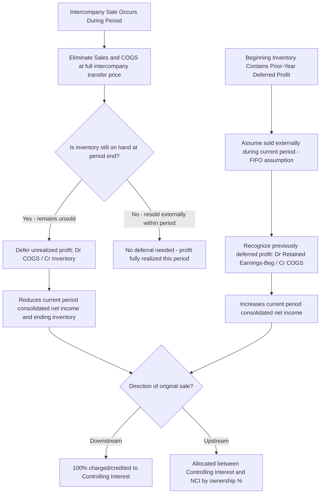

## Intercompany Inventory Transfers Upstream and Downstream

### Conceptual Foundation

**Key Points**

- Intercompany inventory transfers occur when one member of a consolidated group sells inventory to another member. From the perspective of the **consolidated entity**, no sale has occurred until the inventory is sold to a party **external** to the group — the transfer is merely a movement of goods within the same economic entity.
- Consolidation procedures must therefore **eliminate 100% of the intercompany sale, cost of goods sold, and any unrealized profit** remaining in ending inventory, regardless of the parent's ownership percentage in the subsidiary, because the elimination corrects the consolidated financial statements to reflect only transactions with outside parties.
- The direction of the sale — **downstream** (Parent sells to Subsidiary) versus **upstream** (Subsidiary sells to Parent) — does not change the amount eliminated, but it **does** change how the elimination affects the allocation of consolidated net income between the controlling interest and non-controlling interest (NCI).

### Downstream vs. Upstream — Definitions and Significance

**Key Points**

- **Downstream sale:** Parent sells inventory to Subsidiary. Any unrealized intercompany profit resides on the **Parent's** books (Parent recorded the sale and the related profit). Since the Parent's income is fully attributable to the controlling interest, unrealized profit elimination from downstream sales is charged **100% to the controlling interest**, with no effect on NCI.
- **Upstream sale:** Subsidiary sells inventory to Parent. Any unrealized intercompany profit resides on the **Subsidiary's** books. Since Subsidiary's income is shared between the controlling interest and NCI in proportion to ownership, unrealized profit elimination from upstream sales must be allocated **between both the controlling interest and NCI** based on their respective ownership percentages.
- [Inference] This asymmetry — full burden on the parent for downstream vs. shared burden for upstream — is one of the most commonly tested distinctions in intercompany elimination problems, precisely because it requires correctly identifying which entity originated the profit before determining the allocation.

### The Elimination Mechanics — Two-Part Process Each Period

**Key Points**

Each period in which intercompany inventory transactions occurred, two categories of worksheet entries are needed:

1. **Elimination of the intercompany sale itself** (Sales/COGS elimination) — removes the "double counting" of revenue and cost of goods sold that would otherwise occur because both the selling and buying entities recorded the transaction on their separate books.
2. **Deferral of unrealized profit in ending inventory** — defers the portion of intercompany profit embedded in inventory that has **not yet been resold to an outside party** by period end; recognizes (realizes) profit that **was** deferred in a prior period and has now been resold externally in the current period.

### Step 1: Eliminating the Intercompany Sale and COGS

**Example**

During the year, Subsidiary sells inventory to Parent for $500,000 total intercompany sales price. Subsidiary's cost of this inventory was $350,000.

```plaintext
Dr. Sales Revenue (intercompany)            500,000
    Cr. Cost of Goods Sold (intercompany)             500,000
```

This entry removes the intercompany sale and cost from the consolidated income statement entirely — since Sales and COGS are recorded at the same $500,000 gross intercompany transfer price on both sides, the elimination is a simple debit to Sales and offsetting credit to COGS, regardless of profit margin. This step alone does not affect consolidated net income (it is dollar-for-dollar), but it is necessary because consolidated Sales and COGS should reflect only transactions with external customers.

### Step 2: Deferring Unrealized Profit in Ending Inventory

**Key Points**

- Of the $500,000 in inventory Subsidiary sold to Parent, whatever portion **remains unsold by Parent to outside parties** at year-end still carries the intercompany profit margin embedded in its cost — this profit is **unrealized** from the consolidated entity's perspective and must be deferred (removed from consolidated ending inventory and consolidated net income) until the inventory is finally sold externally.

**Example**

Assume of the $500,000 in intercompany sales, $120,000 (at intercompany transfer price) remains in Parent's ending inventory. The gross profit margin on intercompany sales was 30% ($500,000 sales, $350,000 cost = $150,000 gross profit = 30% margin).

Unrealized profit in ending inventory:

$$\$120{,}000 \times 30\% = \$36{,}000$$

Worksheet elimination entry:

```plaintext
Dr. Cost of Goods Sold                36,000
    Cr. Inventory (ending)                       36,000
```

This entry reduces consolidated ending inventory to its original (pre-intercompany-markup) cost basis and reduces consolidated net income by the unrealized profit amount, since that profit has not yet been earned from the consolidated entity's perspective (no external sale has occurred).

### Step 3: Recognizing Previously Deferred Profit — Beginning Inventory

**Key Points**

- Inventory that was in **beginning** inventory (i.e., unsold at the end of the *prior* period and thus contained profit that was deferred in the prior year's worksheet) is now assumed **sold to an outside party during the current period** (using a FIFO-style assumption common in most textbook treatments, unless told otherwise).
- Because this profit is now realized from the consolidated entity's perspective, the current-period worksheet must **recognize** (undo the deferral of) the prior year's unrealized profit that related to beginning inventory — this increases current-period consolidated net income (by reducing current-period COGS).

**Example**

At the beginning of the current year, Parent's beginning inventory included $80,000 of goods purchased intercompany from Subsidiary in the prior year, with a 25% intercompany profit margin embedded in the prior year.

Realized profit from beginning inventory (recognized this period):

$$\$80{,}000 \times 25\% = \$20{,}000$$

Worksheet entry (recognizes the previously deferred profit as now realized, since a **new** consolidated worksheet is prepared each period and the prior year's deferral must be re-derived):

```plaintext
Dr. Retained Earnings — Beginning (or Investment in Sub, if upstream and Parent uses equity method)   20,000
    Cr. Cost of Goods Sold                                                                                  20,000
```

Because beginning retained earnings already reflects the *prior year's* consolidated (deferred) figure, this entry restates the beginning-of-period retained earnings balance downward for consolidation purposes and simultaneously reduces current-period COGS, so that the $20,000 profit — deferred last year — is recognized as part of **this** year's consolidated income, matching the period in which the inventory was actually sold externally.

### Combining Steps 2 and 3 — The Net Effect Each Period

**Key Points**

- In most periods (after the first year of intercompany sales activity), **both** the deferral of current-year ending inventory profit (Step 2) **and** the recognition of prior-year beginning inventory profit (Step 3) occur simultaneously on the same worksheet.
- The **net effect on current-period consolidated net income** equals: (realized profit from beginning inventory) minus (unrealized profit deferred in ending inventory). If ending inventory intercompany profit exceeds beginning inventory intercompany profit (e.g., intercompany sales volume grew), consolidated net income is reduced relative to the sum of separate-entity net incomes; if ending is less than beginning (volume declined), consolidated net income is increased.

**Example — Combined Entry**

Using the two examples above: $36,000 unrealized in ending inventory (deferred) and $20,000 realized from beginning inventory (recognized).

```plaintext
Dr. Retained Earnings — Beginning       20,000
Dr. Cost of Goods Sold                  16,000   [net plug: 36,000 deferral − 20,000 recognition]
    Cr. Inventory (ending)                        36,000
    Cr. Cost of Goods Sold                        20,000
```

[Inference] Worksheet presentation conventions vary — some textbooks present the beginning-inventory recognition and ending-inventory deferral as two fully separate entries (as in Steps 2 and 3 above) rather than netting them into a single combined entry; both approaches produce identical net effects on consolidated net income, ending inventory, and retained earnings, so the netted illustration here is a presentation convenience, not a required format.

### NCI Allocation — Where Direction Matters

**Example: Upstream Sale**

Subsidiary is 75%-owned. The $36,000 unrealized profit deferred in ending inventory (from an upstream sale, Subsidiary to Parent) must be allocated between controlling interest and NCI when computing each party's share of consolidated net income:

|  | Amount |
| --- | --- |
| Unrealized profit deferred (reduces Subsidiary's income component) | $36,000 |
| Allocated to Controlling Interest (75%) | $27,000 |
| Allocated to NCI (25%) | $9,000 |

Similarly, the $20,000 realized profit from beginning inventory (also upstream) increases the current period's income allocable to both parties:

|  | Amount |
| --- | --- |
| Realized profit recognized (increases Subsidiary's income component) | $20,000 |
| Allocated to Controlling Interest (75%) | $15,000 |
| Allocated to NCI (25%) | $5,000 |

**Example: Downstream Sale**

If instead the same $500,000 sale had been **downstream** (Parent to Subsidiary), the entire $36,000 unrealized profit deferral and $20,000 realized profit recognition would be charged/credited **100% to the controlling interest** — NCI's allocated share of consolidated net income is completely unaffected by downstream intercompany profit elimination, because the profit originated on Parent's books, and NCI has no equity claim on Parent's separately reported income.

### Illustrative Diagram: Downstream vs. Upstream NCI Impact (svg_diagram)

<svg xmlns="http://www.w3.org/2000/svg" viewBox="0 0 900 420">
<text x="450" y="30" font-size="18" font-weight="bold" text-anchor="middle" fill="#1a1a1a">Downstream vs. Upstream Profit Elimination Impact (svg_diagram)</text>
<rect x="40" y="70" width="380" height="150" rx="8" fill="#e8f0fe" stroke="#4285f4" stroke-width="1.5" />
<text x="230" y="100" font-size="14" font-weight="bold" text-anchor="middle">DOWNSTREAM (Parent → Subsidiary)</text>
<text x="230" y="125" font-size="12" text-anchor="middle">Unrealized profit originates on</text>
<text x="230" y="143" font-size="12" text-anchor="middle">Parent's separate books</text>
<text x="230" y="170" font-size="12" font-weight="bold" text-anchor="middle">Elimination charged 100% to:</text>
<text x="230" y="195" font-size="13" font-weight="bold" text-anchor="middle" fill="#4285f4">CONTROLLING INTEREST ONLY</text>
<rect x="480" y="70" width="380" height="150" rx="8" fill="#fef7e0" stroke="#f9ab00" stroke-width="1.5" />
<text x="670" y="100" font-size="14" font-weight="bold" text-anchor="middle">UPSTREAM (Subsidiary → Parent)</text>
<text x="670" y="125" font-size="12" text-anchor="middle">Unrealized profit originates on</text>
<text x="670" y="143" font-size="12" text-anchor="middle">Subsidiary's separate books</text>
<text x="670" y="170" font-size="12" font-weight="bold" text-anchor="middle">Elimination allocated between:</text>
<text x="670" y="195" font-size="13" font-weight="bold" text-anchor="middle" fill="#f9ab00">CONTROLLING INTEREST + NCI</text>
<rect x="150" y="260" width="600" height="130" rx="8" fill="#e6f4ea" stroke="#34a853" stroke-width="1.5" />
<text x="450" y="285" font-size="13" font-weight="bold" text-anchor="middle">Amount Eliminated is Identical Either Way</text>
<text x="450" y="310" font-size="12" text-anchor="middle">Total Sales/COGS elimination and unrealized profit</text>
<text x="450" y="328" font-size="12" text-anchor="middle">deferral amounts do NOT depend on direction</text>
<text x="450" y="355" font-size="12" font-weight="bold" text-anchor="middle">Only the ALLOCATION between CI and NCI differs</text>
</svg>

### Illustrative Diagram: Multi-Period Inventory Profit Flow



### Fixed Asset Intercompany Transfers — Brief Contrast (Related Concept)

**Key Points**

- While this topic focuses on inventory, the same upstream/downstream logic extends to intercompany sales of **depreciable fixed assets**, with one key mechanical difference: instead of profit being realized in a single period when inventory is resold externally, unrealized profit on an intercompany fixed asset sale is realized **gradually, over the asset's remaining useful life**, through an adjustment to depreciation expense each period (excess depreciation elimination), rather than through a one-time COGS adjustment.
- [Inference] This is typically treated as a related but distinct sub-topic in most curricula, often covered immediately alongside or after intercompany inventory transfers, given the shared upstream/downstream NCI allocation logic but differing realization patterns (point-in-time for inventory vs. ratable-over-life for fixed assets).

### Cumulative Effect on Multi-Year Consolidation

**Key Points**

- Because a **new consolidation worksheet is prepared every period** (see related topic: consolidation worksheet procedures in subsequent periods), the beginning-inventory profit recognition (Step 3 above) must be re-derived every year based on the actual beginning inventory balance and the intercompany margin rate that applied when that inventory was originally transferred — this requires maintaining a **rolling schedule of intercompany margin rates by period** if margin percentages change from year to year.
- If a company sells intercompany inventory at a **consistent** gross margin percentage every year, the beginning-inventory recognition calculation is straightforward (apply that period's constant margin to the beginning balance). If margins fluctuate year to year, the preparer must know **which year's inventory purchase** is assumed to comprise the beginning balance (again, typically a FIFO cost-flow assumption is used unless the problem specifies otherwise) to apply the correct historical margin rate.

### Common Errors and Review Points

**Key Points**

- Eliminating the intercompany Sales/COGS at only the **profit** amount rather than the **full intercompany transfer price** — Step 1's Sales/COGS elimination must be at the gross intercompany sales price, not just the markup.
- Forgetting to recognize the prior year's deferred profit in **beginning** inventory in the current period, which understates current-period consolidated net income (the profit is "lost" rather than recognized when the goods are finally sold externally).
- Applying the **wrong direction's NCI allocation logic** — treating an upstream sale's unrealized profit as fully absorbed by the controlling interest (or vice versa for downstream), which misstates the split between "Net Income Attributable to Parent" and "Net Income Attributable to NCI."
- Using the **wrong gross profit margin** when multiple years of intercompany sales occurred at different margins — applying the current year's margin to beginning inventory that was actually transferred at a prior year's (different) margin rate.
- Confusing the **direction of the entry** for recognition vs. deferral — deferral of ending inventory profit **reduces** current income (Dr. COGS / Cr. Inventory), while recognition of beginning inventory profit **increases** current income (Dr. Retained Earnings-Beginning / Cr. COGS) — these are opposite in effect and are easy to transpose under exam time pressure.
- Forgetting that, under the **equity method**, if the sale is **upstream**, Parent's own equity-method income already reflects Parent's share of the unrealized profit deferral (since Parent recognizes only its proportionate share of Subsidiary's adjusted net income) — worksheet entries must be coordinated with what Parent's separate books already reflect to avoid double-counting or omitting the NCI portion of the adjustment.

### Conclusion

**Conclusion**

Intercompany inventory transfers require eliminating the full intercompany sale and cost of goods sold each period, and separately deferring any profit that remains unrealized in ending inventory while recognizing profit that was deferred in a prior period's beginning inventory and has since been sold externally. The total dollar amount eliminated and deferred is identical regardless of whether the sale flows downstream (parent to subsidiary) or upstream (subsidiary to parent), but the direction fundamentally changes how that elimination is allocated between the controlling interest and non-controlling interest — downstream unrealized profit burdens the controlling interest exclusively, while upstream unrealized profit is shared proportionally with NCI, since it originated within the subsidiary's own reported income. Because a new consolidation worksheet is constructed every period, preparers must maintain careful records of historical intercompany margin rates to correctly recognize profit embedded in beginning inventory balances across multiple years of ongoing intercompany activity.

**Related Topics**

- Intercompany fixed asset (PP&E) transfers and excess depreciation elimination
- Intercompany bond transactions and constructive gain/loss on retirement
- Non-controlling interest computation and roll-forward in subsequent periods
- Consolidation worksheet procedures in subsequent periods (Entry BE, D, A, I)
- Equity method "amortization of excess" and its interaction with intercompany profit deferral
- Intercompany service fees, royalties, and management charges elimination
- FIFO vs. specific identification cost-flow assumptions in multi-year intercompany profit tracking
- Deferred tax effects of intercompany profit elimination (separate return vs. consolidated return jurisdictions)
- Forensic red flags: channel stuffing and intercompany sales used to manipulate segment-level or subsidiary-level reported performance
- Variable interest entity (VIE) intercompany transaction considerations