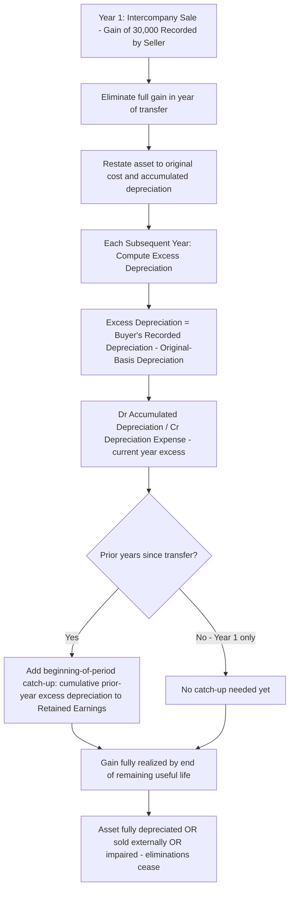

## Intercompany Fixed Asset and Depreciable Asset Transfers

### Conceptual Foundation

**Key Points**

- Intercompany fixed asset transfers occur when one member of a consolidated group sells a depreciable (or non-depreciable) fixed asset — equipment, buildings, land, vehicles — to another member of the same group. From the consolidated entity's perspective, this is an **internal transfer of an asset already owned**, not an economic transaction with an outside party.
- Any gain or loss recorded by the selling entity, and any change in depreciable basis recorded by the buying entity, must be **eliminated in full** on the consolidation worksheet, because the consolidated entity must report the asset at its **original historical cost basis less accumulated depreciation computed as if the intercompany sale never occurred**.
- Unlike intercompany inventory, where unrealized profit is typically realized in a **single subsequent period** (when the inventory is resold externally), unrealized profit on an intercompany fixed asset sale is realized **gradually, over the asset's remaining useful life**, through an adjustment to depreciation expense each period — this ratable realization pattern is the defining mechanical difference between the two topics.
- As with inventory, the **direction** of the sale — downstream (Parent to Subsidiary) or upstream (Subsidiary to Parent) — does not change the total amount eliminated, but does change how the elimination is allocated between the controlling interest and non-controlling interest (NCI).

### Step 1: Eliminating the Intercompany Gain or Loss at the Date of Transfer

**Key Points**

- When the intercompany sale occurs, the selling entity typically records a gain or loss equal to the difference between the sale price and its net book value (original cost less accumulated depreciation) at the transfer date. This gain/loss must be **fully eliminated** in the period of transfer, since the consolidated entity has not realized any gain/loss on an asset it still owns.
- The buying entity then depreciates the asset based on **its** newly recorded basis (the intercompany sale price), which differs from what would have been depreciated had the asset never left the consolidated group — this creates the need for ongoing "excess depreciation" adjustments in every subsequent period until the asset is fully depreciated, sold externally, or otherwise disposed of.

### Example: Intercompany Sale of Equipment at a Gain

**Example**

On January 1, Year 1, Subsidiary sells equipment to Parent for $150,000. At the time of sale, the equipment had an original cost of $200,000 and accumulated depreciation of $80,000 (net book value = $120,000). Remaining useful life at the transfer date = 6 years, straight-line, no salvage value.

Subsidiary's separate books recorded:

```plaintext
Dr. Cash                          150,000
Dr. Accumulated Depreciation       80,000
    Cr. Equipment                          200,000
    Cr. Gain on Sale of Equipment            30,000
```

Parent's separate books recorded the equipment at the new cost:

```plaintext
Dr. Equipment                     150,000
    Cr. Cash                                150,000
```

Parent will depreciate $150,000 over 6 years = $25,000/year, whereas the consolidated entity (had the sale never occurred) would have continued depreciating the **original** $200,000 cost basis at its original rate.

### Step 1 Worksheet Entry — Eliminate the Gain, Restate Asset to Original Basis (Year of Transfer)

**Example**

Worksheet entry in the year of the intercompany sale (Year 1):

```plaintext
Dr. Gain on Sale of Equipment          30,000
Dr. Equipment (restate to original cost)  50,000    [200,000 − 150,000]
    Cr. Accumulated Depreciation                     80,000   [restore original accumulated depreciation]
```

This entry: (1) eliminates the $30,000 gain Subsidiary recognized, (2) restates the Equipment account from Parent's recorded $150,000 back up to the original $200,000 gross cost, and (3) restores the $80,000 of accumulated depreciation that existed before the intercompany sale — collectively returning the consolidated balance sheet to what it would show had the equipment never been sold intercompany. Net effect on consolidated net assets: $150,000 (Parent's recorded NBV) is adjusted down to $120,000 (original NBV), a $30,000 reduction matching the eliminated gain.

### Step 2: Excess Depreciation Elimination in Subsequent Periods

**Key Points**

- Each period following the intercompany transfer, Parent (the new legal owner) records depreciation based on its **$150,000** basis ($25,000/year), but the consolidated entity should only reflect depreciation based on the **original $200,000** basis continuing at its original rate.
- Original annual depreciation, before the sale, was presumably $200,000 ÷ (original useful life). If the original life was 10 years, presale annual depreciation = $20,000/year, and 4 years had elapsed (since accumulated depreciation was $80,000 = 4 years × $20,000), leaving 6 years remaining — consistent with the "6 years remaining" fact pattern above.
- **Excess depreciation** = Parent's recorded depreciation ($25,000) − consolidated (original-basis) depreciation ($20,000) = **$5,000 per year**, for each of the 6 remaining years.

**Example — Worksheet Entry, Year 2 Onward (Each Subsequent Year Through Year 6)**

```plaintext
Dr. Accumulated Depreciation           5,000
    Cr. Depreciation Expense                       5,000
```

This entry reduces Parent's (and thus the consolidated group's) recorded depreciation expense by the "excess" $5,000 that resulted purely from the artificially inflated $150,000 basis, bringing consolidated depreciation expense back down to the $20,000/year that would have been recorded had the asset never been transferred intercompany. This simultaneously **realizes** $5,000 of the originally deferred $30,000 gain each year ($30,000 ÷ 6 years = $5,000/year), consistent with the asset's remaining useful life.

### Cumulative "Catch-Up" Adjustment in Multi-Year Consolidation

**Key Points**

- As with all consolidation worksheet items, because no permanent entries are recorded in either entity's books, the **beginning-of-period cumulative effect** must be reconstructed each period. By the beginning of Year 3 (two years after transfer), $10,000 of the excess depreciation has already been eliminated in prior years' worksheets ($5,000 × 2 years), and $10,000 of the original $30,000 gain has already been "realized" through those prior eliminations.
- The Year 3 worksheet must reflect: (a) a **beginning-of-period catch-up** adjustment to Retained Earnings and Accumulated Depreciation for the $10,000 cumulative prior-year excess depreciation elimination, and (b) the **current-year** $5,000 excess depreciation elimination.

**Example — Year 3 Combined Entry**

```plaintext
Dr. Accumulated Depreciation (cumulative: prior 2 years + current year)   15,000
    Cr. Retained Earnings — Beginning (reversal of cumulative prior-year gain elimination)   10,000
    Cr. Depreciation Expense (current year only)                                             5,000
```

[Inference] The precise presentation of this catch-up entry — whether split into a separate "beginning balance" entry and a "current year" entry, or combined as shown — varies by textbook convention, but the substantive effect (restoring cumulative accumulated depreciation to the original-basis amount, while crediting only the current year's amount to the income statement and the prior years' cumulative amount to beginning retained earnings) is consistent across treatments.

### Illustrative Diagram: Realization of Intercompany Gain Over Remaining Useful Life



### NCI Allocation — Downstream vs. Upstream

**Key Points**

- **Downstream transfer** (Parent sells to Subsidiary): The gain originated on Parent's separate books. Both the initial gain elimination (Step 1) and the subsequent excess depreciation eliminations (Step 2) are charged/credited **100% to the controlling interest** — NCI's allocated share of consolidated net income is unaffected in every period.
- **Upstream transfer** (Subsidiary sells to Parent): The gain originated on Subsidiary's separate books. Both the initial gain elimination and every subsequent year's excess depreciation elimination must be allocated between the controlling interest and NCI based on ownership percentage, since the gain (and its later realization through reduced depreciation) affects Subsidiary's reported income, which is shared with NCI.

**Example — Upstream Transfer, 70% Ownership**

Using the equipment example above, assume the sale was **upstream** (Subsidiary to Parent) and Subsidiary is 70%-owned.

*Year 1 — Gain Elimination:*

|  | Amount |
| --- | --- |
| Total gain eliminated | $30,000 |
| Allocated to Controlling Interest (70%) | $21,000 |
| Allocated to NCI (30%) | $9,000 |

*Years 2–6 — Excess Depreciation Elimination (each year):*

|  | Amount |
| --- | --- |
| Excess depreciation eliminated | $5,000 |
| Allocated to Controlling Interest (70%) | $3,500 |
| Allocated to NCI (30%) | $1,500 |

Over the full 6-year remaining life, NCI's cumulative share of the eliminations totals $9,000 (Year 1 gain reversal) reduced gradually as $1,500/year of realized gain flows back through — meaning NCI's total net cumulative charge across all periods nets to zero once the asset is fully depreciated, consistent with the gain being fully "earned" by the end of the asset's useful life.

### Illustrative Diagram: Downstream vs. Upstream Fixed Asset Transfer Allocation (svg_diagram)

<svg xmlns="http://www.w3.org/2000/svg" viewBox="0 0 900 400">
<text x="450" y="30" font-size="18" font-weight="bold" text-anchor="middle" fill="#1a1a1a">Fixed Asset Transfer: NCI Allocation by Direction (svg_diagram)</text>
<rect x="40" y="70" width="380" height="140" rx="8" fill="#e8f0fe" stroke="#4285f4" stroke-width="1.5" />
<text x="230" y="100" font-size="14" font-weight="bold" text-anchor="middle">DOWNSTREAM</text>
<text x="230" y="120" font-size="12" text-anchor="middle">Parent → Subsidiary</text>
<text x="230" y="145" font-size="12" text-anchor="middle">Gain elimination AND excess</text>
<text x="230" y="163" font-size="12" text-anchor="middle">depreciation: 100% to</text>
<text x="230" y="188" font-size="13" font-weight="bold" text-anchor="middle" fill="#4285f4">CONTROLLING INTEREST</text>
<rect x="480" y="70" width="380" height="140" rx="8" fill="#fef7e0" stroke="#f9ab00" stroke-width="1.5" />
<text x="670" y="100" font-size="14" font-weight="bold" text-anchor="middle">UPSTREAM</text>
<text x="670" y="120" font-size="12" text-anchor="middle">Subsidiary → Parent</text>
<text x="670" y="145" font-size="12" text-anchor="middle">Gain elimination AND excess</text>
<text x="670" y="163" font-size="12" text-anchor="middle">depreciation: allocated by</text>
<text x="670" y="188" font-size="13" font-weight="bold" text-anchor="middle" fill="#f9ab00">OWNERSHIP % (CI + NCI)</text>
<rect x="150" y="250" width="600" height="120" rx="8" fill="#e6f4ea" stroke="#34a853" stroke-width="1.5" />
<text x="450" y="275" font-size="13" font-weight="bold" text-anchor="middle">Key Difference from Inventory Transfers</text>
<text x="450" y="300" font-size="12" text-anchor="middle">Gain is NOT realized in one lump sum upon external resale —</text>
<text x="450" y="318" font-size="12" text-anchor="middle">it is realized RATABLY over the asset's remaining useful life</text>
<text x="450" y="340" font-size="12" font-weight="bold" text-anchor="middle">via annual excess depreciation eliminations</text>
</svg>

### Intercompany Transfer of Land (Non-Depreciable Asset)

**Key Points**

- Because land is not depreciated, an intercompany gain/loss on land is **not** realized gradually through depreciation adjustments. Instead, the entire gain/loss elimination **persists unchanged on the worksheet every period** until the land is **sold to an outside party**, at which point the full originally-eliminated gain/loss is recognized in the period of the external sale.

**Example**

Parent sells land to Subsidiary at a $40,000 gain. Every year until Subsidiary sells the land externally, the worksheet must include:

```plaintext
Dr. Gain on Sale of Land (Year 1 only; in later years, this becomes Retained Earnings — Beginning)   40,000
    Cr. Land                                                                                            40,000
```

In the year the land is **finally sold externally** by Subsidiary, the worksheet must instead **recognize** the deferred gain by adjusting the gain/loss reported on that external sale:

```plaintext
Dr. Land (remove the remaining eliminated basis adjustment)    40,000
    Cr. Gain on Sale of Land (recognize the previously deferred gain)   40,000
```

This produces the correct consolidated gain/loss on the **external** sale, which should reflect the difference between the external sale price and the **original** (pre-intercompany-transfer) cost basis of the land — not Subsidiary's recorded (intercompany-transfer) basis.

### Loss Transactions — Special Consideration

**Key Points**

- If an intercompany fixed asset transfer occurs at a **loss** rather than a gain, the same elimination mechanics apply symmetrically (eliminate the loss; restate the asset to original basis; adjust subsequent depreciation in the opposite direction — i.e., **increase** rather than decrease depreciation expense on the worksheet each period, since the buyer's basis, and thus recorded depreciation, would be **lower** than the original-basis depreciation).
- [Unverified] In practice, intercompany sales at a loss warrant additional scrutiny under both IFRS and US GAAP for whether the transaction reflects a genuine economic loss (e.g., the asset's fair value genuinely declined) versus an artificial transfer price — but for pure consolidation worksheet mechanics, the elimination approach is symmetric regardless of the reason for the loss.

### Impairment and Disposal Considerations

**Key Points**

- If the intercompany-transferred asset is later **impaired** while still held within the consolidated group, impairment testing must be performed based on the **consolidated (original-basis) carrying amount**, not the buyer's separate-book (intercompany-transfer) carrying amount, since the worksheet-adjusted basis is what should be tested for impairment from the consolidated entity's perspective.
- If the asset is **sold to an outside party** before the end of its useful life, the worksheet must include a final entry restating the eliminated gain/loss and accumulated depreciation adjustments so that the consolidated gain/loss on the **external** disposal is calculated using the **original** cost basis and accumulated depreciation (not the buyer's intercompany-transfer basis) — any remaining unrealized/unrecognized portion of the original intercompany gain or loss is fully recognized in this final period.

### Common Errors and Review Points

**Key Points**

- Eliminating only the **gain** in the year of transfer but forgetting to restate the **Equipment (or Building)** account back to its original gross cost and **Accumulated Depreciation** back to its original balance — a common error that leaves the consolidated balance sheet using the buyer's (incorrect) intercompany-transfer basis.
- Computing excess depreciation using the **wrong basis or wrong remaining life** — the excess depreciation calculation depends on correctly identifying both the buyer's newly recorded depreciable basis and life, **and** what the depreciation would have been on the original basis and remaining original life.
- Forgetting the **cumulative catch-up adjustment** to beginning retained earnings in Year 2 and beyond, which is required because each period's worksheet is prepared independently and prior years' excess depreciation eliminations were never permanently recorded in either entity's ledgers.
- Applying the **wrong direction's NCI allocation** — charging 100% of an upstream fixed asset gain elimination to the controlling interest (or vice versa for downstream), which misstates the "Net Income Attributable to NCI" line.
- For **land** and other non-depreciable assets, forgetting that the gain/loss elimination persists **indefinitely** on the worksheet (rather than reversing ratably like depreciable assets) until the asset is actually sold to an outside party.
- Failing to fully recognize the **remaining unrealized gain/loss** in the period the asset is finally disposed of externally, resulting in an incorrect consolidated gain/loss on disposal that reflects the buyer's basis rather than the original historical cost basis.

### Conclusion

**Conclusion**

Intercompany fixed asset transfers require eliminating the full gain or loss recognized by the selling entity in the year of transfer and restating the asset's gross cost and accumulated depreciation on the consolidated balance sheet to what they would have been had the transfer never occurred. Unlike intercompany inventory profit, which is typically realized in a single subsequent period upon external resale, the gain or loss on a depreciable fixed asset is realized gradually over the asset's remaining useful life through annual excess depreciation eliminations, requiring a cumulative catch-up adjustment to beginning retained earnings in every period beyond the year of transfer. Non-depreciable assets such as land follow a different pattern: the eliminated gain or loss persists unchanged on the worksheet indefinitely until the asset is finally sold outside the consolidated group. As with inventory transfers, the direction of the sale — downstream or upstream — does not change the total dollar amount eliminated but determines whether the elimination is charged entirely to the controlling interest or shared proportionally with the non-controlling interest.

**Related Topics**

- Intercompany inventory transfers upstream and downstream (point-in-time vs. ratable profit realization contrast)
- Non-controlling interest computation and roll-forward in subsequent periods
- Consolidation worksheet procedures in subsequent periods (Entry BE, D, A, I)
- Intercompany bond transactions and constructive gain/loss on retirement
- Impairment testing of consolidated assets with unrealized intercompany adjustments
- Deferred tax effects of intercompany fixed asset gain/loss elimination
- Disposal or sale of a subsidiary holding previously-transferred intercompany assets
- Equity method "amortization of excess" interaction with upstream fixed asset transfers
- Leaseback and sale-leaseback transactions within a consolidated group
- Forensic red flags: asset shuffling between related entities to manage segment profitability or asset utilization metrics