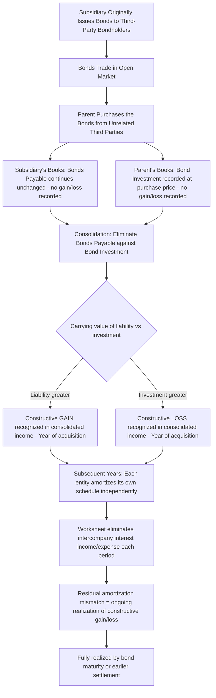

## Intercompany Bond Holdings and Constructive Retirement

### Conceptual Foundation

**Key Points**

- Intercompany bond holdings arise when one member of a consolidated group **purchases, in the open market, the outstanding bonds originally issued by another member** of the same consolidated group — typically Parent purchasing Subsidiary's previously issued bonds from unrelated third-party bondholders (or vice versa), rather than Subsidiary issuing bonds directly to Parent.
- From the perspective of the **consolidated entity**, once one affiliate holds the debt instrument issued by another affiliate, the debt is effectively **owed by the group to itself** — an intercompany receivable/payable from a consolidated standpoint, which has no external economic substance.
- Because the bonds were purchased in the open market rather than directly retired with the original issuer, this situation is termed **constructive retirement** (also called an "indirect extinguishment"): even though the bonds remain legally outstanding between the issuing subsidiary and the purchasing affiliate, **consolidation treats them as if the issuer had retired the bonds** on the date the affiliate acquired them, because the debt no longer represents an obligation to an outside party.
- A **constructive gain or loss on bond retirement** typically arises because the price the purchasing affiliate paid to acquire the bonds in the open market rarely equals the bonds' carrying (book) value on the issuing affiliate's books at that date — this gain or loss must be recognized in the **consolidated** financial statements in the period of acquisition, even though **neither entity's separate books recognize any gain or loss** at that time.

### Why Separate-Entity Books Show No Gain/Loss, But Consolidation Requires One

**Key Points**

- The **issuing entity** (e.g., Subsidiary) continues to carry the bonds payable at their normal amortized cost on its own books — from its perspective, it simply continues to owe the bonds to whoever the current legal holder is; it has no knowledge of, or need to record, anything different merely because the holder is now an affiliate.
- The **purchasing entity** (e.g., Parent) records the bond investment as an asset at the price it paid, and subsequently accounts for it as a bond investment under normal investment accounting (amortized cost, effective interest method), just as it would with any third-party bond investment.
- Only at the **consolidated** level — where the Bonds Payable (liability) of Subsidiary and the Bond Investment (asset) of Parent must be eliminated against each other, since they represent the same debt instrument from opposite sides — does a gain or loss emerge, because the **carrying value of the liability** and the **carrying value of the investment** are almost never identical (they reflect different original issuance/purchase prices, different effective interest rates, and different amortization schedules).

### Computing the Constructive Gain or Loss

**Key Points**

The constructive gain or loss is computed as the difference between:

$$\text{Carrying Value of Bonds Payable (Issuer's Books)} - \text{Carrying Value of Bond Investment (Purchaser's Books)}$$

- If this difference is **positive** (liability carrying value exceeds investment carrying value), a **constructive gain** on retirement is recognized in consolidation — conceptually, the group "retired" debt for less than its carrying value.
- If this difference is **negative** (investment carrying value exceeds liability carrying value), a **constructive loss** on retirement is recognized in consolidation — the group effectively "retired" debt for more than its carrying value.

### Example: Computing the Constructive Gain

**Example**

Subsidiary originally issued $1,000,000 face value bonds at a premium, and as of January 1, Year 3, the bonds' carrying value on Subsidiary's books (unamortized premium included) is $1,030,000.

On that same date, Parent purchases these bonds in the open market from unrelated third-party bondholders for $980,000 (below the carrying value, reflecting a rise in market interest rates since original issuance). Parent's cost basis (carrying value of its bond investment) at acquisition = $980,000.

$$\text{Constructive Gain} = \$1{,}030{,}000 - \$980{,}000 = \$50{,}000$$

From the consolidated entity's perspective, the group has effectively retired $1,030,000 of recorded debt for a total out-of-pocket cost of only $980,000 — a $50,000 gain, even though neither Subsidiary's nor Parent's separate books show any gain at all.

### Worksheet Entry — Year of Acquisition (Constructive Retirement)

**Example**

Worksheet elimination entry in the year Parent acquires the bonds (Year 3):

```plaintext
Dr. Bonds Payable (Subsidiary's carrying value)         1,030,000
    Cr. Investment in Bonds (Parent's carrying value)               980,000
    Cr. Gain on Constructive Retirement of Bonds                     50,000
```

This entry eliminates both the intercompany liability and the intercompany investment in full, and recognizes the $50,000 constructive gain in the **consolidated** income statement for Year 3 — even though this gain appears nowhere in either Parent's or Subsidiary's separately prepared financial statements.

### Subsequent Periods — The Amortization Mismatch Problem

**Key Points**

- After the year of constructive retirement, **each entity continues amortizing its own bond premium/discount independently** on its separate books: Subsidiary continues amortizing its bond premium toward the $1,000,000 face value based on its **original** effective interest rate, while Parent continues amortizing its bond discount/premium toward the $1,000,000 face value based on **its own** effective interest rate (determined by its $980,000 purchase price and the bonds' remaining terms at acquisition).
- Because these two amortization schedules are **based on different effective interest rates and different carrying values**, the amount of interest expense recorded by Subsidiary and the amount of interest income recorded by Parent will **not exactly offset** each period going forward — this creates the need for **ongoing worksheet adjustments** in every subsequent period until the bonds mature or are otherwise settled.
- The consolidated worksheet must, each period: (1) eliminate the intercompany interest expense (Subsidiary) against intercompany interest income (Parent), and (2) adjust for the **difference between the two entities' separate amortization amounts**, which represents the ongoing realization of the constructive gain (or loss) recognized at the date of acquisition, spread over the remaining life of the bonds.

### Example: Interest Elimination and Amortization Adjustment, Year 4

**Example**

Continuing the illustration: Subsidiary's Year 4 interest expense (including premium amortization) = $68,000; Parent's Year 4 interest income (including discount amortization) = $71,500.

```plaintext
Dr. Interest Income (Parent's recorded amount)          71,500
    Cr. Interest Expense (Subsidiary's recorded amount)             68,000
    Cr. Retained Earnings — Beginning (or Investment in Sub, cumulative catch-up plug)    3,500
```

[Inference] The specific plug amount and its direction (debit or credit to Retained Earnings/Investment) depend on the relative amortization patterns of the two effective interest schedules and will vary each year as both schedules progress toward the common $1,000,000 face value at maturity; the mechanical approach is to eliminate 100% of the recorded interest income against 100% of the recorded interest expense, with the residual "plugged" to Retained Earnings-Beginning (for the cumulative effect of all differences from the constructive retirement date through the beginning of the current period) and to the current period's Gain or Loss on Bond Retirement (if any incremental adjustment is needed for the current period specifically) — exact worksheet presentation format varies by textbook.

### Illustrative Diagram: Constructive Retirement Mechanics



### NCI Allocation — Which Entity Issued the Bonds Determines the Direction

**Key Points**

- The relevant question for NCI allocation is **which entity is the issuer (debtor)** of the bonds being constructively retired, not which entity purchased them — because the constructive gain/loss economically belongs to the entity whose debt was extinguished at a favorable or unfavorable price.
- **If Subsidiary is the issuer** and Parent is the purchaser (as in the examples above), the constructive gain/loss is considered to originate with Subsidiary. If Subsidiary is partially owned, this gain/loss (and its subsequent-period realization through the amortization mismatch) must be **allocated between the controlling interest and NCI** based on ownership percentage.
- **If Parent is the issuer** and Subsidiary is the purchaser, the constructive gain/loss originates with Parent and is charged/credited **100% to the controlling interest**, with no effect on NCI's allocated share of consolidated net income.

### Example: NCI Allocation, Subsidiary as Issuer, 85% Ownership

**Example**

Using the $50,000 constructive gain from the earlier example (Subsidiary is the bond issuer, Parent purchased the bonds), and Subsidiary is 85%-owned:

|  | Amount |
| --- | --- |
| Total constructive gain (Year 3, year of acquisition) | $50,000 |
| Allocated to Controlling Interest (85%) | $42,500 |
| Allocated to NCI (15%) | $7,500 |

This allocation affects the split of consolidated net income between "Net Income Attributable to Parent" and "Net Income Attributable to NCI" in the year of acquisition, and the ongoing subsequent-period amortization mismatch adjustments must be allocated the same way in each future period until the bonds mature.

### Illustrative Diagram: Issuer Identity Determines NCI Allocation (svg_diagram)

<svg xmlns="http://www.w3.org/2000/svg" viewBox="0 0 900 400">
<text x="450" y="30" font-size="18" font-weight="bold" text-anchor="middle" fill="#1a1a1a">Constructive Gain/Loss: Issuer Identity Governs NCI Allocation (svg_diagram)</text>
<rect x="40" y="70" width="380" height="150" rx="8" fill="#e8f0fe" stroke="#4285f4" stroke-width="1.5" />
<text x="230" y="100" font-size="14" font-weight="bold" text-anchor="middle">PARENT is Issuer</text>
<text x="230" y="122" font-size="12" text-anchor="middle">Subsidiary purchases Parent's bonds</text>
<text x="230" y="148" font-size="12" text-anchor="middle">in the open market</text>
<text x="230" y="175" font-size="12" font-weight="bold" text-anchor="middle">Gain/loss belongs to Parent:</text>
<text x="230" y="198" font-size="13" font-weight="bold" text-anchor="middle" fill="#4285f4">100% CONTROLLING INTEREST</text>
<rect x="480" y="70" width="380" height="150" rx="8" fill="#fef7e0" stroke="#f9ab00" stroke-width="1.5" />
<text x="670" y="100" font-size="14" font-weight="bold" text-anchor="middle">SUBSIDIARY is Issuer</text>
<text x="670" y="122" font-size="12" text-anchor="middle">Parent purchases Subsidiary's bonds</text>
<text x="670" y="148" font-size="12" text-anchor="middle">in the open market</text>
<text x="670" y="175" font-size="12" font-weight="bold" text-anchor="middle">Gain/loss belongs to Subsidiary:</text>
<text x="670" y="198" font-size="13" font-weight="bold" text-anchor="middle" fill="#f9ab00">ALLOCATED CI + NCI</text>
<rect x="150" y="250" width="600" height="110" rx="8" fill="#e6f4ea" stroke="#34a853" stroke-width="1.5" />
<text x="450" y="278" font-size="13" font-weight="bold" text-anchor="middle">Critical Distinction from Inventory/Fixed Asset Transfers</text>
<text x="450" y="303" font-size="12" text-anchor="middle">Allocation depends on WHO ISSUED the bonds (the debtor),</text>
<text x="450" y="323" font-size="12" text-anchor="middle">NOT on who purchased them or the direction of the purchase transaction</text>
</svg>

### Effective Interest Method Detail — Why the Two Schedules Diverge

**Key Points**

- Subsidiary's amortization schedule (as issuer) is based on the **market rate of interest at original issuance**, applied to the bonds' original issuance carrying value, amortizing toward face value over the bonds' **total original life**.
- Parent's amortization schedule (as investor) is based on the **market rate of interest at the date Parent purchased the bonds** (which reflects then-current market conditions, likely different from the original issuance rate), applied to Parent's purchase price, amortizing toward face value over the bonds' **remaining life from the purchase date**.
- Because these are two independent effective interest calculations anchored to different dates, different carrying values, and potentially different market rates, **the two schedules will only coincidentally produce identical period-by-period interest amounts** — in virtually all realistic fact patterns, an adjustment is required every period until maturity.
- [Unverified] The magnitude and even the direction of the period-by-period amortization mismatch can change over the life of the bonds (e.g., a mismatch that initially works to increase consolidated income could later reverse), depending on the specific relationship between the two effective interest rates and remaining terms; each period's adjustment must be independently computed from the two entities' actual amortization schedules rather than assumed to follow a simple straight-line pattern.

### Cumulative Effect Through Maturity

**Key Points**

- By the time the bonds reach **maturity**, both Subsidiary's and Parent's separate carrying values will have amortized to the same **face value** (assuming no other adjustments), meaning the cumulative net effect of all the subsequent-period worksheet adjustments, combined with the original constructive gain/loss recognized at acquisition, will exactly account for the total difference between what Subsidiary would have paid to retire the bonds at face value versus what the group actually paid (Parent's purchase price) — the constructive gain/loss is thus **fully realized by maturity**, spread ratably (though not necessarily evenly, given differing effective interest patterns) across the intervening periods.
- If the bonds are **redeemed early** by Subsidiary (e.g., a call provision is exercised) or **resold by Parent to an outside third party** before maturity, any remaining unrealized portion of the constructive gain/loss must be recognized immediately in that period's consolidated income statement, since the intercompany relationship giving rise to the constructive retirement no longer exists (either because the debt is genuinely retired or because it is now held by an outside party).

### Common Errors and Review Points

**Key Points**

- Assuming **no gain or loss** needs to be recognized in consolidation simply because neither entity's separate books show one — the constructive gain/loss is a **consolidation-only** concept and will not appear anywhere in the separate financial statements of either Parent or Subsidiary.
- Computing the constructive gain/loss using the **face value** of the bonds rather than each entity's **carrying value** (which includes unamortized premium or discount) — the calculation must use carrying values as of the acquisition date, not face value.
- Forgetting that the constructive gain/loss, once recognized in the year of acquisition, must be **incrementally realized** in every subsequent period through the interest income/expense elimination and amortization mismatch adjustment — treating it as a one-time entry with no further consequences.
- Misidentifying which entity is the **issuer** for NCI allocation purposes — the allocation follows the debtor (issuing) entity's ownership structure, not the purchasing entity's, and not simply "whichever direction the cash flowed."
- Failing to update the **cumulative catch-up** to beginning retained earnings in Year 2 and beyond for the constructive retirement's ongoing effects, consistent with the general principle that no consolidation worksheet entries are permanently recorded in either entity's separate ledgers.
- Neglecting to fully recognize any **remaining unrealized** constructive gain/loss if the bonds are settled, called, or resold to a third party before their original maturity date.

### Conclusion

**Conclusion**

Intercompany bond holdings and constructive retirement arise when one consolidated group member acquires, in the open market, bonds originally issued by another group member, creating a debt obligation that is effectively owed by the group to itself even though it remains legally outstanding between the two affiliates. Because the purchase price almost never equals the issuing entity's bond carrying value, a constructive gain or loss must be recognized in the consolidated financial statements in the period of acquisition — even though this gain or loss appears in neither entity's separately prepared statements — and because each entity subsequently continues amortizing its own bonds using its own independently determined effective interest rate, the consolidated worksheet must include an ongoing adjustment every period until maturity to eliminate intercompany interest income/expense and recognize the gradual realization of the constructive gain or loss. The direction of NCI allocation is governed by which entity is the bond issuer (debtor), not by which entity purchased the bonds, distinguishing this topic's allocation logic from the buyer/seller framing used in intercompany inventory and fixed asset transfers.

**Related Topics**

- Effective interest method of bond premium/discount amortization
- Intercompany inventory transfers upstream and downstream (contrasting realization patterns)
- Intercompany fixed asset transfers and excess depreciation elimination
- Non-controlling interest computation and roll-forward in subsequent periods
- Consolidation worksheet procedures in subsequent periods
- Early extinguishment of debt accounting (non-intercompany context) for comparison
- Deferred tax effects of constructive bond retirement gains/losses
- Intercompany loans, notes, and other debt instrument eliminations
- Troubled debt restructuring within a consolidated group
- Forensic red flags: related-party debt repurchases used to manage reported leverage ratios or manufacture gains