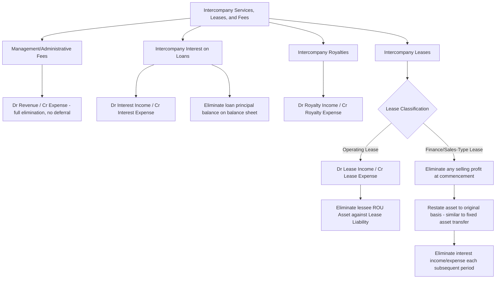

## Intercompany Services, Leases, and Management Fees


### Conceptual Foundation

**Key Points**

- Intercompany services, leases, and management fees encompass a broad category of recurring transactions between consolidated group members that do **not** involve the transfer of inventory or tangible fixed assets, but instead involve one entity providing services, use of assets, or administrative support to another affiliate in exchange for a fee, rent, or charge.
- Common examples include: management/administrative service fees (corporate overhead allocations), intercompany leases of equipment or real property, intercompany royalties for use of intellectual property, intercompany interest on loans and advances, shared services arrangements (IT, HR, legal), and intercompany insurance or reinsurance arrangements.
- As with all intercompany transactions, from the **consolidated entity's** perspective these represent internal cash and resource movements within a single economic entity — the revenue recognized by the providing/lessor entity and the corresponding expense recognized by the receiving/lessee entity must be **eliminated in full**, because no transaction with an outside party has occurred.
- Unlike inventory or fixed asset transfers, most intercompany service, lease, and fee arrangements **do not create unrealized profit deferred in an asset account** — because the "product" (a service, use of an asset, or use of capital) is typically consumed in the same period it is provided, there is generally **no balance sheet deferral mechanism** analogous to unrealized inventory profit. The elimination is usually a straightforward, complete reversal of revenue against expense each period.

### General Elimination Pattern

**Key Points**

The standard worksheet elimination for most intercompany service/fee/lease arrangements follows this simple pattern:

```plaintext
Dr. Revenue (Service Fee Income / Management Fee Income / Rental Income / Interest Income / Royalty Income) — Provider
    Cr. Expense (Service Fee Expense / Management Fee Expense / Rent Expense / Interest Expense / Royalty Expense) — Recipient
```

This is a **dollar-for-dollar** elimination with **no residual gain/loss or deferred profit component**, because the amount recorded as revenue by the provider entity typically equals the amount recorded as expense by the recipient entity (unlike inventory sales, where markup creates a profit differential requiring separate deferral treatment).

### Example: Intercompany Management Fee Elimination

**Example**

Parent charges Subsidiary an annual management fee of $240,000 for corporate administrative services (executive oversight, centralized accounting, HR support). Parent recorded $240,000 of management fee income; Subsidiary recorded $240,000 of management fee expense.

```plaintext
Dr. Management Fee Income               240,000
    Cr. Management Fee Expense                        240,000
```

Because both entities recorded the identical $240,000 amount, this elimination is complete and requires no further adjustment — no profit is embedded in inventory or an asset requiring deferral, since a management service, once rendered, is immediately consumed and expensed by the recipient.

### Example: Intercompany Interest Elimination

**Example**

Subsidiary borrowed $2,000,000 from Parent via an intercompany loan at a 6% annual interest rate. Parent recorded $120,000 of intercompany interest income; Subsidiary recorded $120,000 of intercompany interest expense.

```plaintext
Dr. Interest Income               120,000
    Cr. Interest Expense                        120,000
```

Additionally, the **intercompany loan receivable/payable balance itself** (the $2,000,000 principal) must be eliminated on the consolidated balance sheet:

```plaintext
Dr. Notes/Loans Payable — Intercompany       2,000,000
    Cr. Notes/Loans Receivable — Intercompany            2,000,000
```

Both the income statement elimination (interest) and balance sheet elimination (principal) are required every period the intercompany loan remains outstanding.

### Example: Intercompany Royalty Elimination

**Example**

Parent licenses a trademark to Subsidiary and charges a royalty of 3% of Subsidiary's net sales, totaling $85,000 for the year. Parent recorded $85,000 royalty income; Subsidiary recorded $85,000 royalty expense.

```plaintext
Dr. Royalty Income                85,000
    Cr. Royalty Expense                         85,000
```

If Subsidiary capitalized any portion of the royalty as part of inventory cost (uncommon, but possible in certain cost-allocation structures) rather than expensing it immediately, a portion could theoretically remain embedded in ending inventory, requiring inventory-style profit deferral treatment for that portion — but this is an exception rather than the general pattern for royalty arrangements.

### Intercompany Leases — Distinguishing Operating vs. Finance/Capital Leases

**Key Points**

- Intercompany lease elimination mechanics differ depending on whether the lease is classified (on the **lessee's separate books**) as an **operating lease** or a **finance lease** (US GAAP terminology under ASC 842) / **finance lease** (IFRS 16 terminology, noting IFRS 16 eliminated the operating/finance distinction for lessees but retains it for lessors).
- **Operating lease (lessee) / Operating lease (lessor, both frameworks):** The lessor recognizes lease income (typically straight-line) and the lessee recognizes lease expense (also typically straight-line); elimination is a straightforward Dr. Lease Income / Cr. Lease Expense entry, similar to the management fee pattern above. Additionally, the lessee's **right-of-use (ROU) asset and lease liability** (recognized under both ASC 842 and IFRS 16 for virtually all leases, including those classified as "operating" for income statement purposes) must be eliminated against the lessor's underlying leased asset, since from the consolidated perspective, the leased asset never left the group.
- **Finance lease (lessee) / Sales-type or direct financing lease (lessor):** More complex elimination is required because the lessor may have recognized a **selling profit** at lease commencement (in a sales-type lease) and interest income over the lease term, while the lessee recognizes interest expense and amortization of the ROU asset — this creates a pattern **analogous to intercompany fixed asset sales with imputed financing**, requiring elimination of any selling profit (similar to the fixed asset gain elimination discussed in the related topic) plus ongoing interest income/expense elimination each period.

### Example: Intercompany Operating Lease Elimination

**Example**

Parent owns a building and leases it to Subsidiary under an operating lease, charging $150,000 annual rent. Parent recorded $150,000 rental income; Subsidiary recorded $150,000 rent expense (assuming straight-line recognition with no significant escalation clauses requiring deferred rent adjustments).

```plaintext
Dr. Rental Income                 150,000
    Cr. Rent Expense                          150,000
```

Additionally, Subsidiary's right-of-use asset and lease liability (recognized on Subsidiary's separate books under ASC 842/IFRS 16 for this operating lease) must be eliminated in consolidation, since the building itself remains within the consolidated group and continues to be reported at its own carrying value on Parent's balance sheet as an owned asset (subject to Parent's own depreciation), not duplicated as a separate ROU asset at the consolidated level:

```plaintext
Dr. Lease Liability — Subsidiary            [remaining lease liability balance]
    Cr. Right-of-Use Asset — Subsidiary                 [remaining ROU asset balance]
```

[Inference] The exact elimination of ROU assets and lease liabilities in intercompany lease arrangements is a comparatively newer and more mechanically involved area following the adoption of ASC 842 and IFRS 16 (which brought most leases onto the lessee's balance sheet), and specific worksheet presentation conventions continue to vary across texts and practitioners; the underlying principle — that the consolidated entity should report the leased asset only once, at its own carrying basis, with no duplicated ROU asset or corresponding lease liability — is consistent across frameworks.

### Example: Intercompany Finance Lease with Selling Profit

**Example**

Parent (lessor) leases specialized equipment to Subsidiary under a finance/sales-type lease. At lease commencement, the equipment's carrying value on Parent's books was $400,000; the present value of lease payments (recorded as Parent's net investment in the lease) is $460,000, resulting in Parent recognizing a **selling profit of $60,000** at commencement.

Worksheet entry at lease commencement:

```plaintext
Dr. Selling Profit on Lease (Parent)         60,000
Dr. Right-of-Use Asset — Subsidiary (restate toward original basis)   [adjustment]
    Cr. Net Investment in Lease — Parent                                       [adjustment]
```

[Inference] The precise restatement mechanics for intercompany finance/sales-type leases with embedded selling profit closely parallel the intercompany fixed asset transfer framework (eliminate the gain, restate the asset to original basis, adjust subsequent-period interest and amortization), but the specific account titles and ROU-asset-versus-net-investment-in-lease restatement combine both fixed-asset-transfer logic and bond-style interest elimination logic; this is one of the more mechanically complex sub-areas of intercompany elimination and merits careful application of the general "restate to original basis, eliminate profit, adjust subsequent periods" framework rather than rote memorization of a single formula. Subsequent periods require eliminating the interest income Parent recognizes on its net investment in the lease against the interest expense Subsidiary recognizes on its lease liability, similar in spirit to the intercompany bond elimination pattern.

### Illustrative Diagram: Categories of Intercompany Service-Type Transactions



### NCI Allocation Considerations

**Key Points**

- As with all intercompany elimination topics, the **direction** of the transaction — which entity is the provider/lessor/lender versus the recipient/lessee/borrower — determines how any eliminated amount affects the allocation of consolidated net income between the controlling interest and NCI.
- For **most pure service, management fee, and interest arrangements**, because the elimination is typically a complete, equal-and-offsetting Dr. Revenue / Cr. Expense entry with **no net effect on total consolidated net income** (the amounts are usually identical, unlike inventory profit which has a markup), there is generally **no NCI allocation impact** from the elimination itself — both the revenue removed and the expense removed affect the respective entity's reported income equally, and since consolidated net income is unaffected in total, the split between CI and NCI based on each entity's *adjusted* net income is simply recalculated using each entity's post-elimination figures.
- **Exception:** If a service, lease, or management fee arrangement is **not** priced at an amount that exactly offsets between the two entities' books (which should not normally occur if arm's-length or cost-allocation-based pricing is used consistently, but could arise from measurement differences, foreign currency timing mismatches, or accrual cutoff differences), any resulting residual difference does affect consolidated net income and would need to be allocated based on which entity's income statement absorbs the residual, following the same "identify the originating entity" logic used in other intercompany topics.
- For **finance/sales-type leases with selling profit**, the NCI allocation logic mirrors intercompany fixed asset transfers: if the **lessor is the entity with NCI** (e.g., Subsidiary as lessor, Parent as lessee — an "upstream" fact pattern), the selling profit and its subsequent realization are allocated between CI and NCI; if the **lessor is the parent** (a "downstream" fact pattern), the selling profit is charged 100% to the controlling interest.

### Transfer Pricing and Arm's-Length Considerations

**Key Points**

- While consolidation elimination mechanics are largely indifferent to whether an intercompany service/fee/lease arrangement is priced at "arm's length" (since the full amount is eliminated regardless of price, for financial reporting consolidation purposes), the **pricing of intercompany services, management fees, royalties, and leases is highly significant for tax purposes** in multi-jurisdictional groups, governed by transfer pricing rules (e.g., OECD Transfer Pricing Guidelines, US IRC §482).
- [Unverified] Transfer pricing adequacy for intercompany services and management fees is a frequent area of tax authority scrutiny and controversy across jurisdictions; while this affects each entity's **separate** taxable income and the group's **consolidated tax provision** (see related topic), it does not change the **financial statement consolidation elimination mechanics** described above, which eliminate the full recorded amounts regardless of whether those amounts would withstand transfer pricing scrutiny.
- Forensic and audit attention to intercompany service and management fee arrangements often focuses on whether they are used to **shift income between jurisdictions or between a parent and a partially-owned subsidiary** in a manner that could disadvantage NCI shareholders (e.g., an excessive management fee charged by a wholly-owned parent to a partially-owned subsidiary could be used to extract value from NCI shareholders' economic interest) — this is a substantive related-party governance concern distinct from the mechanical consolidation elimination itself.

### Illustrative Diagram: Full Elimination With No Deferral vs. Fixed-Asset-Style Deferral (svg_diagram)

<svg xmlns="http://www.w3.org/2000/svg" viewBox="0 0 900 400">
<text x="450" y="30" font-size="18" font-weight="bold" text-anchor="middle" fill="#1a1a1a">Service/Fee Elimination vs. Asset-Style Deferral (svg_diagram)</text>
<rect x="40" y="70" width="380" height="160" rx="8" fill="#e8f0fe" stroke="#4285f4" stroke-width="1.5" />
<text x="230" y="100" font-size="14" font-weight="bold" text-anchor="middle">Management Fees, Interest,</text>
<text x="230" y="118" font-size="14" font-weight="bold" text-anchor="middle">Royalties, Operating Leases</text>
<text x="230" y="145" font-size="12" text-anchor="middle">Service consumed same period</text>
<text x="230" y="163" font-size="12" text-anchor="middle">as rendered — no asset holds profit</text>
<text x="230" y="185" font-size="12" font-weight="bold" text-anchor="middle">Dr Revenue / Cr Expense</text>
<text x="230" y="205" font-size="13" font-weight="bold" text-anchor="middle" fill="#4285f4">Complete, one-time elimination</text>
<rect x="480" y="70" width="380" height="160" rx="8" fill="#fef7e0" stroke="#f9ab00" stroke-width="1.5" />
<text x="670" y="100" font-size="14" font-weight="bold" text-anchor="middle">Finance/Sales-Type Leases</text>
<text x="670" y="118" font-size="14" font-weight="bold" text-anchor="middle">(Selling Profit Embedded)</text>
<text x="670" y="145" font-size="12" text-anchor="middle">Profit embedded in ROU asset /</text>
<text x="670" y="163" font-size="12" text-anchor="middle">net investment in lease</text>
<text x="670" y="185" font-size="12" font-weight="bold" text-anchor="middle">Restate to original basis</text>
<text x="670" y="205" font-size="13" font-weight="bold" text-anchor="middle" fill="#f9ab00">Realized ratably over lease term</text>
</svg>

### Common Errors and Review Points

**Key Points**

- Assuming **all** intercompany transactions require a profit-deferral mechanism analogous to inventory — most service, fee, and operating lease arrangements involve **complete, equal-and-offsetting eliminations** with no deferred profit, since there is no inventory-like asset holding unrealized margin.
- Forgetting to eliminate the **balance sheet** components alongside the income statement components — intercompany loan principal balances, right-of-use assets, and lease liabilities must be eliminated in addition to the related interest, rental, or lease expense/income eliminations.
- Treating an intercompany **finance/sales-type lease** with the same simple elimination pattern as an operating lease or management fee, overlooking the embedded selling profit that requires fixed-asset-transfer-style treatment (restate to original basis, eliminate profit, adjust subsequent interest).
- Misapplying NCI allocation logic to a straightforward, fully-offsetting service fee elimination — since most such eliminations do not change total consolidated net income, no special NCI allocation adjustment is typically needed beyond correctly computing each entity's post-elimination adjusted net income.
- Overlooking governance and forensic concerns around intercompany management fees or royalties that may be structured to disadvantage NCI shareholders, even though the financial statement consolidation mechanics remain the same regardless of whether the pricing is fair to NCI.
- Confusing **transfer pricing tax considerations** (which affect separate-entity taxable income and the consolidated tax provision) with **consolidation elimination mechanics** (which eliminate the full recorded amount regardless of tax transfer pricing adequacy).

### Conclusion

**Conclusion**

Intercompany services, leases, and management fees represent a broad category of recurring intercompany transactions that, unlike inventory and fixed asset transfers, typically involve complete and immediate elimination of matching revenue and expense amounts with no unrealized profit requiring deferral, since the underlying service or use of an asset is generally consumed in the same period it is provided. Management fees, interest on intercompany loans, and royalties follow this straightforward Dr. Revenue / Cr. Expense elimination pattern, supplemented by elimination of any related balance sheet balances (loan principal, right-of-use assets, lease liabilities). Intercompany leases classified as finance or sales-type leases are a notable exception, requiring more complex treatment analogous to intercompany fixed asset transfers when the lessor recognizes selling profit at commencement, with that profit realized ratably over the lease term through subsequent interest income/expense eliminations. NCI allocation is generally unaffected by fully-offsetting service and fee eliminations, but becomes relevant for finance/sales-type leases with embedded selling profit, following the same originating-entity logic used throughout intercompany elimination topics.

**Related Topics**

- Lease accounting fundamentals under ASC 842 and IFRS 16 (lessee and lessor models)
- Intercompany fixed asset transfers and excess depreciation elimination (parallel framework for finance leases)
- Intercompany bond holdings and constructive retirement (parallel interest elimination framework)
- Transfer pricing methodologies (OECD Guidelines, comparable uncontrolled price, cost-plus, resale price methods)
- Related-party transaction disclosure requirements (IAS 24 / ASC 850)
- Non-controlling interest protections and governance concerns in related-party pricing
- Consolidated income tax provision considerations — interaction with transfer pricing
- Shared services and cost allocation methodologies in multinational groups
- Sale-leaseback transactions within a consolidated group
- Forensic red flags: intercompany fee manipulation for earnings management or NCI value extraction