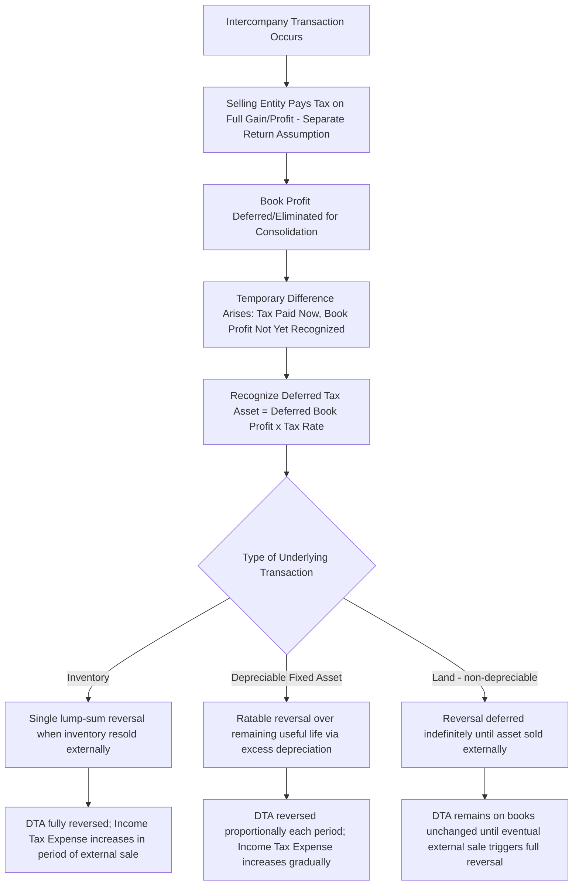

## Unrealized Profit Elimination and Deferred Tax Effects

### Conceptual Foundation

**Key Points**

- Whenever intercompany profit is eliminated for **financial reporting purposes** — whether from inventory, fixed assets, or other intercompany transactions — the elimination typically has **no corresponding effect on the taxable income** already reported by the selling entity on its **separate tax return**, because tax authorities generally tax each legal entity (or tax-filing group) on transactions as they actually occurred, not as they are subsequently adjusted for financial consolidation purposes.
- This divergence between the **book** treatment (profit deferred until realized through external sale, resale, or ratable depreciation) and the **tax** treatment (profit taxed in the period the intercompany transaction actually occurred, assuming separate-return filing or no specific intercompany deferral election) creates a **temporary difference** requiring deferred tax accounting under IAS 12 (Income Taxes) and ASC 740 (Income Taxes).
- The general principle: when book profit is **deferred** (eliminated) but tax has already been **paid** on the full amount, a **deferred tax asset (DTA)** is recognized; when the temporary difference later **reverses** (the deferred book profit is finally recognized as the asset is sold externally or depreciated), the DTA is reversed and consolidated income tax expense **decreases** in that period, since the tax was already paid in an earlier period.

### Why This Differs by Filing Structure

**Key Points**

- **Separate-return jurisdictions or non-consolidated tax filing:** The selling entity recognizes and pays tax on its full intercompany gain/profit in the period of the intercompany transaction, regardless of consolidation-level deferral. This is the scenario in which the deferred tax mechanics described in this topic most directly apply.
- **Consolidated or combined tax return jurisdictions with intercompany deferral rules:** Many tax regimes that permit consolidated/combined filing (e.g., US federal consolidated return regulations under Treas. Reg. §1.1502-13) include specific **intercompany transaction deferral rules** that defer the *tax* gain on intercompany transactions until the asset leaves the tax-consolidated group — in these cases, the book and tax treatments may already be aligned (both deferred), **reducing or eliminating** the temporary difference that would otherwise arise.
- [Unverified] Whether a specific consolidated group's intercompany transactions benefit from tax-basis deferral rules depends entirely on (a) whether the specific entities are eligible for and have elected consolidated/combined tax filing in the relevant jurisdiction, and (b) the specific intercompany transaction regulations of that jurisdiction — this determination requires jurisdiction-specific tax analysis and should not be assumed based on financial reporting consolidation status alone.

### Deferred Tax on Unrealized Inventory Profit — Mechanics

**Key Points**

- When intercompany inventory profit is deferred in ending inventory for book purposes (see related topic: intercompany inventory transfers), but the **selling entity** already paid tax on the full intercompany gain (separate-return assumption), a deferred tax asset arises equal to the tax rate applied to the deferred (unrealized) profit.
- In the following period, when the previously deferred profit is recognized in **book** income (as the inventory is sold externally), the DTA **reverses**, since no *additional* tax is owed at that time (it was already paid in the earlier period) — this reversal **reduces** consolidated income tax expense in the period of realization.

### Example: DTA on Unrealized Inventory Profit — Formation and Reversal

**Example**

Subsidiary sells inventory to Parent at a $40,000 intercompany profit; $40,000 remains in Parent's ending inventory at year-end (fully unrealized for book purposes). Subsidiary files a separate tax return and has already paid tax at a 25% rate on this $40,000 gain.

**Year 1 — Formation of DTA (profit deferred for book, already taxed):**

```plaintext
Dr. Deferred Tax Asset                    10,000
    Cr. Income Tax Expense                            10,000
```

$$\text{DTA} = \$40{,}000 \times 25\% = \$10{,}000$$

**Year 2 — Reversal of DTA (assuming inventory sold externally, profit now recognized for book purposes):**

```plaintext
Dr. Income Tax Expense                    10,000
    Cr. Deferred Tax Asset                            10,000
```

Net effect across the two years: consolidated income tax expense is **reduced** by $10,000 in Year 1 (matching the book profit deferral) and **increased** by $10,000 in Year 2 (matching the book profit recognition) — the deferred tax entries track the book-tax timing difference precisely as the underlying temporary difference reverses.

### Deferred Tax on Unrealized Fixed Asset Gains — Mechanics

**Key Points**

- The same DTA formation-and-reversal logic applies to intercompany fixed asset transfers (see related topic), but the **reversal pattern is ratable over the asset's remaining useful life** rather than a single lump-sum reversal, because the underlying book gain is realized gradually through excess depreciation eliminations rather than all at once.
- At the date of the intercompany fixed asset sale, if the selling entity recognized and paid tax on the full gain (separate-return assumption), a DTA is recognized for the tax effect of the **entire** eliminated gain. In each subsequent period, as a portion of that gain is "realized" for book purposes (via the excess depreciation elimination), a proportional share of the DTA reverses.

### Example: DTA on Unrealized Fixed Asset Gain — Formation and Ratable Reversal

**Example**

Using the earlier fixed asset transfer illustration: Subsidiary sold equipment to Parent at a $30,000 gain (eliminated for book purposes), with the gain realized ratably over the 6-year remaining useful life ($5,000/year). Subsidiary paid tax on the full $30,000 gain at a 25% rate.

**Year of Transfer — Formation of DTA:**

```plaintext
Dr. Deferred Tax Asset                    7,500
    Cr. Income Tax Expense                          7,500
```

$$\text{DTA} = \$30{,}000 \times 25\% = \$7{,}500$$

**Each of the Following 6 Years — Ratable Reversal:**

```plaintext
Dr. Income Tax Expense                    1,250
    Cr. Deferred Tax Asset                          1,250
```

$$\text{Annual Reversal} = \$7{,}500 \div 6 \text{ years} = \$1{,}250 \text{ per year (matching the } \$5{,}000\text{/year} \times 25\% \text{ book gain realization)}$$

By the end of the 6-year period, the DTA is fully reversed to zero, exactly tracking the pattern by which the $30,000 book gain was eliminated in Year 1 and then gradually recognized through reduced depreciation expense over the following 6 years.

### Illustrative Diagram: Deferred Tax Formation and Reversal Pattern by Transaction Type



### Deferred Tax on Intercompany Land Transfers — Indefinite Deferral Pattern

**Key Points**

- Because gains/losses on intercompany land transfers are eliminated **indefinitely** for book purposes until the land is sold to an outside party (see related topic: intercompany fixed asset and depreciable asset transfers), the associated DTA similarly **persists unchanged** on the consolidated balance sheet for as long as the land remains within the group.
- Only when the land is finally sold externally does the book gain get recognized (reversing the original elimination) and the corresponding DTA fully reverse in that single period — potentially many years after the original intercompany transfer.

### Deferred Tax Rate Considerations — Which Rate to Use

**Key Points**

- The deferred tax asset (or liability) should be measured using the **tax rate expected to apply in the period the temporary difference is expected to reverse**, consistent with the general deferred tax measurement principle under both IAS 12 and ASC 740 — not necessarily the tax rate in effect at the time the intercompany transaction originally occurred.
- For inventory-related unrealized profit, since reversal is typically expected within the following year, the current enacted tax rate is usually appropriate.
- For fixed-asset-related unrealized gains with multi-year ratable reversal patterns, if enacted tax rates are scheduled to **change** during the reversal period (e.g., a known future statutory rate change), the deferred tax asset should be measured using the **rate expected to apply when each portion of the temporary difference reverses**, which may require a **schedule of expected reversal by year**, each measured at its own applicable enacted rate — rather than a single blended rate applied to the entire remaining balance.
- [Unverified] The specific mechanics of applying graduated or scheduled future tax rate changes to a multi-year reversing temporary difference can be complex in practice and are sensitive to the specific enacted tax law in the relevant jurisdiction at the reporting date; general practice is to use enacted (not merely proposed) rates for each future period in which reversal is expected.

### NCI Allocation of Deferred Tax Effects

**Key Points**

- Consistent with the general principle that deferred tax effects follow the **same origination and allocation logic as the underlying book item** they relate to, deferred tax assets/liabilities arising from unrealized profit elimination on **upstream** transactions (subsidiary as seller) must be allocated between the controlling interest and NCI, while those arising from **downstream** transactions (parent as seller) are attributed entirely to the controlling interest.

**Example**

Using the fixed asset example above (Subsidiary as seller, 70%-owned), the $7,500 DTA formed in the year of transfer and its subsequent $1,250/year reversals must be allocated:

|  | DTA Formation (Year of Transfer) | Annual DTA Reversal |
| --- | --- | --- |
| Total | $7,500 | $1,250 |
| Controlling Interest (70%) | $5,250 | $875 |
| NCI (30%) | $2,250 | $375 |

This allocation affects the split of consolidated net income (via the income tax expense component) between "Net Income Attributable to Parent" and "Net Income Attributable to NCI" in each relevant period.

### Interaction with Valuation Allowance Assessment

**Key Points**

- Like all deferred tax assets, DTAs arising from unrealized intercompany profit elimination must be assessed for **realizability** — it must be "more likely than not" (under both IAS 12's "probable" recognition threshold and ASC 740's "more likely than not" threshold, which are similar but not identical formulations) that the entity will generate sufficient future taxable income to realize the benefit of the DTA.
- This realizability assessment is performed at the **legal entity or tax-filing-group level** consistent with general deferred tax principles (see related topic: consolidated income tax provision considerations) — a DTA arising from an upstream intercompany transaction (recognized because Subsidiary, the seller, already paid the tax) is assessed based on the **selling entity's** (or its tax-filing group's) ability to generate future taxable income, not the consolidated group's income as a whole, if the entities do not file a consolidated/combined tax return together.
- [Inference] If the selling entity (e.g., a loss-making subsidiary in a separate-return jurisdiction) is unable to demonstrate sufficient future taxable income to support realizability of this specific DTA, a valuation allowance may be required against it even though the consolidated group overall is profitable — this is a natural extension of the general valuation allowance principle to this specific type of consolidation-driven deferred tax asset.

### Illustrative Diagram: Deferred Tax Effect Lifecycle Across Multiple Periods (svg_diagram)

<svg xmlns="http://www.w3.org/2000/svg" viewBox="0 0 900 440">
<text x="450" y="30" font-size="18" font-weight="bold" text-anchor="middle" fill="#1a1a1a">Deferred Tax Lifecycle: Intercompany Profit Elimination (svg_diagram)</text>
<rect x="40" y="65" width="250" height="90" rx="8" fill="#e8f0fe" stroke="#4285f4" stroke-width="1.5" />
<text x="165" y="95" font-size="13" font-weight="bold" text-anchor="middle">Year of Transaction</text>
<text x="165" y="115" font-size="12" text-anchor="middle">Tax paid on full gain</text>
<text x="165" y="133" font-size="12" text-anchor="middle">Book profit deferred</text>
<rect x="330" y="65" width="250" height="90" rx="8" fill="#fef7e0" stroke="#f9ab00" stroke-width="1.5" />
<text x="455" y="95" font-size="13" font-weight="bold" text-anchor="middle">DTA Recognized</text>
<text x="455" y="115" font-size="12" text-anchor="middle">= Deferred Profit x Tax Rate</text>
<text x="455" y="133" font-size="12" text-anchor="middle">Subject to realizability test</text>
<rect x="620" y="65" width="250" height="90" rx="8" fill="#e6f4ea" stroke="#34a853" stroke-width="1.5" />
<text x="745" y="95" font-size="13" font-weight="bold" text-anchor="middle">Subsequent Period(s)</text>
<text x="745" y="115" font-size="12" text-anchor="middle">Book profit recognized</text>
<text x="745" y="133" font-size="12" text-anchor="middle">as asset resold/depreciated</text>
<line x1="290" y1="110" x2="325" y2="110" stroke="#5f6368" stroke-width="2" marker-end="url(#arrow5)" />
<line x1="580" y1="110" x2="615" y2="110" stroke="#5f6368" stroke-width="2" marker-end="url(#arrow5)" />
<rect x="250" y="200" width="400" height="80" rx="8" fill="#fce8e6" stroke="#ea4335" stroke-width="1.5" />
<text x="450" y="228" font-size="13" font-weight="bold" text-anchor="middle">DTA Reversal</text>
<text x="450" y="250" font-size="12" text-anchor="middle">Income Tax Expense increases as</text>
<text x="450" y="266" font-size="12" text-anchor="middle">book profit is finally recognized</text>
<line x1="450" y1="155" x2="450" y2="195" stroke="#5f6368" stroke-width="2" marker-end="url(#arrow5)" />
<rect x="150" y="320" width="600" height="90" rx="8" fill="#f3e8fd" stroke="#a142f4" stroke-width="1.5" />
<text x="450" y="345" font-size="13" font-weight="bold" text-anchor="middle">Allocation Follows the Underlying Transaction's Direction</text>
<text x="450" y="368" font-size="12" text-anchor="middle">Upstream (Subsidiary as seller): DTA formation/reversal shared with NCI</text>
<text x="450" y="386" font-size="12" text-anchor="middle">Downstream (Parent as seller): DTA formation/reversal 100% to Controlling Interest</text>
</svg>

### Common Errors and Review Points

**Key Points**

- Assuming deferred tax effects **automatically** arise from every unrealized profit elimination without first confirming whether the entities file separate tax returns (where the temporary difference typically arises) or a consolidated/combined tax return with specific intercompany transaction deferral rules (where book and tax treatment may already align, reducing or eliminating the temporary difference).
- Using the **tax rate at the date of the original intercompany transaction** rather than the **tax rate expected to apply when the temporary difference reverses**, particularly problematic when a known future statutory rate change occurs during a multi-year fixed asset reversal pattern.
- Forgetting that the **reversal pattern must mirror the book realization pattern** — a lump-sum reversal for inventory (upon external resale), a ratable reversal for depreciable fixed assets (over remaining useful life), and an indefinite deferral for land (until eventual external sale) — applying the wrong reversal pattern misstates income tax expense timing.
- Overlooking the need to assess **realizability** (valuation allowance) for these DTAs at the correct legal-entity or tax-filing-group level, particularly when the selling entity is a loss-making subsidiary that may not independently support the DTA's realizability even though the consolidated group is profitable.
- Failing to allocate the deferred tax formation and reversal amounts between the controlling interest and NCI consistent with whether the underlying transaction was upstream or downstream — the deferred tax effect follows the same allocation logic as the book item that created it.
- Confusing this topic's **intercompany-transaction-driven** temporary differences with **acquisition-date fair value adjustment** temporary differences (a related but distinct source of deferred tax in consolidation, arising from the initial business combination rather than from ongoing post-acquisition intercompany transactions).

### Conclusion

**Conclusion**

Unrealized profit elimination for financial reporting purposes frequently creates a temporary difference for deferred tax purposes, because the selling entity typically pays tax on the full intercompany gain in the period the transaction actually occurred (in separate-return jurisdictions or absent specific intercompany tax deferral rules), while the corresponding book profit is deferred until later realized through external resale or ratable depreciation. This requires recognizing a deferred tax asset at the time of elimination, measured using the tax rate expected to apply when the temporary difference reverses, and reversing that asset in a pattern that mirrors the underlying book realization — a single lump sum for inventory upon external resale, a ratable pattern over the remaining useful life for depreciable fixed assets, and an indefinite deferral for land until eventual disposal. As with all intercompany elimination topics, the allocation of these deferred tax effects between the controlling interest and non-controlling interest follows the direction of the underlying transaction, and realizability of the resulting deferred tax assets must be assessed at the appropriate legal entity or tax-filing-group level rather than assumed automatically from the consolidated group's overall profitability.

**Related Topics**

- Intercompany inventory transfers upstream and downstream (underlying book elimination mechanics)
- Intercompany fixed asset and depreciable asset transfers (underlying book elimination mechanics)
- Consolidated income tax provision considerations (broader framework: separate vs. consolidated tax filing, valuation allowances)
- Deferred tax accounting fundamentals (IAS 12 / ASC 740) — recognition and measurement principles
- Intercompany transaction deferral rules under US consolidated return regulations (Treas. Reg. §1.1502-13)
- Amortization of acquisition-date fair value adjustments and their distinct deferred tax treatment
- Valuation allowance assessment methodology at the legal-entity level
- Non-controlling interest computation and roll-forward in subsequent periods
- Enacted tax rate changes and their effect on multi-year reversing temporary differences
- Forensic red flags: use of intercompany transactions and related deferred tax positions to manage reported effective tax rate