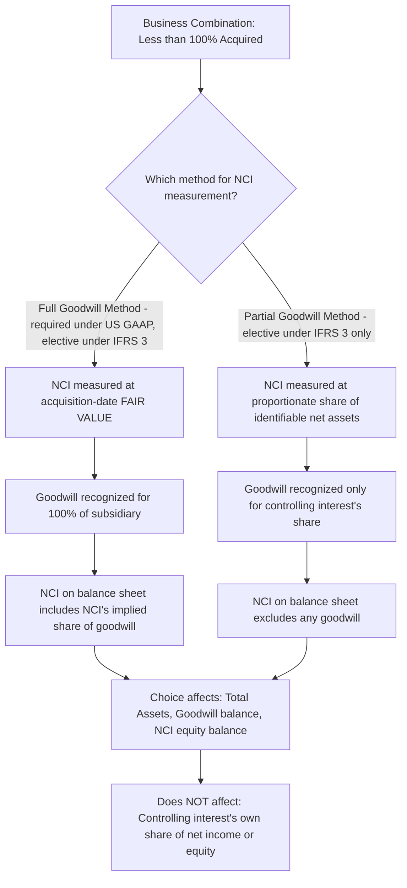

## Measurement and Presentation of Noncontrolling Interests


### Conceptual Foundation

**Key Points**

- A **non-controlling interest (NCI)** — also called a **minority interest** in older literature — represents the equity in a consolidated subsidiary that is **not** attributable, directly or indirectly, to the parent. It arises whenever a parent controls a subsidiary (and therefore consolidates 100% of its assets, liabilities, revenues, and expenses) without owning 100% of its voting equity interests.
- Both **IFRS 10 / IFRS 3** and **US GAAP (ASC 810 / ASC 805)** require NCI to be presented as a **separate component of consolidated equity**, distinct from the parent's shareholders' equity — NCI is emphatically **not** a liability, and its presentation as equity reflects the view that the subsidiary's non-controlling shareholders hold a genuine residual equity claim on the subsidiary's net assets, not a debt-like obligation of the consolidated group.
- This equity classification represents a significant shift from older US GAAP practice (pre-2009, under the predecessor to ASC 810, minority interest was often presented in a "mezzanine" or intermediate section between liabilities and equity, or even as a liability in some cases) — the current standard reflects the "entity theory" of consolidation rather than the older "parent company theory."

### Initial Measurement at Acquisition — Full Goodwill vs. Partial Goodwill Methods

**Key Points**

- At the acquisition date, NCI must be initially measured, and the method chosen affects the amount of **goodwill** recognized in the business combination:
  - **Full goodwill method** (fair value method): NCI is measured at its **acquisition-date fair value** — often estimated using the per-share price implied by the consideration transferred for the controlling interest, adjusted for any control premium, or by other valuation techniques if NCI shares are not actively traded. This results in goodwill being recognized for **100%** of the subsidiary (both the controlling interest's and NCI's proportionate shares of goodwill).
  - **Partial goodwill method** (proportionate share method): NCI is measured at its **proportionate share of the subsidiary's identifiable net assets** (fair value of identifiable assets acquired minus liabilities assumed), with **no goodwill allocated to NCI** — goodwill is recognized only for the controlling interest's share.
- **IFRS 3** permits a **free choice**, made on a **transaction-by-transaction basis**, between the full goodwill method and the partial goodwill method.
- **US GAAP (ASC 805)** requires the **full goodwill method only** — NCI must always be measured at acquisition-date fair value, with goodwill recognized for 100% of the subsidiary. [Unverified] This is a well-established difference between the two frameworks as codified; practitioners should verify current guidance for any subsequent amendments, though this distinction has been stable since the substantially converged 2008/2009 revisions to IFRS 3 and ASC 805 (formerly SFAS 141(R)).

### Example: Full Goodwill vs. Partial Goodwill Method Comparison

**Example**

Parent acquires 80% of Subsidiary for $800,000 cash. At acquisition, Subsidiary's identifiable net assets have a fair value of $900,000. NCI's estimated acquisition-date fair value (based on an implied per-share value consistent with the price paid for the 80% controlling stake, without a control premium adjustment for this illustration) is $220,000.

**Full Goodwill Method (required under US GAAP; elective under IFRS 3):**

|  | Amount |
| --- | --- |
| Consideration transferred (controlling interest) | $800,000 |
| NCI at acquisition-date fair value | $220,000 |
| Total | $1,020,000 |
| Less: Fair value of identifiable net assets | $900,000 |
| **Goodwill (100% recognized)** | **$120,000** |

**Partial Goodwill Method (elective under IFRS 3 only):**

|  | Amount |
| --- | --- |
| Consideration transferred (controlling interest) | $800,000 |
| Less: Controlling interest's share of identifiable net assets (80% × $900,000) | $720,000 |
| **Goodwill (controlling interest's share only)** | **$80,000** |
| NCI (20% × $900,000, proportionate share, no goodwill) | $180,000 |

Note that under the full goodwill method, total consolidated equity attributable to NCI ($220,000) includes NCI's share of goodwill, whereas under the partial goodwill method, NCI ($180,000) reflects only its share of identifiable net assets — the $40,000 difference ($220,000 − $180,000) represents NCI's implied share of goodwill under the full goodwill method.

### Illustrative Diagram: Full Goodwill vs. Partial Goodwill Method Structure



### Subsequent Measurement — Rolling NCI Forward Each Period

**Key Points**

- After initial recognition, NCI is **not** remeasured to fair value each period (unlike, for example, available-for-sale securities). Instead, NCI's carrying amount is **rolled forward** each period using standard equity roll-forward mechanics:

$$\text{NCI}_{\text{ending}} = \text{NCI}_{\text{beginning}} + \text{NCI's Share of Consolidated Net Income} - \text{NCI's Share of Dividends Declared by Subsidiary} \pm \text{Other Comprehensive Income Allocable to NCI} \pm \text{Other Equity Transactions}$$

- "NCI's share of consolidated net income" is based on Subsidiary's **net income as adjusted for consolidation purposes** — including fair value adjustment (FVA) amortization and the NCI-allocable portion of any upstream intercompany profit elimination — not Subsidiary's unadjusted, separately reported net income (see related topics on FVA amortization and intercompany eliminations).
- NCI's share of **other comprehensive income (OCI)** items — foreign currency translation adjustments, unrealized gains/losses on certain financial instruments, pension remeasurements — must also be allocated proportionally to NCI, consistent with the principle that NCI holds a genuine residual equity interest in all of the subsidiary's comprehensive income, not just net income.

### Example: NCI Roll-Forward with Net Income, Dividends, and OCI

**Example**

Subsidiary is 75%-owned (NCI = 25%). At the beginning of the year, NCI's carrying amount was $450,000. During the year, Subsidiary's consolidation-adjusted net income was $200,000, it declared dividends of $60,000, and it recognized a foreign currency translation loss (OCI) of $16,000.

|  | Amount |
| --- | --- |
| NCI, beginning of year | $450,000 |
| Add: NCI share of net income (25% × $200,000) | $50,000 |
| Less: NCI share of dividends (25% × $60,000) | ($15,000) |
| Less: NCI share of OCI loss (25% × $16,000) | ($4,000) |
| **NCI, end of year** | **$481,000** |

This roll-forward must be performed and, in many cases, separately disclosed every period as part of the consolidated statement of changes in equity.

### Presentation on the Consolidated Balance Sheet

**Key Points**

- NCI is presented within the **equity section** of the consolidated balance sheet, but as a **separate line item distinct from the parent's shareholders' equity** — commonly labeled "Non-controlling interests" or "Equity attributable to non-controlling interests."
- Total consolidated equity is presented as the sum of two components:

```plaintext
Stockholders' Equity:
  Equity Attributable to Parent's Shareholders:
    Common Stock                          XXX
    Additional Paid-in Capital            XXX
    Retained Earnings                     XXX
    Accumulated Other Comprehensive Income (Loss)   XXX
    Total Equity Attributable to Parent               XXX
  Non-Controlling Interests                            XXX
Total Stockholders' Equity                             XXX
```

- Both IFRS and US GAAP require this **two-tier presentation**, explicitly showing "Total equity attributable to owners of the parent" and "Non-controlling interests" as distinct subtotals within total equity — a company cannot simply present a single blended equity figure without this disaggregation.

### Presentation on the Consolidated Income Statement and Statement of Comprehensive Income

**Key Points**

- Consolidated net income (or loss) must be presented as a **single total** (100% of the consolidated group's income, since 100% of Subsidiary's revenues and expenses are consolidated), followed by a **required allocation** between the two ownership interests:

```plaintext
Consolidated Net Income                                    XXX
  Net Income Attributable to Non-Controlling Interests     (XXX)
  Net Income Attributable to Parent's Shareholders          XXX
```

- This same "attributable to" split is required for **total comprehensive income** as well:

```plaintext
Consolidated Comprehensive Income                           XXX
  Comprehensive Income Attributable to Non-Controlling Interests   (XXX)
  Comprehensive Income Attributable to Parent's Shareholders        XXX
```

- **Earnings per share (EPS)** calculations are based **only** on income attributable to the parent's common shareholders — NCI's share of income is excluded entirely from both the numerator and denominator of consolidated EPS calculations, since NCI does not hold the parent's common shares.

### Illustrative Diagram: NCI Presentation Across the Three Primary Statements (svg_diagram)

<svg xmlns="http://www.w3.org/2000/svg" viewBox="0 0 900 460">
<text x="450" y="30" font-size="18" font-weight="bold" text-anchor="middle" fill="#1a1a1a">NCI Presentation Across Financial Statements (svg_diagram)</text>
<rect x="40" y="65" width="250" height="120" rx="8" fill="#e8f0fe" stroke="#4285f4" stroke-width="1.5" />
<text x="165" y="90" font-size="13" font-weight="bold" text-anchor="middle">Balance Sheet</text>
<text x="165" y="112" font-size="12" text-anchor="middle">Separate line within</text>
<text x="165" y="130" font-size="12" text-anchor="middle">EQUITY section</text>
<text x="165" y="152" font-size="12" font-weight="bold" text-anchor="middle">"Non-Controlling Interests"</text>
<text x="165" y="170" font-size="12" text-anchor="middle">Never a liability</text>
<rect x="330" y="65" width="250" height="120" rx="8" fill="#fef7e0" stroke="#f9ab00" stroke-width="1.5" />
<text x="455" y="90" font-size="13" font-weight="bold" text-anchor="middle">Income Statement</text>
<text x="455" y="112" font-size="12" text-anchor="middle">Consolidated NI shown first</text>
<text x="455" y="130" font-size="12" text-anchor="middle">(100% of group income)</text>
<text x="455" y="152" font-size="12" font-weight="bold" text-anchor="middle">Then split: attributable to</text>
<text x="455" y="170" font-size="12" text-anchor="middle">Parent vs. NCI</text>
<rect x="620" y="65" width="250" height="120" rx="8" fill="#e6f4ea" stroke="#34a853" stroke-width="1.5" />
<text x="745" y="90" font-size="13" font-weight="bold" text-anchor="middle">Statement of Equity</text>
<text x="745" y="112" font-size="12" text-anchor="middle">Separate column for NCI</text>
<text x="745" y="130" font-size="12" text-anchor="middle">Rolled forward each period</text>
<text x="745" y="152" font-size="12" font-weight="bold" text-anchor="middle">NI + OCI − Dividends</text>
<text x="745" y="170" font-size="12" text-anchor="middle">± other equity transactions</text>
<rect x="150" y="230" width="600" height="180" rx="8" fill="#fce8e6" stroke="#ea4335" stroke-width="1.5" />
<text x="450" y="258" font-size="14" font-weight="bold" text-anchor="middle">Common Thread: NCI Reflects a Genuine Residual Equity Interest</text>
<text x="450" y="285" font-size="12" text-anchor="middle">NCI shareholders hold real equity claims in the subsidiary —</text>
<text x="450" y="303" font-size="12" text-anchor="middle">not a liability, not a temporary/mezzanine item —</text>
<text x="450" y="321" font-size="12" text-anchor="middle">and are entitled to a proportional share of ALL subsidiary</text>
<text x="450" y="339" font-size="12" text-anchor="middle">performance metrics: net income, OCI, and total comprehensive income</text>
<text x="450" y="365" font-size="12" font-weight="bold" text-anchor="middle">EPS calculations exclude NCI entirely</text>
<text x="450" y="385" font-size="12" text-anchor="middle">(based only on income attributable to parent's common shareholders)</text>
</svg>

### Consolidated Statement of Cash Flows — NCI Presentation

**Key Points**

- As discussed in the related topic on the consolidated statement of cash flows, the **starting point** for the indirect-method operating activities section is typically **total consolidated net income** (including NCI's share), since this matches the actual total cash-generating capacity of the consolidated entity — no separate "backing out NCI's share" adjustment is needed at the top of the reconciliation.
- **Dividends paid to NCI shareholders** (as opposed to dividends paid by Subsidiary to Parent, which are eliminated as intercompany) are presented as a genuine **financing activity outflow**, since this cash truly leaves the consolidated group to parties outside it.

### Changes in Ownership Interest While Control Is Maintained

**Key Points**

- If a parent **purchases additional shares** of an already-controlled subsidiary from NCI shareholders (increasing its ownership percentage while retaining control), or **sells a portion** of its interest to NCI shareholders (decreasing its ownership percentage while retaining control), both **IFRS 10** and **ASC 810** require this to be accounted for as an **equity transaction** — a transfer of equity between the controlling interest and NCI **within consolidated equity**, with **no gain or loss recognized in consolidated net income**, and **no remeasurement of goodwill or the subsidiary's identifiable assets/liabilities**.
- The difference between the consideration paid (or received) and the change in the carrying amount of NCI is recorded directly in **equity attributable to the parent** (typically as an adjustment to Additional Paid-in Capital or Retained Earnings), not as a gain/loss on the income statement.

### Example: Parent Purchases Additional Shares from NCI (Control Maintained)

**Example**

Parent owns 75% of Subsidiary; NCI's carrying amount is currently $500,000 (25% of Subsidiary's $2,000,000 total consolidated equity). Parent purchases an additional 10% of Subsidiary's shares directly from NCI shareholders for $230,000 cash, increasing Parent's ownership to 85% (NCI reduced to 15%).

- NCI's carrying amount is reduced proportionally: from 25% ($500,000) to 15% ($300,000) — a reduction of $200,000 (10/25 of the original NCI balance, corresponding to the 10-percentage-point shift).
- Parent paid $230,000 for a reduction in NCI of $200,000 — the $30,000 excess is charged directly to Parent's equity (e.g., Additional Paid-in Capital), **not** to the income statement:

```plaintext
Dr. Non-Controlling Interest             200,000
Dr. Additional Paid-in Capital (Parent)   30,000
    Cr. Cash                                        230,000
```

No gain or loss is recognized in consolidated net income from this transaction, and goodwill is not adjusted, since Parent continues to control the same subsidiary before and after the transaction — only the internal allocation of equity between the controlling and non-controlling interests has changed.

### Loss of Control — Contrast with Changes in Ownership While Retaining Control

**Key Points**

- If, instead, a transaction results in the parent **losing control** of the subsidiary (e.g., selling enough shares to drop ownership below the control threshold), this is treated fundamentally differently — as a **deconsolidation event** requiring the recognition of a **gain or loss in the income statement**, and any **retained non-controlling investment** is remeasured to **fair value** at the date control is lost (with that remeasurement also flowing through the gain/loss calculation).
- [Inference] This bright-line distinction — equity transaction with no P&L effect while control is retained, versus a P&L gain/loss recognition event when control is lost — is a frequently tested contrast, and it underscores that the accounting consequence hinges entirely on whether **control** (not merely ownership percentage) is maintained; a large ownership percentage decrease that still leaves the parent in control is treated very differently from an ownership percentage decrease that crosses the control threshold, even if the percentage-point changes are similar in magnitude.

### Negative (Deficit) NCI Balances

**Key Points**

- Under both IFRS 10 and ASC 810, NCI's share of a subsidiary's **cumulative losses** must be allocated to NCI **even if this results in a negative (deficit) NCI balance**, rather than being disproportionately absorbed by the controlling interest — this reflects the principle that NCI genuinely shares in the subsidiary's economic performance, including losses, in proportion to its ownership interest, regardless of whether NCI has a contractual obligation to fund the deficit.
- This represents a more recent convergence point in both frameworks; historically, some prior guidance limited NCI losses to the amount of its positive investment, but current standards under both IFRS 10 and ASC 810 require full proportional loss allocation to NCI without such a floor.

### Common Errors and Review Points

**Key Points**

- Presenting NCI as a liability or in a "mezzanine" section between liabilities and equity — this contradicts both current IFRS and US GAAP, which unambiguously require NCI to be presented within the equity section.
- Confusing the **full goodwill method** (fair value, required under US GAAP, elective under IFRS) with the **partial goodwill method** (proportionate share of identifiable net assets, elective under IFRS only) — using the wrong method changes both the goodwill balance and the initial NCI balance, and US GAAP preparers do not have a choice in the matter.
- Recognizing a gain or loss on the income statement for a change in ownership interest that does **not** result in loss of control — this should instead be recorded as an equity transaction with the residual difference charged/credited directly to parent's equity.
- Limiting NCI's allocated share of losses to a floor of zero (preventing negative NCI) — current standards require full proportional loss allocation even into a deficit NCI position, absent very specific contractual protections that might justify a different result under detailed application guidance.
- Forgetting to allocate NCI's proportional share of **other comprehensive income** items (foreign currency translation, pension remeasurements, etc.), and presenting only a net-income-based split while omitting the parallel split required for total comprehensive income.
- Including NCI's share of income or equity in **EPS** calculations — EPS is based solely on income attributable to the parent's common shareholders.

### Conclusion

**Conclusion**

Non-controlling interests represent a genuine residual equity claim held by parties other than the parent in a consolidated subsidiary, and both IFRS and US GAAP require NCI to be presented as a distinct component of consolidated equity — never as a liability or mezzanine item. Initial measurement depends on whether the full goodwill method (fair value, mandatory under US GAAP, elective under IFRS 3) or the partial goodwill method (proportionate share of identifiable net assets, elective under IFRS 3 only) is applied, which affects both the goodwill balance and NCI's initial carrying amount. Subsequent to acquisition, NCI must be rolled forward each period for its proportional share of consolidated net income (as adjusted for consolidation-specific items like FVA amortization and upstream intercompany eliminations), dividends, and other comprehensive income, and this same "attributable to parent" versus "attributable to NCI" split must be presented throughout the income statement, statement of comprehensive income, and statement of changes in equity. Changes in ownership interest that do not result in a loss of control are treated as equity transactions with no income statement effect, in sharp contrast to a loss-of-control event, which triggers full deconsolidation gain/loss recognition and fair value remeasurement of any retained interest.

**Related Topics**

- Full goodwill vs. partial goodwill method — detailed computational scenarios and control premium considerations
- Consolidation worksheet procedures in subsequent periods (NCI roll-forward mechanics within the worksheet)
- Amortization of acquisition-date fair value adjustments (effect on NCI's allocated share of net income)
- Intercompany inventory and fixed asset transfers (upstream elimination effects on NCI)
- Loss of control and deconsolidation accounting
- Step acquisitions — achieving control in stages and remeasurement of previously held interests
- Consolidated statement of cash flows — NCI dividend presentation
- Complex ownership structures: multi-tier and reciprocal (mutual) shareholdings
- Variable interest entities (VIEs) and NCI considerations under ASC 810
- Forensic red flags: structuring transactions to avoid loss-of-control recognition or manipulate NCI allocation