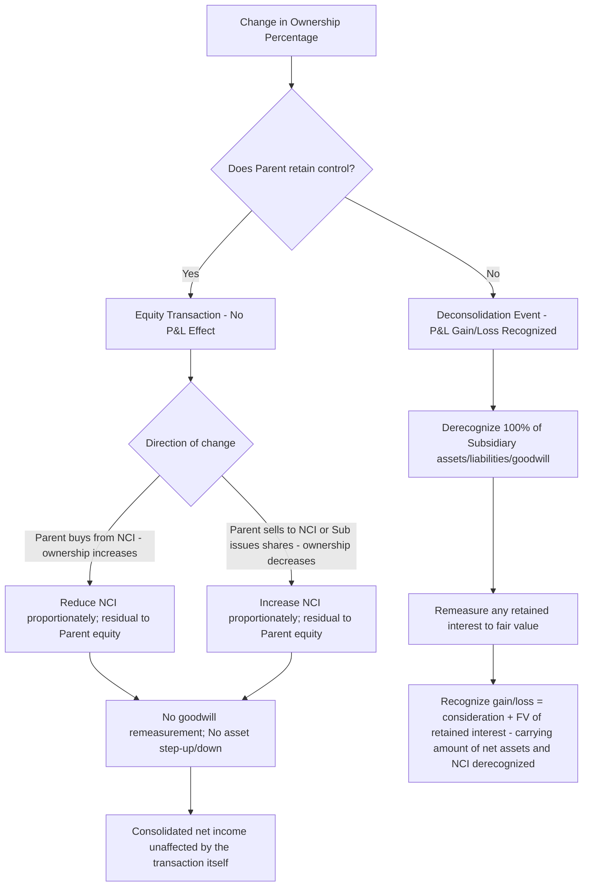

## Changes in Parent Ownership Percentage


### Conceptual Foundation

**Key Points**

- A parent's ownership percentage in a subsidiary can change after the initial acquisition through several distinct transaction types: the parent buying additional shares from NCI, the parent selling some of its shares to NCI or outside parties, the subsidiary issuing new shares to outside parties (diluting the parent), or the subsidiary reacquiring/retiring its own shares (which can either dilute or concentrate the parent's percentage depending on whose shares are retired).
- The **single most important accounting question** for any change in ownership percentage is: **does the parent retain control after the transaction?** This binary determination governs the entire accounting treatment and produces two fundamentally different outcomes:
  1. **Control retained** → accounted for as an **equity transaction** between the controlling and non-controlling interests, with **no gain or loss recognized in consolidated net income** and **no remeasurement of the subsidiary's assets, liabilities, or goodwill**.
  2. **Control lost** → accounted for as a **deconsolidation event**, requiring recognition of a **gain or loss in consolidated net income** and remeasurement of any retained interest to **fair value**.
- This bright-line, control-based distinction is codified consistently under **IFRS 10** (paragraphs on changes in ownership interests) and **US GAAP ASC 810-10-45** (noncontrolling interests) and represents one of the more heavily tested conceptual pivots in this area of consolidation accounting.

### Category 1: Parent Increases Ownership While Retaining Control (Purchase from NCI)

**Key Points**

- When Parent already controls Subsidiary and purchases **additional shares directly from NCI shareholders**, increasing its ownership percentage while remaining in control, this is treated as an **equity transaction** — economically similar to a treasury stock transaction from the perspective of the consolidated entity.
- NCI's carrying amount is reduced by the **proportionate amount** corresponding to the percentage of equity reacquired from NCI (based on NCI's existing carrying amount, not a fair value remeasurement). The **difference** between the cash (or other consideration) paid and the reduction in NCI's carrying amount is recorded directly within **equity attributable to the parent** — typically as an adjustment to Additional Paid-in Capital (US GAAP) or a similar equity reserve (IFRS) — with **no effect on consolidated net income**.
- No portion of goodwill is remeasured, and no step-up (or step-down) of the subsidiary's identifiable net assets to current fair value occurs, because control was already held both before and after the transaction — the transaction is viewed purely as a reallocation of existing equity interests within the same consolidated entity, not a new business combination.

### Example: Parent Purchases Additional Shares from NCI

**Example**

Parent owns 70% of Subsidiary; NCI's carrying amount is $600,000 (30% of $2,000,000 total consolidated equity). Parent purchases an additional 15% directly from NCI shareholders for $340,000 cash, increasing ownership to 85% (NCI reduced to 15%).

- NCI's carrying amount is reduced proportionally: from 30% ($600,000) to 15% ($300,000), a $300,000 reduction (representing half of the original 30%, since 15/30 = 50% of the NCI interest was acquired).
- Parent paid $340,000 for a $300,000 reduction in NCI — the $40,000 excess is charged to Parent's equity:

```plaintext
Dr. Non-Controlling Interest              300,000
Dr. Additional Paid-in Capital (Parent)    40,000
    Cr. Cash                                          340,000
```

If instead Parent had paid **less** than the proportionate NCI reduction (e.g., $270,000 for the same 15% stake), the $30,000 favorable difference would be **credited** to Additional Paid-in Capital rather than debited — either way, the adjustment flows through parent equity, never through the income statement.

### Category 2: Parent Decreases Ownership While Retaining Control (Sale to NCI, or Subsidiary Share Issuance)

**Key Points**

- When Parent **sells** a portion of its shares to NCI shareholders (or the subsidiary **issues new shares** to outside parties that Parent does not proportionately participate in, diluting Parent's percentage) while Parent **retains control**, this is likewise treated as an **equity transaction** with no income statement effect.
- NCI's carrying amount is **increased** by the proportionate share corresponding to the percentage transferred to (or newly issued to) outside parties, and any difference between the consideration received (or, for a share issuance, the proceeds received by Subsidiary allocated to the new shares) and the increase in NCI's carrying amount is recorded directly in Parent's equity.

### Example: Parent Sells Shares to NCI (Control Retained)

**Example**

Parent owns 90% of Subsidiary; total consolidated equity is $3,000,000 (NCI carrying amount = $300,000). Parent sells a 20% interest directly to outside NCI investors for $650,000 cash, reducing its ownership to 70% (NCI increases to 30%).

- NCI's carrying amount increases proportionally: from 10% ($300,000) to 30% ($900,000), a $600,000 increase.
- Parent received $650,000 for a transfer that increases NCI's carrying amount by $600,000 — the $50,000 excess is credited to Parent's equity:

```plaintext
Dr. Cash                                  650,000
    Cr. Non-Controlling Interest                        600,000
    Cr. Additional Paid-in Capital (Parent)                50,000
```

Again, no gain is recognized in consolidated net income despite Parent receiving more cash than the proportionate book value transferred — because control is retained throughout, the entire transaction is confined to the equity section.

### Example: Subsidiary Issues New Shares to Outside Parties (Dilution)

**Example**

Subsidiary (85%-owned by Parent) issues new shares to outside investors for $400,000, and after the issuance, Parent's ownership percentage drops to 75% (still retaining control). Before the issuance, total consolidated equity was $2,500,000 (NCI = $375,000, or 15%).

After the issuance, total consolidated equity becomes $2,900,000 ($2,500,000 + $400,000 proceeds). NCI's new proportionate share (25%) of the new total equity = $725,000.

$$\text{Increase in NCI} = \$725{,}000 - \$375{,}000 = \$350{,}000$$

Since Subsidiary received $400,000 in total proceeds but NCI's carrying amount increased by only $350,000, the $50,000 difference is attributed to Parent's equity (an increase, since NCI "paid" less proportionately than Parent's existing equity base would otherwise imply, benefiting Parent):

```plaintext
[Consolidated effect of subsidiary share issuance]
Dr. Cash (at Subsidiary, flows into consolidated cash)        400,000
    Cr. Non-Controlling Interest                                          350,000
    Cr. Additional Paid-in Capital (Parent)                                50,000
```

[Inference] The precise mechanics of allocating a subsidiary's third-party share issuance between NCI and parent equity can vary in presentation depending on whether the shares were issued at a premium or discount relative to the subsidiary's existing per-share book value, and different texts present the computation with varying degrees of formality; the underlying principle — NCI's carrying amount increases by its new proportionate share of total post-issuance equity, with any residual difference to parent equity — is consistent.

### Illustrative Diagram: Equity Transaction Mechanics (Control Retained)



### Category 3: Loss of Control — Deconsolidation Accounting

**Key Points**

- When a transaction (or series of transactions) causes Parent's ownership or other control rights to fall below the threshold required for control (as assessed under the applicable control model — see related topics on control assessment), the subsidiary must be **deconsolidated**, and the transaction is accounted for as a **sale of the subsidiary** with full gain/loss recognition, **not** as an equity transaction.
- Upon loss of control, the parent must:
  1. **Derecognize** 100% of the subsidiary's assets and liabilities (including goodwill) at their consolidated carrying amounts as of the date control is lost.
  2. **Derecognize** the carrying amount of NCI as of that date.
  3. **Recognize** the fair value of consideration received (if any shares were sold for cash or other consideration).
  4. **Remeasure any retained non-controlling investment** (if Parent keeps a residual stake) to its **acquisition-date... i.e., loss-of-control-date fair value**.
  5. **Recognize the resulting gain or loss** in consolidated net income, computed as the sum of (3) and (4) above, minus the sum of (1) and (2).

### Example: Loss of Control with a Retained Interest

**Example**

Parent owns 80% of Subsidiary. Parent sells 65 percentage points of its interest to an outside party for $1,300,000 cash, retaining a 15% non-controlling interest (Parent no longer controls Subsidiary; the buyer now holds 65% and presumably obtains control, though the specific facts would need to confirm control passed to the buyer). At the date control is lost:

- Carrying amount of Subsidiary's net assets (including goodwill) on the consolidated balance sheet = $2,100,000
- Carrying amount of NCI immediately before this transaction = $420,000 (20% × $2,100,000)
- Fair value of Parent's retained 15% interest = $315,000 (estimated based on the same per-share value implied by the sale transaction)

**Gain/Loss Computation:**

|  | Amount |
| --- | --- |
| Cash received | $1,300,000 |
| Fair value of retained 15% interest | $315,000 |
| Total | $1,615,000 |
| Less: Carrying amount of net assets derecognized | $2,100,000 |
| Add back: Carrying amount of NCI derecognized (removed from equity, not a use of proceeds) | N/A — see note below |

[Inference] The precise formulaic presentation of this gain/loss computation varies by source, but the underlying economic logic is: Parent recognizes a gain/loss equal to the fair value of everything received or retained (cash plus fair value of any retained stake), minus the portion of the subsidiary's net assets that was previously attributable to Parent's controlling interest (i.e., the carrying amount of net assets minus the carrying amount of NCI, since NCI's portion was never "Parent's" to lose in the first place). Using that framing:

$$\text{Parent's Pre-Transaction Share of Net Assets} = \$2{,}100{,}000 - \$420{,}000 = \$1{,}680{,}000$$


$$\text{Gain on Loss of Control} = \$1{,}615{,}000 - \$1{,}680{,}000 = -\$65{,}000 \text{ (a loss)}$$

The resulting $65,000 loss is recognized in **consolidated net income** in the period control is lost — a sharp contrast to the equity-transaction treatment that would have applied had Parent retained control after this sale.

### Illustrative Diagram: Control-Retained vs. Control-Lost Outcomes Compared (svg_diagram)

<svg viewBox="0 0 900 420" xmlns="http://www.w3.org/2000/svg">
<text x="450" y="30" font-size="18" font-weight="bold" text-anchor="middle" fill="#1a1a1a">Control Retained vs. Control Lost: Contrasting Outcomes (svg_diagram)</text>
<rect x="40" y="70" width="380" height="180" rx="8" fill="#e8f0fe" stroke="#4285f4" stroke-width="1.5"/>
<text x="230" y="100" font-size="14" font-weight="bold" text-anchor="middle">CONTROL RETAINED</text>
<text x="230" y="128" font-size="12" text-anchor="middle">Treated as equity transaction</text>
<text x="230" y="148" font-size="12" text-anchor="middle">between CI and NCI</text>
<text x="230" y="175" font-size="12" font-weight="bold" text-anchor="middle">No P&L gain/loss</text>
<text x="230" y="195" font-size="12" text-anchor="middle">No goodwill remeasurement</text>
<text x="230" y="215" font-size="12" text-anchor="middle">No asset step-up/down</text>
<text x="230" y="235" font-size="12" font-weight="bold" text-anchor="middle">Residual → Parent Equity (APIC)</text>
<rect x="480" y="70" width="380" height="180" rx="8" fill="#fce8e6" stroke="#ea4335" stroke-width="1.5"/>
<text x="670" y="100" font-size="14" font-weight="bold" text-anchor="middle">CONTROL LOST</text>
<text x="670" y="128" font-size="12" text-anchor="middle">Treated as a sale/</text>
<text x="670" y="148" font-size="12" text-anchor="middle">deconsolidation event</text>
<text x="670" y="175" font-size="12" font-weight="bold" text-anchor="middle">Gain/loss recognized in P&L</text>
<text x="670" y="195" font-size="12" text-anchor="middle">Derecognize all assets/liabilities/goodwill</text>
<text x="670" y="215" font-size="12" text-anchor="middle">Retained interest remeasured to FV</text>
<text x="670" y="235" font-size="12" font-weight="bold" text-anchor="middle">Fresh-start basis for retained stake</text>
<rect x="150" y="280" width="600" height="110" rx="8" fill="#fef7e0" stroke="#f9ab00" stroke-width="1.5"/>
<text x="450" y="308" font-size="13" font-weight="bold" text-anchor="middle">The Determinative Question</text>
<text x="450" y="335" font-size="12" text-anchor="middle">Not "how much did the ownership percentage change?"</text>
<text x="450" y="355" font-size="12" font-weight="bold" text-anchor="middle">but "does the parent retain CONTROL after the transaction?"</text>
<text x="450" y="375" font-size="12" text-anchor="middle">A 40-point drop that retains control ≠ a 5-point drop that loses it</text>
</svg>

### Step Acquisitions — The Reverse Scenario (Achieving Control)

**Key Points**

- The mirror-image scenario — where Parent **increases** its ownership from a **non-controlling** position (e.g., an equity-method investment or available-for-sale investment) to a **controlling** position (a "step acquisition" or "business combination achieved in stages") — is accounted for very differently from the Category 1 scenario above, precisely because control was **not** held before the transaction.
- In a step acquisition, the **previously held equity interest is remeasured to its acquisition-date fair value**, with any resulting gain or loss recognized in **consolidated net income** — this is conceptually the mirror image of the loss-of-control remeasurement, applied at the moment control is **gained** rather than lost.
- [Inference] Step acquisitions are typically treated as a related but distinct sub-topic (often covered separately under "business combinations achieved in stages"), since the accounting question there is fundamentally about **initial recognition** of a new business combination (with a remeasurement gain/loss on the previously held stake) rather than a post-acquisition change in an already-controlled subsidiary's ownership structure, which is the focus of this topic.

### Subsidiary Reacquisition of Its Own Shares (Treasury Stock at the Subsidiary Level)

**Key Points**

- If Subsidiary **reacquires (buys back)** its own shares from outside NCI shareholders (funded by Subsidiary's own cash, not Parent's), this **increases** Parent's proportionate ownership percentage (since NCI's shares outstanding decrease while Parent's shares outstanding are unchanged) — even though Parent did not personally transact with anyone.
- This is treated consistently with Category 1 above (equity transaction, assuming Parent retains control, which is the overwhelmingly typical outcome of a subsidiary treasury stock purchase): NCI's carrying amount is reduced proportionally, with any residual difference between the reacquisition price and the proportionate NCI reduction charged/credited to Parent's equity.
- [Unverified] In rare fact patterns where a subsidiary's treasury stock buyback is structured or sized such that it could plausibly affect *voting* control dynamics beyond a simple percentage recalculation (e.g., combined with other governance changes), a more careful control reassessment would be warranted; but the ordinary case of a subsidiary buying back a modest percentage of outstanding shares while the parent's absolute voting rights are unaffected is treated as a straightforward equity transaction.

### Common Errors and Review Points

**Key Points**

- Recognizing a gain or loss on the income statement for any ownership percentage change, without first confirming whether **control** was retained — this is the single most common conceptual error in this topic area.
- Remeasuring goodwill or stepping the subsidiary's identifiable net assets up/down to fair value when Parent merely increases or decreases its ownership percentage **while retaining control** — no such remeasurement occurs in a pure equity transaction.
- Failing to remeasure a **retained** interest to fair value upon loss of control, instead carrying it forward at its pre-existing consolidated carrying amount — the retained interest must receive fresh-start fair value treatment at the date control is lost, becoming the new cost basis for subsequent equity-method or fair-value accounting.
- Confusing a **step acquisition** (gaining control from a non-controlling starting position, requiring remeasurement of the previously held stake) with a Category 1 **ownership increase while already controlling** (no remeasurement, simple equity transaction) — these are governed by entirely different accounting models despite superficially similar fact patterns ("Parent buys more shares").
- Overlooking those subsidiary-level transactions — new share issuances to outside parties, or subsidiary treasury stock buybacks — that change Parent's ownership percentage **without any transaction directly involving Parent itself**; these still trigger the same equity-transaction (or, if control is lost, deconsolidation) mechanics.
- Applying a floor of zero to NCI's carrying amount reduction in a Category 1 purchase-from-NCI transaction, rather than allowing NCI to be reduced (or even go negative, in extreme cases) consistent with its actual proportionate carrying amount.

### Conclusion

**Conclusion**

Changes in a parent's ownership percentage in an already-controlled subsidiary are governed by a single determinative question: does the parent retain control after the transaction? When control is retained — whether the parent buys additional shares from NCI, sells shares to NCI, the subsidiary issues new shares to outside parties, or the subsidiary repurchases its own shares from NCI — the transaction is treated purely as a reallocation of equity between the controlling and non-controlling interests, with NCI's carrying amount adjusted proportionately and any residual difference charged directly to parent equity, with no effect on consolidated net income, goodwill, or the subsidiary's asset basis. When control is lost, the transaction is instead treated as a sale of the subsidiary, requiring full derecognition of the subsidiary's assets, liabilities, and goodwill, fair value remeasurement of any retained interest, and recognition of the resulting gain or loss in consolidated net income. This same control-based framework, applied in reverse, governs step acquisitions in which a previously non-controlling interest becomes controlling, triggering fair value remeasurement of the previously held stake as of the date control is achieved.

**Related Topics**

- Measurement and presentation of noncontrolling interests (initial measurement, full vs. partial goodwill methods)
- Step acquisitions and business combinations achieved in stages
- Loss of control and deconsolidation accounting in depth
- Control assessment under IFRS 10 and ASC 810 (voting control, VIEs, potential voting rights)
- Consolidated statement of cash flows — presentation of proceeds from ownership changes
- Equity-method accounting for retained non-controlling investments post-deconsolidation
- Complex ownership structures: multi-tier and reciprocal (mutual) shareholdings
- Push-down accounting considerations following a change in control
- Variable interest entities (VIEs) — reconsideration events and changes in variable interests
- Forensic red flags: structuring transactions to avoid or artificially trigger loss-of-control recognition