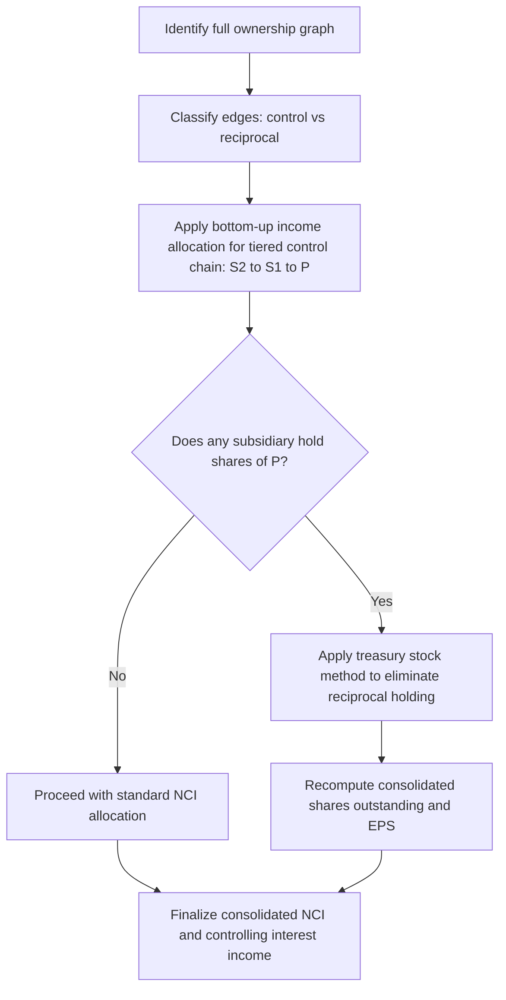

## Multi-level and Reciprocal Ownership Structures

### Overview and Conceptual Framework

Multi-level (indirect/tiered) ownership and reciprocal (mutual) ownership structures arise when consolidation involves more than a simple parent-subsidiary pair. These structures complicate the computation of consolidated net income, noncontrolling interest (NCI), and retained earnings because ownership percentages must be traced through multiple corporate layers, and in reciprocal arrangements, ownership flows in a loop rather than a single direction.

Two distinct structural patterns are addressed:

- **Multi-level (chain/tiered) ownership**: Parent (P) owns a controlling interest in Subsidiary 1 (S1), which in turn owns a controlling interest in Subsidiary 2 (S2). Control and income flow through a chain: P → S1 → S2.
- **Reciprocal (mutual) ownership**: Two or more affiliated companies hold stock in each other, either directly (S1 owns shares of P) or through an affiliate structure, creating circular ownership.

Both patterns require careful allocation of consolidated income and NCI because a single dollar of subsidiary income may be attributable, in part, to owners at multiple levels of the corporate structure.

### Multi-Level (Indirect) Ownership Structures

#### Structural Pattern

In a tiered structure:

$$P \rightarrow \text{owns } x\% \text{ of } S1$$

$$S1 \rightarrow \text{owns } y\% \text{ of } S2$$

P's **indirect** (effective) ownership of S2 is the product of the ownership percentages along the chain:

$$\text{Indirect ownership of P in } S2 = x\% \times y\%$$

**Example:** P owns 80% of S1. S1 owns 70% of S2.

- P's direct ownership of S1 = 80%
- P's indirect ownership of S2 = $0.80 \times 0.70 = 0.56$, i.e., 56%
- NCI's interest in S2 = 44% (composed of S1's own 30% NCI stake times S1's ownership, plus S1 NCI's indirect claim — detailed below)

#### Income Allocation in Tiered Structures: Bottom-Up Approach

The standard technique is a **bottom-up consolidation of income**, working from the lowest-tier subsidiary upward:

**Step 1 — Determine S2's adjusted net income.** Start with S2's reported net income, adjust for any unrealized intercompany profits originating in transactions between S2 and its affiliates (S1 or P), and amortization of acquisition-date fair value adjustments (AAP — acquisition accounting premium) applicable to S2.

**Step 2 — Allocate S2's income between S1 and S2's NCI.**

$$\text{S1's share of S2 income} = \text{S2 adjusted NI} \times 70\%$$

$$\text{S2 NCI's share} = \text{S2 adjusted NI} \times 30\%$$

**Step 3 — Determine S1's "own" adjusted net income** (S1's separate operations, excluding equity in S2), adjusted for unrealized profits on intercompany transactions between S1 and P, and S1-level AAP amortization.

**Step 4 — Compute S1's total income available for allocation:**

$$\text{S1 total income} = \text{S1 own adjusted NI} + \text{S1's share of S2 income (from Step 2)}$$

**Step 5 — Allocate S1's total income between P and S1's NCI:**

$$\text{P's share} = \text{S1 total income} \times 80\%$$

$$\text{S1 NCI's share} = \text{S1 total income} \times 20\%$$

**Step 6 — Aggregate NCI.** Total consolidated NCI in net income equals S2 NCI's direct share (Step 2) *plus* S1 NCI's share of S1's total income (Step 5), since S1's total income already embeds its portion of S2's earnings.

$$\text{Total NCI} = (\text{S2 NCI\%} \times \text{S2 NI}) + (\text{S1 NCI\%} \times [\text{S1 own NI} + \text{S1's share of S2 NI}])$$

This bottom-up cascading is essential: NCI holders of the intermediate company (S1) have a claim not only on S1's standalone earnings but also on the portion of S2's earnings that flows through S1's ownership stake, because they hold a proportionate interest in S1 as a whole (including its investment in S2).

#### Worked Numerical Example

Assume:

- P owns 80% of S1; S1 owns 70% of S2
- S2 reports net income of $200,000 (no AAP adjustments, no unrealized profits, for simplicity)
- S1 reports separate (own-operations) net income of $300,000

Applying the steps:

| Step | Calculation | Amount |
| --- | --- | --- |
| S2 NI | Given | $200,000 |
| S1's share of S2 NI | $200,000 × 70% | $140,000 |
| S2 NCI share | $200,000 × 30% | $60,000 |
| S1 total income | $300,000 + $140,000 | $440,000 |
| P's share of S1 total income | $440,000 × 80% | $352,000 |
| S1 NCI share | $440,000 × 20% | $88,000 |
| **Total consolidated NCI** | $60,000 + $88,000 | **$148,000** |
| **Income to controlling interest (P)** | $352,000 | **$352,000** |
| **Total consolidated net income** | $352,000 + $148,000 | **$500,000** |

Verification: total consolidated net income should equal the sum of all separate-company incomes (S2 NI + S1 own NI) = $200,000 + $300,000 = $500,000. This ties out, confirming the allocation is internally consistent.

#### Consolidation Worksheet Mechanics

In the consolidation worksheet, the elimination entries proceed in the same bottom-up sequence:

1. Eliminate S1's Investment in S2 account against S2's stockholders' equity (at the S1-S2 level), recognizing S2 NCI.
2. Roll S1's equity-method income from S2 into S1's books (if S1 uses the equity method for internal reporting) or recognize it directly in the worksheet.
3. Eliminate P's Investment in S1 account against S1's stockholders' equity (which now includes S1's equity interest in S2), recognizing S1 NCI.

**[Inference]** In practice, many systems apply the equity method at each level sequentially (S1 books equity in S2, then P books equity in S1) before consolidation entries are prepared, which mechanically produces the same bottom-up cascading result without requiring separate worksheet-level percentage calculations at the top.

#### Consolidated Retained Earnings and NCI in Equity

The same bottom-up logic extends to cumulative (balance sheet) allocations:

$$\text{Consolidated NCI (balance sheet)} = \text{S2 NCI\%} \times \text{S2 net assets at fair value} + \text{S1 NCI\%} \times (\text{S1 own net assets at fair value} + \text{S1's equity in S2 net assets})$$

Retained earnings attributable to the controlling interest is built up analogously, tracking cumulative income since acquisition, dividends, and AAP amortization at each tier.

### Reciprocal (Mutual) Ownership Structures

#### Structural Pattern

Reciprocal ownership occurs when a subsidiary holds shares of its own parent (or grandparent). Common configurations:

- **Direct reciprocal holding**: P owns x% of S; S owns y% of P.
- **Indirect reciprocal holding**: P owns S1; S1 owns shares of P (rather than of S2), creating a circular loop through an intermediate entity.

This creates a mathematical circularity: S's net income depends partly on its investment income from P, and P's net income depends partly on its investment income from S — each is a function of the other.

#### Two Accounting Approaches to Reciprocal Holdings

**1. Treasury Stock Approach**

Under this method, the parent's shares held by the subsidiary are treated as **treasury stock** of the consolidated entity — they are not treated as an outstanding equity interest of a third party. Practically:

- Consolidated shares outstanding for EPS purposes are reduced by the shares S holds in P.
- No investment income or dividend income is recognized reciprocally on P's own shares held by S; the "investment" account representing S's holding of P stock is eliminated against consolidated paid-in capital, analogous to a treasury stock purchase.
- This is the predominant method in **U.S. GAAP practice** for parent shares held by a consolidated subsidiary, because from the perspective of the single economic entity, a subsidiary's purchase of parent stock is economically equivalent to the parent buying back its own stock.

**2. Conventional (Simultaneous Equations) Approach**

Under this method, S's holding of P stock is treated as a **genuine outside investment**, and reciprocal income must be solved simultaneously because each entity's income depends on the other's:

$$NI_P = \text{Own income}_P + (\%_{P \to S}) \times NI_S$$

$$NI_S = \text{Own income}_S + (\%_{S \to P}) \times NI_P$$

This is a system of two linear equations in two unknowns ($NI_P$ and $NI_S$), solved by substitution.

**Worked Example — Simultaneous Equations Method**

Assume:

- P owns 80% of S; S owns 10% of P (mutual holding)
- P's own (separate) operating income = $400,000
- S's own (separate) operating income = $150,000

Set up the equations:

$$NI_P = 400{,}000 + 0.80 \times NI_S$$

$$NI_S = 150{,}000 + 0.10 \times NI_P$$

Substitute the second equation into the first:

$$NI_P = 400{,}000 + 0.80 \times (150{,}000 + 0.10 \times NI_P)$$

$$NI_P = 400{,}000 + 120{,}000 + 0.08 \times NI_P$$

$$NI_P - 0.08 NI_P = 520{,}000$$

$$0.92 \times NI_P = 520{,}000$$

$$NI_P = 565{,}217.39$$

Then:

$$NI_S = 150{,}000 + 0.10 \times 565{,}217.39 = 206{,}521.74$$

Consolidated NCI (the 20% outside interest in S, and — if S's 10% stake in P is treated as a genuine outside claim — potentially an offset for P's "self-owned" income) is then computed from $NI_S$ and $NI_P$ under whichever convention the specific reciprocal-ownership variant requires.

**[Inference]** The simultaneous equations approach is primarily a teaching/analytical device found in academic treatments of consolidation theory; the treasury stock method is more consistent with the "single economic entity" concept underlying ASC 810 and is more commonly encountered in applied consolidated financial statement preparation. Firms should evaluate specific facts against current authoritative guidance, as practice can vary by structure and jurisdiction.

#### Balance Sheet Elimination for Reciprocal Holdings

Under the treasury stock approach, the elimination entry (in the consolidation worksheet) typically:

1. Eliminates S's "Investment in P" asset account.
2. Debits consolidated Treasury Stock (or reduces additional paid-in capital / common stock, depending on cost vs. par value method) for the same amount.
3. Removes any dividend income S recorded from holding P shares, and any dividends P declared that were paid to S on those shares, from consolidated dividend and retained earnings rollforwards.

### Multi-Level Structures Combined with Reciprocal Holdings

More complex fact patterns combine tiered ownership with reciprocal holdings — for example, P owns S1, S1 owns S2, and S2 holds shares of P. These require:

1. Identifying the full ownership graph (a directed graph where nodes are entities and edges are ownership percentages).
2. Determining which holdings represent controlling interests (which define the consolidation perimeter) versus reciprocal/mutual holdings of the parent's own equity.
3. Applying bottom-up income allocation (multi-level technique) to establish each entity's "own plus indirect" income.
4. Applying the treasury stock (or simultaneous equations) treatment specifically to any loop where a consolidated entity holds shares of the ultimate parent.

**Diagram — Combined tiered and reciprocal structure (svg_diagram)**

<svg xmlns="http://www.w3.org/2000/svg" viewBox="0 0 640 420" font-family="Arial, sans-serif">
<text x="320" y="30" text-anchor="middle" font-size="16" font-weight="bold">Multi-level and Reciprocal Ownership (svg_diagram)</text>
<rect x="260" y="60" width="120" height="60" rx="8" fill="#dbeafe" stroke="#1e3a8a" stroke-width="2" />
<text x="320" y="95" text-anchor="middle" font-size="14" font-weight="bold">Parent (P)</text>
<rect x="90" y="200" width="120" height="60" rx="8" fill="#dcfce7" stroke="#166534" stroke-width="2" />
<text x="150" y="235" text-anchor="middle" font-size="14" font-weight="bold">Subsidiary 1 (S1)</text>
<rect x="430" y="200" width="120" height="60" rx="8" fill="#fef9c3" stroke="#854d0e" stroke-width="2" />
<text x="490" y="235" text-anchor="middle" font-size="14" font-weight="bold">Subsidiary 2 (S2)</text>
<rect x="260" y="340" width="120" height="60" rx="8" fill="#fee2e2" stroke="#991b1b" stroke-width="2" />
<text x="320" y="365" text-anchor="middle" font-size="13" font-weight="bold">NCI (S1, 20%)</text>
<text x="320" y="382" text-anchor="middle" font-size="12">Outside owners</text>
<line x1="290" y1="120" x2="180" y2="200" stroke="#1e3a8a" stroke-width="2" marker-end="url(#arrow)" />
<text x="205" y="155" font-size="12">80%</text>
<line x1="210" y1="230" x2="430" y2="230" stroke="#166534" stroke-width="2" marker-end="url(#arrow)" />
<text x="300" y="220" font-size="12">S1 owns 70% of S2</text>
<line x1="490" y1="200" x2="360" y2="120" stroke="#854d0e" stroke-width="2" stroke-dasharray="6,4" marker-end="url(#arrow)" />
<text x="440" y="150" font-size="12">S2 holds 5% of P</text>
<text x="440" y="165" font-size="12">(reciprocal loop)</text>
<line x1="220" y1="290" x2="290" y2="340" stroke="#991b1b" stroke-width="2" />
<text x="230" y="320" font-size="12">20% NCI in S1</text>
</svg>

**Consolidation logic flow for combined structures:**

### Forensic Accounting Considerations

Multi-level and reciprocal ownership structures are of particular interest in forensic accounting because they can be exploited to:

- **Obscure related-party transactions**: Income can be shifted between entities in a chain to manage reported results at the level most beneficial to management (e.g., meeting analyst expectations at the parent level while burying losses at a lower tier).
- **Circular revenue recognition schemes**: Reciprocal ownership combined with reciprocal transactions (e.g., P sells services to S2, S2's fees fund distributions back through S1 to P) can create the appearance of externally generated revenue that is, in substance, internally circulated cash.
- **Inflated consolidated equity via reciprocal stock**: If reciprocal holdings are *not* properly treated as treasury stock, the consolidated entity could effectively report its own equity as an asset (Investment account) and simultaneously report it as outstanding equity — a double-count that inflates both total assets and total equity. Forensic examiners specifically test for this by tracing every "Investment in affiliate" account back to confirm it is eliminated, not double-counted.
- **NCI minority-squeeze schemes**: In multi-level structures, controlling shareholders at the top may use intercompany pricing, management fees, or intercompany loans between tiers to divert value away from lower-tier NCI holders (a "tunneling" concern well documented in cross-listed and pyramid-structured groups internationally).

**[Inference]** Forensic investigations of pyramidal/tiered group structures (common in some emerging-market conglomerates and family-controlled business groups) often specifically map the full ownership graph as a first analytical step, because control (voting power at each tier) can diverge substantially from cash-flow rights (the multiplied ownership percentage), and this wedge is a documented mechanism for expropriation of minority shareholders in the academic corporate governance literature.

### Key Points

- Multi-level ownership requires **bottom-up income allocation**, starting at the lowest tier and cascading upward; each intermediate company's NCI shares in both its own income and its proportionate share of lower-tier subsidiary income.
- Indirect ownership percentage equals the **product** of ownership percentages along the chain, but this indirect percentage is used for control/consolidation-scope analysis, not as a shortcut that replaces the step-by-step income allocation.
- Reciprocal ownership creates circular income determination, resolved either through the **treasury stock method** (predominant, treats parent shares held by subsidiary as treasury stock of the group) or the **simultaneous equations (conventional) method** (treats it as a genuine mutual investment).
- Total consolidated net income must always reconcile to the sum of all separate-entity net incomes (adjusted for intercompany eliminations and AAP amortization) — this is a critical control check in any tiered consolidation.
- Divergence between voting control and cash-flow (economic) rights in pyramidal structures is a recognized red flag in forensic and corporate governance analysis.

### Related Topics

- Step acquisitions and changes in ownership interest without loss of control
- Variable interest entities (VIEs) and the primary beneficiary analysis in tiered structures
- Push-down accounting in multi-tier acquisitions
- Intercompany profit elimination in upstream, downstream, and lateral transactions
- Consolidated statement of cash flows with multiple NCI layers
- Pyramidal ownership structures and the wedge between control rights and cash-flow rights (corporate governance/forensic literature)
- Deconsolidation and loss of control at an intermediate tier