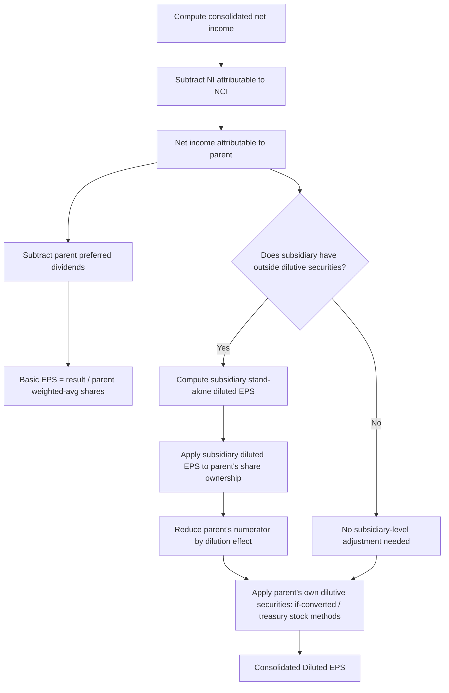

## Consolidated Earnings per Share with Noncontrolling Interests

### Overview and Governing Framework

Consolidated earnings per share (EPS) computations become substantially more complex when a reporting entity has one or more less-than-wholly-owned subsidiaries. The core principle under **ASC 260 (Earnings Per Share)** is that consolidated EPS must reflect only the earnings attributable to the **parent's common shareholders** — noncontrolling interest (NCI) holders' claims on subsidiary earnings must be excluded from the numerator, and the parent's own common share count (not the subsidiary's) governs the denominator. Complexity increases further when the subsidiary itself has a complex capital structure with potentially dilutive securities (convertible bonds, stock options, warrants, convertible preferred stock) held by parties outside the consolidated group.

### Basic EPS: Numerator Construction

**Step 1 — Start with consolidated net income.**

$$\text{Consolidated Net Income} = \text{Parent's own income} + \text{Subsidiary's income (100\%)}$$

**Step 2 — Subtract net income attributable to noncontrolling interests.**

$$\text{Net Income Attributable to Parent} = \text{Consolidated NI} - \text{NI Attributable to NCI}$$

This "Net Income Attributable to Parent" line (required to be presented separately on the face of the income statement under ASC 810) is the correct **starting numerator** for basic EPS — never consolidated net income before the NCI deduction.

**Step 3 — Subtract preferred dividends (parent-level).**

$$\text{Basic EPS Numerator} = \text{NI Attributable to Parent} - \text{Preferred Dividends (Parent's own preferred stock)}$$

**Step 4 — Divide by weighted-average parent common shares outstanding.**

$$\text{Basic EPS} = \frac{\text{NI Attributable to Parent} - \text{Preferred Dividends}}{\text{Weighted-Average Parent Common Shares Outstanding}}$$

Note that the subsidiary's own share count is **never** part of the consolidated EPS denominator — the denominator is exclusively the parent entity's common shares, since consolidated financial statements are, by definition, prepared from the perspective of the parent's shareholders.

### Basic EPS Worked Example

Assume:

- Consolidated net income = $1,000,000
- Subsidiary is 75% owned; NCI attributable income = $150,000
- Net income attributable to parent = $1,000,000 − $150,000 = $850,000
- Parent has $50,000 of preferred dividends declared on its own preferred stock
- Weighted-average parent common shares outstanding = 400,000

$$\text{Basic EPS} = \frac{850{,}000 - 50{,}000}{400{,}000} = \frac{800{,}000}{400{,}000} = \$2.00 \text{ per share}$$

### Diluted EPS: The Core Complication

Diluted EPS becomes significantly more intricate because **dilutive securities can exist at either the parent level or the subsidiary level**, and subsidiary-level dilutive securities affect the parent's consolidated EPS indirectly — through their effect on the amount of subsidiary income allocable to the parent, not through the parent's own share count.

#### Case 1: Dilutive Securities at the Parent Level Only

This is treated identically to single-entity diluted EPS under ASC 260: apply the treasury stock method to options/warrants and the if-converted method to convertible securities, adjusting both the numerator (add back after-tax interest or preferred dividends avoided) and denominator (add incremental shares) as usual. The "Net Income Attributable to Parent" figure (already net of NCI) is used as the base numerator before dilutive adjustments.

#### Case 2: Dilutive Securities at the Subsidiary Level (Held by Outside Parties)

This is the distinctive complexity of consolidated diluted EPS. When a subsidiary has potentially dilutive securities outstanding that are held by parties *outside* the consolidated group (i.e., not held by the parent), exercising or converting those securities would **dilute the subsidiary's earnings among a larger number of subsidiary shares**, which in turn **reduces the amount of subsidiary income allocable to the parent**.

**Methodology:**

1. Compute the subsidiary's **diluted EPS** as if it were a stand-alone public company, including all of its own potentially dilutive securities (whether held by the parent, by NCI holders, or by unrelated third parties).
2. Determine the parent's **percentage ownership** of the subsidiary's common stock (and any common stock equivalents the parent holds).
3. Multiply the subsidiary's diluted EPS by the *number of subsidiary shares the parent owns* (or by the parent's ownership percentage applied to the subsidiary's diluted net income) to determine the parent's share of subsidiary earnings **on a diluted basis**.
4. Substitute this diluted (reduced) figure for the previously-used pro-rata share of subsidiary income in the parent's consolidated income available to common shareholders.
5. The reduction (the difference between the parent's pro-rata share of subsidiary income used at the "basic" level and the lower diluted amount) flows through as a reduction to the numerator of the **parent's own diluted EPS calculation** — with no effect on the parent's denominator, since the dilutive securities are shares of the subsidiary, not the parent.

#### Worked Example — Subsidiary-Level Dilutive Securities

Assume:

- Subsidiary S is 80%-owned by Parent P.
- S's net income = $500,000.
- S has convertible bonds outstanding, held entirely by outside (non-P) investors, convertible into 50,000 shares of S common stock. After-tax interest expense on these bonds = $20,000.
- S's basic weighted-average shares outstanding = 200,000.
- S's basic EPS = $500,000 / 200,000 = $2.50.

**S's diluted EPS (as a stand-alone entity):**

$$\text{S Diluted EPS} = \frac{500{,}000 + 20{,}000}{200{,}000 + 50{,}000} = \frac{520{,}000}{250{,}000} = \$2.08$$

**Parent's basic share of S's income** (used in P's basic consolidated EPS numerator):

$$80\% \times \$500{,}000 = \$400{,}000$$

**Parent's diluted share of S's income**, using S's diluted EPS applied to the shares P actually holds (assume P holds 160,000 of S's 200,000 basic shares, i.e., 80%):

$$160{,}000 \text{ shares} \times \$2.08 = \$332{,}800$$

**Impact on P's consolidated diluted EPS numerator:**

$$\text{Reduction} = \$400{,}000 - \$332{,}800 = \$67{,}200$$

This $67,200 reduction is subtracted from P's income available to common shareholders when computing **P's own diluted EPS**, even though P's own share count and P's own securities are entirely unaffected. P's basic EPS is unchanged; only P's diluted EPS reflects the dilutive impact of S's outside convertible bonds.

### Reconciliation Table — Basic vs. Diluted, Parent-Level Effects Only

| Component | Basic EPS (Parent) | Diluted EPS (Parent) |
| --- | --- | --- |
| Consolidated NI | $X | $X |
| Less: NI attributable to NCI (basic allocation) | ($Y) | ($Y adjusted for sub-level dilution, if applicable) |
| Effect of subsidiary's own dilutive securities | Not applicable | Reduces P's share of subsidiary income allocable to P |
| Effect of parent's own dilutive securities | Not applicable | Add-back adjustments to numerator; incremental shares to denominator |
| Denominator | Parent weighted-avg shares | Parent weighted-avg shares + parent's own dilutive share equivalents |

### Treatment When the Parent Holds Convertible Securities of the Subsidiary

A distinct scenario arises when the **parent itself** holds convertible preferred stock or convertible debt issued by the subsidiary. If the parent's conversion of those subsidiary securities into subsidiary common stock would **increase** the parent's economic interest in the subsidiary, this is analyzed under the **if-converted method applied at the consolidation level**: the additional subsidiary shares the parent would receive on conversion are treated as if already converted, which typically *increases* (not decreases) the parent's share of subsidiary income, because a larger share of that income would then be attributed to the parent rather than to NCI. Under ASC 260's antidilution rules, this adjustment is only included in the diluted EPS computation if its net effect is dilutive to the parent's own consolidated diluted EPS (i.e., it must reduce EPS or increase loss per share to be included; antidilutive adjustments are excluded).

### Sequencing Rule for Multiple Dilutive Securities (Most Dilutive First)

When a subsidiary has multiple classes of potentially dilutive securities, ASC 260 requires the entity to determine dilutive sequencing by ranking securities from **most dilutive to least dilutive** (lowest incremental EPS impact first), testing each incrementally for whether it is dilutive or antidilutive at the subsidiary level, and only then flowing the resulting subsidiary diluted EPS figure up into the parent's consolidated computation. **[Inference]** Because this sequencing must be performed at the subsidiary's own EPS level before flowing results upward, entities with subsidiaries that have several tiers of convertible instruments (converts, options, and convertible preferred, for example) generally need to fully complete the subsidiary's own stand-alone diluted EPS schedule (including the sequencing/ranking test) as a discrete first step, rather than attempting to blend the parent and subsidiary calculations simultaneously.

### Process Flow Diagram

### Illustrative Structure Diagram (svg_diagram)

<svg xmlns="http://www.w3.org/2000/svg" viewBox="0 0 620 320" font-family="Arial, sans-serif">
<text x="310" y="28" text-anchor="middle" font-size="16" font-weight="bold">Consolidated EPS Numerator Flow (svg_diagram)</text>
<rect x="30" y="60" width="180" height="50" rx="6" fill="#dbeafe" stroke="#1e3a8a" stroke-width="2" />
<text x="120" y="90" text-anchor="middle" font-size="13">Consolidated Net Income</text>
<rect x="30" y="140" width="180" height="50" rx="6" fill="#fee2e2" stroke="#991b1b" stroke-width="2" />
<text x="120" y="165" text-anchor="middle" font-size="12">Less: NI to NCI</text>
<text x="120" y="180" text-anchor="middle" font-size="11">(basic allocation)</text>
<rect x="30" y="220" width="180" height="50" rx="6" fill="#dcfce7" stroke="#166534" stroke-width="2" />
<text x="120" y="250" text-anchor="middle" font-size="12">NI Attributable to Parent</text>
<rect x="330" y="60" width="220" height="70" rx="6" fill="#fef9c3" stroke="#854d0e" stroke-width="2" />
<text x="440" y="85" text-anchor="middle" font-size="12">Subsidiary Outside Dilutive</text>
<text x="440" y="100" text-anchor="middle" font-size="12">Securities Increase Sub Shares</text>
<text x="440" y="115" text-anchor="middle" font-size="11">Reduces Sub Income per Share</text>
<rect x="330" y="220" width="220" height="50" rx="6" fill="#e0e7ff" stroke="#3730a3" stroke-width="2" />
<text x="440" y="245" text-anchor="middle" font-size="12">Reduced Parent Share</text>
<text x="440" y="260" text-anchor="middle" font-size="11">of Subsidiary Income</text>
<line x1="120" y1="110" x2="120" y2="140" stroke="#333" stroke-width="2" marker-end="url(#arrow2)" />
<line x1="120" y1="190" x2="120" y2="220" stroke="#333" stroke-width="2" marker-end="url(#arrow2)" />
<line x1="330" y1="95" x2="210" y2="95" stroke="#854d0e" stroke-width="2" stroke-dasharray="5,3" marker-end="url(#arrow2)" />
<line x1="440" y1="130" x2="440" y2="220" stroke="#333" stroke-width="2" marker-end="url(#arrow2)" />
<line x1="330" y1="245" x2="210" y2="245" stroke="#333" stroke-width="2" marker-end="url(#arrow2)" />
<text x="270" y="238" text-anchor="middle" font-size="10">Feeds diluted</text>
<text x="270" y="250" text-anchor="middle" font-size="10">numerator</text>
</svg>

### Presentation and Disclosure Requirements

- Companies must present **basic and diluted EPS** for income from continuing operations and net income, both on a consolidated basis, on the face of the income statement.
- Net income attributable to the parent (excluding NCI) is the figure used in the EPS reconciliation, and this reconciliation (from income to income available to common shareholders, including all adjustments) must be disclosed in the notes per ASC 260-10-50.
- If a subsidiary's securities are publicly traded (common in partial spin-off or majority-owned public subsidiary situations), the subsidiary separately computes and discloses **its own EPS** in its own stand-alone financial statements, using its own share count — this is entirely distinct from, and not to be confused with, the parent's consolidated EPS computation.

### Forensic and Analytical Considerations

- **EPS management through subsidiary dilutive instrument design**: Structuring convertible instruments at the subsidiary level (rather than the parent level) can, in certain fact patterns, produce different consolidated diluted EPS outcomes than issuing economically similar instruments directly at the parent level, because the dilution flows through an indirect allocation mechanism rather than a direct share-count addition. Forensic and technical accounting review of consolidated EPS should trace whether dilutive securities are correctly identified as parent-level versus subsidiary-level, since misclassification changes both the mechanics and the magnitude of the dilutive adjustment.
- **NCI income allocation manipulation**: Since NI attributable to NCI is subtracted before computing EPS, any error or manipulation in the NCI allocation methodology (e.g., incorrect ownership percentages, mis-measured AAP amortization, or improperly excluded intercompany eliminations, as discussed in tiered and reciprocal ownership analysis) directly and proportionately misstates consolidated EPS.
- **Antidilution screening errors**: Because each potentially dilutive security (at both parent and subsidiary levels) must be independently tested for whether it is dilutive or antidilutive, and because subsidiary-level securities interact with the parent's numerator in a non-obvious way, EPS restatements related to complex ownership structures are a recurring category of technical accounting correction; reviewers should reperform the full sequencing and antidilution test independently rather than relying on management's characterization.

### Key Points

- Consolidated EPS numerator always starts from **net income attributable to the parent** (after NCI), never total consolidated net income.
- The **denominator is always the parent's own share count** — the subsidiary's shares never enter the parent's EPS denominator directly.
- Subsidiary-level dilutive securities held by outside parties dilute **subsidiary earnings per subsidiary share**, which reduces the *amount* of subsidiary income allocable to the parent — this operates entirely through the numerator, not the denominator, of the parent's consolidated diluted EPS.
- Parent-level dilutive securities are treated with the standard treasury stock / if-converted methodology under ASC 260, unaffected by the subsidiary-level analysis.
- Antidilution testing and most-dilutive-first sequencing must be performed independently at the subsidiary level before subsidiary results are incorporated into the parent's consolidated diluted EPS.

### Related Topics

- Complex capital structures and the if-converted / treasury stock methods under ASC 260
- Contingently issuable shares and their effect on diluted EPS
- Push-down accounting and its interaction with subsidiary-level EPS reporting
- Spin-offs and carve-out financial statements with separately traded subsidiary equity
- Multi-level and reciprocal ownership structures (income and NCI allocation mechanics)
- Antidilution sequencing tests for multiple convertible instrument classes
- SEC reporting requirements for majority-owned public subsidiaries