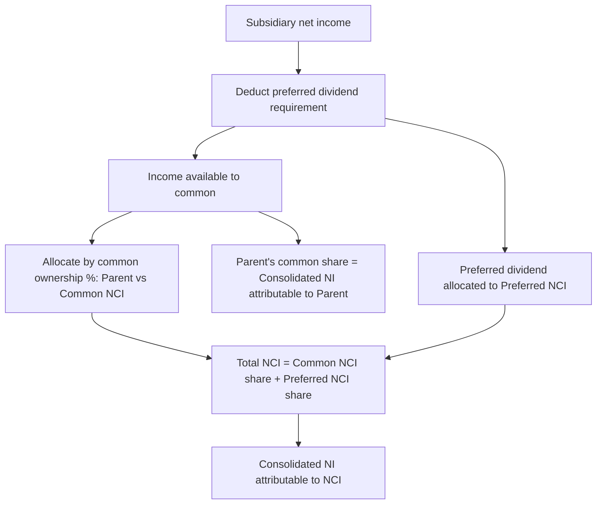

## Subsidiary Preferred Stock Considerations

### Overview

When a subsidiary has outstanding preferred stock held by parties outside the consolidated group, consolidation accounting must address two distinct issues: (1) how the subsidiary's preferred dividends and liquidation preferences affect the computation of the **common** stockholders' equity and income that is being allocated between the parent and noncontrolling interests (NCI), and (2) how to classify and measure the subsidiary preferred stock itself within the consolidated financial statements. The presence of subsidiary preferred stock introduces a "first claim" layer that must be carved out before ordinary common-stock ownership percentages can be applied.

### Classification of Subsidiary Preferred Stock Held by Outsiders

Subsidiary preferred stock held by parties outside the consolidated group represents **another category of noncontrolling interest**, but one with distinct economic rights (typically a fixed dividend and a liquidation preference) rather than a proportionate residual claim. Under ASC 810, this preferred NCI is:

- Reported as a **separate component of NCI** within consolidated equity if the preferred stock is not mandatorily redeemable and does not otherwise meet liability classification criteria.
- Reported as a **liability (or mezzanine/temporary equity)** if the preferred stock is mandatorily redeemable, contains a mandatory redemption feature, or is redeemable at the holder's option in a manner that requires classification outside of permanent equity under ASC 480 or the SEC's temporary equity guidance (ASC 480-10-S99).

**[Inference]** Because redemption features vary widely by instrument, the specific classification analysis (permanent NCI equity vs. temporary equity vs. liability) requires reviewing the preferred stock's actual contractual terms against ASC 480 and, for SEC registrants, Regulation S-X requirements on temporary equity; this determination should not be assumed from the "preferred stock" label alone.

### Allocating Subsidiary Income Between Preferred and Common Claims

Before subsidiary net income can be allocated between the parent's common ownership interest and common NCI, **preferred dividends must first be deducted** (whether declared, or — for cumulative preferred — whether declared or not) to determine "income available to common stockholders" at the subsidiary level. This mirrors the basic EPS numerator adjustment for preferred dividends, but here it is a precursor step to consolidation-level NCI allocation, not an EPS-specific computation.

**Step-by-step allocation process:**

**Step 1 — Determine subsidiary net income.**

**Step 2 — Deduct subsidiary preferred dividends.**

For **cumulative preferred stock**, the current period's preferred dividend requirement is deducted whether or not declared:

$$\text{Income available to common} = \text{Subsidiary NI} - \text{Preferred Dividend Requirement}$$

For **non-cumulative preferred stock**, only dividends *actually declared* in the period are deducted.

**Step 3 — Allocate remaining income available to common stockholders between the parent's common ownership percentage and common NCI percentage,** using the parent's percentage ownership of subsidiary common stock (not total capital).

**Step 4 — Separately, the preferred dividend requirement (or declared amount) is allocated entirely to the preferred NCI holders** (assuming the parent holds no subsidiary preferred stock; if the parent holds some subsidiary preferred, that portion is allocated to the parent instead).

#### Worked Example — Cumulative Preferred Stock

Assume:

- Subsidiary S has net income of $600,000 for the year.
- S has $1,000,000 of 6% cumulative preferred stock outstanding, held entirely by outside investors (none held by parent).
- Preferred dividend requirement = $1,000,000 × 6% = $60,000 (whether or not declared).
- Parent P owns 75% of S's common stock; outside common NCI holders own 25%.

Allocation:

| Component | Amount | Allocated to |
| --- | --- | --- |
| Subsidiary net income | $600,000 | — |
| Less: preferred dividend requirement | ($60,000) | Preferred NCI (100%) |
| Income available to common | $540,000 | — |
| Parent's share (75%) | $405,000 | Parent |
| Common NCI share (25%) | $135,000 | Common NCI |
| **Total NCI (preferred + common)** | $60,000 + $135,000 = **$195,000** | NCI (aggregate) |
| **Income to parent** | **$405,000** | Parent |

Verification: $405,000 + $195,000 = $600,000, which ties to subsidiary net income, confirming the allocation is complete and internally consistent.

#### Effect of Dividends in Arrears (Cumulative Preferred)

If cumulative preferred dividends were not declared in a prior period, the **arrearage does not accumulate as a liability** on the subsidiary's balance sheet (consistent with general preferred stock accounting), but it must be disclosed, and it affects the current-period computation only to the extent the *current period's* requirement is deducted from current income. However, arrearages are highly relevant when computing **liquidation-basis or acquisition-date fair value allocations** to preferred NCI (see below), since a cumulative arrearage represents an enhanced claim on net assets that must be considered in fair value measurement of the preferred NCI at each subsequent reporting or acquisition date.

### Allocating Consolidated Net Assets: Balance Sheet NCI Measurement

At the balance sheet level, a similar "waterfall" carve-out is required when determining the carrying amount and subsequent measurement of preferred NCI versus common NCI in consolidated equity:

1. **Preferred NCI** is generally measured based on the greater of (a) the preferred stock's liquidation value, including any cumulative dividends in arrears, or (b) its relative fair value at the date NCI is first recognized (acquisition date), subject to subsequent adjustment for accretion or dividend accrual, depending on the specific classification (permanent equity vs. temporary equity/liability).
2. **Common NCI** is measured as its proportionate share of the subsidiary's identifiable net assets at fair value (under the full goodwill method), **after** the preferred claim has been notionally carved out of total net assets — since preferred stockholders have priority over common stockholders in liquidation, the preferred NCI's claim (liquidation value) is subtracted from total subsidiary equity value before computing the common NCI's proportionate share.

#### Illustrative Waterfall (Acquisition-Date Fair Value Allocation)

$$\text{Common Equity Fair Value} = \text{Total Subsidiary Equity Fair Value} - \text{Preferred Stock Fair Value (Liquidation Preference Basis)}$$

$$\text{Common NCI (balance sheet)} = \text{Common Ownership \%(NCI)} \times \text{Common Equity Fair Value}$$

### Participating and Convertible Preferred Stock Complications

If the subsidiary's preferred stock is **participating** (entitled to share in residual earnings/distributions beyond its stated dividend rate, alongside common stockholders) or **convertible** into common stock, additional analysis is required:

- **Participating preferred**: Requires application of the **two-class method** (as used in EPS computations under ASC 260) at the subsidiary level to correctly bifurcate "income available to common" from the participating preferred's share of residual earnings, before that residual common-equivalent income is allocated between the parent and common NCI.
- **Convertible preferred**: If economically "in the money" and expected to convert, the potential dilution of common shares on conversion is relevant to diluted EPS analysis (see the related consolidated EPS material) but does not, by itself, change the *current-period* actual income allocation unless conversion has actually occurred; the preferred is analyzed as preferred stock (with its stated preference) until actual conversion, subject to the diluted-EPS "as-if-converted" test applied separately for EPS purposes only.

**[Inference]** In practice, participating subsidiary preferred stock held by outside investors is relatively uncommon compared to plain cumulative non-participating preferred, but when it exists it substantially complicates both the income allocation waterfall and diluted EPS computations, and warrants a dedicated review of the participating feature's precise contractual formula, since participation rights are highly instrument-specific and not standardized.

### Redemption Features and Subsequent Measurement

For subsidiary preferred stock classified as **temporary equity** (redeemable preferred not meeting permanent-equity criteria):

- The instrument is **not** included in permanent consolidated equity (including the permanent-equity portion of NCI); it sits between liabilities and equity on the consolidated balance sheet.
- It is subsequently measured using either the **accretion method** (ratably accreting the carrying amount to the redemption value over the period to redemption, with the accretion recorded against retained earnings or additional paid-in capital, analogous to a deemed dividend) or measured at **redemption value immediately** if redemption is currently probable, per SEC guidance for registrants (ASC 480-10-S99).
- **[Unverified]** The precise accretion method selected (immediate accrual to full redemption value versus ratable accretion) is often described as an accounting policy election disclosed in the notes; entities should confirm the applicable policy against current authoritative guidance and their own disclosed accounting policies, as practice and specific SEC staff positions in this area have evolved over time.

### Consolidation Worksheet Mechanics

In the consolidation elimination entries:

1. Eliminate the parent's **Investment in Subsidiary** account against the subsidiary's **common** stockholders' equity accounts only (common stock, APIC-common, retained earnings attributable to common).
2. Recognize **common NCI** for its proportionate share of subsidiary common equity (at fair value, including any AAP).
3. **Do not eliminate** the subsidiary's preferred stock account against the parent's investment account (unless the parent itself holds some of the preferred stock, in which case that portion is eliminated); instead, reclassify subsidiary preferred stock held by outsiders into the **preferred NCI** component of equity (or temporary equity/liability, as applicable).
4. In the income statement, deduct the preferred dividend requirement (or declared amount) directly in arriving at "Income available to common," and separately present or embed that amount within total NCI income, since the total NCI income disclosed on the face of the income statement typically aggregates both common and preferred NCI shares.

### Process Flow Diagram

### Illustrative Equity Waterfall Diagram (svg_diagram)

<svg xmlns="http://www.w3.org/2000/svg" viewBox="0 0 600 340" font-family="Arial, sans-serif">
<text x="300" y="26" text-anchor="middle" font-size="16" font-weight="bold">Subsidiary Equity Claim Waterfall (svg_diagram)</text>
<rect x="200" y="50" width="200" height="50" rx="6" fill="#dbeafe" stroke="#1e3a8a" stroke-width="2" />
<text x="300" y="80" text-anchor="middle" font-size="13">Total Subsidiary Equity (FV)</text>
<rect x="60" y="140" width="200" height="50" rx="6" fill="#fee2e2" stroke="#991b1b" stroke-width="2" />
<text x="160" y="165" text-anchor="middle" font-size="12">Preferred Claim</text>
<text x="160" y="180" text-anchor="middle" font-size="10">(liquidation value + arrears)</text>
<rect x="340" y="140" width="200" height="50" rx="6" fill="#dcfce7" stroke="#166534" stroke-width="2" />
<text x="440" y="165" text-anchor="middle" font-size="12">Residual Common Equity</text>
<rect x="60" y="230" width="200" height="50" rx="6" fill="#fecaca" stroke="#7f1d1d" stroke-width="2" />
<text x="160" y="255" text-anchor="middle" font-size="12">Preferred NCI</text>
<text x="160" y="270" text-anchor="middle" font-size="10">(equity, temp equity, or liability)</text>
<rect x="220" y="230" width="150" height="50" rx="6" fill="#bbf7d0" stroke="#166534" stroke-width="2" />
<text x="295" y="255" text-anchor="middle" font-size="11">Common NCI</text>
<text x="295" y="268" text-anchor="middle" font-size="9">(% × residual)</text>
<rect x="390" y="230" width="150" height="50" rx="6" fill="#bfdbfe" stroke="#1e3a8a" stroke-width="2" />
<text x="465" y="255" text-anchor="middle" font-size="11">Parent's Common</text>
<text x="465" y="268" text-anchor="middle" font-size="9">(% × residual)</text>
<line x1="260" y1="100" x2="160" y2="140" stroke="#333" stroke-width="2" marker-end="url(#arrow3)" />
<line x1="340" y1="100" x2="440" y2="140" stroke="#333" stroke-width="2" marker-end="url(#arrow3)" />
<line x1="160" y1="190" x2="160" y2="230" stroke="#333" stroke-width="2" marker-end="url(#arrow3)" />
<line x1="420" y1="190" x2="295" y2="230" stroke="#333" stroke-width="2" marker-end="url(#arrow3)" />
<line x1="460" y1="190" x2="465" y2="230" stroke="#333" stroke-width="2" marker-end="url(#arrow3)" />
</svg>

### Forensic and Analytical Considerations

- **Misclassification risk between permanent NCI and temporary equity/liability**: Because redemption features can be embedded in complex ways (contingent redemption triggers, change-of-control puts, sinking fund requirements), misclassifying redeemable subsidiary preferred as permanent NCI equity — rather than temporary equity or a liability — can materially overstate consolidated permanent equity and understate leverage-related metrics. This is a recurring area of SEC comment letters and restatements.
- **Understated preferred dividend deductions**: Failing to deduct the full cumulative preferred dividend requirement (including current-period arrearage) before allocating "income available to common" overstates both the parent's and common NCI's allocated income, and understates aggregate NCI income presented on the face of the income statement.
- **Use of subsidiary preferred stock to disguise financing as equity**: Structuring intercompany or third-party financing as subsidiary "preferred stock" (rather than debt) can be used to keep leverage off the face of the balance sheet as a liability, when the economic substance (mandatory redemption, fixed coupon, priority claim, limited upside) is functionally debt-like. Forensic and technical accounting reviews specifically test the redemption and dividend terms against ASC 480's liability-classification criteria rather than relying on the "preferred stock" label.
- **Related-party preferred stock terms**: When subsidiary preferred stock is held by related parties (e.g., a private equity sponsor's affiliated fund, or family members of controlling shareholders), the stated dividend rate and liquidation preference should be benchmarked against arm's-length market terms, since off-market terms can be used to shift value between the common (parent/family) and preferred (related-party) claims for tax or estate-planning purposes, which is a recognized area of scrutiny in closely-held group forensic engagements.

### Key Points

- Subsidiary preferred dividends (cumulative, whether declared or not; non-cumulative, only if declared) must be deducted from subsidiary net income **before** allocating remaining income between the parent's common interest and common NCI.
- Subsidiary preferred stock held by outsiders constitutes a **separate NCI component**, classified as permanent equity, temporary equity, or a liability depending on redemption features under ASC 480.
- Balance-sheet NCI measurement requires carving out the preferred claim (at liquidation value, including arrears) from total subsidiary equity fair value **before** computing common NCI's proportionate share of the residual.
- Participating and convertible preferred features require additional two-class-method or as-if-converted analysis layered on top of the basic preferred/common allocation waterfall.
- Redemption feature classification and dividend deduction completeness are recurring areas of restatement risk and forensic scrutiny.

### Related Topics

- Multi-level and reciprocal ownership structures
- Consolidated earnings per share with noncontrolling interests
- ASC 480 liability classification for mandatorily redeemable financial instruments
- Temporary equity (mezzanine equity) presentation under SEC Regulation S-X
- Two-class method for participating securities in EPS
- Acquisition-date fair value measurement of noncontrolling interests (full goodwill method)
- Related-party transaction analysis in closely-held or family-controlled corporate groups