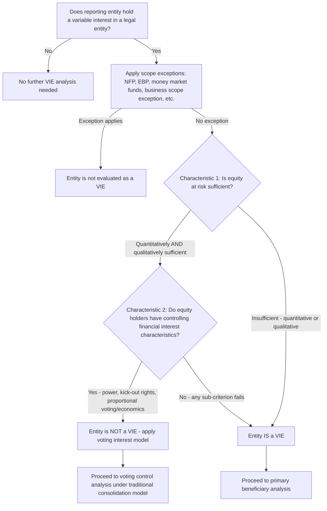

## VIE Identification Criteria under ASC 810

### Overview and Historical Context

ASC 810, *Consolidation*, contains two distinct consolidation models: the traditional **voting interest model** (based on majority voting control) and the **variable interest entity (VIE) model**. The VIE model was introduced (originally as FIN 46/FIN 46(R)) in response to structures — most notably the Enron special-purpose entities — where a reporting entity exercised effective control over another entity through contractual arrangements rather than through majority stock ownership, allowing risks and assets to be kept off the controlling party's balance sheet. The VIE model requires consolidation based on **power and economics** rather than voting rights, and it must be evaluated for every reporting entity's interests in legal entities as a threshold question before applying the voting model.

### Step 1: Scope — Is the Entity a "Legal Entity" Subject to VIE Analysis?

ASC 810 applies to interests in "legal entities" — a term broadly defined to include corporations, partnerships, limited liability companies, trusts, and other legally recognized structures, whether or not separately incorporated. Certain scope exceptions exist, including (subject to specific conditions): certain not-for-profit entities, employee benefit plans subject to other GAAP, registered money market funds, and certain governmental organizations. Businesses (as defined in ASC 805) may qualify for a scope exception from the VIE guidance under specific conditions established in ASU 2018-17, though related-party and other conditions must still be evaluated.

### Step 2: The Two Threshold VIE Characteristics

An entity is a VIE if it exhibits **either** of the following two characteristics (only one is required, not both):

#### Characteristic 1 — Insufficient Equity at Risk

The entity does not have equity investment at risk that is sufficient to permit it to finance its activities without additional subordinated financial support from other parties. This is assessed through two related sub-tests:

**(a) Quantitative insufficiency:** Equity at risk is compared to expected losses; if equity at risk is not sufficient to absorb expected losses, the entity fails this test. **[Inference]** While a "rule of thumb" threshold (historically around 10% of total assets) is sometimes referenced informally in practice as a starting screen, ASC 810 does not establish a bright-line percentage; the standard requires an entity-specific, facts-and-circumstances quantitative analysis of expected losses versus equity at risk, and any percentage-based screening should be treated as a preliminary indicator only, not a substitute for the required analysis.

**(b) Qualitative insufficiency (regardless of quantitative sufficiency):** Even if the quantitative test is passed, equity is deemed insufficient if:

- Equity holders (as a group) lack the ability to make decisions about the entity's activities that most significantly impact its economic performance, or
- Equity holders do not have the obligation to absorb expected losses, or
- Equity holders do not have the right to receive expected residual returns.

**Equity at risk exclusions:** For purposes of this test, equity at risk generally excludes:

- Equity interests issued in exchange for subordinated interests in other VIEs.
- Amounts provided to the equity holder, directly or indirectly, by the entity or other parties involved with the entity (e.g., through fees, loans, or guarantees) unless the provider is a parent, subsidiary, or affiliate of the equity holder that is included in the same consolidated financial statements.
- Amounts financed for the equity holder (e.g., loans) by the entity itself or other parties involved with the entity.

#### Characteristic 2 — Non-Substantive Voting Rights ("Kick-Out" and Related Deficiencies)

The entity's equity investors, as a group, lack the characteristics of a controlling financial interest, evaluated through three sub-criteria (any one causes the entity to be a VIE under this characteristic):

**(a) Lack of power through voting rights:** The holders of the equity investment at risk, as a group, lack the power, through voting rights or similar rights, to direct the activities that most significantly impact the entity's economic performance.

**(b) Non-substantive kick-out or participating rights:** There is no substantive ability for the equity holders (as a group) to remove the party with power over the entity's most significant activities (no substantive kick-out rights) or to participate substantively in decisions (no substantive participating rights). Substantiveness of kick-out rights is analyzed based on whether such rights are exercisable by a single party or a small group, whether there are legal or economic barriers to exercise, and whether there is a economic disincentive that would discourage a party from exercising the right.

**(c) Disproportionality between voting rights and economics (the "anti-abuse" test):** The equity investors' voting rights are not proportional to their obligations to absorb expected losses or rights to receive expected residual returns, **and** substantially all of the entity's activities either involve, or are conducted on behalf of, an investor with disproportionately few voting rights relative to its economics. This test is specifically designed to prevent structuring around the VIE rules by giving a controlling economic party a small voting interest while housing decision-making with a party that has little economic exposure.

### Step 3: Related-Party Aggregation ("De Facto Agent") Considerations

When evaluating whether a reporting entity holds a variable interest and whether it is the primary beneficiary, ASC 810 requires consideration of interests held by the entity's **related parties and de facto agents**. A party is a de facto agent if, for example, it cannot finance its operations without subordinated financial support from the reporting entity, it received its interest as a contribution or loan from the reporting entity, it has an agreement not to sell or transfer its interest without the reporting entity's approval, or it has a close business relationship (such as a supplier relying on the reporting entity for a significant portion of its business) combined with other factors. This aggregation prevents structuring around the VIE rules by parking variable interests with nominally unrelated but economically dependent parties.

### Step 4: Identifying Variable Interests

Before applying the two VIE characteristics, a reporting entity must first identify whether it holds a **variable interest** in the legal entity at all — a contractual, ownership, or other financial interest that changes with changes in the fair value of the entity's net assets exclusive of variable interests. Common variable interests include: equity investments (that are not at-risk equity, or that are at-risk but combined with other interests), subordinated debt, guarantees of the entity's debt or asset value, certain leases, servicing arrangements with subordinated fees, and written put options on the entity's assets. Fee arrangements (e.g., asset management or servicing fees) are variable interests **unless** the fee is at market terms, is customary, commensurate with services provided, and the decision maker does not hold other interests that individually or in aggregate would absorb more than an insignificant amount of the entity's expected losses or receive more than an insignificant amount of expected residual returns (the "decision-maker fee" scope exception).

### Decision Flow for VIE Identification

### Illustrative Structure Diagram (svg_diagram)

<svg xmlns="http://www.w3.org/2000/svg" viewBox="0 0 640 380" font-family="Arial, sans-serif">
<text x="320" y="26" text-anchor="middle" font-size="16" font-weight="bold">VIE vs Voting Interest Entity Classification (svg_diagram)</text>
<rect x="220" y="50" width="200" height="50" rx="6" fill="#dbeafe" stroke="#1e3a8a" stroke-width="2" />
<text x="320" y="80" text-anchor="middle" font-size="13">Legal Entity Under Evaluation</text>
<rect x="60" y="140" width="220" height="80" rx="6" fill="#fee2e2" stroke="#991b1b" stroke-width="2" />
<text x="170" y="165" text-anchor="middle" font-size="12" font-weight="bold">Characteristic 1</text>
<text x="170" y="182" text-anchor="middle" font-size="11">Insufficient equity</text>
<text x="170" y="197" text-anchor="middle" font-size="11">at risk (quant. or</text>
<text x="170" y="212" text-anchor="middle" font-size="11">qualitative test)</text>
<rect x="360" y="140" width="220" height="80" rx="6" fill="#fef9c3" stroke="#854d0e" stroke-width="2" />
<text x="470" y="165" text-anchor="middle" font-size="12" font-weight="bold">Characteristic 2</text>
<text x="470" y="182" text-anchor="middle" font-size="11">Equity holders lack</text>
<text x="470" y="197" text-anchor="middle" font-size="11">power / kick-out rights /</text>
<text x="470" y="212" text-anchor="middle" font-size="11">proportional economics</text>
<rect x="160" y="270" width="320" height="60" rx="6" fill="#fecaca" stroke="#7f1d1d" stroke-width="2" />
<text x="320" y="295" text-anchor="middle" font-size="13" font-weight="bold">Entity IS a Variable Interest Entity</text>
<text x="320" y="312" text-anchor="middle" font-size="11">(if EITHER characteristic is present)</text>
<line x1="280" y1="100" x2="170" y2="140" stroke="#333" stroke-width="2" marker-end="url(#arrow4)" />
<line x1="360" y1="100" x2="470" y2="140" stroke="#333" stroke-width="2" marker-end="url(#arrow4)" />
<line x1="170" y1="220" x2="280" y2="270" stroke="#333" stroke-width="2" marker-end="url(#arrow4)" />
<line x1="470" y1="220" x2="380" y2="270" stroke="#333" stroke-width="2" marker-end="url(#arrow4)" />
</svg>

### Worked Illustrative Scenario

A sponsor forms Entity X (a securitization trust) to purchase a pool of receivables. Entity X is capitalized with:

- $2,000,000 in senior notes sold to third-party investors.
- $150,000 of "equity" contributed by a nominal equity holder (3rd party, unaffiliated).
- Total assets = $2,150,000.

The sponsor services the receivables for a market-rate fee and provides a guarantee on a subordinated tranche.

**Analysis:**

- Equity at risk ($150,000) is approximately 7% of total assets — a quantitative screen suggesting potential insufficiency (subject to actual expected-loss modeling, not the percentage alone).
- The nominal equity holder has no substantive decision-making rights over the receivables servicing or collections strategy (which the sponsor, as servicer, controls).
- The sponsor's guarantee on the subordinated tranche represents a variable interest, since it absorbs risk from changes in the fair value of the trust's net assets.

**Conclusion:** Entity X is a VIE because equity at risk appears both quantitatively thin and, more decisively, the equity holder lacks power over the entity's most significant activities (loan servicing and collection decisions), satisfying Characteristic 1's qualitative test and/or Characteristic 2's power criterion. The sponsor would then proceed to the primary beneficiary analysis (a separate, subsequent step) to determine whether it must consolidate Entity X.

### Interaction with the Primary Beneficiary Analysis

VIE identification is a **threshold gate**: once an entity is determined to be a VIE, the reporting entity does not simply "own a percentage" the way it would under the voting model. Instead, a **separate primary beneficiary test** must be applied — evaluating (1) power to direct the activities that most significantly impact the VIE's economic performance and (2) the obligation to absorb losses or the right to receive benefits that could be significant to the VIE. VIE identification (this topic) is a necessary precondition to, but conceptually and procedurally distinct from, the primary beneficiary determination (a related but separate topic).

### Reassessment Triggers

VIE status is not assessed only at inception. Reporting entities must **reconsider** whether an entity is a VIE upon the occurrence of specified reconsideration events, including: amendments to the entity's governing documents or contractual arrangements that reallocate the obligation to absorb losses or the right to receive returns among the variable interest holders; additional equity investment that resolves previously insufficient equity at risk; and other triggering events specified in ASC 810-10-35. Absent such triggering events, VIE status is generally not reassessed merely due to the passage of time or changes in the entity's financial performance.

### Forensic and Analytical Considerations

- **Understated equity-at-risk analysis**: A recurring forensic and technical accounting concern is management overstating the sufficiency of equity at risk (through aggressive expected-loss modeling assumptions, or by including amounts in "equity at risk" that should be excluded under the anti-circularity rules — e.g., equity funded indirectly by the entity itself) in order to avoid VIE classification and keep an entity's assets and liabilities off the sponsor's consolidated balance sheet.
- **Structuring around the disproportionality test**: Because Characteristic 2(c) specifically targets voting-rights/economics disproportionality tied to a party for whom "substantially all" activities are conducted, sponsors seeking to avoid VIE classification sometimes attempt to diversify a vehicle's activities across multiple economic beneficiaries to avoid tripping the "substantially all" threshold; forensic review should examine whether such diversification is economically substantive or largely formal.
- **De facto agent identification failures**: Failure to properly identify and aggregate interests held by related parties or de facto agents (e.g., a "friendly" nominal equity holder who is economically dependent on the sponsor) can result in an entity incorrectly being treated as having sufficient independent equity holders with power, when in substance the sponsor controls the arrangement through an intermediary.
- **Fee-based decision-maker exception misuse**: Overstating the "market terms and customary" nature of a servicing or management fee to qualify for the decision-maker fee scope exception — when the fee arrangement in fact absorbs more than an insignificant amount of variability — is a documented area of restatement and SEC comment-letter activity, since it directly determines whether the fee itself constitutes a variable interest requiring further analysis.

### Key Points

- An entity is a VIE if it has **either** insufficient equity at risk (Characteristic 1) **or** equity holders lacking the characteristics of a controlling financial interest (Characteristic 2) — only one characteristic is required.
- Equity at risk sufficiency involves both a quantitative test (equity vs. expected losses) and a qualitative test (power, obligation to absorb losses, right to residual returns), with no bright-line percentage threshold in the standard itself.
- Related parties and de facto agents' interests must be aggregated with the reporting entity's own interests when evaluating variable interests and VIE characteristics.
- A variable interest must first be identified before the VIE characteristics are even evaluated; fee arrangements are excluded from variable interest treatment only if they meet the market-terms/customary/insignificant-variability decision-maker exception.
- VIE identification is a threshold gate distinct from, and a precondition to, the separate primary beneficiary consolidation analysis.
- VIE status is reassessed only upon specified reconsideration events, not automatically with the passage of time.

### Related Topics

- Primary beneficiary determination: power and economics criteria
- Kick-out rights and participating rights substantiveness analysis
- Related-party and de facto agent aggregation rules
- Business scope exception under ASU 2018-17
- Securitization structures and consolidation of special-purpose entities
- Decision-maker and service-provider fee arrangements as variable interests
- Reconsideration events and ongoing VIE monitoring procedures