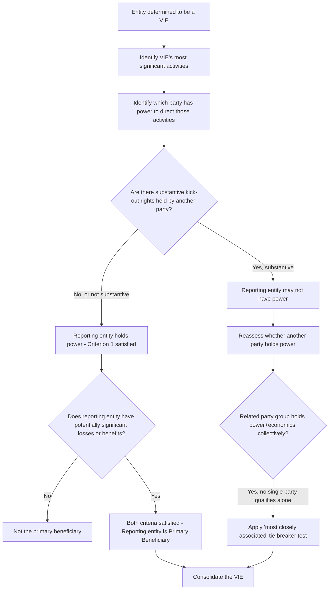

## Determining the Primary Beneficiary

### Overview

Once a legal entity has been identified as a variable interest entity (VIE) under the two-characteristic test of ASC 810, a reporting entity holding a variable interest in that VIE must determine whether it is the **primary beneficiary** — the party required to consolidate the VIE. Unlike the voting interest model, consolidation is not driven by ownership percentage; it is driven by a **qualitative, two-part test** combining (1) power and (2) economics. A reporting entity must satisfy **both** criteria to be the primary beneficiary; satisfying only one is insufficient.

### The Two-Part Primary Beneficiary Test

#### Criterion 1 — Power

The reporting entity has the **power to direct the activities of the VIE that most significantly impact the VIE's economic performance**.

Key analytical steps:

1. **Identify the VIE's "most significant activities."** This requires understanding the VIE's purpose and design — what economic activities actually drive its performance (e.g., for a securitization vehicle, this might be servicing/collection decisions on the underlying receivables; for a real estate VIE, this might be property management and leasing decisions; for a research and development VIE, this might be decisions over which R&D programs to pursue and fund).
2. **Identify which party (or parties) has decision-making authority over those activities**, considering governance documents, management agreements, servicing agreements, and other contractual arrangements — not merely nominal titles.
3. **Assess whether power is held by a single party or shared.** If activities are directed by a single party (or by parties acting in concert as a single decision-making unit), that party (or unit) holds power. If, in a genuinely rare fact pattern, multiple unrelated parties must act together and no single party can unilaterally direct the most significant activities, no single party may have "power" under the standard definition — though ASC 810 further directs consideration of related-party and de facto agent aggregation before reaching that conclusion.

**Kick-out rights caveat:** If another party (not the reporting entity) holds *substantive* kick-out rights enabling it to remove the reporting entity from its decision-making role without cause, the reporting entity may not be considered to hold power, even if it currently makes the relevant decisions — because the substantive ability of another party to unilaterally remove the decision-maker undermines the decision-maker's power. This mirrors the substantiveness analysis (barriers to exercise, economic disincentives, single party vs. dispersed holders) used in the VIE identification characteristic 2(b) analysis.

#### Criterion 2 — Economics (Obligation to Absorb Losses / Right to Receive Benefits)

The reporting entity has **the obligation to absorb losses of the VIE that could potentially be significant to the VIE, or the right to receive benefits from the VIE that could potentially be significant to the VIE**.

Key points:

- This is an **either/or** test at the individual-criterion level (losses OR benefits, not necessarily both), but in practice, most variable interests that create power also carry both loss exposure and benefit potential simultaneously (e.g., an equity-like residual interest).
- "Could potentially be significant" is evaluated based on the **variable interest's design and the range of possible outcomes**, not solely on the interest's fair value or notional amount at a single point in time; it requires assessing the interest across a reasonable range of the VIE's possible economic outcomes.
- **Both explicit and implicit variable interests** are considered — an implicit variable interest can arise from an arrangement that, in substance, absorbs risk or provides benefits even without an explicit contractual obligation, such as an implied "obligation" arising from a pattern of past support (though the existence of implicit interests requires careful judgment and is inherently more fact-dependent than explicit interests).

### Both Criteria Required — No "Primary Beneficiary" Without Power AND Economics

A party can hold a significant economic interest (potentially significant losses or benefits) without having power (e.g., a purely passive third-party investor with no decision rights) — that party is *not* the primary beneficiary despite bearing meaningful risk. Conversely, a party can hold power (e.g., a fee-only manager or servicer) without potentially significant economic exposure — that party is also not the primary beneficiary. **Only the party (or related-party group treated as a single decision maker, subject to further sharing rules below) satisfying both criteria simultaneously consolidates the VIE.**

### Related-Party Tie-Breaker Rule

If, after applying the related-party and de facto agent aggregation rules, it is determined that a related-party group (rather than a single unrelated reporting entity) collectively has power and economics such that the group as a whole is the primary beneficiary, but no single party within that related-party group individually has both power and potentially significant economics on a stand-alone basis, ASC 810 provides a **tie-breaker test**: the party within the related-party group that is **most closely associated with the VIE** is deemed the primary beneficiary. Factors used to determine "most closely associated" include (this is a qualitative, facts-and-circumstances judgment, not a mechanical formula):

- The relative size of each party's economic interests (variable interests) in the VIE, if determinable.
- Whether the VIE was designed specifically for one party's benefit (e.g., created at a particular party's request or to hold assets closely related to that party's ongoing operations).
- Similarities between the VIE's activities and each related party's own principal activities.
- Which party has employees, management, or other operational resources devoted to the VIE.
- The existence of explicit or implicit financial guarantees provided by one party that are not shared proportionately among the group.

**[Inference]** Because "most closely associated" is a multi-factor qualitative judgment rather than a bright-line test, this determination is one of the more heavily documented and debated areas in VIE consolidation memos in practice, often requiring a side-by-side comparative analysis of each related party against every factor.

### Ongoing Reassessment of Primary Beneficiary Status

Unlike VIE identification (assessed at inception and upon specified reconsideration events), the primary beneficiary determination is required to be **reassessed on an ongoing basis** — specifically, at each reporting period, an entity must reconsider whether it remains the primary beneficiary (or whether it has newly become the primary beneficiary) whenever the facts and circumstances relevant to the power or economics criteria change. This means the primary beneficiary analysis is inherently more dynamic than the initial VIE-status determination and requires continuous monitoring of governance changes, new variable interests issued, or changes in the VIE's most significant activities.

### Worked Illustrative Scenario

Assume:

- A sponsor establishes a special-purpose entity ("SPE") to hold a portfolio of commercial mortgage loans.
- The sponsor acts as **servicer**, with full discretion over loan workout, modification, and foreclosure decisions (identified as the SPE's most significant activities, since credit-related decisions drive the SPE's economic performance far more than passive interest collection).
- The sponsor holds a **subordinated residual interest** representing 15% of the SPE's capital structure, absorbing the first losses on the portfolio and receiving excess spread after senior noteholders are paid.
- Senior noteholders (third parties) hold fixed-rate notes with no decision rights over loan servicing, and no kick-out rights over the servicer beyond a narrow "servicer default" termination right requiring a supermajority vote and demonstrated cause.

**Analysis:**

| Criterion | Assessment |
| --- | --- |
| Most significant activity | Loan workout/modification/foreclosure decisions (credit risk management) |
| Who holds power over that activity | Sponsor (as servicer, with full discretion) |
| Are third-party kick-out rights substantive? | No — narrow, cause-based, supermajority-vote-gated; not a low-barrier unilateral removal right |
| Sponsor's economic exposure | 15% first-loss residual interest — potentially significant given first-loss position |
| Conclusion | Sponsor satisfies **both** power and economics criteria |

**Conclusion:** The sponsor is the primary beneficiary and must consolidate the SPE, notwithstanding that it holds only a 15% economic interest — because the primary beneficiary test is not proportionate ownership-based; it is a qualitative power-plus-economics test, and the sponsor's decision-making authority over the SPE's most significant activities (credit decisions) combined with potentially significant first-loss exposure is sufficient.

### Decision Flow Diagram

### Illustrative Power/Economics Matrix Diagram (svg_diagram)

<svg xmlns="http://www.w3.org/2000/svg" viewBox="0 0 560 400" font-family="Arial, sans-serif">
<text x="280" y="26" text-anchor="middle" font-size="16" font-weight="bold">Primary Beneficiary Power/Economics Matrix (svg_diagram)</text>
<line x1="100" y1="60" x2="100" y2="340" stroke="#333" stroke-width="2" />
<line x1="100" y1="340" x2="520" y2="340" stroke="#333" stroke-width="2" />

<text x="60" y="90" font-size="11" text-anchor="middle">Has</text>

<text x="60" y="103" font-size="11" text-anchor="middle">Power</text>

<text x="60" y="290" font-size="11" text-anchor="middle">No</text>

<text x="60" y="303" font-size="11" text-anchor="middle">Power</text>

<text x="180" y="365" font-size="12" text-anchor="middle">No Significant Economics</text>

<text x="420" y="365" font-size="12" text-anchor="middle">Potentially Significant Economics</text>

<rect x="110" y="70" width="180" height="130" fill="#fef9c3" stroke="#854d0e" stroke-width="1.5" />
<text x="200" y="130" text-anchor="middle" font-size="12">Fee-only manager</text>
<text x="200" y="148" text-anchor="middle" font-size="12">Not Primary Beneficiary</text>
<rect x="300" y="70" width="210" height="130" fill="#bbf7d0" stroke="#166534" stroke-width="2" />
<text x="405" y="120" text-anchor="middle" font-size="12" font-weight="bold">Power + Economics</text>
<text x="405" y="140" text-anchor="middle" font-size="13" font-weight="bold">PRIMARY BENEFICIARY</text>
<text x="405" y="160" text-anchor="middle" font-size="11">Must consolidate</text>
<rect x="110" y="210" width="180" height="120" fill="#f3f4f6" stroke="#6b7280" stroke-width="1.5" />
<text x="200" y="270" text-anchor="middle" font-size="12">No involvement</text>
<text x="200" y="288" text-anchor="middle" font-size="12">Not Primary Beneficiary</text>
<rect x="300" y="210" width="210" height="120" fill="#fee2e2" stroke="#991b1b" stroke-width="1.5" />
<text x="405" y="260" text-anchor="middle" font-size="12">Passive investor</text>
<text x="405" y="278" text-anchor="middle" font-size="12">(e.g. senior noteholder)</text>
<text x="405" y="296" text-anchor="middle" font-size="12">Not Primary Beneficiary</text>
</svg>

### Multiple Related Parties Sharing Power

In some VIE structures, power over the most significant activities is genuinely **shared** among unrelated parties such that no single party can unilaterally direct those activities (e.g., certain joint-venture-structured VIEs requiring dual approval for key decisions). In such cases:

- If truly no single party has unilateral power, **no party consolidates** under the primary beneficiary model, even if one or more parties has significant economic exposure — since power is a necessary (not sufficient) condition.
- **[Inference]** In practice, genuinely shared power arrangements (as opposed to arrangements that appear shared on paper but functionally vest power with one party through practical dominance, tie-breaking mechanisms, or economic dependency) are relatively uncommon and warrant careful scrutiny of the actual governance mechanics, since structuring around consolidation by creating the appearance of shared power without true shared decision-making is a recognized area of accounting judgment risk.

### Forensic and Analytical Considerations

- **Power criterion manipulation through nominal governance structures**: A well-documented forensic and technical accounting risk is structuring governance documents to create the *appearance* of shared or third-party power (avoiding consolidation) while the sponsor retains practical, de facto control through side agreements, economic dependency of the nominal decision-maker, or reserved "veto" rights over all matters that functionally amount to affirmative control.
- **Understating potential significance of economic exposure**: Because the economics criterion depends on "potentially significant" losses/benefits assessed across a range of outcomes (not a single-point fair value), understating the range of adverse outcomes in an internal analysis — for example, by using an unrealistically narrow stress scenario — can be used to support a conclusion that economic exposure is insignificant when, under a more realistic range of outcomes, it would be significant.
- **Kick-out rights substantiveness overstatement**: Asserting that third-party kick-out rights are substantive (thereby negating the reporting entity's power) when those rights in fact require an unrealistic supermajority, involve significant financial or legal barriers to exercise, or are held by parties with economic disincentives to exercise them (e.g., a removal right that would trigger the removing party's own loss of collateral value) is a recurring area of technical accounting dispute and restatement.
- **Reassessment failures**: Because the primary beneficiary determination must be continuously reassessed (unlike the point-in-time VIE identification test), failing to update the consolidation conclusion after a material change — such as a new variable interest issuance, an amendment to servicing rights, or a change in the VIE's most significant activities — is a common source of "stale" consolidation conclusions identified in forensic reviews and restatements.

### Key Points

- The primary beneficiary must satisfy **both** the power criterion (directs the VIE's most significant activities) and the economics criterion (potentially significant losses or benefits) — one without the other is insufficient.
- Consolidation is **not proportionate to ownership percentage**; a party with a small economic interest (e.g., 15% first-loss residual) can be required to consolidate 100% of the VIE if it holds power and potentially significant economic exposure.
- Substantive kick-out rights held by another party can negate a decision-maker's power; substantiveness depends on exercisability, barriers, and economic disincentives.
- When a related-party group collectively satisfies both criteria but no single member does individually, the "most closely associated" tie-breaker (a qualitative, multi-factor test) determines which party consolidates.
- Unlike VIE status (assessed at inception and upon reconsideration events), primary beneficiary status must be reassessed on an ongoing basis whenever relevant facts change.

### Related Topics

- VIE identification criteria under ASC 810
- Related-party and de facto agent aggregation rules
- Kick-out rights and participating rights substantiveness analysis
- Explicit versus implicit variable interests
- Consolidation accounting for joint ventures and shared-control arrangements
- Deconsolidation of a VIE and loss of primary beneficiary status
- Disclosure requirements for consolidated and unconsolidated VIEs (ASC 810-10-50)