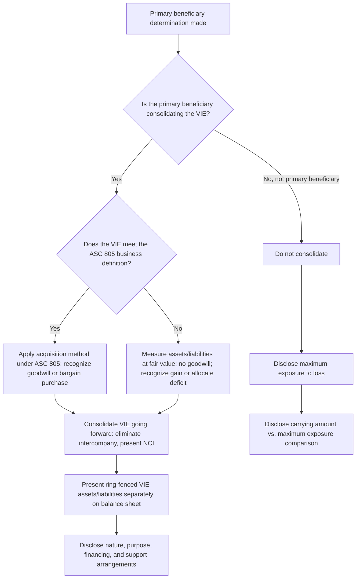

## Consolidation and Disclosure of VIEs

### Overview

Once a reporting entity has determined that it is the **primary beneficiary** of a variable interest entity (VIE), it must consolidate that VIE into its financial statements. The consolidation mechanics for a VIE differ in important respects from the traditional voting-interest consolidation model, particularly regarding initial measurement, and the disclosure requirements are more extensive than for ordinary wholly- or majority-owned subsidiaries — reflecting the VIE model's origin in improving transparency around off-balance-sheet risk.

### Initial Consolidation Measurement

#### Business vs. Non-Business VIEs

The initial measurement approach depends on whether the consolidated VIE constitutes a **business** as defined in ASC 805:

**If the VIE is a business:** The primary beneficiary applies the **acquisition method** under ASC 805, essentially identical to a traditional business combination — identifiable assets acquired and liabilities assumed are measured at acquisition-date fair value, and goodwill (or a bargain purchase gain) is recognized for any excess of consideration transferred (and NCI, if measured under the full goodwill method) over the fair value of identifiable net assets.

**If the VIE is not a business** (the more common case for structured finance vehicles, securitization trusts, and single-asset entities): The primary beneficiary measures the VIE's assets, liabilities, and NCI as follows:

1. Assets other than goodwill and liabilities of the VIE are measured at their **fair values as of the date the reporting entity becomes the primary beneficiary** (essentially a fresh fair value measurement, similar to a business combination but without the concept of a business).
2. **No goodwill is recognized** in an asset-acquisition-style VIE consolidation, since the transaction is not treated as a business combination.
3. Any excess of the **total fair value of the VIE's assets and liabilities** (net) over the sum of (a) the fair value of consideration paid, if any, plus (b) the carrying amount of any previously held interest, plus (c) NCI at fair value, is recognized as a **gain in current-period earnings** — analogous to a bargain purchase gain but arising in a non-business consolidation context.
4. Conversely, if the calculation results in a deficit, that deficit is generally allocated to reduce the amounts otherwise assignable to the assets recognized (other than financial assets measured at fair value with changes in earnings, and certain other exceptions), consistent with the general excess-measurement guidance for asset acquisitions in ASC 805-50.

**[Inference]** Distinguishing whether a specific VIE constitutes a "business" for this purpose requires applying ASC 805's business definition (inputs, processes, and the ability to create outputs) to the VIE's specific activities; many special-purpose, single-asset, or securitization VIEs will not meet the business definition because they typically lack substantive processes beyond passive asset-holding, but this determination should be made on the specific facts rather than assumed categorically.

### Subsequent Measurement and Reporting

After initial consolidation, the VIE is consolidated in subsequent periods using the **same general consolidation principles** applicable to any subsidiary: intercompany transactions and balances are eliminated, the VIE's assets, liabilities, revenues, and expenses are combined line-by-line with the primary beneficiary's own financial statements, and NCI in the VIE (if any parties other than the primary beneficiary hold interests) is presented as a separate component of consolidated equity (or as a liability, if applicable, per the same NCI classification principles applicable to any consolidated subsidiary).

### Presentation Requirements — Consolidated Balance Sheet

ASC 810 requires that a reporting entity present, for **consolidated VIEs**, separate line items (or aggregated disclosure) distinguishing:

- Assets of consolidated VIEs that can be used only to settle obligations of the VIE (i.e., assets that are not available to the general creditors of the primary beneficiary).
- Liabilities of consolidated VIEs for which creditors (or other beneficial interest holders) do not have recourse to the general credit of the primary beneficiary.

This "ring-fencing" disclosure is central to the standard's purpose: it allows financial statement users to distinguish assets and liabilities that, despite being consolidated, remain legally isolated within the VIE structure from those that expose the primary beneficiary's general creditors or shareholders.

### Disclosure Requirements — Consolidated VIEs

For each consolidated VIE (or groups of similar VIEs), the reporting entity must disclose, at a minimum:

- The **nature, purpose, size, and activities** of the VIE, including how the VIE is financed.
- **Qualitative and quantitative information** about the reporting entity's involvement (financial or otherwise, including implicit arrangements that could require the reporting entity to provide financial support) with the VIE.
- Whether the reporting entity has provided **financial or other support** to the VIE that it was not previously contractually required to provide, and the reasons for doing so.
- The terms of arrangements that could require the reporting entity to provide financial support (e.g., liquidity arrangements, guarantees, or other commitments).

### Disclosure Requirements — Unconsolidated VIEs (Where the Reporting Entity Holds a Variable Interest but Is Not the Primary Beneficiary)

Because a reporting entity can hold a significant variable interest in a VIE without being its primary beneficiary, ASC 810 also requires disclosures for **unconsolidated** VIEs in which the reporting entity holds a variable interest, including:

- The carrying amount and classification of assets and liabilities recognized in the reporting entity's own financial statements related to its involvement with the VIE.
- The reporting entity's **maximum exposure to loss** as a result of its involvement with the VIE, and how that maximum exposure to loss is determined.
- A comparison of the carrying amounts of assets/liabilities to the maximum exposure to loss.
- Information about any liquidity arrangements, guarantees, or other commitments by third parties that may affect the fair value or risk of the reporting entity's variable interest.

### Comparison Table — Consolidated vs. Unconsolidated VIE Disclosure Focus

| Disclosure Element | Consolidated VIE | Unconsolidated VIE (Variable Interest Held) |
| --- | --- | --- |
| Balance sheet presentation | Ring-fenced assets/liabilities shown separately | Only the reporting entity's own recognized interest is on the balance sheet |
| Primary risk disclosure focus | Isolation of VIE assets/liabilities from general creditors | Maximum exposure to loss |
| Nature and purpose of VIE | Required | Required |
| Support provided beyond contractual requirement | Required, with reasons | Required, with reasons |
| Comparison of carrying value to risk | Not the primary focus (already consolidated) | Explicit comparison of carrying amount to maximum exposure to loss required |

### Process Flow — From Primary Beneficiary Conclusion to Financial Statement Presentation

### Illustrative Ring-Fencing Diagram (svg_diagram)

<svg xmlns="http://www.w3.org/2000/svg" viewBox="0 0 600 340" font-family="Arial, sans-serif">
<text x="300" y="26" text-anchor="middle" font-size="16" font-weight="bold">VIE Asset Ring-Fencing on Consolidated Balance Sheet (svg_diagram)</text>
<rect x="40" y="60" width="520" height="240" rx="8" fill="#f8fafc" stroke="#1e3a8a" stroke-width="2" />
<text x="300" y="85" text-anchor="middle" font-size="13" font-weight="bold">Primary Beneficiary's Consolidated Balance Sheet</text>
<rect x="70" y="110" width="200" height="160" rx="6" fill="#dbeafe" stroke="#1e3a8a" stroke-width="1.5" />
<text x="170" y="135" text-anchor="middle" font-size="12" font-weight="bold">General Entity Assets</text>
<text x="170" y="155" text-anchor="middle" font-size="11">Available to general</text>
<text x="170" y="170" text-anchor="middle" font-size="11">creditors of the</text>
<text x="170" y="185" text-anchor="middle" font-size="11">primary beneficiary</text>
<rect x="330" y="110" width="200" height="160" rx="6" fill="#fee2e2" stroke="#991b1b" stroke-width="2" stroke-dasharray="6,3" />
<text x="430" y="135" text-anchor="middle" font-size="12" font-weight="bold">Consolidated VIE Assets</text>
<text x="430" y="155" text-anchor="middle" font-size="11">Usable ONLY to settle</text>
<text x="430" y="170" text-anchor="middle" font-size="11">VIE obligations —</text>
<text x="430" y="185" text-anchor="middle" font-size="11">not available to</text>
<text x="430" y="200" text-anchor="middle" font-size="11">general creditors</text>

<text x="430" y="230" text-anchor="middle" font-size="10" font-style="italic">Disclosed separately</text>

<text x="430" y="245" text-anchor="middle" font-size="10" font-style="italic">per ASC 810-10-50</text>

</svg>

### Deconsolidation of a VIE

If a reporting entity ceases to be the primary beneficiary (e.g., due to a reconsideration event, a change in the VIE's governing documents, or the sale of a variable interest), it deconsolidates the VIE. Upon deconsolidation:

- The reporting entity derecognizes the VIE's assets and liabilities from its consolidated balance sheet.
- Any retained noncontrolling investment in the former VIE is recognized at fair value as of the deconsolidation date.
- The difference between (a) the fair value of consideration received (if any) plus the fair value of any retained interest, and (b) the carrying amount of the VIE's net assets (including any related goodwill) and any NCI derecognized, is recognized as a **gain or loss on deconsolidation** in the income statement.

### Forensic and Analytical Considerations

- **Non-business classification manipulation for gain recognition**: Because non-business VIE consolidations can result in immediate gain recognition (a "gain on consolidation") when the fair value of net assets exceeds consideration and any previously held interest, there is a documented risk of entities inflating the fair value of newly consolidated VIE assets, or asserting non-business treatment when the VIE arguably meets the ASC 805 business definition, specifically to generate favorable one-time earnings impact upon initial consolidation.
- **Ring-fencing disclosure omissions**: Failing to separately present or disclose which consolidated assets are legally restricted to satisfying VIE obligations (versus general-creditor-available assets) undermines a core investor-protection purpose of the VIE standard; this is a specific area examiners and forensic reviewers test by tracing consolidated balance sheet captions back to the underlying legal and contractual restrictions of each VIE.
- **Maximum exposure to loss understatement (unconsolidated VIEs)**: For VIEs that are *not* consolidated, understating the disclosed "maximum exposure to loss" — for example, by excluding implicit support arrangements, reputational-risk-driven support, or off-balance-sheet guarantees not legally required but historically provided — can materially understate the risk disclosed to financial statement users regarding an entity's involvement with structured off-balance-sheet vehicles. This was a central criticism of pre-FIN 46 era disclosure practices and remains a focus area in post-issuance forensic reviews of structured finance programs.
- **Deconsolidation timing and gain/loss recognition manipulation**: Because deconsolidation can trigger recognition of a gain or loss based on the fair value of any retained interest, the precise timing of a deconsolidation event (tied to a change in primary beneficiary status) is a documented area of scrutiny — entities have, in some historical enforcement matters, been alleged to time or structure changes in governance or economic terms specifically to trigger favorable deconsolidation gain recognition.

### Key Points

- Initial consolidation measurement of a VIE depends on whether it constitutes a business under ASC 805: business VIEs use the acquisition method (with goodwill); non-business VIEs are measured at fair value with any excess recognized as a **gain in earnings** (no goodwill).
- Consolidated VIE assets and liabilities that are legally restricted (usable only for VIE obligations, or without recourse to the primary beneficiary's general credit) must be separately presented or disclosed — the core "ring-fencing" transparency objective of the standard.
- Disclosure requirements differ meaningfully between consolidated VIEs (focus on nature, purpose, and support arrangements) and unconsolidated VIEs where a variable interest is held (focus on maximum exposure to loss and comparison to carrying amount).
- Deconsolidation occurs when primary beneficiary status is lost, with any retained interest remeasured at fair value and a gain or loss recognized for the difference.
- Understated ring-fencing disclosures and overstated non-business gain recognition are recurring forensic and technical accounting risk areas tied to VIE consolidation.

### Related Topics

- VIE identification criteria under ASC 810
- Determining the primary beneficiary
- Business combinations and the ASC 805 business definition
- Bargain purchase gain recognition in business combinations
- Deconsolidation of subsidiaries under the voting interest model
- Securitization accounting and true-sale versus financing analysis
- Historical case studies: Enron special-purpose entities and the origin of FIN 46/ASC 810