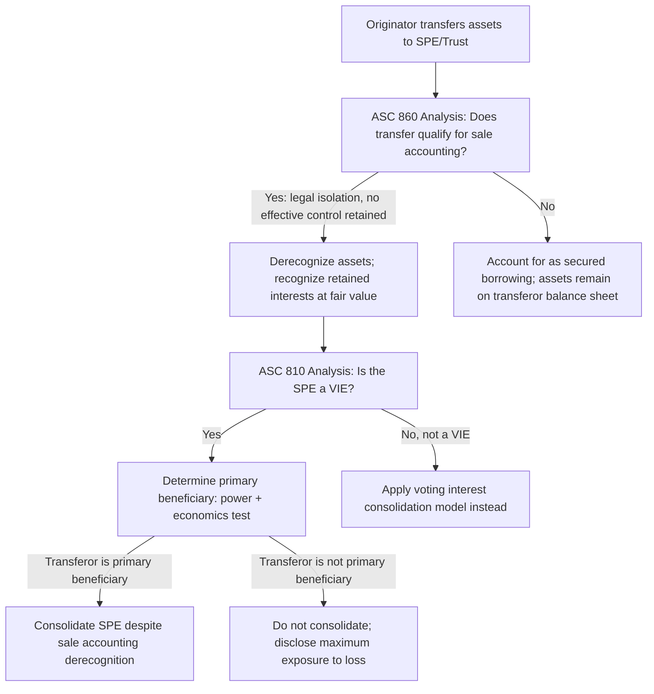

## Securitization Structures and Special Purpose Entities

### Overview

Securitization is the process of pooling financial assets (receivables, mortgages, auto loans, credit card balances, leases) and transferring them to a **special purpose entity (SPE)**, which then issues securities (notes, certificates, or beneficial interests) to investors, backed by the cash flows from the underlying asset pool. SPEs are the paradigmatic structure motivating the VIE consolidation model, since their entire economic design typically features thin equity capitalization, contractually defined (rather than voting-based) decision rights, and tranched risk allocation among investors — precisely the characteristics ASC 810's VIE model was designed to capture.

### Typical Securitization Structure and Parties

A conventional securitization structure involves several distinct parties, each performing a specialized role:

- **Originator/Sponsor**: The entity that originates or acquires the underlying financial assets (e.g., a bank originating mortgages, an auto lender originating auto loans) and typically initiates and structures the securitization.
- **Depositor**: A wholly-owned subsidiary of the sponsor that acquires the assets from the originator and transfers them to the issuing entity (this two-step transfer structure is designed to achieve a "true sale" for legal isolation purposes).
- **Issuing Entity (the SPE/trust)**: The legal entity (commonly a trust, though sometimes a limited liability company or corporation) that holds the asset pool and issues securities to investors. This is the entity subject to VIE analysis.
- **Servicer**: The party responsible for collecting payments from underlying obligors, managing delinquencies, and (critically for VIE analysis) making loss-mitigation and workout decisions — often identified as the party directing the "most significant activities" of the SPE.
- **Trustee**: An independent party (often a bank or trust company) that holds legal title to the assets for the benefit of investors and oversees compliance with the transaction documents, generally without economic exposure to the pool's performance.
- **Credit enhancement providers**: Parties providing subordination, overcollateralization, guarantees, letters of credit, or reserve funds to absorb initial losses and enhance the credit quality of senior tranches.
- **Investors (noteholders/certificateholders)**: Third parties purchasing securities issued by the SPE, typically in **tranches** with differing seniority, risk, and return profiles.

### Tranching and the Waterfall

Securitization structures typically allocate cash flows and losses through a **contractual payment waterfall** and a **tranched capital structure**:

- **Senior tranches**: Highest priority of payment, lowest risk, lowest yield; typically rated investment grade.
- **Mezzanine tranches**: Subordinate to senior tranches but senior to the residual/equity tranche; intermediate risk and yield.
- **Subordinated/residual/equity tranche**: Lowest priority of payment (absorbs losses first), highest risk, and typically retained by the sponsor or sold to specialized investors seeking higher yields — this tranche often represents the "equity at risk" (or the interest most analogous to it) in the VIE analysis and frequently carries the loss-absorption and power characteristics relevant to the primary beneficiary test.

$$\text{Available Collections} \rightarrow \text{Senior Interest \& Principal} \rightarrow \text{Mezzanine Interest \& Principal} \rightarrow \text{Servicing Fees / Expenses} \rightarrow \text{Residual/Equity Distributions}$$

**[Inference]** The precise ordering and priority of servicing fees relative to tranche payments varies by transaction and is governed by the specific pooling and servicing agreement; the waterfall shown above is illustrative of common structures rather than a universal fixed sequence.

### Diagram — Securitization Structure and Cash Flow (svg_diagram)

<svg xmlns="http://www.w3.org/2000/svg" viewBox="0 0 680 420" font-family="Arial, sans-serif">
<text x="340" y="26" text-anchor="middle" font-size="16" font-weight="bold">Securitization Structure Overview (svg_diagram)</text>
<rect x="20" y="60" width="140" height="60" rx="6" fill="#dbeafe" stroke="#1e3a8a" stroke-width="2" />
<text x="90" y="85" text-anchor="middle" font-size="12">Originator</text>
<text x="90" y="100" text-anchor="middle" font-size="11">(Sponsor)</text>
<rect x="200" y="60" width="140" height="60" rx="6" fill="#dbeafe" stroke="#1e3a8a" stroke-width="2" />
<text x="270" y="85" text-anchor="middle" font-size="12">Depositor</text>
<text x="270" y="100" text-anchor="middle" font-size="11">(sponsor subsidiary)</text>
<rect x="380" y="60" width="160" height="70" rx="6" fill="#fef9c3" stroke="#854d0e" stroke-width="2" />
<text x="460" y="88" text-anchor="middle" font-size="12" font-weight="bold">Issuing Entity</text>
<text x="460" y="105" text-anchor="middle" font-size="11">(SPE / Trust)</text>
<text x="460" y="120" text-anchor="middle" font-size="10">Holds asset pool</text>
<rect x="380" y="170" width="160" height="60" rx="6" fill="#e0e7ff" stroke="#3730a3" stroke-width="1.5" />
<text x="460" y="195" text-anchor="middle" font-size="12">Servicer</text>
<text x="460" y="212" text-anchor="middle" font-size="10">Collections / workouts</text>
<rect x="580" y="60" width="90" height="40" rx="4" fill="#dcfce7" stroke="#166534" stroke-width="1.5" />
<text x="625" y="84" text-anchor="middle" font-size="10">Senior</text>
<rect x="580" y="105" width="90" height="40" rx="4" fill="#fde68a" stroke="#854d0e" stroke-width="1.5" />
<text x="625" y="129" text-anchor="middle" font-size="10">Mezzanine</text>
<rect x="580" y="150" width="90" height="40" rx="4" fill="#fecaca" stroke="#991b1b" stroke-width="1.5" />
<text x="625" y="174" text-anchor="middle" font-size="9">Residual/Equity</text>
<line x1="160" y1="90" x2="200" y2="90" stroke="#333" stroke-width="2" marker-end="url(#arrow5)" />
<line x1="340" y1="90" x2="380" y2="90" stroke="#333" stroke-width="2" marker-end="url(#arrow5)" />
<line x1="460" y1="170" x2="460" y2="130" stroke="#3730a3" stroke-width="2" stroke-dasharray="5,3" marker-end="url(#arrow5)" />
<line x1="540" y1="80" x2="580" y2="80" stroke="#333" stroke-width="1.5" marker-end="url(#arrow5)" />
<line x1="540" y1="100" x2="580" y2="125" stroke="#333" stroke-width="1.5" marker-end="url(#arrow5)" />
<line x1="540" y1="110" x2="580" y2="170" stroke="#333" stroke-width="1.5" marker-end="url(#arrow5)" />

<text x="90" y="145" text-anchor="middle" font-size="10">Sells assets</text>

<text x="270" y="145" text-anchor="middle" font-size="10">True sale transfer</text>

<text x="460" y="245" text-anchor="middle" font-size="10">Directs loss mitigation /</text>

<text x="460" y="258" text-anchor="middle" font-size="10">most significant activities</text>

</svg>

### The "True Sale" and Legal Isolation Analysis

A foundational structuring objective in securitization is achieving **"true sale"** treatment — a determination (grounded in bankruptcy and legal analysis, not solely accounting analysis) that the transfer of assets from the originator to the SPE would survive a bankruptcy court's potential recharacterization as a secured financing rather than a genuine sale, in the event of the originator's insolvency. True sale opinions from legal counsel are a standard feature of securitization transactions, and legal isolation is also a relevant (though not solely determinative) consideration feeding into the broader transfer of financial assets analysis under ASC 860 (Transfers and Servicing), which operates alongside, but is analytically distinct from, the VIE consolidation analysis under ASC 810.

**Two-step structure rationale**: The originator-to-depositor-to-issuing-entity two-step transfer structure is specifically designed to strengthen the true sale analysis by adding a layer of separateness — the depositor, as a distinct bankruptcy-remote entity, provides an additional structural barrier against substantive consolidation of the SPE's assets with the originator's estate in a bankruptcy proceeding.

### Interaction Between ASC 860 (Transfers and Servicing) and ASC 810 (VIE Consolidation)

Securitization accounting requires **two separate, sequential analyses**:

1. **ASC 860 analysis (by the transferor/sponsor)**: Does the transfer of financial assets to the SPE qualify for **sale accounting** (derecognition of the transferred assets from the transferor's own balance sheet) under ASC 860's criteria — legal isolation, the transferee's ability to pledge or exchange the assets (or, for certain structures, the absence of the transferor's effective control), and the absence of the transferor's continuing effective control over the transferred assets?
2. **ASC 810 analysis (by any party with a variable interest, including the transferor)**: Separately and independently of the sale accounting conclusion, is the SPE a VIE, and if so, is any party (potentially including the transferor, even after achieving sale accounting under ASC 860) the primary beneficiary required to consolidate the SPE?

**Critical point**: Achieving **sale accounting under ASC 860 does not automatically mean the transferor avoids consolidation under ASC 810.** A transferor can achieve legal derecognition of the transferred assets at the individual-asset level under ASC 860, and *still* be required to consolidate the SPE in its entirety under the separate VIE model if it is determined to be the primary beneficiary (for example, by retaining servicing with credit-related discretion plus a subordinated residual interest). This dual-analysis requirement was a central reform following the pre-2010 QSPE (qualifying special purpose entity) exception, which had permitted certain SPEs meeting specific passive criteria to avoid VIE consolidation entirely; that QSPE exception was eliminated by the standards that became ASC 810's current framework (originally SFAS 166/167), specifically to close this gap.

### Retained Interests and Continuing Involvement

Sponsors of securitizations frequently retain various forms of continuing involvement, each with distinct accounting and VIE-analysis implications:

- **Servicing rights** (with or without a subordinated servicing fee) — relevant both to ASC 860's effective control analysis and to the VIE power criterion.
- **Retained subordinated/residual interests** — relevant to the VIE economics criterion (potentially significant losses/benefits).
- **Guarantees or recourse arrangements** — relevant to both the ASC 860 continuing-involvement disclosure requirements and to VIE variable interest identification.
- **Repurchase or "clean-up call" options** — options allowing the sponsor to repurchase remaining assets once the pool balance falls below a specified threshold; these can, depending on their terms and pricing, constitute a variable interest and factor into the power/economics analysis, though a fixed-price clean-up call at a level designed purely for administrative convenience (not economically substantive) is generally analyzed differently than a call option with meaningful economic value transfer potential.

### Worked Illustrative Scenario — Auto Loan Securitization

A bank originates a pool of auto loans ($500,000,000 aggregate balance) and securitizes them through a trust:

- The trust issues $450,000,000 of senior notes (AAA-rated) to third-party investors.
- The trust issues $35,000,000 of mezzanine notes (BBB-rated) to third-party investors.
- The bank retains a $15,000,000 residual/equity interest, absorbing first losses and receiving excess spread.
- The bank continues to service the loans, retaining full discretion over delinquency management, modification, and repossession decisions, for a market servicing fee.

**ASC 860 analysis**: Assuming legal isolation and no effective control retained by the bank over the transferred loans individually (i.e., the trust/investors can pledge or exchange the loans; the bank has no unilateral ability to reclaim specific loans other than through a permissible clean-up call), the bank achieves **sale accounting** and derecognizes the $500,000,000 of loans, recognizing the retained $15,000,000 residual interest at fair value and any gain or loss on sale.

**ASC 810 analysis**: Separately, applying the VIE framework: the trust is a VIE (thinly capitalized relative to expected losses, contractually defined rather than voting-based governance). The bank, as servicer, directs the most significant activity (delinquency/loss-mitigation decisions on the underlying loans) and holds the $15,000,000 first-loss residual interest, which is potentially significant. **Conclusion: the bank is the primary beneficiary and must consolidate the trust**, notwithstanding having achieved sale accounting (asset derecognition) at the individual-transaction level under ASC 860. The consolidation reverses the sale-accounting derecognition in substance — the loans, notes payable to investors, and residual equity reappear on the bank's consolidated balance sheet, subject to the ring-fencing presentation and disclosure requirements discussed in VIE consolidation.

### Process Flow — Securitization Dual Analysis

### Forensic and Analytical Considerations

- **Structuring to avoid primary beneficiary status**: A well-documented area of forensic and regulatory scrutiny involves structuring servicing rights, residual interest sizing, and clean-up call terms specifically to avoid satisfying either the power or economics criterion of the primary beneficiary test, while retaining substantial practical economic benefit through fee structures, side arrangements, or informal (non-contractual) support commitments.
- **Historical QSPE exploitation**: Prior to the elimination of the qualifying SPE exception, entities historically structured securitizations to meet QSPE passive-management criteria specifically to avoid consolidation altogether; post-reform, forensic reviews of legacy securitization programs (and any newly structured vehicles attempting to replicate similarly passive characteristics) specifically test whether governance and servicing arrangements are genuinely passive or functionally retain active decision-making by the sponsor.
- **Implicit recourse and reputational support**: A sponsor providing support to a securitization SPE beyond its contractual obligations (e.g., repurchasing deteriorating loans, or providing additional credit enhancement, to protect its market reputation or ability to sponsor future securitizations) can indicate that the sponsor has **implicit variable interests** not reflected in the original contractual terms, which is directly relevant both to the VIE variable-interest identification analysis and to the required disclosure of support "not previously contractually required," discussed in the consolidation and disclosure topic. Historical instances of undisclosed implicit recourse were a significant contributing factor to the pre-2010 standard-setting reforms.
- **True sale legal opinion quality and consistency**: Forensic reviews of securitization programs often specifically examine whether the legal true-sale opinions obtained align with the actual accounting sale-accounting conclusions reached, and whether subsequent amendments to servicing or credit enhancement terms (after initial closing) were re-evaluated for their effect on both the true-sale/effective-control analysis and the VIE primary beneficiary conclusion — since amendments can trigger reconsideration events under both frameworks.

### Key Points

- Securitization structures typically feature a multi-party design (originator, depositor, issuing SPE, servicer, trustee, credit enhancers, and tranched investors) specifically engineered around true sale and bankruptcy-remoteness objectives.
- Tranching allocates risk and return through a contractual payment waterfall, with the residual/equity tranche typically retained by the sponsor and central to VIE economics analysis.
- ASC 860 (sale accounting/derecognition) and ASC 810 (VIE consolidation) are **separate, sequential analyses**; achieving sale accounting under ASC 860 does not preclude a requirement to consolidate the SPE under ASC 810.
- The elimination of the QSPE exception closed a significant pre-2010 gap that had allowed certain securitization SPEs to avoid consolidation despite the sponsor's substantial continuing involvement.
- Retained servicing rights (power) combined with a retained subordinated residual interest (economics) is a common fact pattern resulting in primary beneficiary consolidation despite individual-asset sale accounting.

### Related Topics

- VIE identification criteria under ASC 810
- Determining the primary beneficiary
- Consolidation and disclosure of VIEs
- Transfers and servicing of financial assets under ASC 860
- True sale opinions and bankruptcy-remoteness in structured finance
- Historical elimination of the qualifying special purpose entity (QSPE) exception
- Credit enhancement mechanisms: overcollateralization, subordination, and reserve funds