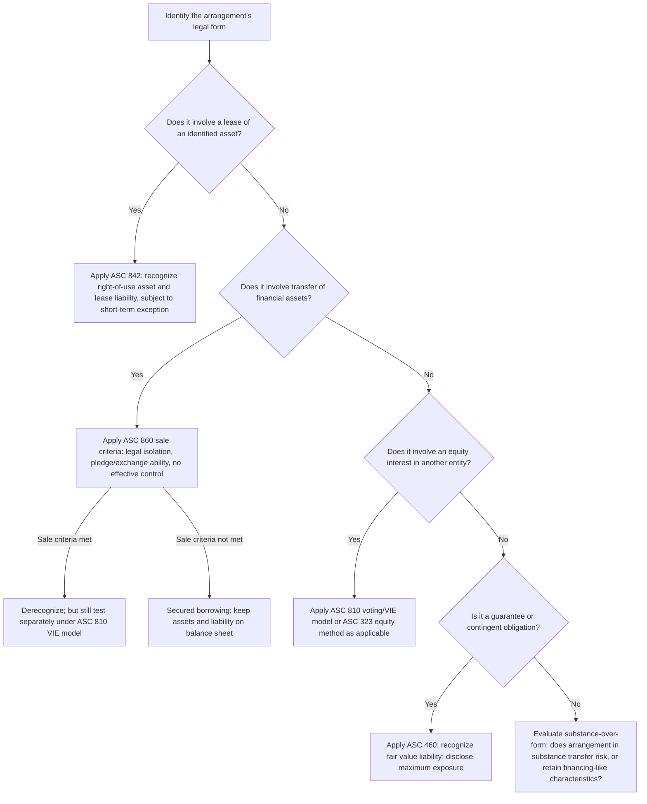

## Off-Balance-Sheet Financing Arrangements

### Overview

Off-balance-sheet (OBS) financing refers to arrangements structured so that assets, liabilities, or both are kept off a reporting entity's balance sheet, despite the entity retaining meaningful economic exposure to, or control over, the underlying assets or obligations. While the VIE consolidation model (ASC 810) and lease accounting (ASC 842) have substantially narrowed the scope of arrangements that can legitimately remain off-balance-sheet compared to decades past, a range of structures and contractual arrangements continue to warrant careful analysis to determine whether on-balance-sheet recognition is required in substance, even when the legal form suggests otherwise.

### Historical Motivations for Off-Balance-Sheet Structuring

Entities have historically pursued off-balance-sheet treatment to achieve one or more of the following (legitimate or, in some documented cases, improper) objectives:

- **Leverage ratio management**: Keeping debt off the balance sheet to maintain compliance with debt covenants, credit rating thresholds, or regulatory capital requirements.
- **Return-on-asset optimization**: Removing assets (and their associated, often lower-yielding, financing) from the balance sheet to improve reported return on assets or return on equity metrics.
- **Risk transfer**: Genuinely transferring economic risk to third parties (a legitimate objective when substantively achieved) as opposed to merely obtaining favorable accounting form without true risk transfer.
- **Regulatory capital arbitrage** (for financial institutions): Structuring transactions to reduce risk-weighted assets for regulatory capital purposes, which historically sometimes diverged from the economic risk actually transferred.

### Principal Categories of Off-Balance-Sheet Arrangements

#### 1. Operating Leases (Pre-ASC 842)

Prior to the adoption of ASC 842 (*Leases*), operating leases represented one of the most common and financially significant forms of off-balance-sheet financing: a lessee could obtain long-term, non-cancelable use of an asset (real estate, aircraft, equipment) while recognizing only rent expense, with no lease liability or right-of-use asset on the balance sheet, provided the arrangement met the (pre-ASC 842) operating lease classification criteria rather than capital lease criteria. **ASC 842 substantially eliminated this form of off-balance-sheet treatment** for lessees by requiring recognition of a right-of-use asset and a corresponding lease liability for substantially all leases (with limited exceptions, primarily short-term leases of 12 months or less). **[Inference]** Because this reform is well-established and widely implemented at this point, operating lease off-balance-sheet treatment is now primarily a historical/legacy topic for forensic review of pre-adoption periods or as a comparative baseline for understanding why current lease standards were reformed, rather than a live current-period planning consideration for lessees under U.S. GAAP.

#### 2. Securitizations and Structured Finance Vehicles

As discussed in the related securitization topic, the historical qualifying special purpose entity (QSPE) exception permitted certain passively-managed securitization SPEs to avoid consolidation entirely, keeping the underlying assets and associated debt off the sponsor's balance sheet while the sponsor often retained significant continuing economic exposure through residual interests, servicing arrangements, or implicit recourse. The elimination of the QSPE exception and the strengthened VIE primary beneficiary model substantially curtailed this avenue, though sponsors retaining only genuinely passive, non-controlling interests in securitization vehicles can still achieve legitimate non-consolidation.

#### 3. Joint Ventures and Equity Method Investments

Investments accounted for under the **equity method** (typically 20%-50% voting ownership without control, or non-controlling influence in a VIE context) result in the investee's assets and liabilities remaining off the investor's balance sheet — only a single net "Investment in Joint Venture" line item and the investor's share of the investee's net income/loss are reflected. If a joint venture is separately financed with debt at the JV level, that debt does not appear on the investor's balance sheet unless the investor has provided a guarantee (which would itself require separate liability or disclosure treatment) or unless, in substance, the arrangement causes the investor to be a VIE primary beneficiary rather than a genuine equity-method participant.

#### 4. Take-or-Pay and Throughput Arrangements

Historically significant OBS structures (again, of substantial interest in the forensic/academic literature around the Enron matter) include **take-or-pay contracts** (obligating a purchaser to pay for a specified quantity of goods or services regardless of whether it takes delivery) and **throughput arrangements** (obligating a shipper to use, and pay for, a certain capacity of a pipeline or similar infrastructure). These can, in substance, function as financing arrangements for the construction or acquisition of the underlying asset by a separate entity, with the "customer" effectively guaranteeing the debt service through its purchase/throughput commitments, while no liability appears directly on the customer's balance sheet — a structure requiring careful substance-over-form analysis, particularly regarding whether the arrangement in substance transfers the risks and rewards of ownership.

#### 5. Factoring and Receivables Sale Arrangements

Sales of accounts receivable (factoring) can achieve off-balance-sheet treatment (derecognition of the receivables) if the transfer meets the sale criteria of ASC 860 (surrender of control, including legal isolation, transferee's ability to pledge/exchange, and absence of the transferor's effective control). If the arrangement instead retains recourse features, repurchase obligations, or other continuing involvement that fails the ASC 860 sale criteria, it must be accounted for as a **secured borrowing**, keeping both the receivables and the associated liability on the transferor's balance sheet.

#### 6. Supply Chain Finance and Reverse Factoring Programs

**[Inference]** Reverse factoring (supply chain finance) programs — where a financial intermediary pays a company's suppliers early, in exchange for the company extending its own payment terms to the intermediary — have drawn recent standard-setting and disclosure attention (addressed through ASU 2022-04, *Disclosure of Supplier Finance Program Obligations*) because these programs can result in payables that are economically similar to debt being presented as ordinary accounts payable rather than as financing obligations, obscuring the true nature and extent of an entity's financing. Current U.S. GAAP requires specific disclosures about the key terms of such programs (including the amount outstanding, payment terms, and a rollforward of obligations) rather than reclassifying the obligations as debt outright, so entities should verify against current guidance whether reclassification, rather than disclosure alone, might apply to their specific program terms.

#### 7. Guarantees and Contingent Obligations

Financial and performance guarantees can create substantial off-balance-sheet exposure: the guarantor typically recognizes only a (often small) liability for the fair value of the guarantee obligation at inception under ASC 460, even though the guarantor's maximum potential exposure (if the guaranteed party defaults) could be many multiples of the recognized liability. This asymmetry between the small recognized liability and the potentially large contingent exposure is a specifically identified disclosure focus area under ASC 460's guarantee disclosure requirements.

### Comparison Table — OBS Structures and Their Primary Governing Standard

| OBS Structure | Governing Standard | Current Status |
| --- | --- | --- |
| Operating leases (lessee) | ASC 842 | Largely eliminated for lessees; right-of-use asset/liability now required |
| Securitization SPEs | ASC 810 (VIE) / ASC 860 | QSPE exception eliminated; primary beneficiary test applies |
| Equity method joint ventures | ASC 323 | Legitimate OBS treatment when genuinely no control; JV-level debt not consolidated absent control/VIE primary beneficiary status |
| Take-or-pay / throughput arrangements | ASC 842 (if lease-like) / substance-over-form analysis | Requires facts-specific evaluation; historically a documented abuse area |
| Receivables factoring | ASC 860 | OBS only if true sale criteria met; otherwise secured borrowing |
| Supply chain finance / reverse factoring | ASC 405-50 (disclosure, per ASU 2022-04) | Enhanced disclosure required; not automatically reclassified as debt |
| Financial guarantees | ASC 460 | Small liability recognized; disclosure required for maximum exposure |

### Decision Flow — Evaluating a Potential OBS Arrangement

### Illustrative Substance-Over-Form Diagram (svg_diagram)

<svg xmlns="http://www.w3.org/2000/svg" viewBox="0 0 600 300" font-family="Arial, sans-serif">
<text x="300" y="26" text-anchor="middle" font-size="16" font-weight="bold">Legal Form vs Economic Substance Gap (svg_diagram)</text>
<rect x="40" y="60" width="220" height="180" rx="8" fill="#dbeafe" stroke="#1e3a8a" stroke-width="2" />
<text x="150" y="90" text-anchor="middle" font-size="13" font-weight="bold">Legal Form</text>
<text x="150" y="115" text-anchor="middle" font-size="11">"Sale" of receivables</text>
<text x="150" y="135" text-anchor="middle" font-size="11">"Operating" lease</text>
<text x="150" y="155" text-anchor="middle" font-size="11">"Passive" equity holder</text>
<text x="150" y="175" text-anchor="middle" font-size="11">"Take-or-pay" contract</text>
<text x="150" y="200" text-anchor="middle" font-size="10" font-style="italic">Presented off balance sheet</text>
<rect x="340" y="60" width="220" height="180" rx="8" fill="#fee2e2" stroke="#991b1b" stroke-width="2" />
<text x="450" y="90" text-anchor="middle" font-size="13" font-weight="bold">Economic Substance</text>
<text x="450" y="115" text-anchor="middle" font-size="11">Recourse retained</text>
<text x="450" y="135" text-anchor="middle" font-size="11">Effective control retained</text>
<text x="450" y="155" text-anchor="middle" font-size="11">Power + significant economics</text>
<text x="450" y="175" text-anchor="middle" font-size="11">Debt-service guarantee in substance</text>
<text x="450" y="200" text-anchor="middle" font-size="10" font-style="italic">Should be recognized/consolidated</text>
<line x1="260" y1="150" x2="340" y2="150" stroke="#7f1d1d" stroke-width="3" marker-end="url(#arrow6)" />
<text x="300" y="140" text-anchor="middle" font-size="10">Analysis</text>
<text x="300" y="165" text-anchor="middle" font-size="10">gap</text>
</svg>

### Forensic and Analytical Considerations

- **The Enron precedent**: The collapse of Enron is the paradigmatic case study in off-balance-sheet financing abuse, involving numerous SPEs (including the well-documented "Raptor" and "LJM" entities) that were structured to keep debt and underlying asset risk off Enron's consolidated balance sheet while Enron's own executives and affiliated parties controlled and economically benefited from the entities, in a manner that (per subsequent investigations and restatements) did not reflect genuine risk transfer or independent equity ownership consistent with then-applicable consolidation rules. This case directly motivated the original FIN 46/46(R) VIE consolidation reforms.
- **Substance-over-form testing as a core forensic technique**: Because OBS structures are, by design, engineered to satisfy the *technical* requirements of applicable accounting literature while achieving a desired presentational outcome, forensic accountants specifically focus on whether the arrangement's economic substance (who bears risk, who has decision-making power, who receives residual benefit) diverges from its legal and accounting form, rather than accepting management's characterization or the presence of a supporting legal opinion at face value.
- **Aggregation and disclosure completeness testing**: Because individual OBS arrangements can each be immaterial in isolation while collectively representing a significant undisclosed risk concentration, forensic and audit procedures increasingly focus on aggregating related off-balance-sheet exposures (across guarantees, unconsolidated VIEs, and supply-chain finance programs, for example) to assess whether the *aggregate* off-balance-sheet risk is properly disclosed, even where each individual arrangement's disclosure, viewed alone, might appear adequate.
- **Related-party and management-affiliated SPE screening**: A recurring red flag pattern (directly informed by the Enron matter) is off-balance-sheet vehicles in which company executives, directors, or their close associates hold direct or indirect economic interests or decision-making roles; forensic investigations specifically screen for such related-party involvement in any entity claimed to be a genuinely independent, unconsolidated counterparty.
- **Reverse factoring risk to going-concern and liquidity analysis**: Because reverse factoring programs can substantially extend a company's effective payment terms while the balance remains classified as ordinary accounts payable, forensic and credit analysts specifically test disclosed supply-chain-finance program balances against historical payment-term trends to assess whether reported liquidity and working capital metrics are being flattered by financing arrangements not transparently presented as debt.

### Key Points

- ASC 842 (leases) and the modern ASC 810 VIE model (post-QSPE-elimination) have substantially narrowed, though not entirely eliminated, the range of arrangements that can legitimately remain off-balance-sheet.
- Off-balance-sheet treatment should always be tested against economic substance — who bears risk, who holds decision-making power, and who receives residual benefit — rather than relying solely on the arrangement's legal form or label.
- Guarantees, take-or-pay contracts, throughput arrangements, and supply-chain finance programs remain areas where significant economic exposure can exist without full on-balance-sheet recognition, relying instead on disclosure-based transparency.
- The Enron collapse remains the foundational case study motivating the stringent modern VIE consolidation framework and continues to inform forensic screening methodology for related-party and management-affiliated off-balance-sheet vehicles.
- Aggregation of individually immaterial off-balance-sheet exposures into a comprehensive risk picture is an increasingly emphasized forensic and disclosure-adequacy technique.

### Related Topics

- VIE identification criteria under ASC 810
- Determining the primary beneficiary
- Securitization structures and special purpose entities
- Lease accounting under ASC 842 and historical operating lease treatment
- Guarantee accounting and disclosure under ASC 460
- Supply chain finance program disclosures under ASU 2022-04
- Case study: Enron special purpose entities and the origins of modern VIE consolidation standards