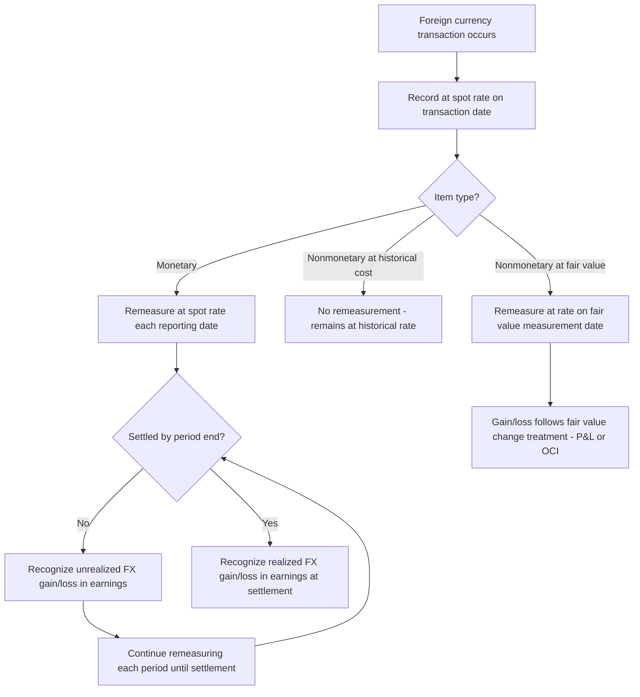

## Foreign Currency Transaction Accounting and Remeasurement

### Overview

Foreign currency transaction accounting governs how an entity records transactions denominated in a currency other than its functional currency, and how it remeasures the resulting monetary and nonmonetary balances at each subsequent reporting date until settlement. This area is governed primarily by ASC 830 (Foreign Currency Matters) under U.S. GAAP and IAS 21 (The Effects of Changes in Foreign Exchange Rates) under IFRS. The core mechanics are consistent between the two frameworks, though terminology and certain presentation requirements differ.

The key distinction that anchors this entire topic is between:

1. **Foreign currency transactions** — transactions a reporting entity enters into that are denominated in a currency other than its own functional currency (e.g., a US company with USD functional currency purchasing inventory invoiced in EUR).
2. **Translation of foreign operations** — converting the financial statements of a foreign subsidiary whose functional currency differs from the parent's reporting currency (covered separately under the translation topic in this chapter).

This item focuses specifically on transaction accounting and remeasurement — the process applied at the individual transaction/balance level, not the full financial-statement translation process.

### Key Concepts and Definitions

- **Functional currency**: The currency of the primary economic environment in which an entity operates; normally the currency in which it primarily generates and expends cash (ASC 830-10-45-2; IAS 21.9–14).
- **Foreign currency**: Any currency other than the entity's functional currency.
- **Transaction date**: The date a transaction is initially recognized in accordance with U.S. GAAP/IFRS (e.g., date of sale, purchase, or when a receivable/payable arises).
- **Settlement date**: The date the transaction is settled in cash or its equivalent.
- **Spot rate**: The exchange rate for immediate delivery of currency.
- **Monetary items**: Units of currency held and assets/liabilities to be received or paid in a fixed or determinable number of currency units (cash, receivables, payables, most debt).
- **Nonmonetary items**: Items not settled in a fixed number of currency units (inventory, PP&E, intangible assets, most equity investments).
- **Remeasurement**: Restating monetary foreign-currency-denominated balances to current spot rates at each balance sheet date.

### Initial Recognition

At the transaction date, a foreign-currency-denominated transaction is recorded in the entity's functional currency using the spot exchange rate on that date (ASC 830-20-30-1; IAS 21.21).

$$\text{Functional Currency Amount} = \text{Foreign Currency Amount} \times \text{Spot Rate at Transaction Date}$$

**Example:**

A US company (functional currency: USD) purchases inventory from a German supplier for €100,000 on a date when the spot rate is $1.10/€.

$$\$110{,}000 = €100{,}000 \times 1.10$$

Journal entry at transaction date:

| Account | Debit | Credit |
| --- | --- | --- |
| Inventory | $110,000 |  |
| Accounts Payable (EUR) |  | $110,000 |

### Subsequent Measurement — Monetary vs. Nonmonetary Treatment

This is the central mechanical rule of the topic:

- **Monetary items** denominated in a foreign currency are remeasured at the **current spot rate** at each balance sheet date, with the resulting exchange difference recognized in **earnings** (ASC 830-20-35-1; IAS 21.23(a), 21.28).
- **Nonmonetary items** carried at historical cost are **not** remeasured for subsequent exchange rate changes — they remain at the functional-currency amount established at the transaction date (their exchange rate is effectively "locked in").
- **Nonmonetary items carried at fair value** (e.g., certain equity securities, some inventory measured at NRV in specific regimes) are remeasured using the exchange rate in effect when fair value was determined, with the resulting difference treated consistently with how the fair value change itself is recognized (P&L or OCI, following the item's own measurement guidance).

| Item Type | Examples | Remeasurement Rate | Gain/Loss Location |
| --- | --- | --- | --- |
| Monetary | Cash, A/R, A/P, notes payable/receivable, accrued liabilities | Current spot rate at each reporting date | Earnings (P&L) |
| Nonmonetary — historical cost | Inventory (at cost), PP&E, intangibles, prepaid expenses | Historical rate (transaction date) — not remeasured | N/A |
| Nonmonetary — fair value | Available-for-sale/FVOCI equity securities, certain inventory at NRV | Rate at fair value measurement date | Follows fair value change treatment (P&L or OCI) |

### Remeasurement at Subsequent Balance Sheet Dates

For each unsettled monetary item, at every reporting date:

$$\text{Remeasurement Gain/(Loss)} = \text{Foreign Currency Balance} \times (\text{Current Spot Rate} - \text{Prior Carrying Rate})$$

**Example (continuing the €100,000 payable):**

At year-end, the spot rate has moved to $1.15/€.

- Carrying value at transaction date: $110,000 (€100,000 × 1.10)
- Carrying value at year-end: €100,000 × 1.15 = $115,000
- The payable has **increased** in USD terms by $5,000

Since this is a liability and the foreign currency has strengthened against the functional currency, the entity owes more USD to settle the same €100,000 — this is a **remeasurement loss**.

Journal entry:

| Account | Debit | Credit |
| --- | --- | --- |
| Foreign Exchange Loss | $5,000 |  |
| Accounts Payable (EUR) |  | $5,000 |

**Direction logic** (critical for exam-style application):

- **Payable (liability)** + foreign currency **strengthens** → loss (owe more functional currency)
- **Payable (liability)** + foreign currency **weakens** → gain (owe less functional currency)
- **Receivable (asset)** + foreign currency **strengthens** → gain (will collect more functional currency)
- **Receivable (asset)** + foreign currency **weakens** → loss (will collect less functional currency)

### Settlement Accounting

At settlement, the entity records a final remeasurement to the settlement-date spot rate, then extinguishes the monetary item with the actual currency exchanged.

**Example (continuing at settlement):**

The payable is settled shortly after year-end when the spot rate is $1.13/€.

- Carrying value before settlement: $115,000
- Cash required to settle: €100,000 × 1.13 = $113,000
- Difference: $2,000 **gain** (the payable's carrying amount decreased relative to what was owed)

Journal entry:

| Account | Debit | Credit |
| --- | --- | --- |
| Accounts Payable (EUR) | $115,000 |  |
| Foreign Exchange Gain |  | $2,000 |
| Cash |  | $113,000 |

### Full Worked Example — Multi-Period Transaction

**Facts:** A US company (USD functional) sells goods to a UK customer for £50,000 on November 1, invoiced in GBP, with payment due February 1 of the following year. The company has a December 31 year-end.

| Date | Event | Spot Rate ($/£) | USD Amount |
| --- | --- | --- | --- |
| Nov 1 | Sale recognized | 1.25 | $62,500 |
| Dec 31 | Year-end remeasurement | 1.28 | $64,000 |
| Feb 1 | Settlement | 1.22 | $61,000 |

**Nov 1 — Initial recognition:**

| Account | Debit | Credit |
| --- | --- | --- |
| Accounts Receivable (GBP) | $62,500 |  |
| Sales Revenue |  | $62,500 |

**Dec 31 — Year-end remeasurement:**

Receivable (asset) and GBP strengthened (1.25 → 1.28) → gain.

$$£50{,}000 \times (1.28 - 1.25) = \$1{,}500 \text{ gain}$$

| Account | Debit | Credit |
| --- | --- | --- |
| Accounts Receivable (GBP) | $1,500 |  |
| Foreign Exchange Gain |  | $1,500 |

**Feb 1 — Settlement:**

GBP weakened from 1.28 to 1.22 → loss on the remaining exposure.

$$£50{,}000 \times (1.22 - 1.28) = -\$3{,}000 \text{ (loss)}$$

| Account | Debit | Credit |
| --- | --- | --- |
| Cash | $61,000 |  |
| Foreign Exchange Loss | $3,000 |  |
| Accounts Receivable (GBP) |  | $64,000 |

**Net effect check:** $1,500 gain (2026) + ($3,000) loss (2027) = ($1,500) net loss, which equals the difference between the original transaction-date value and final settlement value: $62,500 − $61,000 = $1,500 loss. This reconciliation is a useful check on any multi-period problem.

### Forecasted and Committed Transactions vs. Recognized Transactions

A common point of confusion: remeasurement gain/loss recognition applies only to **recognized** monetary assets/liabilities, not to unrecognized firm commitments or forecasted transactions, which are instead addressed under hedge accounting guidance (ASC 815 / IFRS 9) if hedged, or simply not recognized until the underlying transaction occurs.

### Intercompany Foreign Currency Transactions

Special consideration applies to intercompany balances:

- If an intercompany foreign-currency transaction is **of a long-term investment nature** (settlement not planned or anticipated in the foreseeable future), the resulting exchange gain/loss is **not** recognized in consolidated earnings; instead, under ASC 830-20-35-3 it is reported in **cumulative translation adjustment (CTA)** within OCI (analogous treatment under IAS 21.32 for net investment in a foreign operation).
- If the intercompany balance is a routine, short-term trade receivable/payable expected to be settled, normal earnings-based remeasurement applies.

This distinction is frequently tested because it requires judgment about the nature and intent of the intercompany balance, not just its legal form.

### Distinguishing Remeasurement from Translation

| Aspect | Remeasurement (this topic) | Translation |
| --- | --- | --- |
| Applies to | Foreign-currency-denominated transactions/balances in an entity's own functional-currency books | Converting an entire set of foreign-functional-currency financial statements into the reporting currency |
| Rate used | Spot rate for monetary items; historical rate for nonmonetary items | Current rate for assets/liabilities (balance sheet); average rate for income statement items (typically) |
| Gain/loss location | Earnings (P&L) | Other Comprehensive Income (CTA) |
| Governing guidance | ASC 830-20 / IAS 21.20-29 | ASC 830-30 / IAS 21.38-49 |

Remeasurement (sometimes called the "temporal method" when applied to an entire set of foreign subsidiary books whose functional currency is deemed to be the parent's reporting currency) is used when a foreign entity's functional currency is the same as the reporting currency's parent, or for individual monetary items in an entity's own books. Full **translation** using the current rate method applies when a foreign subsidiary's functional currency differs from the parent's reporting currency — this is addressed in the companion topic within this chapter.

### Process Flow

### Exchange Rate Timeline Illustration (svg_diagram)

<svg xmlns="http://www.w3.org/2000/svg" viewBox="0 0 700 260">
<rect x="0" y="0" width="700" height="260" fill="#ffffff" />
<text x="350" y="24" text-anchor="middle" font-size="16" font-weight="bold" fill="#1a1a1a">Foreign Currency Receivable Timeline (svg_diagram)</text>
<line x1="60" y1="140" x2="640" y2="140" stroke="#333333" stroke-width="2" />
<circle cx="120" cy="140" r="6" fill="#2563eb" />
<text x="120" y="165" text-anchor="middle" font-size="12" fill="#1a1a1a">Nov 1</text>
<text x="120" y="180" text-anchor="middle" font-size="11" fill="#555555">Transaction Date</text>
<text x="120" y="115" text-anchor="middle" font-size="11" fill="#1a1a1a">Rate: 1.25</text>
<text x="120" y="100" text-anchor="middle" font-size="11" fill="#1a1a1a">\$62,500</text>
<circle cx="360" cy="140" r="6" fill="#16a34a" />
<text x="360" y="165" text-anchor="middle" font-size="12" fill="#1a1a1a">Dec 31</text>
<text x="360" y="180" text-anchor="middle" font-size="11" fill="#555555">Balance Sheet Date</text>
<text x="360" y="115" text-anchor="middle" font-size="11" fill="#1a1a1a">Rate: 1.28</text>
<text x="360" y="100" text-anchor="middle" font-size="11" fill="#16a34a">Gain: \$1,500</text>
<circle cx="600" cy="140" r="6" fill="#dc2626" />
<text x="600" y="165" text-anchor="middle" font-size="12" fill="#1a1a1a">Feb 1</text>
<text x="600" y="180" text-anchor="middle" font-size="11" fill="#555555">Settlement Date</text>
<text x="600" y="115" text-anchor="middle" font-size="11" fill="#1a1a1a">Rate: 1.22</text>
<text x="600" y="100" text-anchor="middle" font-size="11" fill="#dc2626">Loss: \$3,000</text>
<line x1="120" y1="140" x2="360" y2="140" stroke="#16a34a" stroke-width="4" />
<line x1="360" y1="140" x2="600" y2="140" stroke="#dc2626" stroke-width="4" />

<text x="350" y="230" text-anchor="middle" font-size="12" fill="`#333333`">Net effect: $62,500 → $61,000 = $1,500 net loss over the full period</text>

</svg>

### Presentation and Disclosure

- Realized and unrealized transaction gains/losses are generally aggregated and presented as a single line item, often within "other income (expense)" on the income statement, unless material enough to warrant separate disclosure (ASC 830-20-45-1).
- Entities must disclose the aggregate transaction gain/loss included in net income (ASC 830-20-50-1; IAS 21.52).
- IFRS additionally requires disclosure of the amount of exchange differences recognized in OCI and reconciliation of these amounts where a CTA-equivalent exists.

### Common Errors and Points of Confusion

- **Applying spot-rate remeasurement to nonmonetary items** carried at historical cost — this is incorrect; only monetary items are remeasured.
- **Reversing the gain/loss direction** — always anchor to whether the entity holds an asset (will receive currency) or liability (will pay currency), then determine whether the foreign currency strengthened or weakened against the functional currency.
- **Confusing remeasurement gains/losses (P&L) with translation adjustments (OCI/CTA)** — these follow different rules and serve different purposes despite superficially similar mechanics.
- **Treating intercompany balances uniformly** — long-term-investment-nature intercompany balances receive OCI treatment; routine ones do not.

**Related Topics:**

- Translation of foreign subsidiary financial statements (current rate method) and cumulative translation adjustment (CTA)
- Determination of functional currency and highly inflationary economies (ASC 830-10-45 / IAS 21.19-14, IAS 29)
- Hedge accounting for foreign currency exposures (forward contracts, options) under ASC 815 / IFRS 9
- Net investment hedges and their interaction with CTA
- Foreign currency financial statement translation illustrative disclosures under ASC 830-30 / IAS 21
- Forensic accounting red flags in FX gain/loss manipulation and timing of remeasurement recognition