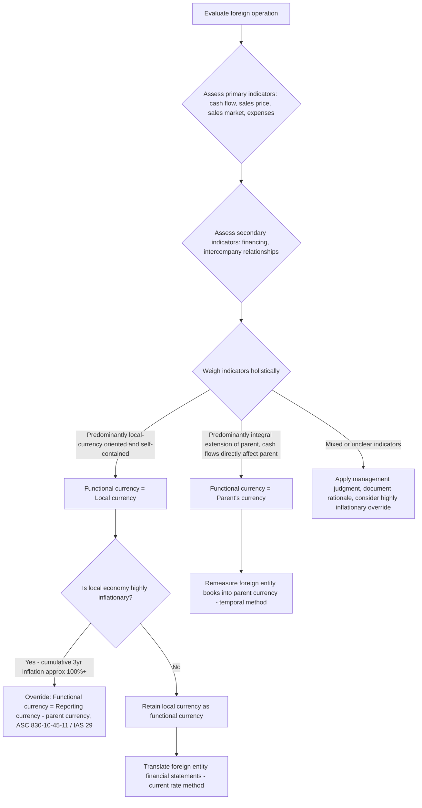

## Functional Currency Determination

### Overview

Functional currency determination is the foundational judgment that precedes all other foreign currency accounting. It determines which currency an entity uses as its "home base" for measuring transactions, and consequently dictates whether subsequent foreign currency activity is accounted for through **remeasurement** (transaction-level, into a functional currency) or **translation** (financial-statement-level, out of a functional currency into a reporting currency). An incorrect functional currency determination cascades through every subsequent foreign currency accounting decision, making this a high-leverage judgment area in both financial reporting and forensic review.

Governing guidance: ASC 830-10-45 under U.S. GAAP; IAS 21.9–14 under IFRS. The two frameworks are substantively converged on this topic.

### Definition

The **functional currency** is the currency of the primary economic environment in which an entity operates — normally, the currency of the environment in which the entity primarily generates and expends cash (ASC 830-10-45-2). It is not necessarily:

- The currency in which the entity keeps its accounting records
- The parent's reporting currency
- The currency of the country where the entity is legally domiciled or incorporated

An entity's functional currency is a matter of fact determined by economic substance, not an accounting policy election — management does not have free choice.

### The Indicator Framework (ASC 830-10-55-5 / IAS 21.9-10)

Both frameworks provide a set of economic indicators to evaluate, grouped into categories. No single indicator is determinative; judgment is required to weigh them holistically, though IAS 21 explicitly directs that cash flow, sales price, and financing indicators be given priority consideration before secondary indicators.

**Primary indicators:**

| Indicator | Question to Ask | Points Toward Functional = Local Currency | Points Toward Functional = Parent Currency |
| --- | --- | --- | --- |
| Cash flow indicators | In what currency are cash flows primarily generated/settled, and do they directly affect the parent's cash flows? | Cash flows primarily in local currency, largely self-contained | Cash flows directly impact parent's cash flows on a current basis |
| Sales price indicators | What currency mainly influences sales prices? | Local sales prices determined by local competition/regulation, not short-term parent-currency exchange rate movements | Sales prices are directly responsive to changes in exchange rates (e.g., quoted in parent currency, tied to a world market) |
| Sales market indicators | Where is the entity's sales market? | Active local sales market for the entity's products, though exports may also occur | Sales market is primarily the parent's country, or sales contracts are denominated in parent currency |
| Expense indicators | What currency drives production costs/expenses? | Labor, materials, and other costs primarily local currency, local components | Costs primarily sourced from and paid in parent's country/currency |

**Secondary indicators:**

| Indicator | Points Toward Local Currency | Points Toward Parent Currency |
| --- | --- | --- |
| Financing | Financing primarily denominated in local currency; local operations generate sufficient funds to service debt | Financing primarily from parent or denominated in parent currency; entity cannot service debt without parent funding |
| Intercompany transactions | Low volume/interrelation of intercompany transactions | Extensive and continuous intercompany transactions integral to operations |

### Decision Framework Summary

### Two Practical Scenarios

**Scenario 1 — Self-contained, integrated local operation:**

A US parent owns a manufacturing subsidiary in Brazil that produces and sells almost entirely within the Brazilian market, is financed by local Brazilian bank debt, pays local suppliers and employees in BRL, and generates sufficient BRL cash flow to service its own obligations without ongoing parent funding. The Brazilian economy is not highly inflationary.

- **Conclusion**: Functional currency = BRL (local currency)
- **Consequence**: The subsidiary's financial statements are **translated** into USD using the current rate method for consolidation; a Cumulative Translation Adjustment (CTA) is recognized in OCI.

**Scenario 2 — Integral extension of the parent's operations:**

A US parent operates a foreign sales branch/subsidiary in Singapore that exists mainly to distribute the parent's USD-manufactured products, is financed almost entirely by intercompany loans from the US parent, remits cash to the parent regularly, and prices its products by reference to USD list prices.

- **Conclusion**: Functional currency = USD (parent's currency), even though the entity is legally domiciled and keeps its books in SGD.
- **Consequence**: The entity's SGD-denominated books must be **remeasured** into USD using the temporal method; remeasurement gains/losses flow through earnings, not OCI.

### The Highly Inflationary Economy Override

Under ASC 830-10-45-11, if a foreign entity operates in a **highly inflationary economy** — defined as cumulative inflation of approximately 100% or more over a three-year period — the foreign entity's functional currency is deemed to be the reporting currency of the parent, regardless of what the indicator analysis would otherwise suggest. This is a mandatory override, not a judgment call once the inflation threshold is met.

$$\text{Cumulative 3-year inflation} = \left[(1+i_1)(1+i_2)(1+i_3)\right] - 1 \geq 100\%$$

**Example:** If a country's annual inflation rates over three years are 30%, 35%, and 30%:

$$(1.30)(1.35)(1.30) - 1 = 2.2815 - 1 = 128.15\%$$

Since this exceeds 100%, the economy is deemed highly inflationary, and the subsidiary must remeasure its financial statements into the parent's reporting currency using the temporal method — even if the entity would otherwise clearly meet local-currency indicators.

IAS 21 does not use a bright-line 100% threshold in the same mechanical way; instead IAS 29 (Financial Reporting in Hyperinflationary Economies) requires restatement of the foreign entity's financial statements for the effects of hyperinflation before translation, using qualitative indicators of hyperinflation (e.g., the population's preference to hold wealth in a stable foreign currency, prices quoted in a stable foreign currency, high cumulative inflation approaching or exceeding 100% over three years, and widespread indexing of prices to a price index).

### Multiple Functional Currencies Within One Consolidated Group

A parent entity may have — and often does have — multiple functional currencies across its consolidated group, since the determination is made **separately for each distinct and separable operation**, not for the consolidated entity as a whole. Each subsidiary, and in some cases each distinct operation within a subsidiary if it has a separately identifiable and self-contained economic environment, must be assessed independently under the indicator framework.

### Change in Functional Currency

A functional currency, once determined, is not expected to change unless there is a clear and significant change in the underlying economic facts and circumstances that drove the original determination (ASC 830-10-45-7; IAS 21.35-37). Examples of triggering changes:

- A previously self-contained local subsidiary becomes wholly dependent on parent financing and loses its local sales market.
- The local economy becomes highly inflationary (triggers the mandatory override discussed above).
- A previously integrated branch develops an independent local customer base, financing, and cost structure.

When a change occurs, it is accounted for **prospectively** from the date of change — translation adjustments are not retrospectively restated for prior periods (ASC 830-10-45-8). Any translation adjustments previously recorded in OCI up to the date of change remain in equity until the foreign entity is sold or substantially liquidated.

### Functional Currency vs. Reporting Currency vs. Presentation Currency (IFRS terminology note)

| Term | Definition | Who Determines It |
| --- | --- | --- |
| Functional currency | Currency of the primary economic environment of a given entity/operation | Determined by economic facts (indicator analysis) — not elected |
| Reporting currency (US GAAP term) / Presentation currency (IFRS term) | Currency in which the consolidated financial statements are presented to external users | Chosen by the reporting entity/parent, can differ from any subsidiary's functional currency |

A group can freely choose its presentation currency under IFRS (IAS 21.38-43) even though functional currency at the entity level is a factual determination, not a choice.

### Documentation and Forensic/Audit Considerations

Because functional currency determination is judgmental and materially affects whether FX effects hit **earnings** (remeasurement/temporal method) versus **OCI** (translation/current rate method), it is an area susceptible to earnings management and warrants heightened professional skepticism:

- **Red flag**: An entity restructures the indicator facts (e.g., changes intercompany financing arrangements) shortly before a reporting period specifically to shift functional currency classification and thereby redirect FX volatility between P&L and OCI.
- **Red flag**: Inconsistent application across similarly situated subsidiaries without documented facts-and-circumstances rationale for the difference.
- **Audit focus**: Contemporaneous documentation of the indicator analysis, especially when indicators are mixed or conflict with each other, and re-assessment triggers (e.g., new financing arrangements, entry into hyperinflationary status) should be monitored each reporting period, not just at initial entity formation/acquisition.
- **Disclosure**: While functional currency itself is not always separately disclosed line-by-line for each subsidiary, changes in functional currency and their effects are disclosable events (ASC 830-10-50; IAS 21.53-57), and the general basis of translation should be described in significant accounting policies.

### Summary Comparison Table: Indicator Outcome to Method

| Functional Currency Determination | Accounting Method Applied | Gain/Loss Location |
| --- | --- | --- |
| Local currency of foreign operation | Translation (current rate method) | OCI — Cumulative Translation Adjustment (CTA) |
| Parent's reporting currency (integral operation or highly inflationary override) | Remeasurement (temporal method) | Earnings (P&L) — remeasurement gain/loss |

**Related Topics:**

- Translation of foreign entity financial statements — current rate method mechanics
- Highly inflationary economies and IAS 29 hyperinflation restatement procedures
- Temporal method remeasurement of nonmonetary and monetary accounts
- Disposal or substantial liquidation of a foreign operation and recycling of CTA from OCI to earnings
- Net investment hedges of foreign operations
- Consolidation procedures for multinational groups with multiple functional currencies