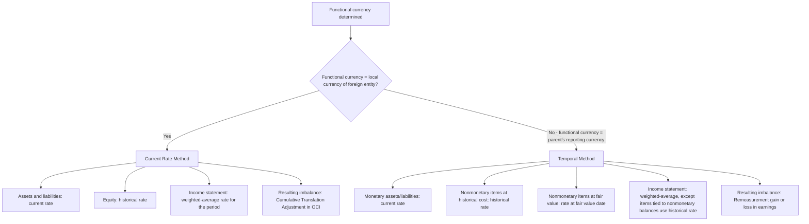

## Current Rate Method versus Temporal Method

### Overview

Once functional currency has been determined for a foreign entity, one of two translation/remeasurement methods applies to convert that entity's financial statements into the reporting currency: the **current rate method** or the **temporal method**. The choice between them is not elective — it follows mechanically from the functional currency determination made under ASC 830-10-45 / IAS 21.9-14. This topic addresses the mechanics, rate application, and gain/loss treatment differences between the two methods, which together represent the two possible endpoints of all foreign currency financial statement conversion.

### Which Method Applies When

| Functional Currency of Foreign Entity | Method Applied | Governing Guidance |
| --- | --- | --- |
| Local currency (foreign entity's own currency) | **Current rate method** | ASC 830-30; IAS 21.38-49 (translation) |
| Parent's reporting currency (integral operation or highly inflationary override) | **Temporal method** | ASC 830-10-45 remeasurement provisions; ASC 830-10-55 |

This is the critical linkage: functional currency determination is the gate; method selection is the automatic consequence.

### Current Rate Method — Mechanics

Used when the foreign entity's functional currency is its own local currency. The entire set of financial statements is translated using three distinct rates:

| Financial Statement Item | Rate Applied |
| --- | --- |
| All assets and liabilities (both monetary and nonmonetary) | Current (spot) rate at the balance sheet date |
| Common stock, APIC, and other equity transactions | Historical rate at the date each equity transaction occurred |
| Retained earnings | Carried forward from prior period translated balance, adjusted for current period translated net income and dividends |
| Revenues and expenses | Weighted-average rate for the period (a simple average or transaction-weighted average is acceptable if it approximates actual rates) |
| Dividends declared | Rate at declaration date |

Because assets/liabilities use the current rate while equity uses historical/average rates, the balance sheet will not balance without a plug — this plug is the **Cumulative Translation Adjustment (CTA)**, reported within **Accumulated Other Comprehensive Income (AOCI)** in equity, not in earnings.

$$\text{CTA} = \text{Total Assets (current rate)} - \text{Total Liabilities (current rate)} - \text{Equity (historical/average rates)}$$

**Key characteristic**: Because all assets and liabilities move together at the current rate, the *net asset position* of the entity is what drives the translation adjustment — the relative proportion of monetary versus nonmonetary items does not matter under this method, unlike under the temporal method.

### Temporal Method — Mechanics

Used when the foreign entity's functional currency is deemed to be the parent's reporting currency (either because the entity is an integral extension of the parent, or due to the highly inflationary override). The temporal method applies rates based on the **measurement basis of each individual item**, preserving the historical-cost nature of nonmonetary assets in the reporting currency.

| Financial Statement Item | Rate Applied |
| --- | --- |
| Monetary assets and liabilities (cash, receivables, payables, debt) | Current (spot) rate at balance sheet date |
| Nonmonetary assets/liabilities carried at historical cost (inventory at cost, PP&E, intangibles) | Historical rate at the date the asset was acquired or liability incurred |
| Nonmonetary items carried at fair value/NRV | Rate in effect at the date fair value was determined |
| Common stock, APIC | Historical rate at issuance |
| Retained earnings | Derived — a balancing/rolled-forward figure, not directly translated |
| Revenues and most expenses | Weighted-average rate for the period |
| Cost of goods sold, depreciation, amortization (expenses related to nonmonetary balance-sheet items) | Historical rate(s) applicable to the related nonmonetary asset (e.g., COGS uses the historical rate(s) that applied to the inventory layers sold) |

**Key characteristic**: Because monetary and nonmonetary items are translated at different rates, the resulting imbalance is a **remeasurement gain or loss recognized directly in earnings** — not OCI. The temporal method effectively treats the transaction/balance history as if it had been recorded directly in the parent's functional currency all along.

$$\text{Remeasurement Gain/(Loss)} = \text{Plug needed to balance the temporally-translated balance sheet, recognized in net income}$$

### Side-by-Side Comparison Table

| Feature | Current Rate Method | Temporal Method |
| --- | --- | --- |
| Triggering functional currency | Local currency | Parent's reporting currency |
| Monetary assets/liabilities rate | Current rate | Current rate |
| Nonmonetary assets (historical cost) rate | Current rate | Historical rate |
| Common stock/APIC rate | Historical rate | Historical rate |
| Revenue/expense rate (general) | Weighted-average | Weighted-average |
| COGS/depreciation rate | Weighted-average (same as other expenses) | Historical rate tied to the related asset |
| Resulting balancing item | Cumulative Translation Adjustment (CTA) | Remeasurement gain/loss |
| Location of balancing item | OCI (equity) | Net income (P&L) |
| Volatility impact on earnings | None (isolated to OCI until disposal) | Direct — flows through every period |
| Retained earnings treatment | Roll-forward of translated net income | Derived/residual balancing figure |

### Worked Comparative Example

**Facts:** A foreign subsidiary has the following simplified balance sheet at year-end (in local currency, LC):

| Item | LC Amount | Historical Rate | Current Rate |
| --- | --- | --- | --- |
| Cash | 20,000 | — | 1.10 |
| Accounts Receivable | 30,000 | — | 1.10 |
| Inventory (at cost) | 50,000 | 1.05 | 1.10 |
| PP&E, net | 100,000 | 0.95 | 1.10 |
| **Total Assets** | **200,000** |  |  |
| Accounts Payable | 25,000 | — | 1.10 |
| Long-term Debt | 75,000 | — | 1.10 |
| Common Stock | 60,000 | 0.90 | 1.10 |
| Retained Earnings | 40,000 | (derived) | (derived) |
| **Total Liabilities + Equity** | **200,000** |  |  |

**Under the Current Rate Method** (functional currency = LC):

- All assets and all liabilities translate at 1.10: Total assets = $220,000; Total liabilities = $110,000
- Common stock translates at historical rate 0.90: $54,000
- Retained earnings rolls forward from prior translated balance plus current period translated income
- CTA is the plug needed to make the balance sheet balance — reflects the net investment exposure to exchange rate movement on the subsidiary's **net asset position** (200,000 LC of net assets)

**Under the Temporal Method** (functional currency = USD, i.e., parent currency):

- Monetary items (cash, A/R, A/P, debt) translate at current rate 1.10
- Inventory translates at its historical rate 1.05: $52,500
- PP&E translates at its historical rate 0.95: $95,000
- Common stock at historical rate 0.90: $54,000
- Retained earnings is derived as a residual/roll-forward figure
- The imbalance between temporally-translated assets and liabilities+equity is the remeasurement gain or loss, recognized immediately in net income

The critical difference: under temporal method, inventory and PP&E are "frozen" at their historical rates rather than moving with current exchange rates, which is why the two methods can produce materially different reported net asset values and materially different income statement volatility for the same underlying foreign operation.

### Why the Methods Diverge: Net Monetary Position

The temporal method's earnings volatility is driven by the entity's **net monetary position** (monetary assets minus monetary liabilities), because only monetary items move with current exchange rates while nonmonetary items stay fixed at historical rates.

$$\text{Net Monetary Position} = \text{Monetary Assets} - \text{Monetary Liabilities}$$

- If an entity holds a **net monetary asset position** (more monetary assets than liabilities) and the foreign currency **weakens**, a remeasurement **loss** results.
- If an entity holds a **net monetary liability position** (more monetary liabilities than assets — common for leveraged entities) and the foreign currency **weakens**, a remeasurement **gain** results (the entity owes less in reporting-currency terms).

This is a frequently tested relationship: entities with substantial foreign-currency-denominated debt (net monetary liability position) will show remeasurement **gains** in earnings when the foreign currency depreciates against the parent's currency — a result that can be counterintuitive and is a common area of financial statement analysis and forensic scrutiny (e.g., are remeasurement gains from currency depreciation on debt masking underlying operating weakness?).

Under the current rate method, by contrast, net monetary position is irrelevant to CTA — only net *asset* position (all assets minus all liabilities at current rate) matters, and the effect bypasses earnings entirely.

### Disposal and Recycling

- **Current rate method / CTA**: Upon **sale or substantially complete liquidation** of the foreign entity, the cumulative translation adjustment attributable to that entity is reclassified ("recycled") from AOCI into earnings as part of the gain/loss on disposal (ASC 830-30-40-1; IAS 21.48). Partial disposals may trigger partial recycling under specific conditions.
- **Temporal method / remeasurement gain-loss**: Since remeasurement gains/losses are already recognized in earnings each period as incurred, there is no deferred balance to recycle upon disposal.

### Practical and Forensic Implications

- **Earnings management exposure**: Because functional currency determination dictates which method applies, and the temporal method routes FX effects through earnings while the current rate method routes them through OCI, there is an incentive to structure (or characterize) foreign operations in ways that direct volatility to the preferred location — particularly relevant when management compensation or debt covenants are tied to net income.
- **Analytical adjustment**: Analysts evaluating operating performance often need to identify and isolate remeasurement gains/losses embedded in earnings under the temporal method, since these are driven by balance sheet financing structure (net monetary position) rather than operating performance.
- **Consistency check**: Auditors and forensic reviewers should verify that the method applied is consistent with the documented functional currency conclusion — use of the current rate method for an entity whose facts indicate an integral/parent-currency functional currency (or vice versa) is a translation-method error, not merely a presentation choice.

**Related Topics:**

- Functional currency determination (governs method selection — see prior item)
- Cumulative translation adjustment mechanics and AOCI rollforward
- Highly inflationary economies and the mandatory temporal method override
- Disposal of a foreign operation and CTA recycling to earnings
- Hedging of net investment in foreign operations
- Analytical adjustments for foreign-currency-driven earnings volatility in ratio analysis