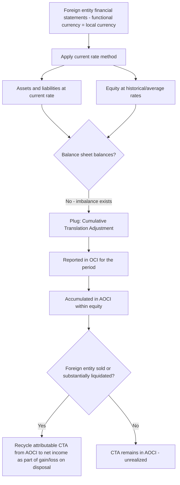

## Cumulative Translation Adjustment and Other Comprehensive Income

### Overview

The Cumulative Translation Adjustment (CTA) is the balancing item that arises specifically from the **current rate method** of translating a foreign entity's financial statements — the direct consequence of applying different exchange rates to assets/liabilities (current rate) versus equity (historical/average rates). Rather than distorting net income with a mechanical artifact of the translation process, U.S. GAAP and IFRS route this adjustment through **Other Comprehensive Income (OCI)** and accumulate it within a separate component of equity. This topic covers CTA's computation, presentation, rollforward mechanics, and the specific rules governing its eventual recognition in earnings upon disposal.

Governing guidance: ASC 830-30 (Translation of Financial Statements); ASC 220 (Comprehensive Income); IAS 21.38-49; IAS 1 (presentation of OCI).

### Why CTA Exists

Under the current rate method, all assets and liabilities are translated at the **current (spot) rate** at each balance sheet date, while common stock and additional paid-in capital remain at the **historical rate** in effect when the equity was issued, and retained earnings is rolled forward using **average rates** for translated net income. Because these components move at different rates, the translated balance sheet will not balance on its own — the plug required to force balance is CTA.

$$\text{CTA (plug)} = \text{Translated Total Assets} - \text{Translated Total Liabilities} - \text{Translated Contributed Capital} - \text{Translated Retained Earnings}$$

Conceptually, CTA represents the unrealized effect of exchange rate fluctuations on the parent's **net investment** in the foreign entity — it is not a transaction gain or loss on any individual asset or liability, but an artifact of restating an entire net asset position to a new currency at a point in time.

### Computation Walkthrough

**Step 1 — Translate the balance sheet:**

All assets and liabilities at the current rate.

**Step 2 — Translate the income statement:**

Revenues and expenses at the weighted-average rate for the period; the translated net income becomes the addition to translated retained earnings for the period.

**Step 3 — Roll forward equity:**

- Beginning retained earnings (translated) + translated net income − translated dividends = ending translated retained earnings
- Common stock/APIC remain at their historical translation rates, unchanged unless new equity is issued

**Step 4 — Compute CTA for the period as the plug:**

$$\text{CTA}_{\text{period}} = \left(\text{Translated Assets} - \text{Translated Liabilities}\right) - \left(\text{Translated Common Stock/APIC} + \text{Translated Retained Earnings}\right)$$

**Step 5 — Roll forward cumulative CTA:**

$$\text{CTA}_{\text{ending balance}} = \text{CTA}_{\text{beginning balance}} + \text{CTA}_{\text{current period change}}$$

The ending CTA balance is reported within **Accumulated Other Comprehensive Income (AOCI)**, a component of stockholders' equity, while the current-period change flows through the statement of comprehensive income as a component of OCI for the period.

### Worked Numerical Example

**Facts:** A foreign subsidiary (functional currency = local currency, "LC") has the following simplified activity for the year:

| Item | LC Amount | Rate | USD Amount |
| --- | --- | --- | --- |
| Beginning net assets (translated, prior year-end) |  |  | $500,000 |
| Beginning CTA balance |  |  | ($20,000) |
| Net income for the year | 80,000 | 1.12 (avg) | $89,600 |
| Dividends declared | 10,000 | 1.15 (declaration date) | $11,500 |
| Ending net assets (LC) | 570,000 | 1.18 (current/year-end rate) | $672,600 |

**Step 1 — Expected ending net assets before translation effect:**

$$\$500{,}000 + \$89{,}600 - \$11{,}500 = \$578{,}100$$

**Step 2 — Actual translated ending net assets (at current rate):**

$$570{,}000 \text{ LC} \times 1.18 = \$672{,}600$$

**Step 3 — Current period CTA (the difference attributable to exchange rate movement):**

$$\$672{,}600 - \$578{,}100 = \$94{,}500 \text{ (positive CTA — gain)}$$

**Step 4 — Ending cumulative CTA balance:**

$$(\$20{,}000) + \$94{,}500 = \$74{,}500$$

This $74,500 is reported within AOCI on the consolidated balance sheet; the $94,500 current-period movement is reported as a component of OCI on the statement of comprehensive income for the year. None of it touches net income or retained earnings on the parent's consolidated income statement.

### Presentation in the Financial Statements

**Statement of Comprehensive Income:**

|  | Amount |
| --- | --- |
| Net income | $XXX |
| Other comprehensive income (loss): |  |
| — Foreign currency translation adjustment | $94,500 |
| — Other OCI items (pension, AFS securities, cash flow hedges) | $XXX |
| Total other comprehensive income | $XXX |
| **Comprehensive income** | **$XXX** |

**Statement of Stockholders' Equity — AOCI rollforward:**

|  | Beginning Balance | Current Period Change | Ending Balance |
| --- | --- | --- | --- |
| Foreign currency translation adjustment | ($20,000) | $94,500 | $74,500 |

CTA is one of several components typically aggregated within AOCI alongside items such as unrealized gains/losses on available-for-sale debt securities (or FVOCI under IFRS), pension and postretirement plan adjustments, and effective portions of cash flow hedges.

### Noncontrolling Interest Allocation

When a foreign subsidiary is not wholly owned, the CTA must be allocated between the controlling and noncontrolling interests in proportion to their respective ownership, consistent with how other equity items are allocated in consolidation (ASC 810; ASC 830-30-45-13). Only the parent's proportionate share of CTA is reported within the parent company's AOCI; the noncontrolling interest's share is reported within noncontrolling interest equity.

### Disposal and Recycling to Earnings

A defining feature that distinguishes CTA from most other components of AOCI is its treatment upon disposal of the underlying entity:

- **Complete sale or substantially complete liquidation** of a foreign entity: the cumulative CTA balance attributable to that entity is reclassified out of AOCI and recognized in net income as part of the computed gain or loss on sale/liquidation (ASC 830-30-40-1; IAS 21.48-49).
- **Partial sale of an equity-method investment or partial disposal that does not result in loss of control**: generally, a pro-rata portion of CTA is recycled based on the relative interest disposed of, when specific conditions are met (ASC 830-30-40-2 through 40-3; IFRS has analogous but not identical partial-disposal guidance under IAS 21.48A-48D — IFRS conditions for recycling on partial disposals of subsidiaries with retained control differ from a loss-of-control disposal).
- **Loss of control but retained noncontrolling equity interest**: the full CTA attributable to the previously consolidated interest is generally recycled to net income, with any retained investment remeasured at fair value as a new basis.
- **Step acquisitions and increases in ownership without loss of control**: additional purchases of noncontrolling interest that do not result in a change of control typically do **not** trigger CTA recycling; they are treated as equity transactions.

### Complications and Special Situations

- **Intercompany loans of a long-term-investment nature**: As covered under foreign currency transaction accounting, exchange gains/losses on intercompany balances that are, in substance, part of the net investment in a foreign operation (settlement not planned or anticipated) are also recorded directly in OCI/CTA rather than earnings (ASC 830-20-35-3; IAS 21.32).
- **Hedges of net investment**: When a parent designates a derivative or foreign-currency-denominated debt as a hedge of its net investment in a foreign operation, the effective portion of the hedging gain/loss is also recorded in OCI/CTA (offsetting the translation exposure), with ineffective portions recognized in earnings (ASC 815-35; IAS 21.32, IFRS 9 hedge accounting for net investment hedges).
- **Deferred taxes**: CTA is a temporary difference-generating item; deferred tax effects related to CTA are generally also recorded within OCI (ASC 740; IAS 12), consistent with the principle of tax-effecting items through the same component of equity/income where the underlying item is recognized ("backwards tracing" is generally not applied, but initial recognition follows the item's location).

### Distinguishing CTA from Remeasurement Gain/Loss (Recap)

| Feature | CTA (Current Rate Method) | Remeasurement Gain/Loss (Temporal Method) |
| --- | --- | --- |
| Origin | Translating a foreign entity's full financial statements when functional currency = local currency | Remeasuring foreign-currency-denominated balances when functional currency = parent's currency |
| Financial statement location | Other Comprehensive Income → AOCI (equity) | Net income (earnings) |
| Recognized currently in P&L? | No — deferred until disposal | Yes — immediately, every period |
| Driven by | Net asset position of the entity | Net monetary position of the entity |
| Reversal mechanism | Recycled to earnings upon sale/substantial liquidation | N/A — already in earnings when incurred |

### Analytical and Forensic Considerations

- **Non-cash, non-operating nature**: CTA balances can be significant in magnitude for multinational entities with substantial foreign net assets, yet they reflect no cash transaction — analysts should be cautious not to conflate large negative CTA balances with operating distress, though persistent adverse CTA movements can signal structural currency exposure that management is not hedging.
- **Disposal timing scrutiny**: Because CTA recycling can produce a one-time earnings effect (positive or negative) upon disposal that is unrelated to the current period's operating performance, forensic and analytical review should assess whether disposal timing appears structured to opportunistically recognize favorable CTA recycling into earnings.
- **AOCI transparency**: Users of financial statements should review the AOCI rollforward disclosures (required under ASC 220-10-45 and ASU 2018-02 reclassification disclosures) to isolate the currency translation component from other AOCI drivers (pension, hedges, AFS securities) when assessing the sources of equity volatility.
- **Consistency with functional currency conclusions**: A sudden or unexplained shift in a subsidiary's CTA behavior (e.g., from consistent moderate volatility to an outsized single-period swing) can be a diagnostic prompt to re-examine whether the underlying functional currency determination and method selection remain appropriate given current facts.

**Related Topics:**

- Current rate method versus temporal method (source of CTA versus remeasurement gain/loss)
- Functional currency determination and reassessment triggers
- Disposal, deconsolidation, and step acquisitions of foreign subsidiaries
- Net investment hedge accounting and effectiveness testing
- Deferred tax effects of items recognized in OCI
- Comprehensive income statement presentation requirements under ASC 220 / IAS 1