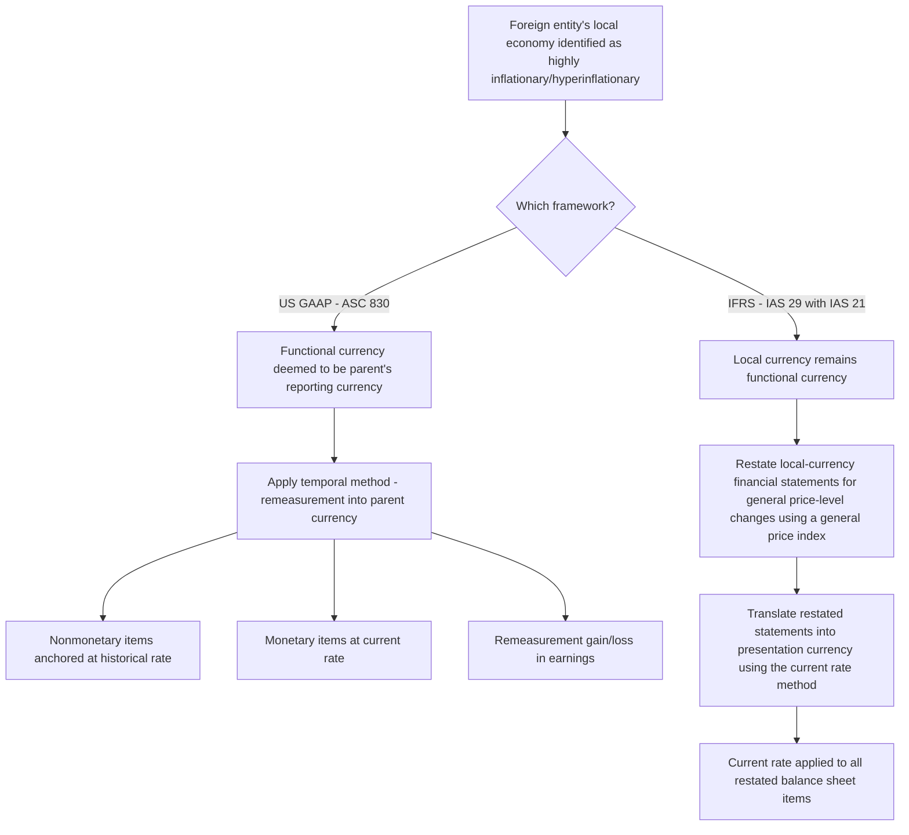

## Highly Inflationary Economies

### Overview

Highly inflationary economy accounting is a mandatory override provision within the functional currency framework. When a foreign entity operates within an economy experiencing extreme, sustained inflation, both U.S. GAAP and IFRS depart from the normal indicator-based functional currency analysis and instead impose specific measurement responses designed to prevent distorted, economically meaningless financial statements that would otherwise result from translating or measuring balances in a rapidly depreciating currency. This topic covers the identification threshold, the mandatory accounting consequences, and the differences between the U.S. GAAP and IFRS approaches.

Governing guidance: ASC 830-10-45-11 through 45-13 (U.S. GAAP); IAS 29 (Financial Reporting in Hyperinflationary Economies) in conjunction with IAS 21.

### Why This Override Exists

In a hyperinflationary environment, historical-cost financial statements become rapidly meaningless: nonmonetary assets recorded at historical cost understate current values, monetary items lose purchasing power at an accelerating rate, and period-over-period comparisons become distorted by pure currency depreciation rather than genuine economic performance. Both frameworks respond to this distortion, but through different mechanisms:

- **U.S. GAAP (ASC 830)** responds by changing the **functional currency** determination — forcing the foreign entity to be measured in the parent's (stable) reporting currency using the temporal method, which anchors nonmonetary items at their historical-cost rates rather than allowing translation distortion at rapidly changing current rates.
- **IFRS (IAS 29)** responds by requiring the foreign entity's financial statements to be **restated for the effects of changing prices** (inflation-adjusted) before any translation occurs, preserving the local currency as functional currency but adjusting the underlying numbers for purchasing power changes.

This divergence is one of the more consequential U.S. GAAP/IFRS differences within foreign currency accounting.

### U.S. GAAP Threshold: The 100% Cumulative Test

ASC 830-10-45-11 identifies a highly inflationary economy as one with **cumulative inflation of approximately 100% or more over a three-year period**. This is generally applied as a bright-line quantitative screen, though "approximately" allows for some judgment near the threshold.

$$\text{Cumulative 3-year inflation} = \left[(1+i_1)(1+i_2)(1+i_3)\right] - 1$$

Where $i_1$, $i_2$, $i_3$ are the annual inflation rates for each of the three most recent years.

**Example — Threshold calculation:**

Annual inflation rates: Year 1 = 25%, Year 2 = 28%, Year 3 = 30%

$$(1.25)(1.28)(1.30) - 1 = 2.0800 - 1 = 108.00\%$$

Since cumulative inflation exceeds 100%, the economy is classified as highly inflationary beginning at the start of the reporting period following the period in which the threshold is met (i.e., the determination is made at each reporting period based on trailing three-year data, and application is generally prospective from the beginning of the reporting period after the threshold is crossed).

**Practical application note:** Entities commonly reference published inflation indices (e.g., country CPI data, IMF World Economic Outlook data) each reporting period to monitor whether any operating jurisdiction has crossed or is approaching the 100% cumulative threshold — this is a recurring quarterly/annual monitoring procedure, not a one-time assessment.

### Mandatory Consequence Under U.S. GAAP

Once an economy is designated highly inflationary:

1. The functional currency of any foreign entity operating in that economy is **deemed to be the reporting currency of the parent** (ASC 830-10-45-11) — this overrides whatever the normal indicator analysis (cash flow, sales price, sales market, expense, financing, intercompany indicators) would otherwise conclude.
2. The entity's financial statements must be **remeasured** using the **temporal method** rather than translated using the current rate method.
3. Any **cumulative translation adjustment (CTA)** previously accumulated in AOCI for that entity, from periods prior to the highly inflationary designation, is **not** immediately recycled to earnings — it remains frozen in AOCI as of the date the entity's functional currency changes, and is only recycled upon eventual sale or substantially complete liquidation of the entity (ASC 830-10-45-11, consistent with the general functional currency change guidance under ASC 830-10-45-7/45-8).
4. Going forward, all remeasurement gains/losses under the temporal method are recognized directly in **earnings**, not OCI.

**Example — Transition mechanics:**

A US parent's Argentine subsidiary (functional currency previously ARS, translated under the current rate method, with an accumulated CTA balance of $15,000 favorable in AOCI) is determined to operate in a highly inflationary economy effective the beginning of the next fiscal year.

- The $15,000 CTA balance remains in AOCI — it is not written off or immediately recognized in earnings at the transition date.
- Beginning in the new fiscal year, the subsidiary's ARS-denominated financial statements are remeasured (not translated) into USD using the temporal method.
- Nonmonetary assets (inventory, PP&E) are remeasured using their **historical exchange rates** at acquisition — effectively "unwinding" any current-rate translation that had been applied to them under the prior current rate method, restoring them to a historical-cost USD basis.
- Monetary items (cash, receivables, payables) are remeasured at the **current rate** going forward.
- Going forward, remeasurement gains/losses hit earnings each period.

### IFRS Approach: IAS 29 Restatement

Under IFRS, the response to hyperinflation is fundamentally different in mechanism, though the ultimate objective — preventing distorted historical-cost reporting in a rapidly depreciating currency — is similar in spirit.

**IAS 29 core requirement**: The financial statements of an entity whose functional currency is that of a hyperinflationary economy must be **restated in terms of the measuring unit current at the balance sheet date**, using a general price index, **regardless of whether the statements are based on historical cost or current cost**. This restatement is applied **before** any translation into a different presentation currency occurs.

Key IAS 29 restatement principles:

- **Monetary items** are not restated (they are already expressed in terms of the measuring unit current at the balance sheet date), but the entity recognizes a **net gain or loss on the net monetary position** in profit or loss, reflecting the purchasing power impact of holding net monetary assets or liabilities during a period of inflation.
- **Nonmonetary items** carried at historical cost are restated by applying the change in a general price index from the date of acquisition to the balance sheet date.
- **Nonmonetary items already carried at current values** (e.g., net realizable value, fair value) are not restated, as they already reflect current purchasing power.
- **All items in the income statement** are restated by applying the change in the general price index from the dates the items were originally recorded.
- Comparative amounts are also restated into the measuring unit current at the *most recent* balance sheet date.

$$\text{Restated Amount} = \text{Historical Amount} \times \frac{\text{Price Index at Balance Sheet Date}}{\text{Price Index at Acquisition/Transaction Date}}$$

**Example — IAS 29 restatement of a nonmonetary asset:**

Equipment acquired for 1,000,000 local currency units (LCU) when the general price index was 100. At the current balance sheet date, the general price index is 340.

$$\text{Restated Amount} = 1{,}000{,}000 \times \frac{340}{100} = 3{,}400{,}000 \text{ LCU}$$

This restated LCU amount (not the original historical LCU amount) is what then gets translated into the presentation currency using the **current rate method** at the closing rate, since the local currency remains the functional currency under IFRS's approach.

### Qualitative Indicators of Hyperinflation (IAS 29.3)

IAS 29 does not rely solely on the 100% cumulative bright line; it provides qualitative characteristics that indicate hyperinflation, including:

- The general population prefers to keep its wealth in nonmonetary assets or a relatively stable foreign currency; amounts of local currency held are immediately invested to maintain purchasing power
- The general population regards monetary amounts not in terms of the local currency but in terms of a relatively stable foreign currency; prices may be quoted in that foreign currency
- Sales and purchases on credit take place at prices that compensate for the expected loss of purchasing power during the credit period, even if the period is short
- Interest rates, wages, and prices are linked to a price index
- The cumulative inflation rate over three years approaches or exceeds 100%

Note that the 100% figure appears as one of several indicators under IFRS, rather than a strict standalone mechanical trigger as it functions under U.S. GAAP.

### Key U.S. GAAP vs. IFRS Comparison

| Aspect | U.S. GAAP (ASC 830) | IFRS (IAS 29 / IAS 21) |
| --- | --- | --- |
| Threshold | Approximately 100% cumulative 3-year inflation (bright-line quantitative screen) | Multiple qualitative indicators; ~100% cumulative 3-year inflation is one indicator, not solely determinative |
| Mechanism | Functional currency changes to parent's reporting currency | Functional currency remains local currency; financial statements restated for general price-level changes |
| Method applied | Temporal method (remeasurement) | Current rate method applied to price-level-restated statements |
| Treatment of nonmonetary items | Anchored at historical exchange rate (in reporting currency terms) | Restated for inflation using a general price index (in local currency terms), then translated at current rate |
| Net monetary position effect | Reflected indirectly through remeasurement gain/loss under temporal method | Explicitly recognized as a separate "gain or loss on net monetary position" in profit or loss |
| Prior CTA balance | Frozen in AOCI at the date of transition; not immediately recycled | N/A — local currency remains functional currency, so CTA mechanics continue on the restated basis |

### Exit from Highly Inflationary Status

Both frameworks address the reverse scenario — an economy ceasing to be highly inflationary/hyperinflationary:

- **U.S. GAAP**: If an economy ceases to be highly inflationary, the local currency may be reinstated as the functional currency; the translated amounts for nonmonetary assets at the date of the change become the new accounting basis for those assets going forward, effectively establishing a new "historical" basis at the transition date (ASC 830-10-45-13).
- **IFRS**: When an economy ceases to be hyperinflationary, an entity discontinues IAS 29 restatement and treats the amounts expressed in the measuring unit current at the end of the prior reporting period as the historical-cost basis for subsequent periods.

### Practical and Forensic Considerations

- **Monitoring obligation**: Entities with operations in historically volatile economies (e.g., Argentina, Venezuela, Turkey, Lebanon, Zimbabwe in various periods) must perform a **recurring** assessment each reporting period — this is not a one-time determination at entity formation, and failure to timely identify a transition into (or out of) highly inflationary status is a recurring area of restatement risk and SEC/regulatory comment.
- **Comparability distortion**: Because U.S. GAAP and IFRS diverge significantly in mechanism, cross-border comparisons of multinational entities with hyperinflationary subsidiaries require care — a U.S. GAAP filer's remeasurement gain/loss in earnings is not directly comparable to an IFRS filer's price-level-restated translated results for economically similar underlying operations.
- **Net monetary position exposure as a red flag/analytical signal**: Under both frameworks, entities with large net monetary asset positions in a hyperinflationary economy face substantial purchasing-power erosion; under IFRS this is transparently disclosed as a discrete "gain/loss on net monetary position" line, offering more direct analytical visibility than the aggregated remeasurement gain/loss reported under U.S. GAAP.
- **Disclosure requirements**: Both frameworks require disclosure of the fact that an economy has been designated highly inflationary/hyperinflationary and the general nature of the accounting response applied (ASC 830-10-50; IAS 29.39).
- **Management judgment scrutiny**: Because the U.S. GAAP threshold is quantitatively defined but reliant on selection of an inflation index/data source, and IFRS relies on qualitative judgment across multiple indicators, both approaches leave room for the timing of designation to be a judgment area warranting careful audit and forensic attention, particularly where delaying recognition would avoid an unfavorable earnings or equity impact.

**Related Topics:**

- Functional currency determination and the indicator framework
- Current rate method versus temporal method mechanics
- Cumulative translation adjustment and its treatment upon functional currency changes
- IAS 29 general price index selection and restatement mechanics in depth
- Country risk assessment and economic environment monitoring for multinational reporting
- Disposal and deconsolidation of foreign operations in hyperinflationary economies