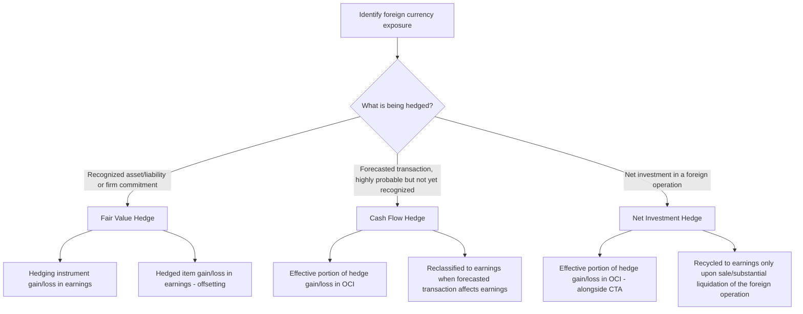

## Hedging Foreign Currency Exposures

### Overview

Hedging foreign currency exposures is the practice of using derivative instruments or foreign-currency-denominated debt to manage the risk that exchange rate fluctuations will adversely affect an entity's transactions, assets, liabilities, or net investments. This topic addresses the types of foreign currency exposure, the hedging instruments commonly used, and the hedge accounting framework under ASC 815 (Derivatives and Hedging) and IFRS 9 (Financial Instruments) that governs whether and how hedge gains/losses are matched against the exposures they offset. Because foreign currency hedge accounting interacts directly with the transaction, remeasurement, and translation topics already covered in this chapter, this item synthesizes how hedging fits into the broader foreign currency accounting framework.

### Categories of Foreign Currency Exposure

| Exposure Type | Description | Related Topic in This Chapter |
| --- | --- | --- |
| Transaction exposure | Risk that the functional-currency value of a recognized foreign-currency-denominated monetary asset/liability will change before settlement | Foreign currency transaction accounting and remeasurement |
| Forecasted transaction exposure | Risk affecting a highly probable future transaction not yet recognized (e.g., anticipated foreign-currency sale or purchase) | Not yet recognized — addressed only through cash flow hedge accounting |
| Firm commitment exposure | Risk affecting an unrecognized but binding contractual commitment denominated in a foreign currency | Addressed through fair value hedge accounting |
| Translation/net investment exposure | Risk that the reporting-currency value of a parent's net investment in a foreign operation will change due to translation under the current rate method | Cumulative translation adjustment and OCI |

### Common Hedging Instruments

- **Forward contracts**: Agreement to exchange a specified amount of one currency for another at a fixed rate on a future date. Most common instrument for hedging transaction and forecasted transaction exposure.
- **Currency options**: Right (not obligation) to exchange currency at a specified rate; used when the entity wants downside protection while preserving upside potential, at the cost of an upfront premium.
- **Currency swaps**: Exchange of principal and/or interest payments in one currency for those in another; commonly used for longer-term financing and net investment hedges.
- **Foreign-currency-denominated debt**: Borrowing directly in the foreign currency to create a natural offsetting liability against a foreign-currency asset exposure (frequently used as a net investment hedge instrument).

### The Three Hedge Accounting Designations

Both ASC 815 and IFRS 9 permit three types of hedge designation relevant to foreign currency risk, each with a different accounting objective and gain/loss location.

### Fair Value Hedges

Used to hedge exposure to changes in the fair value of a recognized asset/liability or an unrecognized firm commitment attributable to foreign exchange risk (e.g., a forward contract hedging a foreign-currency-denominated payable, or a firm purchase commitment denominated in a foreign currency).

**Accounting treatment**: Both the derivative hedging instrument and the hedged item's change in fair value attributable to the hedged risk are recognized currently in **earnings**, ideally offsetting each other to the extent the hedge is effective (ASC 815-25; IFRS 9.6.5.8).

**Example**: A US company has a €100,000 firm purchase commitment for equipment, priced in EUR, with delivery in 90 days. The company enters a forward contract to buy €100,000 in 90 days at a fixed rate to hedge the commitment's fair value exposure.

- The forward contract is remeasured to fair value each period, with changes recognized in earnings.
- The firm commitment itself is also remeasured for changes in fair value attributable to FX movements, recognized in earnings.
- If effective, the two gains/losses offset, and the net earnings impact approaches zero prior to settlement.

### Cash Flow Hedges

Used to hedge exposure to variability in cash flows attributable to foreign exchange risk associated with a **recognized asset/liability** or a **forecasted transaction** (e.g., an anticipated foreign-currency sale expected to occur in the next quarter).

**Accounting treatment**: The **effective portion** of the hedging instrument's gain/loss is deferred in **OCI** and reclassified into earnings in the period(s) that the hedged forecasted transaction affects earnings (e.g., when the forecasted sale is recognized as revenue, or over the depreciable life of a hedged forecasted asset purchase). Any **ineffective portion** is recognized immediately in earnings (ASC 815-30; IFRS 9.6.5.11).

$$\text{OCI Deferral} = \text{Effective portion of hedge gain/loss}$$

$$\text{Immediate P\&L Recognition} = \text{Ineffective portion of hedge gain/loss}$$

**Example**: A US company forecasts a highly probable sale of €200,000 of goods to a European customer in six months. It enters a forward contract to sell €200,000 at a fixed rate to lock in the USD proceeds.

- Changes in the forward contract's fair value during the six-month period are deferred in OCI (to the extent effective).
- When the sale actually occurs and revenue is recognized, the deferred OCI amount is reclassified into earnings, effectively adjusting the reported revenue/margin to reflect the hedged rate rather than the spot rate at the sale date.

### Net Investment Hedges

Used to hedge the foreign currency exposure of a parent's **net investment in a foreign operation** — that is, the translation exposure captured by CTA under the current rate method. This is the hedge type most directly connected to the CTA topic covered earlier in this chapter.

**Accounting treatment**: The effective portion of the hedging instrument's gain/loss (whether a derivative such as a currency forward/swap, or nonderivative foreign-currency-denominated debt designated as the hedging instrument) is recognized in **OCI**, alongside and offsetting the CTA on the hedged net investment. Any ineffective portion is recognized in earnings (ASC 815-35; IAS 21.32, applying IFRS 9 hedge accounting mechanics).

**Example**: A US parent has a €10,000,000 net investment in a European subsidiary (functional currency = EUR, translated under the current rate method). To hedge against EUR depreciation reducing the translated USD value of this investment, the parent borrows €10,000,000 directly (foreign-currency-denominated debt) and designates this debt as a net investment hedge.

- As the EUR depreciates, the subsidiary's translated net assets decline in USD terms, generating a negative CTA.
- Simultaneously, the EUR-denominated debt, when remeasured, generates an offsetting foreign exchange gain (the parent owes fewer USD to settle the debt).
- Under net investment hedge accounting, this offsetting gain is also recorded in OCI (rather than earnings) to the extent effective, so it directly offsets the CTA movement rather than creating an earnings mismatch.
- Both amounts remain in AOCI until the hedged net investment (the foreign subsidiary) is sold or substantially liquidated, at which point both the CTA and the cumulative hedge gain/loss are recycled to earnings together.

### Hedge Effectiveness Requirements

To qualify for hedge accounting under either framework, an entity must satisfy documentation and effectiveness requirements at hedge inception and on an ongoing basis:

- **Formal designation and documentation** at inception, identifying the hedging instrument, the hedged item/transaction, the nature of the risk being hedged, and the method for assessing effectiveness.
- **Economic relationship** between the hedging instrument and hedged item (under IFRS 9's more principles-based effectiveness model) or **highly effective** offsetting changes (under ASC 815's effectiveness thresholds, which were simplified for many relationships by ASU 2017-12).
- **Ongoing assessment**: effectiveness must be reassessed each reporting period; hedge accounting is discontinued prospectively if the qualifying criteria are no longer met.

ASU 2017-12 significantly simplified U.S. GAAP hedge accounting, aligning it more closely with the economic substance of hedging activities and reducing (though not eliminating) the burden of separately measuring and recognizing ineffectiveness for many well-designed hedge relationships — the "critical terms match" and simplified approaches are frequently tested in this context.

### Comparative Summary Table

| Hedge Type | What Is Hedged | Gain/Loss Deferral Location | Recycling Trigger |
| --- | --- | --- | --- |
| Fair value hedge | Recognized asset/liability or firm commitment — fair value exposure | None — recognized immediately in earnings for both instrument and hedged item | N/A — already in earnings |
| Cash flow hedge | Forecasted transaction or recognized item — cash flow variability | OCI (effective portion) | When the forecasted transaction affects earnings |
| Net investment hedge | Net investment in a foreign operation — translation exposure | OCI (effective portion), alongside CTA | Sale or substantially complete liquidation of the foreign operation |

### Undesignated (Economic) Hedges

Not all foreign-currency risk management activity qualifies for or is elected into hedge accounting. An entity may enter derivative contracts purely for economic risk management without formally designating them under ASC 815/IFRS 9 hedge accounting rules — in this case, the derivative is simply marked to fair value each period with all changes recognized directly in earnings, with no matching or deferral mechanism, potentially introducing earnings volatility that a qualifying hedge designation would have avoided.

### Practical and Forensic Considerations

- **De-designation risk**: Hedge accounting is elective and can be discontinued if documentation or effectiveness requirements lapse; entities under earnings pressure have an incentive to either avoid formal designation (to retain flexibility) or to aggressively assert hedge effectiveness to defer unfavorable derivative losses into OCI — both are areas warranting audit and forensic scrutiny of hedge documentation contemporaneity and effectiveness testing rigor.
- **Speculative activity disguised as hedging**: A key forensic question is whether a purported "hedge" derivative genuinely corresponds to an identifiable, appropriately sized underlying exposure, or whether the notional amount/tenor mismatch suggests speculative position-taking mischaracterized as risk management.
- **OCI reclassification timing**: For cash flow hedges, the timing of reclassification from OCI to earnings should align precisely with when the hedged forecasted transaction affects earnings — premature or delayed reclassification is a common error and potential manipulation point.
- **Disclosure requirements**: Both frameworks require extensive quantitative and qualitative disclosure of hedging activities, including the notional amounts of derivatives by hedge type, fair value gains/losses recognized, and the location of those amounts within the financial statements (ASC 815-10-50; IFRS 7).

**Related Topics:**

- Foreign currency transaction accounting and remeasurement (the exposure fair value/cash flow hedges typically address)
- Cumulative translation adjustment and OCI (the exposure net investment hedges address)
- Derivative instrument fair value measurement (ASC 820 / IFRS 13)
- ASU 2017-12 hedge accounting simplification provisions
- Disclosure requirements for derivative and hedging activities
- Forensic red flags in derivative and hedge accounting misrepresentation