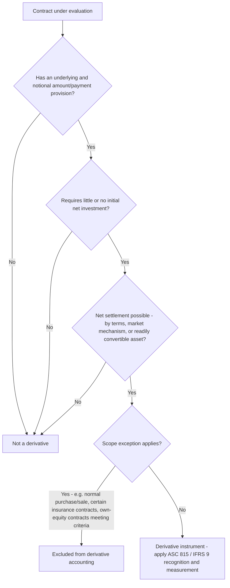

## Identifying and Classifying Derivative Instruments

<syllabot_broad_topic/>

### Overview

Before any hedge accounting, fair value measurement, or disclosure framework can be applied, an entity must first correctly identify whether a contract meets the definition of a derivative and, if so, classify it appropriately. This determination is foundational to the entire derivatives and hedge accounting chapter — misidentifying a derivative (or failing to recognize an embedded derivative within a host contract) is one of the most common and consequential errors in practice, frequently surfacing in restatements and forensic reviews. This topic covers the definitional criteria under ASC 815 (Derivatives and Hedging) and IFRS 9 (Financial Instruments), common derivative types, classification frameworks, and the scope exceptions that determine whether a contract is accounted for as a derivative at all.

### The Three-Part Definition of a Derivative (ASC 815-10-15-83)

Under U.S. GAAP, a contract meets the definition of a derivative instrument if it has **all three** of the following characteristics:

1. **Underlying and notional amount (or payment provision)**: The contract has one or more underlyings (a specified price, rate, index, or other variable, such as an interest rate, security price, commodity price, foreign exchange rate, or credit rating) and one or more notional amounts (a specified number of units — currency units, shares, bushels) or payment provisions, or both.
2. **Little or no initial net investment**: The contract requires little or no initial net investment relative to other contract types that would be expected to have a similar response to changes in market factors.
3. **Net settlement provision**: The contract can be settled net by its terms (explicit net settlement), through a market mechanism outside the contract (a mechanism such as a clearinghouse or exchange), or by delivery of an asset that puts the recipient in a position not substantially different from net settlement (an asset readily convertible to cash).

IFRS 9 (Appendix A) provides a substantively converged definition: a derivative is a financial instrument or other contract with (a) a value that changes in response to a specified underlying, (b) no or a small initial net investment relative to other contracts with similar market response, and (c) settlement at a future date.

### Applying the Three-Part Test — Worked Examples

**Example 1 — Interest rate swap:**

- Underlying: a specified interest rate index (e.g., SOFR)
- Notional amount: $10,000,000
- Initial net investment: none (swaps are typically entered at a rate that gives them zero initial fair value)
- Net settlement: cash settled periodically based on the rate differential

**Conclusion**: Meets all three criteria — this is a derivative.

**Example 2 — Purchased call option on a stock:**

- Underlying: the stock price
- Notional amount: number of shares under the option
- Initial net investment: the option premium is small relative to the notional value of shares controlled — much smaller than the investment required to buy the shares outright
- Net settlement: can be net share settled or cash settled, or exercised for shares that are readily convertible to cash (if publicly traded)

**Conclusion**: Meets all three criteria — this is a derivative.

**Example 3 — Ordinary forward purchase contract for inventory, to be physically delivered and used in normal operations, with no net settlement provision and no market mechanism for net settlement:**

- Has an underlying (commodity price) and notional amount (quantity)
- Initial net investment: none
- Net settlement: **not present** — the contract requires physical delivery, is not net-settleable, and the commodity is not readily convertible to cash (it will be consumed in operations)

**Conclusion**: Fails the net settlement criterion (absent an applicable scope exception override) — not a derivative, though note this fact pattern is also the classic case for the "normal purchases and normal sales" scope exception discussed below, which would exclude it even if net settlement were technically present.

### Common Derivative Instrument Types

| Instrument | Underlying | Typical Use | Settlement |
| --- | --- | --- | --- |
| Forward contract | Price of asset/currency/commodity | Locking in a future price | Net or gross at maturity |
| Futures contract | Price of asset/currency/commodity | Exchange-traded, standardized hedging/speculation | Daily mark-to-market via clearinghouse |
| Option (call/put) | Price of underlying asset | Asymmetric risk management, right without obligation | Exercise or expire; cash or physical |
| Interest rate swap | Interest rate index | Converting fixed-to-floating or floating-to-fixed exposure | Net cash settlement of rate differential |
| Currency swap | Exchange rate and/or interest rates | Cross-currency financing and FX risk management | Exchange of principal/interest streams |
| Credit default swap | Credit event/spread on reference entity | Credit risk transfer | Cash or physical settlement upon credit event |
| Total return swap | Total return of a reference asset | Synthetic exposure without ownership | Net cash settlement |
| Warrant | Issuer's own stock price | Equity-linked compensation or financing | Exercise for shares or cash |

### Classification Framework: Balance Sheet Presentation

Once identified as a derivative, ASC 815-10-25-1 requires that **all derivative instruments be recognized as assets or liabilities on the balance sheet at fair value**, a marked departure from historical off-balance-sheet treatment. Classification as an asset or liability depends on the derivative's fair value at each reporting date:

$$\text{Derivative Asset} : \text{Fair Value} > 0$$

$$\text{Derivative Liability} : \text{Fair Value} < 0$$

A single derivative can flip between asset and liability classification across reporting periods as its fair value changes with market conditions — this is a normal and expected feature of derivative accounting, not an error.

### Classification by Accounting Treatment: Hedging vs. Non-Hedging

| Classification | Gain/Loss Recognition | Prerequisite |
| --- | --- | --- |
| Not designated (held for trading/economic hedge only) | Immediately in earnings, each period | None — default treatment |
| Designated as fair value hedge | Immediately in earnings, offsetting the hedged item's fair value change | Formal documentation and effectiveness criteria met (ASC 815-25) |
| Designated as cash flow hedge | Effective portion in OCI, reclassified to earnings when hedged transaction affects earnings | Formal documentation and effectiveness criteria met (ASC 815-30) |
| Designated as net investment hedge | Effective portion in OCI, alongside CTA | Formal documentation and effectiveness criteria met (ASC 815-35) |

This classification layer is distinct from — and applied only after — the initial determination that a contract is a derivative in the first place.

### Embedded Derivatives

A critical and frequently misapplied aspect of derivative identification is the requirement to evaluate whether a **host contract** (e.g., a bond, lease, insurance contract, or purchase agreement) contains an **embedded derivative feature** that must be separated ("bifurcated") and accounted for separately as a standalone derivative.

Under ASC 815-15-25-1, an embedded derivative must be bifurcated from its host contract and accounted for separately if **all three** of the following conditions are met:

1. The economic characteristics and risks of the embedded feature are **not clearly and closely related** to the economic characteristics and risks of the host contract.
2. A separate instrument with the same terms as the embedded feature would, on a standalone basis, meet the definition of a derivative.
3. The combined (hybrid) instrument is **not** already measured at fair value with changes in fair value reported in earnings as they occur.

**Example — Convertible bond with an equity conversion feature:**

A bond (debt host contract) contains a feature allowing conversion into the issuer's common stock.

- Is the equity conversion feature's risk (equity price risk) clearly and closely related to the debt host's risk (interest rate/credit risk)? Generally, **no** — equity risk is not clearly and closely related to a debt instrument's risk profile.
- Would the conversion feature, on a standalone basis, meet the definition of a derivative? Often yes, unless a scope exception applies (e.g., certain conventional convertible debt may qualify for exceptions under specific indexation and classification criteria, such as the "fixed-for-fixed" criterion for equity classification).
- Is the hybrid instrument already at fair value through earnings? If the issuer has not elected the fair value option, no.

**Conclusion**: Absent a qualifying scope exception (such as meeting the conditions for classification in stockholders' equity under ASC 815-40), the conversion feature is bifurcated and accounted for as a separate embedded derivative liability, marked to fair value through earnings each period, with the debt host accounted for separately (typically at amortized cost).

IFRS 9 takes a notably different approach for **financial asset** hosts: bifurcation of embedded derivatives is **not applied**; instead, the entire hybrid financial asset is classified and measured as a whole under IFRS 9's classification model (amortized cost, FVOCI, or FVTPL) based on the contractual cash flow characteristics and business model tests. Bifurcation of embedded derivatives is still required under IFRS 9 for hybrid contracts with a **financial liability** host or a **non-financial** host (e.g., a lease or executory contract), using criteria substantively similar to the "clearly and closely related" test under U.S. GAAP.

### Scope Exceptions — Contracts Excluded from Derivative Accounting

Even when a contract technically meets the three-part definition, several scope exceptions remove it from derivative accounting:

- **Normal purchases and normal sales (NPNS) exception** (ASC 815-10-15-22 through 15-51): Contracts for the purchase or sale of a nonfinancial item (e.g., commodities, inventory) that will be physically delivered in quantities expected to be used or sold by the reporting entity over a reasonable period in the normal course of business are excluded, provided the entity documents the NPNS election and the contract does not contain terms that preclude the exception (such as a net settlement provision that is regularly exercised or a provision allowing settlement in an amount equivalent to a net settlement).
- **Certain insurance contracts**: Traditional insurance contracts that indemnify the policyholder against a specified insurable event are generally excluded, though certain non-traditional or weather-derivative-like features within insurance contracts may still require bifurcation.
- **Contracts indexed to an entity's own stock that meet equity classification criteria**: Certain contracts settled in an entity's own shares (e.g., some warrants, certain conversion features) are excluded from derivative liability accounting if they meet specific indexation and equity-classification conditions (ASC 815-40).
- **Certain financial guarantee contracts**: Financial guarantees that provide for payments to be made only to reimburse the guaranteed party for a loss incurred because a debtor fails to pay may qualify for a scope exception under specific conditions.
- **Loan commitments** that are not derivatives under the general framework (certain commitments to originate mortgage loans that will be held for investment are excluded, though commitments to originate loans to be sold are generally derivatives).

### Practical and Forensic Considerations

- **NPNS documentation discipline**: The normal purchases and normal sales exception requires contemporaneous documentation of the election at contract inception; retroactive assertion of NPNS status, or continued reliance on the exception after a pattern of net settlement has emerged, is a common audit and forensic focus area — actual net settlement behavior can invalidate a previously claimed NPNS designation.
- **Embedded derivative identification failures**: A recurring source of restatement is the failure to identify and bifurcate embedded derivatives in complex financing arrangements (convertible debt, structured notes, contracts with foreign-currency-indexed pricing in a host contract not denominated in either party's functional currency) — this remains one of the most frequently cited technical accounting restatement causes.
- **Own-stock-settled instrument classification manipulation risk**: The equity classification scope exception for contracts indexed to an entity's own stock is detail-intensive (fixed-for-fixed criteria, settlement alternatives, tainting provisions) and is an area where structuring incentives can create pressure to achieve equity (rather than derivative liability) classification to avoid earnings volatility — this warrants careful forensic re-performance of the classification analysis rather than reliance on management's conclusion alone.
- **Foreign-currency-indexed contracts**: A purchase or sale contract denominated in a currency other than the functional currency of either substantial party to the contract, and not the currency in which the related goods/services are routinely denominated in international commerce, may itself contain an embedded foreign currency derivative requiring bifurcation — a nuanced application of the "clearly and closely related" test specific to foreign currency features.

**Related Topics:**

- Fair value measurement of derivative instruments (ASC 820 / IFRS 13)
- Hedge accounting designation and effectiveness testing
- Fair value hedges, cash flow hedges, and net investment hedges in depth
- Embedded derivative bifurcation mechanics and the "clearly and closely related" test in depth
- Convertible instrument accounting and equity classification criteria (ASC 815-40)
- Disclosure requirements for derivative instruments and hedging activities (ASC 815-10-50 / IFRS 7)