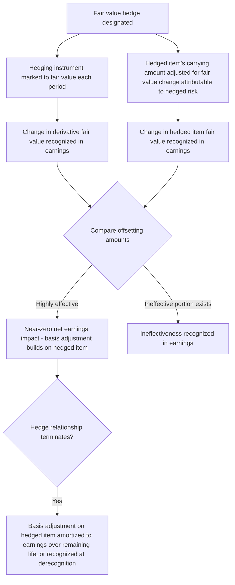

## Fair Value Hedge Accounting

### Overview

Fair value hedge accounting is one of the three hedge accounting models under ASC 815 (Derivatives and Hedging) and IFRS 9 (Financial Instruments), designed for situations where an entity hedges exposure to changes in the **fair value** of a recognized asset, recognized liability, or an unrecognized firm commitment. Unlike cash flow hedges, where the hedging instrument's effective gains/losses are deferred in OCI, fair value hedge accounting recognizes both the hedging instrument's and the hedged item's fair value changes **currently in earnings**, with the accounting objective of achieving an offsetting — and ideally near-zero net — earnings impact. This topic covers the qualifying criteria, the distinctive "basis adjustment" mechanics unique to this hedge type, and worked examples across interest rate and foreign currency applications.

### What Qualifies for Fair Value Hedge Designation

A fair value hedge is used to hedge exposure to changes in the fair value of:

- A **recognized asset or liability** (e.g., fixed-rate debt exposed to interest rate risk, or available-for-sale/FVOCI debt securities)
- An **unrecognized firm commitment** (e.g., a binding agreement to purchase equipment at a fixed foreign-currency price, not yet recognized on the balance sheet)
- A portion or component of such an asset, liability, or firm commitment, attributable to a specifically identified risk (e.g., interest rate risk only, foreign currency risk only, or the risk of overall changes in fair value)

**Common fair value hedge applications:**

| Hedged Item | Hedged Risk | Typical Hedging Instrument |
| --- | --- | --- |
| Fixed-rate debt issued by the entity | Interest rate risk (benchmark rate risk) | Pay-floating/receive-fixed interest rate swap |
| Fixed-rate loan receivable held by the entity | Interest rate risk | Pay-fixed/receive-floating interest rate swap |
| Firm commitment to purchase inventory in a foreign currency | Foreign currency risk | FX forward contract |
| Available-for-sale/FVOCI fixed-rate debt security | Interest rate risk | Interest rate swap |
| Inventory subject to commodity price risk under a firm sale commitment | Commodity price risk | Commodity forward or futures contract |

### Core Accounting Mechanics

Under fair value hedge accounting (ASC 815-25-35-1):

$$\text{Hedging Instrument: Gain/(Loss)} = \Delta \text{Fair Value of Derivative} \rightarrow \text{Recognized in Earnings}$$

$$\text{Hedged Item: Gain/(Loss)} = \Delta \text{Fair Value attributable to the hedged risk} \rightarrow \text{Recognized in Earnings, adjusting the carrying amount of the hedged item}$$

Both amounts are recorded in the **same income statement line item**, generally producing an offsetting effect to the extent the hedge is effective. This is the defining structural feature of fair value hedge accounting: it is the only hedge type under which the **carrying amount of the hedged item itself is adjusted** for fair value changes attributable to the hedged risk — even if that item would not otherwise be measured at fair value (e.g., fixed-rate debt normally carried at amortized cost).

### Worked Example — Interest Rate Swap Hedging Fixed-Rate Debt

**Facts:** A company issues $10,000,000 of 5-year fixed-rate debt at a 6% coupon, carried at amortized cost. To convert this fixed-rate exposure to floating and hedge against fair value fluctuations from changes in the benchmark interest rate, the company enters a pay-floating/receive-fixed interest rate swap with a $10,000,000 notional amount, designated as a fair value hedge of the debt's interest rate risk.

**At inception:**

- Debt carrying amount: $10,000,000 (par)
- Swap fair value: $0 (at-market swap)

**At the first reporting date, market interest rates have risen, causing the fair value of the fixed-rate debt to *decrease* (bond prices move inversely to rates) and the fair value of the swap (which now has an economically favorable position for the company, since it receives fixed while rates have risen) to *increase*:**

| Item | Fair Value Change | Journal Entry |
| --- | --- | --- |
| Interest rate swap (asset) | +$180,000 | Dr. Swap Asset $180,000 / Cr. Earnings (gain) $180,000 |
| Debt carrying amount | −$180,000 | Dr. Earnings (loss) $180,000 / Cr. Debt (basis adjustment) $180,000 |

**Net earnings impact**: $0 (assuming perfect effectiveness) — the swap gain and the debt's fair value loss offset precisely. The debt's carrying amount is now $9,820,000 ($10,000,000 − $180,000), reflecting a **basis adjustment** to the otherwise amortized-cost debt instrument.

**At maturity or upon hedge dedesignation**: The basis adjustment ($180,000 reduction to the debt's carrying amount in this example) is amortized into interest expense over the remaining life of the debt using an effective-yield method, rather than being reversed all at once, unless the hedged item is derecognized (e.g., the debt is extinguished), in which case the entire remaining basis adjustment is recognized immediately.

### Worked Example — Fair Value Hedge of a Firm Commitment

**Facts:** A US company enters a firm, binding commitment on March 1 to purchase specialized equipment from a German supplier for €500,000, with delivery and payment due in 120 days. The company enters a forward contract to buy €500,000 at a fixed rate, designated as a fair value hedge of the firm commitment's foreign currency risk.

**Mechanics:**

- The firm commitment itself is not otherwise recognized on the balance sheet (it is executory), but under fair value hedge accounting, the **portion of its fair value attributable to the hedged risk (FX risk)** is recognized.
- As the EUR/USD spot rate moves between March 1 and the reporting date, both the forward contract and the firm commitment (for FX risk only) are remeasured to fair value, with changes recognized in earnings — offsetting each other to the extent effective.
- At the transaction date (delivery), the cumulative fair value adjustment recognized on the firm commitment becomes part of the initial recorded cost basis of the acquired asset (the equipment), effectively locking in the hedged (forward) rate as the asset's functional-currency cost basis rather than the spot rate at the delivery date.

This is a key distinguishing feature versus a cash flow hedge of the same economic exposure: under a fair value hedge of a firm commitment, both instrument and hedged-item gains/losses hit earnings currently (with the hedged-item's cumulative adjustment ultimately folded into the acquired asset's basis at settlement), whereas a cash flow hedge designation would defer the derivative's effective gain/loss in OCI and reclassify it into the asset's cost basis (or earnings, depending on hedged item type) only at settlement.

### Qualifying Criteria for Fair Value Hedge Accounting

To apply fair value hedge accounting, an entity must satisfy, at inception and on an ongoing basis (ASC 815-20-25):

1. **Formal designation and documentation** at hedge inception, identifying: the hedging instrument, the hedged item, the nature of the risk being hedged, the risk management objective and strategy, and the method for assessing hedge effectiveness (including how ineffectiveness will be measured).
2. **Both the hedging instrument and hedged item must be eligible** — the hedging instrument is generally a derivative (with limited exceptions, such as certain foreign-currency-denominated nonderivative instruments for foreign currency fair value hedges); the hedged item must be specifically identifiable and its fair value changes attributable to the hedged risk must be reliably measurable.
3. **Expectation of high effectiveness** at inception and throughout the hedge term — under ASU 2017-12's simplifications, many well-designed hedge relationships (e.g., where critical terms of the hedging instrument and hedged item match) qualify for simplified effectiveness assessment approaches, such as the "critical terms match" method or, for certain interest rate hedges, the shortcut method's replacement approaches.
4. The hedged risk must be **one of the risks permitted to be hedged** under ASC 815-20-25 — for financial assets/liabilities, this includes overall changes in fair value, interest rate risk (benchmark rate risk, such as SOFR), foreign currency risk, credit risk, or the risk of changes in fair value attributable to changes in the obligor's credit risk. For nonfinancial assets/liabilities, only the risk of changes in fair value of the entire hedged item (not a specifically identified risk component) is generally permitted, with limited exceptions such as certain commodity-related component hedges.

### Discontinuation of Fair Value Hedge Accounting

Fair value hedge accounting is discontinued prospectively when:

- The hedging relationship no longer meets the qualifying criteria (e.g., effectiveness is no longer expected)
- The hedging instrument expires, is sold, terminated, or exercised
- The entity removes the designation (de-designates the hedge)
- The hedged forecasted transaction/firm commitment is no longer expected to occur (in the firm commitment context) or the hedged item is derecognized (e.g., the hedged debt is extinguished, the hedged asset is sold)

Upon discontinuation, any basis adjustment already recorded on the hedged item (for recognized assets/liabilities) is **not reversed**; instead, it continues to be amortized into earnings over the remaining life of the hedged item using an effective-yield method — this treatment was clarified and simplified under ASU 2017-12, replacing more complex prior guidance.

### Fair Value Hedge vs. Cash Flow Hedge — Key Structural Contrast

| Feature | Fair Value Hedge | Cash Flow Hedge |
| --- | --- | --- |
| What is hedged | Recognized item or firm commitment — fair value exposure | Forecasted transaction or recognized item — cash flow variability |
| Hedging instrument gain/loss location | Earnings, currently | OCI (effective portion), then reclassified |
| Hedged item accounting | Carrying amount adjusted for hedged-risk fair value changes, in earnings | Not remeasured for the hedge itself; hedge gain/loss deferred separately in OCI |
| Ineffectiveness | Naturally isolated as the net of two earnings entries | Separately measured; excess over hedged item's cumulative change recognized in earnings |
| Typical example | Swapping fixed-rate debt to floating | Locking in the price of a forecasted foreign-currency sale |

### IFRS 9 Comparative Notes

IFRS 9 applies substantively similar fair value hedge mechanics (IFRS 9.6.5.8), with the hedging instrument at fair value through profit or loss and the hedged item's carrying amount adjusted for fair value changes attributable to the hedged risk, also recognized in profit or loss. One area of divergence: IFRS 9's hedge effectiveness assessment is more principles-based (requiring an economic relationship, a dominance test for credit risk, and a consistent hedge ratio) rather than relying on the more mechanically defined "highly effective" quantitative thresholds historically emphasized under legacy U.S. GAAP guidance, though ASU 2017-12 has narrowed this gap considerably for U.S. GAAP preparers as well.

### Practical and Forensic Considerations

- **Basis adjustment tracking**: Because fair value hedges create a basis adjustment on the hedged item that must subsequently be amortized (rather than reversed) upon dedesignation, entities must maintain detailed subsidiary records tracking the cumulative basis adjustment and its amortization schedule separately from the instrument's stated/contractual terms — a common source of error in practice, particularly upon hedge dedesignation or partial dedesignations.
- **Effectiveness measurement scrutiny**: Selection of the effectiveness assessment method (critical terms match, regression analysis, dollar-offset method) affects how readily ineffectiveness is detected and reported; forensic review should assess whether the chosen method was applied consistently and whether the documented method matches what was actually performed at each testing date.
- **Firm commitment identification**: Because unrecognized firm commitments are not otherwise reflected on the balance sheet, a fair value hedge of a firm commitment introduces an asset/liability (representing the cumulative fair value change attributable to the hedged risk) that exists solely because of the hedge designation — auditors should verify the firm commitment is genuinely binding (not merely a forecast or intention) as a prerequisite for this designation being valid.
- **Interaction with debt extinguishment**: When hedged debt carrying a basis adjustment is extinguished or repurchased, the remaining unamortized basis adjustment must be included in the gain/loss on extinguishment calculation — omission of this adjustment is a recurring technical error.

**Related Topics:**

- Identifying and classifying derivative instruments (prerequisite determination)
- Cash flow hedge accounting mechanics and OCI reclassification
- Net investment hedge accounting
- Hedge effectiveness assessment methods (critical terms match, regression, dollar-offset)
- ASU 2017-12 hedge accounting simplification provisions
- Fair value measurement framework for financial instruments (ASC 820 / IFRS 13)