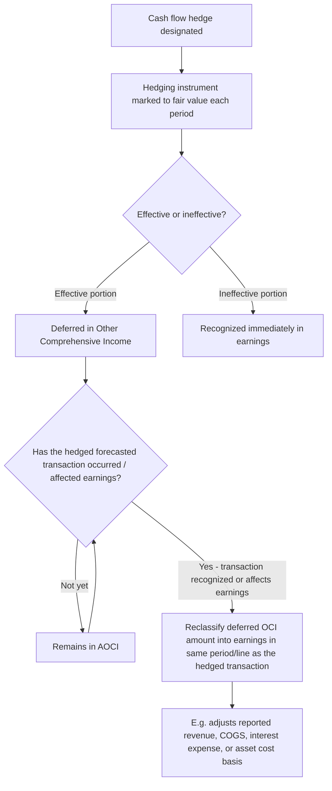

## Cash Flow Hedge Accounting

### Overview

Cash flow hedge accounting is the second of the three hedge accounting models under ASC 815 (Derivatives and Hedging) and IFRS 9 (Financial Instruments), applied when an entity hedges exposure to **variability in cash flows** attributable to a particular risk associated with either a recognized asset/liability or a **forecasted transaction**. Unlike fair value hedges, where both the hedging instrument's and hedged item's gains/losses hit earnings currently, cash flow hedge accounting **defers** the effective portion of the hedging instrument's gain/loss in **Other Comprehensive Income (OCI)**, reclassifying it into earnings only when the hedged transaction itself affects earnings. This topic covers the qualifying criteria, the OCI deferral and reclassification mechanics, and worked examples spanning interest rate and foreign currency forecasted transaction hedges.

### What Qualifies for Cash Flow Hedge Designation

A cash flow hedge addresses exposure to variability in cash flows attributable to a particular risk, associated with:

- A **recognized asset or liability** with variable cash flows (e.g., floating-rate debt exposed to interest rate risk)
- A **forecasted transaction** that is **highly probable** (e.g., an anticipated foreign-currency-denominated sale or purchase expected to occur within a defined future period, or a forecasted issuance of fixed-rate debt)

**Common cash flow hedge applications:**

| Hedged Item | Hedged Risk | Typical Hedging Instrument |
| --- | --- | --- |
| Floating-rate debt issued by the entity | Interest rate risk (variability of interest payments) | Pay-fixed/receive-floating interest rate swap |
| Forecasted foreign-currency sale | Foreign currency risk (variability of functional-currency proceeds) | FX forward contract to sell foreign currency |
| Forecasted foreign-currency purchase of inventory/equipment | Foreign currency risk | FX forward contract to buy foreign currency |
| Forecasted issuance of fixed-rate debt | Interest rate risk (variability of the locked-in rate at issuance) | Treasury rate lock / forward-starting swap |
| Forecasted purchase of a commodity used in production | Commodity price risk | Commodity forward or futures contract |

### The "Highly Probable" Threshold for Forecasted Transactions

A forecasted transaction must be **highly probable** to qualify as a hedged item — this is a significantly higher threshold than merely "possible" or "expected," requiring specific, identifiable characteristics: the expected date, amount, and nature of the transaction, supported by the entity's normal business practices and a demonstrated pattern of similar past transactions occurring as forecasted (ASC 815-20-25-15; IFRS 9.6.3.3). Vague or merely aspirational forecasts do not qualify.

### Core Accounting Mechanics

$$\text{Effective Portion of Hedge Gain/(Loss)} \rightarrow \text{Deferred in OCI}$$

$$\text{Ineffective Portion of Hedge Gain/(Loss)} \rightarrow \text{Recognized immediately in Earnings}$$

$$\text{Amount Reclassified from OCI to Earnings} = \text{Deferred amount, in the period the hedged transaction affects earnings}$$

Critically — and unlike fair value hedges — the **hedged item itself is not remeasured or adjusted** as a consequence of the hedge designation. The forecasted transaction is not yet recognized (it has no carrying amount to adjust), and even for a recognized item with variable cash flows (like floating-rate debt), the debt continues to be accounted for under its normal measurement basis; only the derivative is remeasured, with its effective gain/loss parked in OCI.

### Worked Example — FX Forward Hedging a Forecasted Sale

**Facts:** A US company (USD functional currency) forecasts a highly probable sale of €1,000,000 of goods to a European customer, expected to occur and be invoiced in 6 months. On the forecast date, the spot rate is $1.10/€. To lock in the USD value of the anticipated EUR proceeds, the company enters a forward contract to sell €1,000,000 in 6 months at a forward rate of $1.11/€, designated as a cash flow hedge of the forecasted sale's foreign currency risk.

**At the 3-month interim reporting date**, the forward contract's fair value has increased by $15,000 (assume fully effective):

| Account | Debit | Credit |
| --- | --- | --- |
| Forward Contract (asset) | $15,000 |  |
| OCI — Cash Flow Hedge |  | $15,000 |

No entry affects earnings; the $15,000 gain is deferred in AOCI.

**At the 6-month transaction date**, the sale occurs; the spot rate has moved to $1.08/€. The forward contract is settled, and total cumulative deferred OCI on the hedge is $30,000 (fully effective).

| Account | Debit | Credit |
| --- | --- | --- |
| Accounts Receivable / Cash | $1,080,000 |  |
| Sales Revenue |  | $1,080,000 |
| (Separately) OCI — Cash Flow Hedge | $30,000 |  |
| (Separately) Sales Revenue (reclassification) |  | $30,000 |

**Net effect**: Reported sales revenue = $1,080,000 (at spot) + $30,000 (reclassified hedge gain) = $1,110,000 — precisely equal to €1,000,000 × the locked-in forward rate of $1.11/€. The cash flow hedge accomplishes its objective: the reported revenue reflects the economically hedged rate rather than the fluctuating spot rate, with the derivative's gain reclassified into the same financial statement line item (revenue) that the hedged transaction affects.

### Worked Example — Interest Rate Swap Hedging Floating-Rate Debt

**Facts:** A company has $5,000,000 of floating-rate debt indexed to SOFR, creating variable interest expense. It enters a pay-fixed/receive-floating interest rate swap with a $5,000,000 notional amount, designated as a cash flow hedge of the variability in interest payments.

- Each period, the swap is remeasured to fair value; the effective portion of the change is deferred in OCI.
- Simultaneously, the swap generates periodic net settlements (fixed rate paid, floating rate received) that offset the variability in the debt's floating-rate interest payments.
- The net effect reported in interest expense approximates a fixed rate, even though the underlying debt remains floating-rate — the hedge accounting reclassification mechanism moves the swap's OCI-deferred amounts into interest expense in the same periods the variable interest payments are recognized, synthetically converting the debt's reported interest expense to a fixed rate.

### Qualifying Criteria for Cash Flow Hedge Accounting

Substantively parallel to fair value hedge requirements (ASC 815-20-25), with cash-flow-specific emphasis:

1. **Formal designation and documentation** at inception: the hedging instrument, the hedged forecasted transaction (including expected date, amount, and nature), the specific risk being hedged, the risk management objective, and the effectiveness assessment method.
2. **Highly probable forecasted transaction**, as discussed above — this is the threshold unique to (and most scrutinized within) cash flow hedge qualification.
3. **Expectation of high effectiveness** at inception and on an ongoing basis, using a qualifying assessment method (critical terms match, regression analysis, or other statistical methods); ASU 2017-12 permits qualitative effectiveness assessment after initial quantitative testing for many relationships where the critical terms continue to match.
4. The forecasted transaction must be **probable of occurring** by the end of the originally specified time period; a forecasted transaction becoming no longer probable requires discontinuation of hedge accounting and immediate reclassification of the deferred OCI amount into earnings (unless the forecasted transaction is merely delayed but still probable of occurring within an additional, reasonable period of time consistent with the originally documented strategy).

### Discontinuation of Cash Flow Hedge Accounting

Cash flow hedge accounting is discontinued prospectively when:

- The hedging relationship no longer meets qualifying criteria
- The hedging instrument expires, is sold, terminated, or exercised
- The entity removes the designation
- **The forecasted transaction is no longer probable of occurring** — this triggers immediate reclassification of the entire cumulative deferred OCI gain/loss into earnings (ASC 815-30-40-4)
- The forecasted transaction **is probable of not occurring** by the end of the originally specified period, or within an additional reasonable period thereafter

$$\text{If forecasted transaction no longer probable} \rightarrow \text{Immediately reclassify cumulative OCI balance to earnings}$$

This immediate reclassification requirement is a key risk area: unlike fair value hedge basis adjustments (which amortize gradually), a failed cash flow hedge forecast produces an **immediate, often unexpected earnings hit or benefit** in the period the transaction is determined no longer probable.

### Fair Value Hedge vs. Cash Flow Hedge — Recap Comparison

| Feature | Fair Value Hedge | Cash Flow Hedge |
| --- | --- | --- |
| Objective | Offset fair value changes on a recognized item/firm commitment | Lock in cash flow outcomes on a forecasted or variable-cash-flow item |
| Hedging instrument gain/loss (effective portion) | Earnings, currently | OCI, deferred |
| Hedged item accounting | Carrying amount adjusted (basis adjustment) | Not remeasured — no basis adjustment |
| Reclassification event | N/A — already in earnings | When the hedged transaction affects earnings |
| Failed/discontinued hedge consequence | Basis adjustment amortized over remaining life | Cumulative OCI reclassified — immediately if forecast no longer probable |

### IFRS 9 Comparative Notes

IFRS 9 applies substantively similar cash flow hedge mechanics (IFRS 9.6.5.11), deferring the effective portion of the hedging instrument's gain/loss in a **cash flow hedge reserve** within OCI/equity, and reclassifying it to profit or loss when the hedged item affects profit or loss. A notable distinction: for hedges of forecasted purchases resulting in recognition of a **non-financial asset or liability** (e.g., a forecasted inventory purchase or forecasted PP&E acquisition), IFRS 9 permits (and in practice often results in) the cumulative deferred amount being included directly in the **initial cost basis** of the recognized asset — a "basis adjustment" concept for cash flow hedges that historically differed from certain U.S. GAAP practice, though U.S. GAAP also permits this treatment as an accounting policy election for nonfinancial assets/liabilities under ASC 815-30-35, so the frameworks have substantially converged in practical outcome, with the policy applied consistently by class of hedged transaction.

### Practical and Forensic Considerations

- **"Highly probable" assertion scrutiny**: Because the highly probable threshold is judgmental, a common area of forensic and audit focus is whether the entity's historical forecast accuracy, business practices, and specificity of the forecasted transaction genuinely support the "highly probable" assertion — vague, aggregated, or historically inaccurate forecasting patterns undermine the qualification.
- **Reclassification timing manipulation risk**: Because a discontinued cash flow hedge (due to a forecast no longer being probable) triggers **immediate** earnings recognition of the full cumulative OCI balance, there is a potential incentive to delay or accelerate the "no longer probable" determination to manage the timing of earnings recognition — this warrants careful review of the underlying business rationale and timing relative to earnings pressures.
- **AOCI rollforward transparency**: Users of financial statements should review the required AOCI reclassification disclosures (ASC 220-10-45; ASC 815-10-50) to identify how much of period-over-period OCI movement and reclassification into earnings relates to cash flow hedges specifically, versus other AOCI components.
- **Effectiveness documentation consistency**: As with fair value hedges, the method used to assess and measure effectiveness must be applied consistently with what is documented at inception — inconsistent application, or retroactive changes to the effectiveness testing methodology, is a red flag warranting further investigation.

**Related Topics:**

- Identifying and classifying derivative instruments (prerequisite determination)
- Fair value hedge accounting mechanics and basis adjustments
- Net investment hedge accounting
- Hedge effectiveness assessment methods (critical terms match, regression, dollar-offset)
- ASU 2017-12 hedge accounting simplification provisions
- AOCI reclassification disclosure requirements