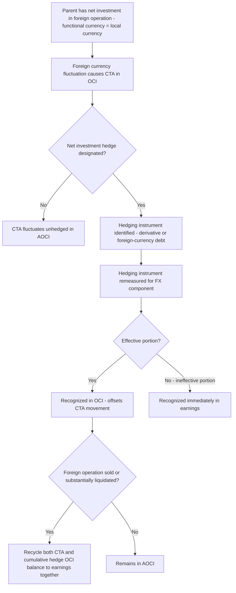

## Net Investment Hedges

### Overview

Net investment hedge accounting is the third of the three hedge accounting models under ASC 815 (Derivatives and Hedging) and IFRS 9/IAS 21, applied specifically when an entity hedges the foreign currency exposure arising from its **net investment in a foreign operation**. This hedge type is the direct accounting counterpart to the translation exposure covered under the current rate method and cumulative translation adjustment (CTA) topics — it exists specifically to allow an entity to offset, within OCI, the volatility that translation would otherwise introduce to accumulated other comprehensive income. This topic covers the definition of net investment exposure, eligible hedging instruments (including the distinctive use of nonderivative debt), effectiveness assessment, and the OCI/CTA recycling mechanics unique to this hedge type.

### What Is Being Hedged: Net Investment Exposure

A parent's **net investment in a foreign operation** is the parent's interest in the net assets of that foreign operation — broadly, the translated equity of a foreign subsidiary, branch, or equity-method investee whose functional currency differs from the parent's reporting currency. When that foreign entity's financial statements are translated using the **current rate method** (because its functional currency is its local currency), fluctuations in the exchange rate directly affect the translated USD (or other reporting-currency) value of the net investment, generating the CTA discussed earlier in this chapter.

A net investment hedge is designed to offset this translation exposure by generating an equal and opposite gain/loss, recognized in OCI alongside — and offsetting — the CTA movement.

### Eligible Hedging Instruments

A distinctive feature of net investment hedges — not available for fair value or cash flow hedges of the same magnitude — is that the hedging instrument may be either a **derivative** or a **nonderivative financial instrument**, most commonly foreign-currency-denominated debt.

| Hedging Instrument | Mechanism |
| --- | --- |
| FX forward contract | Locks in a future exchange rate on a notional amount matching the hedged net investment |
| Cross-currency swap | Exchanges principal/interest in the parent's currency for the foreign currency, hedging both net investment and potentially related financing |
| Foreign-currency-denominated debt (nonderivative) | The parent (or a subsidiary designated as the hedging entity) borrows directly in the foreign currency; as that currency fluctuates, the remeasurement gain/loss on the debt offsets the CTA on the net investment |

**Why foreign-currency debt works as a hedge**: If a US parent borrows €10,000,000 and designates this debt as a net investment hedge of its €10,000,000 net investment in a European subsidiary, then as the EUR depreciates against the USD:

- The subsidiary's translated net assets **decrease** in USD terms (unfavorable CTA)
- The EUR-denominated debt, when remeasured, generates a **favorable** foreign exchange effect (the parent owes fewer USD to settle the debt)

These two effects are economically offsetting, and net investment hedge accounting ensures they are also **accounting-offsetting** by recording both within OCI rather than letting the debt's remeasurement gain hit earnings while the CTA sits in OCI.

### Core Accounting Mechanics

$$\text{Effective Portion of Hedge Gain/(Loss)} \rightarrow \text{OCI, alongside CTA}$$

$$\text{Ineffective Portion (if any)} \rightarrow \text{Immediately in Earnings}$$

For a **derivative** hedging instrument, the change in fair value attributable to changes in spot exchange rates is the portion typically eligible for OCI treatment; changes attributable to other factors (e.g., interest rate differentials reflected in forward points, for a forward contract) may be excluded from the hedge effectiveness assessment and recognized in earnings over the life of the hedge, under an accounting policy election available under ASU 2017-12 (ASC 815-20-25-83A).

For **nonderivative debt** used as the hedging instrument, the entire foreign exchange remeasurement gain/loss on the debt (computed under the normal foreign currency remeasurement rules) is the amount potentially eligible for OCI treatment, to the extent of effectiveness.

### Worked Example

**Facts:** A US parent has a €20,000,000 net investment in a wholly owned European subsidiary (functional currency EUR, translated under the current rate method). The parent borrows €20,000,000 of debt and designates it as a net investment hedge, effective January 1, at a spot rate of $1.10/€.

**At year-end**, the spot rate has moved to $1.05/€ (EUR has weakened).

**CTA effect on the net investment:**

$$€20{,}000{,}000 \times (1.05 - 1.10) = -\$1{,}000{,}000 \text{ (unfavorable CTA)}$$

**Remeasurement effect on the EUR-denominated debt (a liability):**

Since the debt is a liability and the EUR weakened, the parent owes fewer USD to settle it — a favorable remeasurement effect:

$$€20{,}000{,}000 \times (1.05 - 1.10) = -\$1{,}000{,}000 \text{ change in USD-equivalent debt} = \$1{,}000{,}000 \text{ favorable}$$

**Net investment hedge accounting entries:**

| Account | Debit | Credit |
| --- | --- | --- |
| Foreign-currency debt (liability decreases) | $1,000,000 |  |
| OCI — Net Investment Hedge |  | $1,000,000 |

This $1,000,000 OCI credit, recorded alongside (and offsetting) the $1,000,000 unfavorable CTA on the subsidiary, results in a **net-zero** effect on total AOCI from the combined translation and hedge — precisely the intended risk management and accounting outcome. Without net investment hedge designation, the $1,000,000 favorable remeasurement gain on the debt would instead have been recognized directly in **earnings**, creating a mismatch with the CTA sitting in OCI.

### Effectiveness Assessment

Net investment hedge effectiveness assessment focuses on whether the notional amount, currency, and timing of the hedging instrument appropriately correspond to the hedged net investment:

- **Notional/amount matching**: The hedging instrument's notional amount should not exceed the carrying amount of the net investment being hedged (over-hedging the notional beyond the net investment creates ineffectiveness or disqualifies the excess from hedge accounting).
- **Currency matching**: The hedging instrument's currency exposure must correspond to the functional currency of the hedged foreign operation (or a currency in a specified relationship to it, such as a currency the functional currency is expected to move with, under certain proxy-hedging provisions).
- **Simplified approaches under ASU 2017-12**: For net investment hedges using either a forward contract at the spot rate or nonderivative debt with currency and amount matching the hedged net investment, a qualitative effectiveness assessment (rather than quantitative testing each period) is often permitted, substantially simplifying ongoing hedge accounting maintenance.

### Recognizing and Presenting Hedge-Designated Entities

A net investment hedge can be designated at the parent level or at a level between the parent and the foreign subsidiary (an intermediate holding entity), provided the hedging instrument's functional currency differs appropriately from the entity holding it relative to the hedged net investment's functional currency — this is a nuanced structuring consideration in multinational groups with layered holding structures, since the designation must reflect a genuine hedge of translation risk and not merely an intercompany artifact.

### Disposal and Recycling — The Distinguishing Feature

Consistent with CTA's own treatment, the cumulative OCI balance attributable to a net investment hedge is **not** recognized in earnings while the hedge relationship and the underlying net investment continue; it is recycled to earnings only upon:

- **Sale or substantially complete liquidation of the hedged foreign operation** — both the CTA and the cumulative net investment hedge OCI balance are reclassified into earnings **together**, as part of the computed gain/loss on disposal (ASC 830-30-40-1; ASC 815-35-35).
- **Partial disposal** meeting specific conditions (loss of control, or a pro-rata sale of an equity-method investment) may trigger a proportionate recycling, consistent with the partial-disposal CTA recycling rules discussed in the CTA topic.

$$\text{Gain/(Loss) on Disposal} = \text{Proceeds} - \text{Carrying Amount of Net Investment} + \text{Recycled CTA} + \text{Recycled Net Investment Hedge OCI}$$

### Comparison Across All Three Hedge Types (Full Recap)

| Feature | Fair Value Hedge | Cash Flow Hedge | Net Investment Hedge |
| --- | --- | --- | --- |
| What is hedged | Recognized item/firm commitment — fair value exposure | Forecasted transaction/variable cash flows | Net investment in a foreign operation — translation exposure |
| Eligible hedging instruments | Generally derivatives | Generally derivatives | Derivatives **or** nonderivative foreign-currency debt |
| Effective portion location | Earnings, currently | OCI, deferred | OCI, alongside CTA |
| Hedged item remeasured? | Yes — basis adjustment | No | N/A — CTA arises from translation, not a hedge-driven remeasurement |
| Recycling trigger | N/A — already in earnings | Hedged transaction affects earnings | Sale/substantial liquidation of the foreign operation |

### IFRS Comparative Notes

IFRS applies substantively similar net investment hedge mechanics (IAS 21.32, applying IFRS 9 hedge accounting mechanics for effectiveness and instrument eligibility), with the same fundamental objective of offsetting translation exposure within OCI and recycling to profit or loss only upon disposal of the foreign operation. IFRS 9's more principles-based hedge effectiveness framework (economic relationship, credit risk dominance, consistent hedge ratio) applies here as it does to fair value and cash flow hedges, generally producing outcomes closely aligned with U.S. GAAP practice for well-structured net investment hedges.

### Practical and Forensic Considerations

- **Over-hedging risk**: Designating a hedging instrument with a notional amount exceeding the actual net investment being hedged is a common structuring error — the excess notional does not qualify for hedge accounting and its associated gain/loss must be recognized in earnings, creating unexpected volatility that undermines the hedge's intended purpose.
- **Structuring for OCI versus earnings placement**: Because net investment hedges route otherwise-earnings-eligible foreign currency debt remeasurement gains/losses into OCI, there is a structuring incentive to designate foreign-currency debt as a net investment hedge specifically to avoid earnings volatility — legitimate risk management should be distinguished from opportunistic designation lacking a genuine underlying net investment exposure of appropriate magnitude and currency.
- **Disposal-triggered earnings volatility**: As with CTA generally, the eventual recycling of both CTA and net investment hedge OCI balances upon disposal can produce a significant one-time earnings effect unrelated to the disposal period's operating performance — analysts and forensic reviewers should isolate this effect when assessing the quality and sustainability of reported disposal gains/losses.
- **Documentation of currency/amount correspondence**: Because effectiveness substantially depends on notional, currency, and timing correspondence between the hedging instrument and the net investment, audit and forensic review should verify these parameters were appropriately matched at designation and have remained appropriately matched (or been re-designated) as the underlying net investment's carrying amount has changed over time (e.g., due to retained earnings accumulation or additional capital contributions).

**Related Topics:**

- Cumulative translation adjustment and other comprehensive income (the exposure this hedge type addresses)
- Functional currency determination and the current rate method
- Fair value hedge accounting and cash flow hedge accounting (the other two hedge models)
- Disposal, deconsolidation, and step acquisitions of foreign subsidiaries
- Hedge effectiveness assessment methods under ASU 2017-12
- Disclosure requirements for net investment hedges (ASC 815-10-50; IFRS 7)