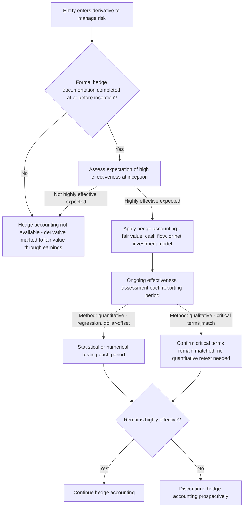

## Hedge Effectiveness Assessment and Documentation

### Overview

Hedge effectiveness assessment and documentation is the procedural and analytical backbone that qualifies any hedging relationship — fair value, cash flow, or net investment — for hedge accounting treatment under ASC 815 (Derivatives and Hedging) and IFRS 9 (Financial Instruments). Without rigorous, contemporaneous documentation and a defensible effectiveness assessment methodology, an entity cannot apply any of the three hedge accounting models covered elsewhere in this chapter, regardless of how genuinely the underlying derivative offsets economic risk. This topic addresses the required documentation elements, the qualifying and ongoing effectiveness assessment methods, ineffectiveness measurement, and the significant simplifications introduced by ASU 2017-12.

### Why Documentation and Effectiveness Requirements Exist

Hedge accounting is fundamentally an **election** that departs from the default treatment of derivatives (immediate fair value recognition through earnings). Because this election can materially affect the timing and location (earnings versus OCI) of gain/loss recognition, standard-setters impose strict qualifying criteria to prevent hedge accounting from being applied opportunistically or retroactively to relationships that do not genuinely offset risk. The core safeguards are: (1) contemporaneous formal documentation at inception, and (2) a defensible, consistently applied effectiveness assessment.

### Required Documentation Elements at Hedge Inception

Under ASC 815-20-25-3, formal documentation must be completed **at or before** hedge inception (not after the fact) and must identify:

1. **The hedging instrument** — precise identification of the specific derivative (or, for net investment hedges, nonderivative instrument) designated.
2. **The hedged item or transaction** — precise identification of the specific asset, liability, firm commitment, forecasted transaction, or net investment being hedged.
3. **The nature of the risk being hedged** — e.g., overall fair value risk, interest rate (benchmark) risk, foreign currency risk, credit risk, or a specifically identified risk component.
4. **The entity's risk management objective and strategy** for undertaking the hedge, including identification of the hedging relationship, the nature of the risk, and how the entity will assess effectiveness (including ineffectiveness measurement, if quantitative assessment is required).
5. **How hedge effectiveness will be assessed**, both at inception and on an ongoing basis, and, if applicable, the method for measuring ineffectiveness.

Failure to complete this documentation contemporaneously — even if the economic hedge is genuinely effective — **disqualifies** the relationship from hedge accounting for the period in which documentation was deficient; late or retroactive documentation cannot cure a missed designation window.

### Effectiveness Assessment Methods

**1. Critical Terms Match Method**

Applicable when the critical terms of the hedging instrument (notional amount, underlying, maturity/settlement dates, and other terms) exactly or closely match those of the hedged item/transaction. If critical terms match, the hedge can be assumed to be perfectly effective without further quantitative testing, provided specific conditions are met (e.g., the notional amounts match, the underlying matches, the derivative's fair value at inception is zero for a forward, and the hedged item's terms do not otherwise introduce a source of ineffectiveness).

**Example**: A forward contract to sell €1,000,000 in exactly 6 months, matched precisely to a forecasted €1,000,000 sale expected in exactly 6 months, with matching settlement mechanics — critical terms match, no ongoing quantitative testing is required.

**2. Regression Analysis**

A statistical method comparing historical or hypothetical changes in the fair value (or cash flows) of the hedging instrument against changes in the hedged item over a representative sample period, assessing the strength and consistency of the relationship using statistical measures such as the coefficient of determination ($R^2$) and the regression slope coefficient.

Commonly applied thresholds (though not codified as a strict bright line requirement post-ASU 2017-12, they remain widely used as a practical benchmark):

$$R^2 \geq 0.80 \text{ (or higher, often } 0.80\text{–}1.00\text{)}$$

$$\text{Slope coefficient within a range around } -1.0 \text{ (typically } -0.80 \text{ to } -1.25\text{)}$$

**3. Dollar-Offset Method**

Compares the actual dollar change in the fair value (or cash flows) of the hedging instrument to the actual dollar change in the fair value (or cash flows) of the hedged item over the assessment period, expressed as a ratio.

$$\text{Dollar-Offset Ratio} = \frac{\Delta \text{Fair Value of Hedging Instrument}}{\Delta \text{Fair Value of Hedged Item}}$$

A ratio falling within an acceptable range (commonly cited as 80%–125%, i.e., between 0.80 and 1.25 in absolute value with opposite signs) has historically been used as an indicator of high effectiveness, though this method can be sensitive to small denominator values producing unstable ratios, a widely recognized practical limitation.

**4. Shortcut Method (Legacy, Now Largely Superseded)**

Historically available for certain interest rate swaps meeting stringent matching criteria (matched notional, term, index, reset dates, and an at-market swap with zero fair value at inception), the shortcut method assumed perfect effectiveness without any further testing. ASU 2017-12 introduced additional simplified approaches and relaxed strict conditions in various ways, reducing reliance on the historically narrow shortcut method while achieving similar qualifying outcomes for well-matched interest rate hedges through the broader "critical terms match" and other simplified assessment provisions.

### ASU 2017-12 Simplifications — Qualitative Subsequent Assessment

A significant practical simplification introduced by ASU 2017-12 allows an entity, after performing an initial quantitative effectiveness assessment at hedge inception, to perform **subsequent** effectiveness assessments **qualitatively** — provided facts and circumstances have not changed such that the entity can reasonably support an expectation that the hedging relationship remains highly effective (ASC 815-20-25-3(a)-(b)). This substantially reduces the ongoing testing burden for stable, well-designed hedge relationships, while still requiring the entity to re-perform quantitative testing if circumstances change or a triggering event occurs (e.g., a change in critical terms, a change in the counterparty's credit risk, or other indicators suggesting effectiveness might have changed).

### Measuring and Recognizing Ineffectiveness

Even a "highly effective" hedge is rarely perfectly effective; the portion of the hedging instrument's gain/loss that does not offset the hedged item's gain/loss (or, for cash flow hedges, that exceeds the cumulative change in the hedged item's expected cash flows) represents **ineffectiveness** and must be recognized immediately in earnings.

**For fair value hedges**: Ineffectiveness is inherently measured as the **net** of the hedging instrument's gain/loss and the hedged item's fair value change attributable to the hedged risk — both are already in earnings, so any non-offsetting residual naturally appears as a net earnings effect without a separate calculation being required for recognition purposes (though it is still measured and disclosed).

**For cash flow hedges**, ineffectiveness is measured as the excess of the cumulative gain/loss on the hedging instrument over the cumulative change in expected future cash flows on the hedged transaction (using the "hypothetical derivative method" or similar approaches), with only the excess recognized immediately in earnings; the remaining effective portion is deferred in OCI.

$$\text{Ineffectiveness (Cash Flow Hedge)} = \left| \text{Cumulative Derivative Gain/Loss} \right| - \left| \text{Cumulative Change in Hedged Item's Expected Cash Flows} \right|, \text{ if positive}$$

### "Highly Effective" — The Qualifying Threshold

Both at inception and on an ongoing basis, a hedging relationship must be expected to be (and subsequently demonstrated to have been) **highly effective** in achieving offsetting changes in fair value or cash flows attributable to the hedged risk. While ASU 2017-12 shifted emphasis away from a rigid quantitative bright-line requirement toward a more principles-based "reasonable expectation of high effectiveness," the widely referenced practical benchmark of the offsetting relationship falling within an 80%–125% range continues to inform practice and audit expectations, particularly at the qualifying (inception) assessment stage.

### Excluded Components — An Available Simplification

ASU 2017-12 permits an entity to elect to exclude certain components of a hedging instrument's change in fair value from the effectiveness assessment — most commonly, the time value of options or the forward points of a forward contract. When elected, the excluded component's change in fair value is recognized in earnings over the life of the hedge using a systematic and rational method (rather than immediately, and rather than being part of the OCI-deferred effective portion), which can meaningfully reduce reported ineffectiveness and simplify the assessment of the remaining (typically intrinsic-value or spot-based) hedge relationship.

### Comparative Summary Table

| Method | Basis | Ongoing Testing Burden | Typical Application |
| --- | --- | --- | --- |
| Critical terms match | Structural term comparison | Minimal — confirm terms remain matched | Forwards/swaps closely matched to hedged item |
| Regression analysis | Statistical relationship over historical/hypothetical data | Moderate to high | Imperfectly matched hedges, cross-currency or cross-index relationships |
| Dollar-offset | Actual period-over-period ratio comparison | High — recalculated each period | Simpler relationships, but sensitive to small-denominator distortion |
| Qualitative subsequent assessment (post ASU 2017-12) | Judgment that facts/circumstances remain consistent with inception | Low, after initial quantitative test | Stable, well-matched hedge relationships with no changed circumstances |

### IFRS 9 Comparative Notes

IFRS 9 (IFRS 9.6.4.1) takes a more explicitly principles-based approach to effectiveness, requiring: (1) an **economic relationship** between the hedged item and hedging instrument such that they are expected to move in opposite directions as a result of the hedged risk; (2) the effect of **credit risk** does not dominate the value changes resulting from that economic relationship; and (3) the **hedge ratio** designated is consistent with the quantity of the hedged item actually hedged and the quantity of the hedging instrument actually used. IFRS 9 does not prescribe a specific quantitative threshold (such as the 80%–125% range historically associated with U.S. GAAP practice) and instead relies on qualitative and, where necessary, quantitative assessment tailored to the specific relationship, with rebalancing of the hedge ratio permitted (and in some cases required) if the hedge ratio no longer reflects the actual risk management relationship without triggering full discontinuation.

### Practical and Forensic Considerations

- **Contemporaneous documentation is non-negotiable**: The single most common cause of hedge accounting disqualification in practice is documentation completed after (rather than at or before) hedge inception — auditors and forensic reviewers should verify documentation dates and system timestamps rather than relying on management's assertion of timely completion.
- **Method consistency over time**: An entity switching effectiveness assessment methods between periods without a substantive change in facts and circumstances is a red flag for potential earnings management, since different methods can produce different conclusions about whether a hedge remains highly effective or must be discontinued.
- **Dollar-offset ratio instability**: Because the dollar-offset method is mathematically sensitive to small hedged-item denominators (producing extreme or unstable ratios even for economically sound hedges), reliance on this method for hedges with modest expected changes warrants additional scrutiny of whether the method appropriately reflects the underlying economic relationship.
- **Excluded component election transparency**: The ASU 2017-12 excluded component election can materially reduce reported ineffectiveness; forensic and analytical review should assess whether the election was applied consistently across similar hedge types and whether the systematic amortization method chosen for the excluded component is applied consistently period over period.
- **Rebalancing versus redesignation under IFRS 9**: IFRS 9's hedge ratio rebalancing provisions, while designed to preserve genuine risk management relationships without unnecessary discontinuation, create judgment areas around when rebalancing is appropriate versus when a hedge relationship has genuinely broken down and should be discontinued — inconsistent application across similar relationships warrants further inquiry.

**Related Topics:**

- Fair value hedge accounting, cash flow hedge accounting, and net investment hedges (the three models this assessment framework qualifies entities for)
- Identifying and classifying derivative instruments
- ASU 2017-12 hedge accounting simplification provisions in depth
- Fair value measurement of derivative instruments (ASC 820 / IFRS 13)
- Disclosure requirements for hedging activities and effectiveness results (ASC 815-10-50; IFRS 7)
- Forensic red flags in derivative and hedge accounting misrepresentation