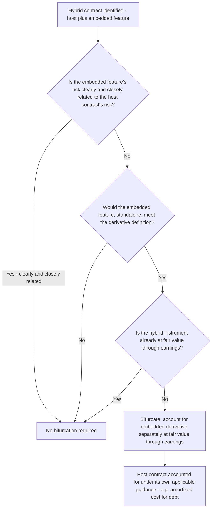

## Embedded Derivatives and Bifurcation

### Overview

Embedded derivatives and bifurcation represents a deeper technical treatment of a concept introduced earlier in this chapter's discussion of identifying derivative instruments. Many financial and nonfinancial contracts — convertible bonds, structured notes, leases, supply agreements, and insurance contracts — contain embedded features that, if analyzed on a standalone basis, would independently meet the definition of a derivative. This topic provides the detailed bifurcation analysis framework under ASC 815-15 (U.S. GAAP) and the corresponding, but structurally different, treatment under IFRS 9, along with the mechanics of separately accounting for a bifurcated embedded derivative once identified.

### The Bifurcation Framework — Three-Part Test (ASC 815-15-25-1)

An embedded derivative feature within a **host contract** must be bifurcated (separated) and accounted for as a standalone derivative if **all three** of the following conditions are met:

1. **Not clearly and closely related**: The economic characteristics and risks of the embedded derivative are not clearly and closely related to the economic characteristics and risks of the host contract.
2. **Standalone derivative test**: A separate instrument with the same terms as the embedded feature would, on a standalone basis, meet the definition of a derivative under ASC 815-10-15-83 (the three-part test covered in the earlier identification topic: underlying/notional, little or no initial investment, net settlement).
3. **Not already at fair value through earnings**: The hybrid (combined) instrument is not already measured at fair value with changes in fair value reported currently in earnings.

### The "Clearly and Closely Related" Test — Applied Examples

This is the most judgment-intensive element of the bifurcation analysis. The test asks whether the risk of the embedded feature is of the same fundamental nature as the risk inherent in the host contract.

| Host Contract | Embedded Feature | Clearly and Closely Related? | Bifurcation Required? |
| --- | --- | --- | --- |
| Fixed-rate debt host | Interest rate cap/floor indexed to the same interest rate index as the debt, within typical market ranges | Generally yes — same interest rate risk nature | Generally no |
| Debt host | Equity conversion option (convertible bond) | Generally no — equity price risk differs fundamentally from debt/credit risk | Generally yes, absent a qualifying scope exception |
| Debt host (functional currency = USD) | Principal/interest indexed to a foreign currency exchange rate, where neither party's functional currency nor common international commerce currency is involved | Generally no | Generally yes |
| Lease host (operating lease) | Contingent rental payments indexed to a commodity price unrelated to the leased asset's use | Generally no — commodity price risk unrelated to lease/rental risk | Generally yes |
| Insurance contract (host) | Payment linked to an equity index return (equity-indexed annuity) | Generally no — equity price risk not clearly and closely related to mortality/insurance risk | Generally yes, for the equity-indexed component |
| Purchase contract denominated in the functional currency of either substantial party, or the currency routinely used in international commerce for the good involved (e.g., USD for oil) | Foreign currency indexation | Yes — this is precisely why such contracts are excluded | No |

### Worked Example — Convertible Bond

**Facts:** A company issues a $10,000,000 convertible bond with a 4% coupon, convertible into common stock at a fixed conversion ratio, not qualifying for equity classification under ASC 815-40 (e.g., because the conversion feature includes a variable component that fails the "fixed-for-fixed" criterion).

**Bifurcation analysis:**

1. **Clearly and closely related?** No — equity price risk is not clearly and closely related to the debt host's interest rate/credit risk.
2. **Standalone derivative?** Yes — a standalone conversion option meets the three-part derivative definition (an underlying equity price, little/no initial investment relative to buying the shares outright, and net/share settlement).
3. **Already at fair value through earnings?** No — the issuer has not elected the fair value option for the entire hybrid instrument.

**Conclusion**: Bifurcate. At issuance, the conversion option's fair value is separated from the total proceeds and recorded as a derivative liability at fair value; the residual proceeds are allocated to the debt host, which is subsequently accounted for at amortized cost using the effective interest method (creating a debt discount amortized over the bond's term). The embedded derivative liability is remeasured to fair value each period, with changes recognized in earnings.

$$\text{Debt Host Initial Carrying Amount} = \text{Total Proceeds} - \text{Fair Value of Bifurcated Conversion Option}$$

### Worked Example — Foreign-Currency-Indexed Supply Contract

**Facts:** A US manufacturer (USD functional currency) enters a 3-year supply agreement with a domestic (US) supplier for raw materials, with pricing indexed to the Japanese yen exchange rate — a currency unrelated to either party's functional currency and not the currency in which such materials are customarily denominated in international commerce.

**Bifurcation analysis:**

1. **Clearly and closely related?** No — foreign currency risk (JPY) is not clearly and closely related to the host purchase contract's inherent commodity/pricing risk when neither party's functional currency, nor the customary international-commerce currency for the goods, is JPY.
2. **Standalone derivative?** Yes — the currency-indexed pricing feature, evaluated on a standalone basis, would meet the derivative definition.
3. **Already at fair value through earnings?** No.

**Conclusion**: Bifurcate the foreign-currency-indexation feature as an embedded derivative, accounted for separately at fair value through earnings, while the host supply contract continues to be accounted for under normal executory contract/purchase accounting principles (often falling under the normal purchases and normal sales exception once the currency feature itself is separately bifurcated).

### Accounting for a Bifurcated Embedded Derivative

Once bifurcation is required:

- **Initial measurement**: The embedded derivative is measured at fair value at inception, typically using an appropriate valuation technique for the specific feature (option-pricing models for conversion features, forward-pricing models for indexation features).
- **Host contract**: The host receives the residual value (total consideration less the embedded derivative's fair value) and is subsequently accounted for entirely under the guidance otherwise applicable to that type of host instrument (e.g., amortized cost for a debt host).
- **Subsequent measurement**: The bifurcated embedded derivative is remeasured to fair value each reporting period, with changes recognized in **earnings** — embedded derivatives are not eligible for the same OCI-deferral treatment that a cash flow or net investment hedge might otherwise achieve, since bifurcation exists precisely because these features were not designated as hedges but rather identified as requiring separate derivative accounting.
- **Reassessment**: Under U.S. GAAP, the bifurcation assessment is generally performed only at contract inception (or upon a substantive contract modification), not reassessed each period absent a triggering event such as a contract modification that changes the cash flows in a manner that would have required a different initial conclusion.

### IFRS 9 Approach — A Materially Different Framework

IFRS 9 takes a fundamentally different approach depending on whether the host contract is a **financial asset** versus a **financial liability or non-financial host**:

- **Financial asset hosts**: IFRS 9 **does not apply bifurcation** to hybrid contracts with a financial asset host. Instead, the entire hybrid instrument is classified and measured as a single unit under IFRS 9's classification model — amortized cost, fair value through OCI (FVOCI), or fair value through profit or loss (FVTPL) — based on the contractual cash flow characteristics (the "solely payments of principal and interest," or SPPI, test) and the entity's business model for managing the asset. If the contractual cash flows fail the SPPI test (as an embedded derivative feature typically would cause), the **entire hybrid financial asset** is measured at FVTPL, rather than separating out just the embedded feature.
- **Financial liability hosts and non-financial hosts**: IFRS 9 retains a bifurcation requirement substantively similar to U.S. GAAP's "clearly and closely related" framework (IFRS 9.4.3.3), separating the embedded derivative from the host and accounting for it at fair value through profit or loss, while the host continues under its otherwise applicable measurement basis.

| Host Contract Type | US GAAP (ASC 815-15) | IFRS 9 |
| --- | --- | --- |
| Financial asset | Bifurcate if 3-part test met | No bifurcation — entire hybrid asset classified as a whole (often FVTPL if cash flows fail SPPI) |
| Financial liability | Bifurcate if 3-part test met | Bifurcate if substantively similar "closely related" test met |
| Non-financial host (lease, insurance, executory contract) | Bifurcate if 3-part test met | Bifurcate if substantively similar "closely related" test met |

This is one of the more consequential U.S. GAAP/IFRS differences in the derivatives area, particularly relevant for structured notes, convertible bonds held as investments, and other hybrid financial assets, where U.S. GAAP bifurcation and IFRS 9's whole-instrument classification can produce materially different balance sheet presentations and income statement volatility patterns for economically identical instruments.

### Fair Value Option Alternative

Both frameworks permit an entity to elect, at inception, to measure an entire hybrid instrument at fair value through earnings (the "fair value option" under ASC 825-10-15 / ASC 815-15-25-4, or FVTPL designation under IFRS 9.4.1.5 for eligible instruments), which — if elected — eliminates the need for bifurcation analysis altogether, since condition 3 of the bifurcation test (not already at fair value through earnings) would no longer be met. This election is irrevocable once made and applies to the instrument as a whole.

### Practical and Forensic Considerations

- **Recurring source of restatement**: Failure to identify embedded derivatives requiring bifurcation — particularly in complex convertible debt, structured notes, and foreign-currency-indexed contracts — remains one of the most frequently cited causes of technical accounting restatements; forensic review of complex financing arrangements should specifically test whether a bifurcation analysis was performed and documented at inception.
- **Contract modification triggers**: A substantive modification to a contract containing an embedded feature (e.g., an amendment changing conversion terms, pricing indices, or settlement mechanics) can trigger a fresh bifurcation assessment — failure to reassess upon modification is a common oversight.
- **Valuation model scrutiny**: Because bifurcated embedded derivatives are frequently complex to value (e.g., conversion options requiring option-pricing models with volatility and credit spread assumptions), the reasonableness and consistency of valuation inputs across periods warrants particular forensic and audit attention, especially where valuation outputs appear to conveniently minimize reported derivative liability balances or associated earnings volatility.
- **US GAAP/IFRS convergence project history**: Standard-setters have periodically discussed further converging the bifurcation frameworks; practitioners working with entities reporting under both frameworks (e.g., US SEC filers with IFRS-reporting subsidiaries, or dual listers) should maintain awareness of the structural difference for financial asset hosts, as it can produce materially different consolidated outcomes requiring careful reconciliation.

**Related Topics:**

- Identifying and classifying derivative instruments (the foundational three-part derivative definition test)
- Convertible instrument accounting and equity classification criteria (ASC 815-40)
- IFRS 9 financial asset classification (SPPI test and business model assessment)
- Fair value option elections under ASC 825-10 / IFRS 9.4.1.5
- Fair value measurement of complex/structured derivative instruments (ASC 820 / IFRS 13)
- Structured note and hybrid security forensic analysis